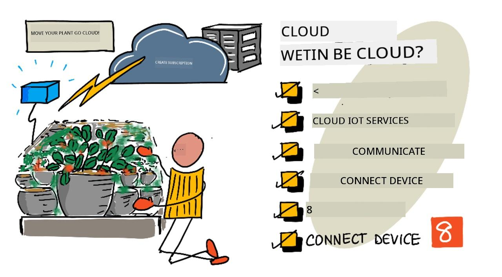
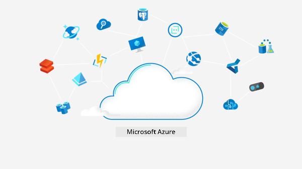
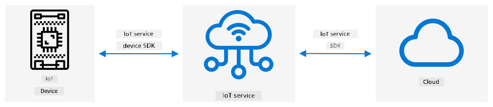
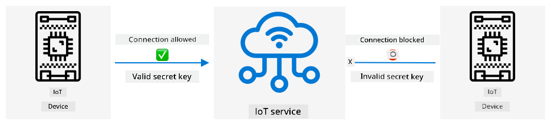
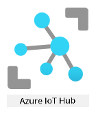

<!--
CO_OP_TRANSLATOR_METADATA:
{
  "original_hash": "4d8e7a066d75b625e7a979c14157041d",
  "translation_date": "2025-11-18T19:35:03+00:00",
  "source_file": "2-farm/lessons/4-migrate-your-plant-to-the-cloud/README.md",
  "language_code": "pcm"
}
-->
# Move Your Plant Go Di Cloud



> Sketchnote by [Nitya Narasimhan](https://github.com/nitya). Click di image for bigger version.

Dis lesson na part of di [IoT for Beginners Project 2 - Digital Agriculture series](https://youtube.com/playlist?list=PLmsFUfdnGr3yCutmcVg6eAUEfsGiFXgcx) wey di [Microsoft Reactor](https://developer.microsoft.com/reactor/?WT.mc_id=academic-17441-jabenn) teach.

[](https://youtu.be/bNxjopXkhvk)

## Pre-lecture quiz

[Pre-lecture quiz](https://black-meadow-040d15503.1.azurestaticapps.net/quiz/15)

## Introduction

For di last lesson, you don learn how to connect your plant to one MQTT broker and control relay from server code wey dey run for your local machine. Dis one na di main idea behind internet-connected automated watering system wey dem dey use for house plants reach commercial farms.

Di IoT device bin dey communicate wit public MQTT broker to show di principles, but dis no be di most reliable or secure way. For dis lesson, you go learn about di cloud and di IoT features wey public cloud services dey provide. You go also sabi how to move your plant go one of dis cloud services from di public MQTT broker.

For dis lesson, we go talk about:

* [Wetin be di cloud?](../../../../../2-farm/lessons/4-migrate-your-plant-to-the-cloud)
* [Create cloud subscription](../../../../../2-farm/lessons/4-migrate-your-plant-to-the-cloud)
* [Cloud IoT services](../../../../../2-farm/lessons/4-migrate-your-plant-to-the-cloud)
* [Create IoT service for di cloud](../../../../../2-farm/lessons/4-migrate-your-plant-to-the-cloud)
* [Communicate wit IoT Hub](../../../../../2-farm/lessons/4-migrate-your-plant-to-the-cloud)
* [Connect your device to di IoT service](../../../../../2-farm/lessons/4-migrate-your-plant-to-the-cloud)

## Wetin be di cloud?

Before di cloud, if company wan provide services to dia workers (like database or file storage), or to di public (like websites), dem go build and run data center. E fit be small room wey get few computers or big building wey get plenty computers. Di company go dey manage everything, like:

* Buy computers
* Maintain hardware
* Power and cooling
* Networking
* Security, including di building and di software for di computers
* Install and update software

Dis kind setup dey cost plenty money, need plenty skilled workers, and e dey slow to change if dem need am. For example, if online store wan prepare for busy holiday season, dem go need plan months before to buy more hardware, configure am, install am, and put di software wey go run dia sales. After di holiday season, di computers wey dem buy go just dey idle till di next busy season.

✅ You think say dis kind setup go allow companies move fast? If online clothing shop suddenly blow because celebrity wear dia clothes, dem fit increase dia computing power quick to handle di sudden plenty orders?

### Na another person computer

People dey joke say di cloud na 'another person computer'. Di idea simple - instead of you to buy computers, you go rent another person computer. Di cloud provider go dey manage big data centers. Dem go dey responsible for di hardware, power, cooling, networking, security, updates, everything. As customer, you go just rent di computers wey you need, rent more if demand increase, and reduce am if demand drop. Dis cloud data centers dey all over di world.


Dis data centers fit big reach many square kilometers. Di pictures above na Microsoft cloud data center wey dem take some years ago, e show di size and di planned expansion. Di area wey dem clear for di expansion big pass 5 square kilometers.

> 💁 Dis data centers dey use plenty power, some even get dia own power station. Because of di size and di investment wey di cloud providers dey put, dem dey usually dey environmentally friendly. Dem dey more efficient pass plenty small data centers, dem dey use renewable energy, and dem dey try reduce waste, save water, and plant trees to replace di ones wey dem cut down. You fit read more about how one cloud provider dey work on sustainability for di [Azure sustainability site](https://azure.microsoft.com/global-infrastructure/sustainability/?WT.mc_id=academic-17441-jabenn).

✅ Do small research: Check di major clouds like [Azure from Microsoft](https://azure.microsoft.com/?WT.mc_id=academic-17441-jabenn) or [GCP from Google](https://cloud.google.com). How many data centers dem get, and where dem dey for di world?

Using di cloud dey help companies reduce cost, and e allow dem focus on wetin dem sabi do well, while di cloud provider go handle di rest. Companies no need to rent or buy data center space, pay different providers for power and connectivity, or employ experts. Instead, dem go just dey pay one monthly bill to di cloud provider.

Di cloud provider go use economies of scale to reduce cost, buy computers in bulk, invest in tools to make maintenance easy, and even design dia own hardware to improve dia cloud services.

### Microsoft Azure

Azure na di developer cloud wey Microsoft get, and na di cloud wey you go use for dis lessons. Di video below go give you small overview of Azure:

[](https://www.microsoft.com/videoplayer/embed/RE4Ibng?WT.mc_id=academic-17441-jabenn)

## Create cloud subscription

To use cloud services, you go need to sign up for subscription wit cloud provider. For dis lesson, you go sign up for Microsoft Azure subscription. If you already get Azure subscription, you fit skip dis task. Di subscription details wey we describe here dey correct as at di time wey we write am, but e fit change.

> 💁 If na your school dey give you access to dis lessons, you fit already get Azure subscription. Check wit your teacher.

Two types of free Azure subscription dey wey you fit sign up for:

* **Azure for Students** - Dis one na for students wey don reach 18 years. You no need credit card to sign up, you go use your school email address to confirm say you be student. When you sign up, you go get US$100 to spend on cloud resources, plus free services like free version of IoT service. E go last for 12 months, and you fit renew am every year wey you still be student.

* **Azure free subscription** - Dis one na for anybody wey no be student. You go need credit card to sign up, but dem no go charge your card, na just to confirm say you be real person, no be bot. You go get $200 credit to use for di first 30 days, plus free tiers of Azure services. After your credit finish, dem no go charge your card unless you convert to pay-as-you-go subscription.

> 💁 Microsoft dey offer Azure for Students Starter subscription for students wey never reach 18, but as at di time wey we dey write dis, e no support IoT services.

### Task - sign up for free cloud subscription

If you be student wey don reach 18 years, you fit sign up for Azure for Students subscription. You go need confirm wit school email address. You fit do am in two ways:

* Sign up for GitHub student developer pack for [education.github.com/pack](https://education.github.com/pack). Dis one go give you access to tools and offers, including GitHub and Microsoft Azure. Once you sign up for di developer pack, you fit activate di Azure for Students offer.

* Sign up directly for Azure for Students account for [azure.microsoft.com/free/students](https://azure.microsoft.com/free/students/?WT.mc_id=academic-17441-jabenn).

> ⚠️ If your school email no dey recognized, raise [issue for dis repo](https://github.com/Microsoft/IoT-For-Beginners/issues) and we go see if dem fit add am to di Azure for Students allow list.

If you no be student, or you no get valid school email, you fit sign up for Azure Free subscription.

* Sign up for Azure Free Subscription for [azure.microsoft.com/free](https://azure.microsoft.com/free/?WT.mc_id=academic-17441-jabenn)

## Cloud IoT services

Di public test MQTT broker wey you dey use na good tool to learn, but e get some wahala if you wan use am for commercial purpose:

* Reliability - E be free service wey no get guarantee, dem fit off am anytime
* Security - E dey public, so anybody fit dey listen to your telemetry or send command to control your hardware
* Performance - E dey designed for small test messages, e no fit handle plenty messages
* Discovery - E no get way to know di devices wey dey connected

IoT services for di cloud dey solve dis problems. Big cloud providers dey maintain dem, dem dey invest for reliability and dey ready to fix any issue. Dem get security to stop hackers from reading your data or sending bad commands. Dem dey high performance, fit handle millions of messages every day, and dem dey scale as needed.

> 💁 Even though you go dey pay monthly fee, most cloud providers dey offer free version of dia IoT service wey get limit for di number of messages per day or devices wey fit connect. Dis free version dey enough for developers to learn. For dis lesson, you go use di free version.

IoT devices dey connect to cloud service either wit device SDK (library wey get code to work wit di service features) or directly wit communication protocol like MQTT or HTTP. Di device SDK dey easy because e dey handle everything for you, like wetin topics to publish or subscribe to, and how to handle security.



Your device go dey communicate wit other parts of your application through dis service - like how you dey send telemetry and receive commands through MQTT. E dey usually use service SDK or similar library. Messages go come from your device to di service, and other parts of your application fit read dem, or send messages back to your device.



Dis services dey secure by knowing di devices wey fit connect and send data, either by pre-registering di devices or giving dem secret keys or certificates to register dia self di first time dem connect. Unknown devices no fit connect, di service go reject dem and ignore dia messages.

✅ Do small research: Wetin be di downside of open IoT service wey any device or code fit connect? You fit find example of hackers wey don take advantage of dis?

Other parts of your application fit connect to di IoT service to know di devices wey dey connected or registered, and communicate wit dem directly or in bulk.

> 💁 IoT services dey also get extra features, and di cloud providers get other services wey fit connect to di IoT service. For example, if you wan store all di telemetry messages wey di devices dey send for database, e dey easy to connect di service to database and stream di data.

## Create IoT service for di cloud

Now wey you don get Azure subscription, you fit sign up for IoT service. Di IoT service wey Microsoft get na Azure IoT Hub.



Di video below go give you small overview of Azure IoT Hub:

[](https://www.youtube.com/watch?v=smuZaZZXKsU)

> 🎥 Click di image above to watch di video

✅ Take small time to do research and read di overview of IoT Hub for di [Microsoft IoT Hub documentation](https://docs.microsoft.com/azure/iot-hub/about-iot-hub?WT.mc_id=academic-17441-jabenn).
Di cloud services wey dey for Azure fit dey configure through web-based portal, or through command-line interface (CLI). For dis task, you go use CLI.

### Task - Install di Azure CLI

To use di Azure CLI, first you go need install am for your PC or Mac.

1. Follow di instructions wey dey for [Azure CLI documentation](https://docs.microsoft.com/cli/azure/install-azure-cli?WT.mc_id=academic-17441-jabenn) to install di CLI.

1. Di Azure CLI get plenty extensions wey dey add power to manage different Azure services. Install di IoT extension by running dis command for your command line or terminal:

    ```sh
    az extension add --name azure-iot
    ```

1. For your command line or terminal, run dis command to log in to your Azure subscription from di Azure CLI.

    ```sh
    az login
    ```

    One web page go open for your default browser. Log in with di account wey you use sign up for your Azure subscription. Once you don log in, you fit close di browser tab.

1. If you get plenty Azure subscriptions, like di one wey your school provide, and your own Azure for Students subscription, you go need select di one wey you wan use. Run dis command to list all di subscriptions wey you fit access:

    ```sh
    az account list --output table
    ```

    For di output, you go see di name of each subscription plus di `SubscriptionId`.

    ```output
    ➜  ~ az account list --output table
    Name                    CloudName    SubscriptionId                        State    IsDefault
    ----------------------  -----------  ------------------------------------  -------  -----------
    School-subscription     AzureCloud   cb30cde9-814a-42f0-a111-754cb788e4e1  Enabled  True
    Azure for Students      AzureCloud   fa51c31b-162c-4599-add6-781def2e1fbf  Enabled  False
    ```

    To select di subscription wey you wan use, use dis command:

    ```sh
    az account set --subscription <SubscriptionId>
    ```

    Replace `<SubscriptionId>` with di Id of di subscription wey you wan use. After you run dis command, run di command again to list your accounts. You go see di `IsDefault` column go show `True` for di subscription wey you just set.

### Task - Create resource group

Azure services, like IoT Hub instances, virtual machines, databases, or AI services, na wetin dem dey call **resources**. Every resource must dey inside **Resource Group**, wey be logical grouping of one or more resources.

> 💁 Resource groups dey help you manage plenty services at once. For example, when you don finish all di lessons for dis project, you fit delete di resource group, and all di resources inside go delete automatically.

1. Azure get plenty data centers for di world, dem dey divide dem into regions. When you wan create Azure resource or resource group, you go need specify di place wey you wan make dem dey. Run dis command to get di list of locations:

    ```sh
    az account list-locations --output table
    ```

    You go see list of locations. Di list go long.

    > 💁 As at di time wey dem write dis, na 65 locations dey wey you fit deploy to.

    ```output
        ➜  ~ az account list-locations --output table
    DisplayName               Name                 RegionalDisplayName
    ------------------------  -------------------  -------------------------------------
    East US                   eastus               (US) East US
    East US 2                 eastus2              (US) East US 2
    South Central US          southcentralus       (US) South Central US
    ...
    ```

    Write down di value from di `Name` column of di region wey dey near you. You fit find di regions for map for [Azure geographies page](https://azure.microsoft.com/global-infrastructure/geographies/?WT.mc_id=academic-17441-jabenn).

1. Run dis command to create resource group wey dem call `soil-moisture-sensor`. Resource group names must dey unique for your subscription.

    ```sh
    az group create --name soil-moisture-sensor \
                    --location <location>
    ```

    Replace `<location>` with di location wey you select for di previous step.

### Task - Create IoT Hub

You fit now create IoT Hub resource for your resource group.

1. Use dis command to create your IoT hub resource:

    ```sh
    az iot hub create --resource-group soil-moisture-sensor \
                      --sku F1 \
                      --partition-count 2 \
                      --name <hub_name>
    ```

    Replace `<hub_name>` with name for your hub. Dis name must dey globally unique - e mean say no other IoT Hub wey anybody don create fit get di same name. Dis name dey use for URL wey dey point to di hub, so e must dey unique. Use something like `soil-moisture-sensor-` plus add unique identifier for di end, like random words or your name.

    Di `--sku F1` option dey tell am to use free tier. Di free tier dey support 8,000 messages per day plus most of di features wey di full-price tiers get.

    > 🎓 Different pricing levels for Azure services na wetin dem dey call tiers. Each tier get different cost and dey provide different features or data volumes.

    > 💁 If you wan learn more about pricing, you fit check di [Azure IoT Hub pricing guide](https://azure.microsoft.com/pricing/details/iot-hub/?WT.mc_id=academic-17441-jabenn).

    Di `--partition-count 2` option dey define how many streams of data di IoT Hub go support, more partitions dey reduce data blocking when plenty things dey read and write from di IoT Hub. Partitions dey outside di scope of dis lessons, but dis value need dey set to create free tier IoT Hub.

    > 💁 You fit only get one free tier IoT Hub per subscription.

Di IoT Hub go dey create. E fit take one minute or so to complete.

## Communicate with IoT Hub

For di previous lesson, you use MQTT and send messages back and forth for different topics, with di different topics get different purposes. Instead of send messages for different topics, IoT Hub get defined ways wey di device fit communicate with di Hub, or di Hub fit communicate with di device.

> 💁 Di communication between IoT Hub and your device fit use MQTT, HTTPS or AMQP.

* Device to cloud (D2C) messages - na messages wey device dey send go IoT Hub, like telemetry. Your application code fit read dem from di IoT Hub.

    > 🎓 Di IoT Hub dey use Azure service wey dem call [Event Hubs](https://docs.microsoft.com/azure/event-hubs/?WT.mc_id=academic-17441-jabenn). When you dey write code to read messages wey dem send to di hub, dem dey call dem events.

* Cloud to device (C2D) messages - na messages wey application code dey send through IoT Hub go IoT device.

* Direct method requests - na messages wey application code dey send through IoT Hub go IoT device to request make di device do something, like control actuator. Dis messages dey need response so your application code fit know if e process am well.

* Device twins - na JSON documents wey dey synchronized between di device and IoT Hub, dem dey use am store settings or other properties wey di device report, or wey di IoT Hub suppose set for di device (dem dey call am desired).

IoT Hub fit store messages and direct method requests for configurable time (default na one day), so if device or application code lose connection, e fit still collect messages wey dem send while e dey offline after e reconnect. Device twins dey permanently for IoT Hub, so anytime device fit reconnect and get di latest device twin.

✅ Do some research: Read more about dis message types for [Device-to-cloud communications guidance](https://docs.microsoft.com/azure/iot-hub/iot-hub-devguide-d2c-guidance?WT.mc_id=academic-17441-jabenn), and [Cloud-to-device communications guidance](https://docs.microsoft.com/azure/iot-hub/iot-hub-devguide-c2d-guidance?WT.mc_id=academic-17441-jabenn) for di IoT Hub documentation.

## Connect your device to di IoT service

Once di hub don create, your IoT device fit connect to am. Only registered devices fit connect to service, so you go need register your device first. When you register, you go get connection string wey di device fit use connect. Dis connection string na device specific, e get information about di IoT Hub, di device, and secret key wey go allow di device connect.

> 🎓 Connection string na general term for text wey get connection details. Dem dey use am connect to IoT Hubs, databases and plenty other services. E dey usually get identifier for di service, like URL, and security information like secret key. Dem dey pass am to SDKs to connect to di service.

> ⚠️ Connection strings suppose dey secure! Security go dey explain well for future lesson.

### Task - Register your IoT device

Di IoT device fit dey register with your IoT Hub using Azure CLI.

1. Run dis command to register device:

    ```sh
    az iot hub device-identity create --device-id soil-moisture-sensor \
                                      --hub-name <hub_name>
    ```

    Replace `<hub_name>` with di name wey you use for your IoT Hub.

    Dis go create device wey get ID of `soil-moisture-sensor`.

1. When your IoT device dey connect to your IoT Hub using SDK, e go need use connection string wey dey give URL of di hub, plus secret key. Run dis command to get di connection string:

    ```sh
    az iot hub device-identity connection-string show --device-id soil-moisture-sensor \
                                                      --output table \
                                                      --hub-name <hub_name>
    ```

    Replace `<hub_name>` with di name wey you use for your IoT Hub.

1. Keep di connection string wey show for di output because you go need am later.

### Task - Connect your IoT device to di cloud

Follow di guide wey dey relevant to connect your IoT device to di cloud:

* [Arduino - Wio Terminal](wio-terminal-connect-hub.md)
* [Single-board computer - Raspberry Pi/Virtual IoT device](single-board-computer-connect-hub.md)

### Task - Monitor events

For now, you no go update your server code. Instead, you fit use Azure CLI to monitor events wey dey come from your IoT device.

1. Make sure say your IoT device dey run and dey send soil moisture telemetry values.

1. Run dis command for your command prompt or terminal to monitor messages wey your IoT device dey send go IoT Hub:

    ```sh
    az iot hub monitor-events --hub-name <hub_name>
    ```

    Replace `<hub_name>` with di name wey you use for your IoT Hub.

    You go see messages dey appear for di console output as dem dey send am from your IoT device.

    ```output
    Starting event monitor, use ctrl-c to stop...
    {
        "event": {
            "origin": "soil-moisture-sensor",
            "module": "",
            "interface": "",
            "component": "",
            "payload": "{\"soil_moisture\": 376}"
        }
    },
    {
        "event": {
            "origin": "soil-moisture-sensor",
            "module": "",
            "interface": "",
            "component": "",
            "payload": "{\"soil_moisture\": 381}"
        }
    }
    ```

    Di contents of di `payload` go match di message wey your IoT device send.

    > As at di time wey dem write dis, di `az iot` extension no dey fully work for Apple Silicon. If you dey use Apple Silicon device, you go need monitor di messages another way, like using [Azure IoT Tools for Visual Studio Code](https://docs.microsoft.com/en-us/azure/iot-hub/iot-hub-vscode-iot-toolkit-cloud-device-messaging).

1. Dis messages get plenty properties wey dem dey attach automatically, like di timestamp wey dem send am. Dem dey call dem *annotations*. To see all di message annotations, use dis command:

    ```sh
    az iot hub monitor-events --properties anno --hub-name <hub_name>
    ```

    Replace `<hub_name>` with di name wey you use for your IoT Hub.

    You go see messages dey appear for di console output as dem dey send am from your IoT device.

    ```output
    Starting event monitor, use ctrl-c to stop...
    {
        "event": {
            "origin": "soil-moisture-sensor",
            "module": "",
            "interface": "",
            "component": "",
            "properties": {},
            "annotations": {
                "iothub-connection-device-id": "soil-moisture-sensor",
                "iothub-connection-auth-method": "{\"scope\":\"device\",\"type\":\"sas\",\"issuer\":\"iothub\",\"acceptingIpFilterRule\":null}",
                "iothub-connection-auth-generation-id": "637553997165220462",
                "iothub-enqueuedtime": 1619976150288,
                "iothub-message-source": "Telemetry",
                "x-opt-sequence-number": 1379,
                "x-opt-offset": "550576",
                "x-opt-enqueued-time": 1619976150277
            },
            "payload": "{\"soil_moisture\": 381}"
        }
    }
    ```

    Di time values for di annotations dey for [UNIX time](https://wikipedia.org/wiki/Unix_time), wey represent di number of seconds since midnight for 1<sup>st</sup> January 1970.

    Exit di event monitor when you don finish.

### Task - Control your IoT device

You fit also use Azure CLI to call direct methods for your IoT device.

1. Run dis command for your command prompt or terminal to invoke di `relay_on` method for di IoT device:

    ```sh
    az iot hub invoke-device-method --device-id soil-moisture-sensor \
                                    --method-name relay_on \
                                    --method-payload '{}' \
                                    --hub-name <hub_name>
    ```

    Replace `<hub_name>` with di name wey you use for your IoT Hub.

    Dis go send direct method request for di method wey `method-name` specify. Direct methods fit carry payload wey get data for di method, and you fit specify am for di `method-payload` parameter as JSON.

    You go see di relay turn on, and di output wey match from your IoT device:

    ```output
    Direct method received -  relay_on
    ```

1. Repeat di step wey dey above, but set di `--method-name` to `relay_off`. You go see di relay turn off and di output wey match from di IoT device.

---

## 🚀 Challenge

Di free tier of IoT Hub dey allow 8,000 messages per day. Di code wey you write dey send telemetry messages every 10 seconds. How many messages per day na one message every 10 seconds?

Think about how often soil moisture measurements suppose dey send? How you fit change your code to stay within di free tier and check as often as e need but no too much? Wetin go happen if you wan add second device?

## Post-lecture quiz

[Post-lecture quiz](https://black-meadow-040d15503.1.azurestaticapps.net/quiz/16)

## Review & Self Study

Di IoT Hub SDK na open source for both Arduino and Python. For di code repos wey dey GitHub, dem get plenty samples wey dey show how to work with different IoT Hub features.

* If you dey use Wio Terminal, check di [Arduino samples for GitHub](https://github.com/Azure/azure-iot-pal-arduino/tree/master/pal/samples)
* If you dey use Raspberry Pi or Virtual device, make you check [Python samples for GitHub](https://github.com/Azure/azure-iot-sdk-python/tree/master/azure-iot-hub/samples)

## Assignment

[Learn about cloud services](assignment.md)

---

<!-- CO-OP TRANSLATOR DISCLAIMER START -->
**Disclaimer**:  
Dis document don dey translate wit AI translation service [Co-op Translator](https://github.com/Azure/co-op-translator). Even though we dey try make am accurate, abeg sabi say automated translations fit get mistake or no dey 100% correct. Di original document for di native language na di main correct source. For important information, e better make una use professional human translation. We no go fit take blame for any misunderstanding or wrong interpretation wey fit happen because of dis translation.
<!-- CO-OP TRANSLATOR DISCLAIMER END -->