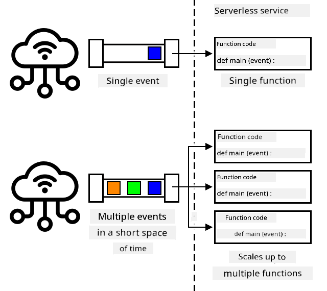
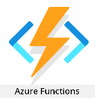
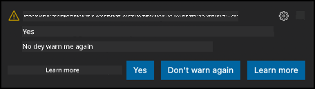

<!--
CO_OP_TRANSLATOR_METADATA:
{
  "original_hash": "5f2d2f4a5a023c93ab34a0cc5b47c0c4",
  "translation_date": "2025-11-18T19:42:29+00:00",
  "source_file": "2-farm/lessons/5-migrate-application-to-the-cloud/README.md",
  "language_code": "pcm"
}
-->
# Move your app logic go cloud


> Sketchnote by [Nitya Narasimhan](https://github.com/nitya). Click di image to see di bigger version.

Dis lesson na part of di [IoT for Beginners Project 2 - Digital Agriculture series](https://youtube.com/playlist?list=PLmsFUfdnGr3yCutmcVg6eAUEfsGiFXgcx) wey Microsoft Reactor teach. [Microsoft Reactor](https://developer.microsoft.com/reactor/?WT.mc_id=academic-17441-jabenn).

[](https://youtu.be/VVZDcs5u1_I)

## Pre-lecture quiz

[Pre-lecture quiz](https://black-meadow-040d15503.1.azurestaticapps.net/quiz/17)

## Introduction

For di last lesson, you don learn how to connect di soil moisture monitor for your plant and relay control go cloud-based IoT service. Di next step na to move di server code wey dey control di relay timing go di cloud. For dis lesson, you go learn how to do am with serverless functions.

For dis lesson we go talk about:

* [Wetin be serverless?](../../../../../2-farm/lessons/5-migrate-application-to-the-cloud)
* [How to create serverless application](../../../../../2-farm/lessons/5-migrate-application-to-the-cloud)
* [How to create IoT Hub event trigger](../../../../../2-farm/lessons/5-migrate-application-to-the-cloud)
* [How to send direct method requests from serverless code](../../../../../2-farm/lessons/5-migrate-application-to-the-cloud)
* [How to deploy your serverless code go cloud](../../../../../2-farm/lessons/5-migrate-application-to-the-cloud)

## Wetin be serverless?

Serverless, or serverless computing, na di way wey you go fit create small code wey go run for cloud anytime event happen. When di event happen, your code go run and e go get di data wey dey about di event. Dis events fit come from different things like web requests, messages wey dem put for queue, changes wey happen for database, or messages wey IoT devices send go IoT service.


> 💁 If you don use database triggers before, you fit think am like di same thing, code wey dey triggered by event like inserting row.



Your code go only run when di event happen, e no dey alive for other times. Di event go happen, your code go load and run. Dis make serverless dey scalable - if plenty events happen at di same time, di cloud provider fit run your function as many times as you need am for di same time across di servers wey dem get. Di downside be say if you need to share information between events, you go need save am somewhere like database instead of memory.

Your code go dey written as function wey dey take di event details as parameter. You fit use plenty programming languages write dis serverless functions.

> 🎓 Serverless dey also dey call Functions as a service (FaaS) because each event trigger dey work as function for code.

Even though di name na serverless, e still dey use servers. Di name dey because as developer, you no go need worry about di servers wey go run your code, all you go care about na say your code go run when event happen. Di cloud provider get serverless *runtime* wey dey manage di servers, networking, storage, CPU, memory and di rest wey your code need. Dis model mean say you no go pay per server, instead you go pay for di time wey your code dey run and di memory wey e use.

> 💰 Serverless na one of di cheapest way to run code for cloud. For example, as of di time wey dem write dis, one cloud provider dey allow all your serverless functions run 1,000,000 times every month before dem go start to charge you, and after dat dem go charge US$0.20 for every 1,000,000 executions. If your code no dey run, you no go pay.

As IoT developer, di serverless model dey perfect. You fit write function wey go dey called anytime message dey sent from any IoT device wey dey connected to your cloud-hosted IoT service. Your code go handle all di messages wey dem send, but e go only dey run when e need.

✅ Look di code wey you write as server code wey dey listen to messages over MQTT. How e fit run for cloud using serverless? How you think say di code go change to support serverless computing?

> 💁 Di serverless model dey move go other cloud services apart from running code. For example, serverless databases dey for cloud wey dey use serverless pricing model wey you go pay per request wey dem make against di database, like query or insert, usually based on di work wey dem do to service di request. For example, one select of one row against primary key go cost less than one complicated operation wey dey join plenty tables and dey return thousands of rows.

## How to create serverless application

Di serverless computing service wey Microsoft get na Azure Functions.



Di short video wey dey below dey give overview of Azure Functions

[](https://www.youtube.com/watch?v=8-jz5f_JyEQ)

> 🎥 Click di image above to watch di video

✅ Take small time do research and read di overview of Azure Functions for di [Microsoft Azure Functions documentation](https://docs.microsoft.com/azure/azure-functions/functions-overview?WT.mc_id=academic-17441-jabenn).

To write Azure Functions, you go start with Azure Functions app for di language wey you choose. Out of di box Azure Functions dey support Python, JavaScript, TypeScript, C#, F#, Java, and Powershell. For dis lesson, you go learn how to write Azure Functions app for Python.

> 💁 Azure Functions dey also support custom handlers so you fit write your functions for any language wey dey support HTTP requests, including old languages like COBOL.

Functions apps dey consist of one or more *triggers* - functions wey dey respond to events. You fit get plenty triggers inside one function app, all dey share di same configuration. For example, di configuration file for your Functions app fit get di connection details of your IoT Hub, and all di functions for di app fit use am connect and dey listen for events.

### Task - install di Azure Functions tools

> As of di time wey dem write dis, di Azure Functions code tools no dey fully work for Apple Silicon with Python projects. You go need use Intel-based Mac, Windows PC, or Linux PC instead.

One better feature of Azure Functions na say you fit run am locally. Di same runtime wey dey used for cloud fit run for your computer, so you fit write code wey dey respond to IoT messages and run am locally. You fit even debug your code as events dey handled. Once you dey happy with your code, you fit deploy am go cloud.

Di Azure Functions tools dey available as CLI, wey dem dey call Azure Functions Core Tools.

1. Install di Azure Functions core tools by following di instructions for di [Azure Functions Core Tools documentation](https://docs.microsoft.com/azure/azure-functions/functions-run-local?WT.mc_id=academic-17441-jabenn)

1. Install di Azure Functions extension for VS Code. Dis extension dey provide support for creating, debugging and deploying Azure functions. Check di [Azure Functions extension documentation](https://marketplace.visualstudio.com/items?WT.mc_id=academic-17441-jabenn&itemName=ms-azuretools.vscode-azurefunctions) for instructions on how to install dis extension for VS Code.

When you deploy your Azure Functions app go cloud, e go need small cloud storage to store things like di application files and log files. When you dey run your Functions app locally, you still go need connect to cloud storage, but instead of using actual cloud storage, you fit use storage emulator wey dem dey call [Azurite](https://github.com/Azure/Azurite). Dis one dey run locally but e dey act like cloud storage.

> 🎓 For Azure, di storage wey Azure Functions dey use na Azure Storage Account. Dis accounts fit store files, blobs, data for tables or data for queues. You fit share one storage account between plenty apps, like Functions app and web app.

1. Azurite na Node.js app, so you go need install Node.js. You fit find di download and installation instructions for di [Node.js website](https://nodejs.org/). If you dey use Mac, you fit also install am from [Homebrew](https://formulae.brew.sh/formula/node).

1. Install Azurite using dis command (`npm` na tool wey dey installed when you install Node.js):

    ```sh
    npm install -g azurite
    ```

1. Create folder wey you go call `azurite` for Azurite to use store data:

    ```sh
    mkdir azurite
    ```

1. Run Azurite, make e use dis new folder:

    ```sh
    azurite --location azurite
    ```

    Di Azurite storage emulator go launch and e go dey ready for di local Functions runtime to connect.

    ```output
    ➜  ~ azurite --location azurite  
    Azurite Blob service is starting at http://127.0.0.1:10000
    Azurite Blob service is successfully listening at http://127.0.0.1:10000
    Azurite Queue service is starting at http://127.0.0.1:10001
    Azurite Queue service is successfully listening at http://127.0.0.1:10001
    Azurite Table service is starting at http://127.0.0.1:10002
    Azurite Table service is successfully listening at http://127.0.0.1:10002
    ```

### Task - create Azure Functions project

Di Azure Functions CLI fit dey used to create new Functions app.

1. Create folder for your Functions app and enter di folder. Call am `soil-moisture-trigger`

    ```sh
    mkdir soil-moisture-trigger
    cd soil-moisture-trigger
    ```

1. Create Python virtual environment inside dis folder:

    ```sh
    python3 -m venv .venv
    ```

1. Activate di virtual environment:

    * For Windows:
        * If you dey use Command Prompt, or Command Prompt through Windows Terminal, run:

            ```cmd
            .venv\Scripts\activate.bat
            ```

        * If you dey use PowerShell, run:

            ```powershell
            .\.venv\Scripts\Activate.ps1
            ```

    * For macOS or Linux, run:

        ```cmd
        source ./.venv/bin/activate
        ```

    > 💁 Dis commands suppose dey run from di same location wey you run di command to create di virtual environment. You no go ever need enter di `.venv` folder, you suppose always run di activate command and any commands to install packages or run code from di folder wey you dey when you create di virtual environment.

1. Run dis command to create Functions app for dis folder:

    ```sh
    func init --worker-runtime python soil-moisture-trigger
    ```

    Dis go create three files inside di current folder:

    * `host.json` - dis JSON document dey contain settings for your Functions app. You no go need modify di settings.
    * `local.settings.json` - dis JSON document dey contain settings wey your app go use when e dey run locally, like connection strings for your IoT Hub. Dis settings na local only, and e no suppose dey added to source code control. When you deploy di app go cloud, dis settings no go dey deployed, instead your settings go dey loaded from application settings. Dis one go dey explained later for dis lesson.
    * `requirements.txt` - dis na [Pip requirements file](https://pip.pypa.io/en/stable/user_guide/#requirements-files) wey dey contain di Pip packages wey di Functions app need.

1. Di `local.settings.json` file get setting for di storage account wey di Functions app go use. E dey default to empty setting, so e need to dey set. To connect to di Azurite local storage emulator, set dis value to dis:

    ```json
    "AzureWebJobsStorage": "UseDevelopmentStorage=true",
    ```

1. Install di necessary Pip packages using di requirements file:

    ```sh
    pip install -r requirements.txt
    ```

    > 💁 Di required Pip packages suppose dey inside dis file, so dat when di Functions app dey deployed go cloud, di runtime fit make sure say e install di correct packages.

1. To test say everything dey work well, you fit start di Functions runtime. Run dis command to do am:

    ```sh
    func start
    ```

    You go see di runtime start up and e go talk say e no find any job functions (triggers).

    ```output
    (.venv) ➜  soil-moisture-trigger func start
    Found Python version 3.9.1 (python3).
    
    Azure Functions Core Tools
    Core Tools Version:       3.0.3442 Commit hash: 6bfab24b2743f8421475d996402c398d2fe4a9e0  (64-bit)
    Function Runtime Version: 3.0.15417.0
    
    [2021-05-05T01:24:46.795Z] No job functions found.
    ```

    > ⚠️ If you see firewall notification, allow am because di `func` application need to fit read and write for your network.

    > ⚠️ If you dey use macOS, you fit see warnings for di output:
    >
    > ```output
    > (.venv) ➜  soil-moisture-trigger func start
    > Found Python version 3.9.1 (python3).
    >
    > Azure Functions Core Tools
    > Core Tools Version:       3.0.3442 Commit hash: 6bfab24b2743f8421475d996402c398d2fe4a9e0  (64-bit)
    > Function Runtime Version: 3.0.15417.0
    >
    > [2021-06-16T08:18:28.315Z] Cannot create directory for shared memory usage: /dev/shm/AzureFunctions
    > [2021-06-16T08:18:28.316Z] System.IO.FileSystem: Access to the path '/dev/shm/AzureFunctions' is denied. Operation not permitted.
    > [2021-06-16T08:18:30.361Z] No job functions found.
    > ```
    >
    > You fit ignore dem as long as di Functions app start well and e list di running functions. As dem talk for [dis question for Microsoft Docs Q&A](https://docs.microsoft.com/answers/questions/396617/azure-functions-core-tools-error-osx-devshmazurefu.html?WT.mc_id=academic-17441-jabenn) e fit dey ignored.

1. Stop di Functions app by pressing `ctrl+c`.

1. Open di current folder for VS Code, either by opening VS Code, then opening dis folder, or by running dis:

    ```sh
    code .
    ```

VS Code go sabi your Functions project and go show one notification wey talk:

    ```output
    Detected an Azure Functions Project in folder "soil-moisture-trigger" that may have been created outside of
    VS Code. Initialize for optimal use with VS Code?
    ```



Choose **Yes** for dis notification.

1. Make sure say Python virtual environment dey run for VS Code terminal. If e no dey run, stop am and start am again.

## Create IoT Hub event trigger

The Functions app na di shell for your serverless code. To fit respond to IoT hub events, you fit add IoT Hub trigger to dis app. Dis trigger go need connect to di stream of messages wey dem dey send go IoT Hub and respond to dem. To get dis stream of messages, your trigger go need connect to di IoT Hub *event hub compatible endpoint*.

IoT Hub dey based on another Azure service wey dem dey call Azure Event Hubs. Event Hubs na service wey dey allow you send and receive messages, IoT Hub dey extend am to add features for IoT devices. Di way you go connect to read messages from IoT Hub na di same way wey you go use if na Event Hubs you dey use.

✅ Do small research: Read di overview of Event Hubs for di [Azure Event Hubs documentation](https://docs.microsoft.com/azure/event-hubs/event-hubs-about?WT.mc_id=academic-17441-jabenn). How di basic features take compare to IoT Hub?

For IoT device to connect to IoT Hub, e go need use secret key wey go make sure say na only allowed devices fit connect. Di same thing apply when you wan connect to read messages, your code go need connection string wey get secret key, plus di details of di IoT Hub.

> 💁 Di default connection string wey you go get get **iothubowner** permissions, wey go give any code wey use am full permissions for di IoT Hub. Ideally, you suppose connect with di lowest level of permissions wey you need. We go talk about dis one for di next lesson.

Once your trigger don connect, di code wey dey inside di function go dey called for every message wey dem send go IoT Hub, no matter di device wey send am. Di trigger go carry di message as parameter.

### Task - get di Event Hub compatible endpoint connection string

1. From di VS Code terminal, run dis command to get di connection string for di IoT Hub Event Hub compatible endpoint:

    ```sh
    az iot hub connection-string show --default-eventhub \
                                      --output table \
                                      --hub-name <hub_name>
    ```

Replace `<hub_name>` with di name wey you use for your IoT Hub.

1. For VS Code, open di `local.settings.json` file. Add dis extra value inside di `Values` section:

    ```json
    "IOT_HUB_CONNECTION_STRING": "<connection string>"
    ```

Replace `<connection string>` with di value wey you get for di previous step. You go need add comma after di line above to make am valid JSON.

### Task - create event trigger

You don ready to create di event trigger.

1. From di VS Code terminal, run dis command from inside di `soil-moisture-trigger` folder:

    ```sh
    func new --name iot-hub-trigger --template "Azure Event Hub trigger"
    ```

Dis one go create new Function wey dem dey call `iot-hub-trigger`. Di trigger go connect to di Event Hub compatible endpoint for di IoT Hub, so you fit use event hub trigger. No specific IoT Hub trigger dey.

Dis one go create folder inside di `soil-moisture-trigger` folder wey dem dey call `iot-hub-trigger` wey get dis function. Di folder go get di following files inside:

* `__init__.py` - dis na di Python code file wey get di trigger, using di standard Python file name convention to turn dis folder into Python module.

Dis file go get di following code:

    ```python
    import logging

    import azure.functions as func


    def main(event: func.EventHubEvent):
        logging.info('Python EventHub trigger processed an event: %s',
                    event.get_body().decode('utf-8'))
    ```

Di main thing for di trigger na di `main` function. Na dis function dem dey call with di events from IoT Hub. Dis function get one parameter wey dem dey call `event` wey get `EventHubEvent`. Anytime message dey sent to IoT Hub, dis function go dey called carry di message as `event`, plus properties wey be di same as di annotations wey you see for di last lesson.

Di main thing for dis function na to log di event.

* `function.json` - dis one get configuration for di trigger. Di main configuration dey inside one section wey dem dey call `bindings`. Binding na di name for connection between Azure Functions and other Azure services. Dis function get input binding to event hub - e dey connect to event hub and dey receive data.

> 💁 You fit also get output bindings so dat di output of one function go dey sent to another service. For example, you fit add output binding to database and return di IoT Hub event from di function, and e go automatically enter di database.

✅ Do small research: Read about bindings for di [Azure Functions triggers and bindings concepts documentation](https://docs.microsoft.com/azure/azure-functions/functions-triggers-bindings?WT.mc_id=academic-17441-jabenn&tabs=python).

Di `bindings` section get configuration for di binding. Di values wey dey important na:

* `"type": "eventHubTrigger"` - dis one dey tell di function say e need listen to events from Event Hub
* `"name": "events"` - dis na di parameter name wey dem go use for di Event Hub events. E match di parameter name for di `main` function for di Python code.
* `"direction": "in"` - dis na input binding, di data from di event hub dey enter di function
* `"connection": ""` - dis one dey define di name of di setting to read di connection string from. When you dey run locally, e go read dis setting from di `local.settings.json` file.

> 💁 Di connection string no fit dey stored for di `function.json` file, e suppose dey read from di settings. Dis na to stop you from accidentally exposing your connection string.

1. Because of [one bug for di Azure Functions template](https://github.com/Azure/azure-functions-templates/issues/1250), di `function.json` get wrong value for di `cardinality` field. Change dis field from `many` to `one`:

    ```json
    "cardinality": "one",
    ```

1. Change di value of `"connection"` for di `function.json` file to point to di new value wey you add for di `local.settings.json` file:

    ```json
    "connection": "IOT_HUB_CONNECTION_STRING",
    ```

> 💁 Remember - dis one suppose point to di setting, e no suppose contain di actual connection string.

1. Di connection string get di `eventHubName` value, so di value for dis one for di `function.json` file suppose dey empty. Change dis value to empty string:

    ```json
    "eventHubName": "",
    ```

### Task - run di event trigger

1. Make sure say you no dey run di IoT Hub event monitor. If e dey run di same time as di functions app, di functions app no go fit connect and consume events.

> 💁 Plenty apps fit connect to di IoT Hub endpoints using different *consumer groups*. We go talk about dis one for later lesson.

1. To run di Functions app, run dis command from di VS Code terminal:

    ```sh
    func start
    ```

Di Functions app go start, and e go discover di `iot-hub-trigger` function. E go then process any events wey dem don send go IoT Hub for di past day.

    ```output
    (.venv) ➜  soil-moisture-trigger func start
    Found Python version 3.9.1 (python3).
    
    Azure Functions Core Tools
    Core Tools Version:       3.0.3442 Commit hash: 6bfab24b2743f8421475d996402c398d2fe4a9e0  (64-bit)
    Function Runtime Version: 3.0.15417.0
    
    Functions:
    
            iot-hub-trigger: eventHubTrigger
    
    For detailed output, run func with --verbose flag.
    [2021-05-05T02:44:07.517Z] Worker process started and initialized.
    [2021-05-05T02:44:09.202Z] Executing 'Functions.iot-hub-trigger' (Reason='(null)', Id=802803a5-eae9-4401-a1f4-176631456ce4)
    [2021-05-05T02:44:09.205Z] Trigger Details: PartitionId: 0, Offset: 1011240-1011632, EnqueueTimeUtc: 2021-05-04T19:04:04.2030000Z-2021-05-04T19:04:04.3900000Z, SequenceNumber: 2546-2547, Count: 2
    [2021-05-05T02:44:09.352Z] Python EventHub trigger processed an event: {"soil_moisture":628}
    [2021-05-05T02:44:09.354Z] Python EventHub trigger processed an event: {"soil_moisture":624}
    [2021-05-05T02:44:09.395Z] Executed 'Functions.iot-hub-trigger' (Succeeded, Id=802803a5-eae9-4401-a1f4-176631456ce4, Duration=245ms)
    ```

Each call to di function go dey surrounded by `Executing 'Functions.iot-hub-trigger'`/`Executed 'Functions.iot-hub-trigger'` block for di output, so you fit see how many messages dem process for each function call.

1. Make sure say your IoT device dey run. You go see new soil moisture messages dey appear for di Functions app.

1. Stop and restart di Functions app. You go see say e no go process old messages again, e go only process new messages.

> 💁 VS Code dey support debugging your Functions. You fit set break points by clicking for di border near di start of each line of code, or put di cursor for one line of code and choose *Run -> Toggle breakpoint*, or press `F9`. You fit start di debugger by choosing *Run -> Start debugging*, press `F5`, or choose di *Run and debug* pane and choose di **Start debugging** button. By doing dis, you fit see di details of di events wey dem dey process.

#### Troubleshooting

* If you see dis error:

    ```output
    The listener for function 'Functions.iot-hub-trigger' was unable to start. Microsoft.WindowsAzure.Storage: Connection refused. System.Net.Http: Connection refused. System.Private.CoreLib: Connection refused.
    ```

Check say Azurite dey run and you don set di `AzureWebJobsStorage` for di `local.settings.json` file to `UseDevelopmentStorage=true`.

* If you see dis error:

    ```output
    System.Private.CoreLib: Exception while executing function: Functions.iot-hub-trigger. System.Private.CoreLib: Result: Failure Exception: AttributeError: 'list' object has no attribute 'get_body'
    ```

Check say you don set di `cardinality` for di `function.json` file to `one`.

* If you see dis error:

    ```output
    Azure.Messaging.EventHubs: The path to an Event Hub may be specified as part of the connection string or as a separate value, but not both.  Please verify that your connection string does not have the `EntityPath` token if you are passing an explicit Event Hub name. (Parameter 'connectionString').
    ```

Check say you don set di `eventHubName` for di `function.json` file to empty string.

## Send direct method requests from serverless code

So far, your Functions app dey listen to messages from IoT Hub using di Event Hub compatible endpoint. Now, you need send commands to di IoT device. Dis one dey done by using different connection to IoT Hub via di *Registry Manager*. Di Registry Manager na tool wey dey allow you see wetin devices dey registered with di IoT Hub, and communicate with dem by sending cloud to device messages, direct method requests or updating di device twin. You fit also use am to register, update or delete IoT devices from di IoT Hub.

To connect to di Registry Manager, you go need connection string.

### Task - get di Registry Manager connection string

1. To get di connection string, run dis command:

    ```sh
    az iot hub connection-string show --policy-name service \
                                      --output table \
                                      --hub-name <hub_name>
    ```

Replace `<hub_name>` with di name wey you use for your IoT Hub.

Di connection string dey requested for di *ServiceConnect* policy using di `--policy-name service` parameter. When you dey request connection string, you fit specify wetin permissions dat connection string go allow. Di ServiceConnect policy dey allow your code connect and send messages to IoT devices.

✅ Do small research: Read about di different policies for di [IoT Hub permissions documentation](https://docs.microsoft.com/azure/iot-hub/iot-hub-devguide-security#iot-hub-permissions?WT.mc_id=academic-17441-jabenn)

1. For VS Code, open di `local.settings.json` file. Add dis extra value inside di `Values` section:

    ```json
    "REGISTRY_MANAGER_CONNECTION_STRING": "<connection string>"
    ```

Replace `<connection string>` with di value wey you get for di previous step. You go need add comma after di line above to make am valid JSON.

### Task - send direct method request to device

1. Di SDK for di Registry Manager dey available via Pip package. Add dis line to di `requirements.txt` file to add di dependency for dis package:

    ```sh
    azure-iot-hub
    ```

1. Make sure say VS Code terminal get di virtual environment activated, and run dis command to install di Pip packages:

    ```sh
    pip install -r requirements.txt
    ```

1. Add dis imports to di `__init__.py` file:

    ```python
    import json
    import os
    from azure.iot.hub import IoTHubRegistryManager
    from azure.iot.hub.models import CloudToDeviceMethod
    ```

Dis one dey import some system libraries, plus di libraries to interact with di Registry Manager and send direct method requests.

1. Remove di code wey dey inside di `main` method, but keep di method itself.

1. For di `main` method, add dis code:

    ```python
    body = json.loads(event.get_body().decode('utf-8'))
    device_id = event.iothub_metadata['connection-device-id']

    logging.info(f'Received message: {body} from {device_id}')
    ```

Dis code dey extract di body of di event wey get di JSON message wey IoT device send.

E then dey get di device ID from di annotations wey dem pass with di message. Di body of di event get di message wey dem send as telemetry, di `iothub_metadata` dictionary get properties wey IoT Hub set like di device ID of di sender, and di time wey dem send di message.

Dis information dey logged. You go see dis logging for di terminal when you dey run di Function app locally.

1. Under dis, add dis code:

    ```python
    soil_moisture = body['soil_moisture']

    if soil_moisture > 450:
        direct_method = CloudToDeviceMethod(method_name='relay_on', payload='{}')
    else:
        direct_method = CloudToDeviceMethod(method_name='relay_off', payload='{}')
    ```

Dis code dey get di soil moisture from di message. E then dey check di soil moisture, and depending on di value, e dey create helper class for di direct method request for di `relay_on` or `relay_off` direct method. Di method request no need payload, so empty JSON document dey sent.

1. Under dis, add dis code:

    ```python
    logging.info(f'Sending direct method request for {direct_method.method_name} for device {device_id}')

    registry_manager_connection_string = os.environ['REGISTRY_MANAGER_CONNECTION_STRING']
    registry_manager = IoTHubRegistryManager(registry_manager_connection_string)
    ```

Dis code dey load di `REGISTRY_MANAGER_CONNECTION_STRING` from di `local.settings.json` file. Di values for dis file dey available as environment variables, and you fit read dem using di `os.environ` function, one function wey dey return dictionary of all di environment variables.

> 💁 When dis code dey deployed to di cloud, di values for di `local.settings.json` file go dey set as *Application Settings*, and you fit read dem from environment variables.

Di code then dey create instance of di Registry Manager helper class using di connection string.

1. Under dis, add dis code:

    ```python
    registry_manager.invoke_device_method(device_id, direct_method)

    logging.info('Direct method request sent!')
    ```

Dis code dey tell di registry manager to send di direct method request to di device wey send di telemetry.
> 💁 For di app wey you don create for di earlier lessons wey dey use MQTT, di relay control commands dey go all di devices. Di code bin dey assume say you go only get one device. Dis version of di code dey send di method request go one device, so e go work if you get plenty setups of moisture sensors and relays, dey send di correct direct method request go di correct device.

1. Run di Functions app, and make sure say your IoT device dey send data. You go see di messages wey dem dey process and di direct method requests wey dem dey send. Move di soil moisture sensor enter and comot for di soil to see how di values dey change and how di relay dey turn on and off.

> 💁 You fit find dis code for di [code/functions](../../../../../2-farm/lessons/5-migrate-application-to-the-cloud/code/functions) folder.

## Deploy your serverless code go di cloud

Your code don dey work for your computer, so di next step na to deploy di Functions App go di cloud.

### Task - create di cloud resources

Your Functions app need to dey deploy go one Functions App resource for Azure, wey go dey inside di Resource Group wey you create for your IoT Hub. You go also need one Storage Account wey dem go create for Azure to replace di one wey you dey emulate for your computer.

1. Run dis command to create one storage account:

    ```sh
    az storage account create --resource-group soil-moisture-sensor \
                              --sku Standard_LRS \
                              --name <storage_name> 
    ```

    Change `<storage_name>` to di name wey you wan give your storage account. Dis name go need to dey unique for di whole world because e go dey part of di URL wey dem go use access di storage account. You fit only use small letters and numbers for dis name, no other characters, and e no fit pass 24 characters. Use something like `sms` and add one unique identifier for di end, like random words or your name.

    Di `--sku Standard_LRS` dey select di pricing tier, wey be di lowest cost general-purpose account. No free tier dey for storage, and you go pay for wetin you use. Di cost no too high, di most expensive storage na less than US$0.05 per month per gigabyte wey you store.

    ✅ Check di pricing for di [Azure Storage Account pricing page](https://azure.microsoft.com/pricing/details/storage/?WT.mc_id=academic-17441-jabenn)

1. Run dis command to create one Function App:

    ```sh
    az functionapp create --resource-group soil-moisture-sensor \
                          --runtime python \
                          --functions-version 3 \
                          --os-type Linux \
                          --consumption-plan-location <location> \
                          --storage-account <storage_name> \
                          --name <functions_app_name>
    ```

    Change `<location>` to di location wey you use when you dey create di Resource Group for di previous lesson.

    Change `<storage_name>` to di name of di storage account wey you create for di previous step.

    Change `<functions_app_name>` to one unique name for your Functions App. Dis name go need to dey unique for di whole world because e go dey part of di URL wey dem go use access di Functions App. Use something like `soil-moisture-sensor-` and add one unique identifier for di end, like random words or your name.

    Di `--functions-version 3` dey set di version of Azure Functions wey you go use. Version 3 na di latest version.

    Di `--os-type Linux` dey tell di Functions runtime to use Linux as di OS wey go host di functions. Functions fit dey host for Linux or Windows, depending on di programming language wey you dey use. Python apps na only Linux dem dey support.

### Task - upload your application settings

When you dey develop your Functions App, you store some settings for di `local.settings.json` file for di connection strings for your IoT Hub. Dis ones need to dey write go Application Settings for your Function App for Azure so dat your code fit use dem.

> 🎓 Di `local.settings.json` file na for local development settings only, and you no suppose check am into source code control, like GitHub. When you deploy am go di cloud, na Application Settings dem dey use. Application Settings na key/value pairs wey dem dey host for di cloud and dem dey read from environment variables either for your code or by di runtime when e dey connect your code to IoT Hub.

1. Run dis command to set di `IOT_HUB_CONNECTION_STRING` setting for di Functions App Application Settings:

    ```sh
    az functionapp config appsettings set --resource-group soil-moisture-sensor \
                                          --name <functions_app_name> \
                                          --settings "IOT_HUB_CONNECTION_STRING=<connection string>"
    ```

    Change `<functions_app_name>` to di name wey you use for your Functions App.

    Change `<connection string>` to di value of `IOT_HUB_CONNECTION_STRING` from your `local.settings.json` file.

1. Repeat di step wey dey up, but set di value of `REGISTRY_MANAGER_CONNECTION_STRING` to di correct value from your `local.settings.json` file.

When you run dis commands, dem go also show one list of all di Application Settings for di function app. You fit use dis one check say your values dey set correct.

> 💁 You go see one value wey dem don already set for `AzureWebJobsStorage`. For your `local.settings.json` file, dis one bin dey set to one value wey dey use di local storage emulator. When you create di Functions App, you dey pass di storage account as parameter, and dis one go dey set automatically for dis setting.

### Task - deploy your Functions App go di cloud

Now wey di Functions App don ready, your code fit dey deploy.

1. Run dis command from di VS Code terminal to publish your Functions App:

    ```sh
    func azure functionapp publish <functions_app_name>
    ```

    Change `<functions_app_name>` to di name wey you use for your Functions App.

Di code go dey package and dem go send am go di Functions App, where dem go deploy am and start am. Plenty console output go dey, and e go end with confirmation of di deployment and one list of di functions wey dem deploy. For dis case, di list go only get di trigger.

```output
Deployment successful.
Remote build succeeded!
Syncing triggers...
Functions in soil-moisture-sensor:
    iot-hub-trigger - [eventHubTrigger]
```

Make sure say your IoT device dey run. Change di moisture levels by adjusting di soil moisture, or move di sensor enter and comot for di soil. You go see di relay dey turn on and off as di soil moisture dey change.

---

## 🚀 Challenge

For di previous lesson, you manage di timing for di relay by unsubscribing from MQTT messages while di relay dey on, and for small time after e don turn off. You no fit use dis method here - you no fit unsubscribe your IoT Hub trigger.

Think about different ways wey you fit handle dis one for your Functions App.

## Post-lecture quiz

[Post-lecture quiz](https://black-meadow-040d15503.1.azurestaticapps.net/quiz/18)

## Review & Self Study

* Read about serverless computing for di [Serverless Computing page for Wikipedia](https://wikipedia.org/wiki/Serverless_computing)
* Read about how to use serverless for Azure including some more examples for di [Go serverless for your IoT needs Azure blog post](https://azure.microsoft.com/blog/go-serverless-for-your-iot-needs/?WT.mc_id=academic-17441-jabenn)
* Learn more about Azure Functions for di [Azure Functions YouTube channel](https://www.youtube.com/c/AzureFunctions)

## Assignment

[Add manual relay control](assignment.md)

---

<!-- CO-OP TRANSLATOR DISCLAIMER START -->
**Disclaimer**:  
Dis dokyument don use AI translation service [Co-op Translator](https://github.com/Azure/co-op-translator) do di translation. Even as we dey try make am accurate, abeg sabi say automated translations fit get mistake or no dey correct well. Di original dokyument for im native language na di main source wey you go fit trust. For important information, e good make professional human translation dey use. We no go fit take blame for any misunderstanding or wrong interpretation wey fit happen because you use dis translation.
<!-- CO-OP TRANSLATOR DISCLAIMER END -->