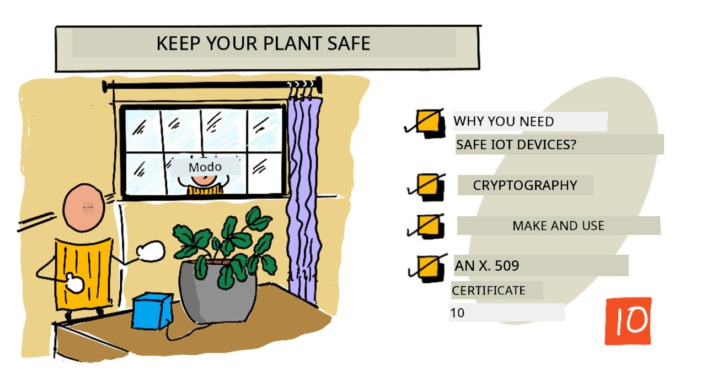
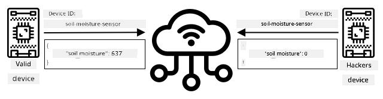
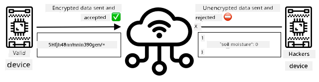
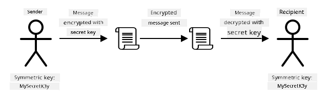
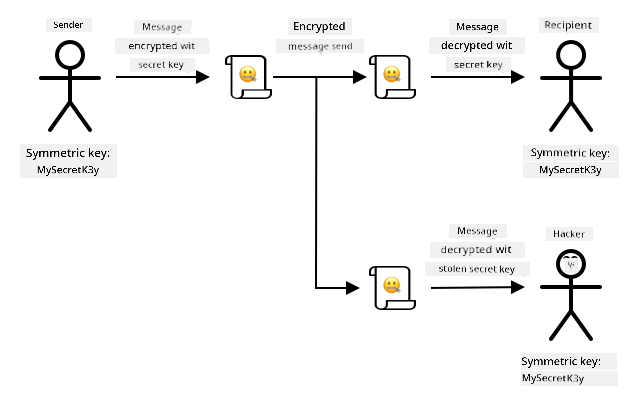
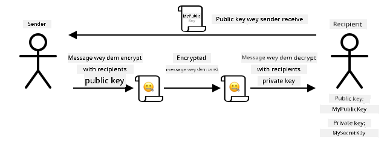
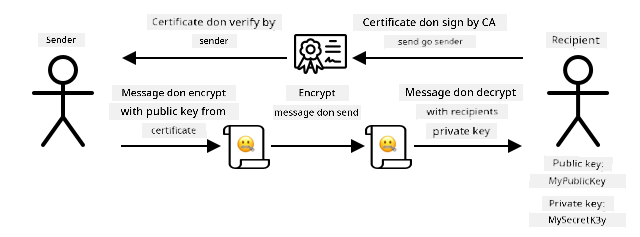

<!--
CO_OP_TRANSLATOR_METADATA:
{
  "original_hash": "81c437c568eee1b0dda1f04e88150d37",
  "translation_date": "2025-11-18T19:44:26+00:00",
  "source_file": "2-farm/lessons/6-keep-your-plant-secure/README.md",
  "language_code": "pcm"
}
-->
# Make sure say your plant dey safe



> Sketchnote by [Nitya Narasimhan](https://github.com/nitya). Click di image for bigger version.

## Pre-lecture quiz

[Pre-lecture quiz](https://black-meadow-040d15503.1.azurestaticapps.net/quiz/19)

## Introduction

For di last few lessons, you don build soil monitoring IoT device wey connect to di cloud. But wetin go happen if hackers wey dey work for rival farmer fit take control of your IoT devices? Wetin if dem send fake high soil moisture readings so your plants no go get water, or dem turn on your watering system make e dey run all di time, wey go kill your plants from too much water and go cost you plenty money for water?

For dis lesson, you go learn how to secure IoT devices. Since na di last lesson for dis project, you go also learn how to clean up your cloud resources, so you no go dey pay extra money.

For dis lesson, we go talk about:

* [Why e dey important to secure IoT devices?](../../../../../2-farm/lessons/6-keep-your-plant-secure)
* [Cryptography](../../../../../2-farm/lessons/6-keep-your-plant-secure)
* [How to secure your IoT devices](../../../../../2-farm/lessons/6-keep-your-plant-secure)
* [How to generate and use X.509 certificate](../../../../../2-farm/lessons/6-keep-your-plant-secure)

> 🗑 Dis na di last lesson for dis project, so after you finish dis lesson and di assignment, no forget to clean up your cloud services. You go need di services to complete di assignment, so make sure say you finish am first.
>
> Check [di clean up your project guide](../../../clean-up.md) if you need instructions on how to do am.

## Why e dey important to secure IoT devices?

IoT security na to make sure say only di devices wey you expect fit connect to your cloud IoT service and send telemetry, and only your cloud service fit send commands to your devices. IoT data fit be personal, like medical or private data, so your whole application need to think about security to stop di data from leaking.

If your IoT application no secure, e get plenty risks:

* Fake device fit send wrong data, wey go make your application behave anyhow. For example, dem fit send constant high soil moisture readings, wey go make your irrigation system no turn on and your plants go die because dem no get water.
* Unauthorized people fit read data from IoT devices, including personal or business-critical data.
* Hackers fit send commands to control di device in way wey fit spoil di device or di hardware wey dey connected.
* If hackers connect to IoT device, dem fit use am enter other networks to access private systems.
* Bad people fit access personal data and use am for blackmail.

Dis na real-life situations, and e dey happen all di time. Some examples don dey for earlier lessons, but here be more:

* For 2018, hackers use open WiFi access point for fish tank thermostat take enter casino network to steal data. [The Hacker News - Casino Gets Hacked Through Its Internet-Connected Fish Tank Thermometer](https://thehackernews.com/2018/04/iot-hacking-thermometer.html)
* For 2016, di Mirai Botnet launch denial of service attack against Dyn, one Internet service provider, wey take down big parts of di Internet. Dis botnet use malware connect to IoT devices like DVRs and cameras wey dey use default usernames and passwords, and from there launch di attack. [The Guardian - DDoS attack that disrupted internet was largest of its kind in history, experts say](https://www.theguardian.com/technology/2016/oct/26/ddos-attack-dyn-mirai-botnet)
* Spiral Toys get database of users of their CloudPets connected toys wey dey public for Internet. [Troy Hunt - Data from connected CloudPets teddy bears leaked and ransomed, exposing kids' voice messages](https://www.troyhunt.com/data-from-connected-cloudpets-teddy-bears-leaked-and-ransomed-exposing-kids-voice-messages/).
* Strava dey tag runners wey you pass and show their routes, wey dey allow strangers see where you dey live. [Kim Komndo - Fitness app could lead a stranger right to your home — change this setting](https://www.komando.com/security-privacy/strava-fitness-app-privacy/755349/).

✅ Do some research: Search for more examples of IoT Hacks and breaches of IoT data, especially with personal items like Internet-connected toothbrushes or scales. Think about di impact wey dis hacks fit get on di victims or customers.

> 💁 Security na big topic, and dis lesson go only touch di basics about connecting your device to di cloud. Other topics wey we no go cover include monitoring for data changes in transit, hacking devices directly, or changes to device configurations. IoT hacking na big threat, tools like [Azure Defender for IoT](https://azure.microsoft.com/services/azure-defender-for-iot/?WT.mc_id=academic-17441-jabenn) don dey developed. Dis tools dey similar to di anti-virus and security tools wey you fit get for your computer, but dem dey designed for small, low-powered IoT devices.

## Cryptography

When device dey connect to IoT service, e dey use ID to identify itself. Di problem be say dis ID fit dey cloned - hacker fit set up bad device wey dey use di same ID as real device but dey send fake data.



Di way to solve dis na to change di data wey dem dey send into scrambled format, using one kind value wey only di device and di cloud sabi. Dis process na *encryption*, and di value wey dem dey use to encrypt di data na *encryption key*.



Di cloud service go then change di data back to readable format, using process wey dem dey call *decryption*, using di same encryption key or *decryption key*. If di encrypted message no fit decrypt with di key, di device don dey hacked and di message go reject.

Di technique wey dem dey use for encryption and decryption na *cryptography*.

### Early cryptography

Di earliest types of cryptography na substitution ciphers, wey don dey since 3,500 years ago. Substitution ciphers na to replace one letter with another. For example, di [Caesar cipher](https://wikipedia.org/wiki/Caesar_cipher) dey shift di alphabet by defined amount, wey only di sender of di encrypted message and di person wey go receive am sabi how many letters dem shift.

Di [Vigenère cipher](https://wikipedia.org/wiki/Vigenère_cipher) carry am go further by using words to encrypt text, so say each letter for di original text go shift by different amount, instead of always shifting by di same number of letters.

Cryptography don dey used for plenty things, like protecting potters glaze recipe for ancient Mesopotamia, writing secret love notes for India, or keeping ancient Egyptian magical spells secret.

### Modern cryptography

Modern cryptography don advance well, e dey harder to crack than di old methods. Modern cryptography dey use complicated mathematics to encrypt data wey get too many possible keys wey go make brute force attacks no possible.

Cryptography dey used for plenty ways for secure communications. If you dey read dis page for GitHub, you fit notice say di web site address dey start with *HTTPS*, wey mean say di communication between your browser and di web servers of GitHub don dey encrypted. If person fit read di internet traffic wey dey flow between your browser and GitHub, dem no go fit read di data because e don dey encrypted. Your computer fit even encrypt all di data for your hard drive so if person thief am, dem no go fit read any of your data without your password.

> 🎓 HTTPS mean HyperText Transfer Protocol **Secure**

But no be everything dey secure. Some devices no get security, others dey secured with easy-to-crack keys, or sometimes all di devices of di same type dey use di same key. E get stories of very personal IoT devices wey all get di same password to connect to dem over WiFi or Bluetooth. If you fit connect to your own device, you fit connect to another person own. Once you connect, you fit access some very private data, or control di person device.

> 💁 Even though modern cryptography dey complex and dem dey talk say breaking encryption fit take billions of years, di rise of quantum computing don make am possible to break all known encryption for very short time!

### Symmetric and asymmetric keys

Encryption get two types - symmetric and asymmetric.

**Symmetric** encryption dey use di same key to encrypt and decrypt di data. Both di sender and receiver need to sabi di same key. Dis na di least secure type, because di key need to dey shared somehow. For sender to send encrypted message to recipient, di sender first fit need to send di recipient di key.



If di key dey stolen for transit, or di sender or recipient dey hacked and di key dey found, di encryption fit dey cracked.



**Asymmetric** encryption dey use 2 keys - one encryption key and one decryption key, wey dem dey call public/private key pair. Di public key dey used to encrypt di message, but e no fit dey used to decrypt am, di private key dey used to decrypt di message but e no fit dey used to encrypt am.



Di recipient go share their public key, and di sender go use am to encrypt di message. Once di message don send, di recipient go decrypt am with their private key. Asymmetric encryption dey more secure because di private key dey kept private by di recipient and e no dey shared. Anybody fit get di public key because e only fit dey used to encrypt messages.

Symmetric encryption dey faster than asymmetric encryption, asymmetric dey more secure. Some systems go use both - using asymmetric encryption to encrypt and share di symmetric key, then using di symmetric key to encrypt all data. Dis go make am more secure to share di symmetric key between sender and recipient, and faster when encrypting and decrypting data.

## How to secure your IoT devices

IoT devices fit dey secured using symmetric or asymmetric encryption. Symmetric dey easier, but e no dey too secure.

### Symmetric keys

When you set up your IoT device to interact with IoT Hub, you use connection string. Example connection string na:

```output
HostName=soil-moisture-sensor.azure-devices.net;DeviceId=soil-moisture-sensor;SharedAccessKey=Bhry+ind7kKEIDxubK61RiEHHRTrPl7HUow8cEm/mU0=
```

Dis connection string get three parts wey dey separated by semi-colons, with each part na key and value:

| Key | Value | Description |
| --- | ----- | ----------- |
| HostName | `soil-moisture-sensor.azure-devices.net` | Di URL of di IoT Hub |
| DeviceId | `soil-moisture-sensor` | Di unique ID of di device |
| SharedAccessKey | `Bhry+ind7kKEIDxubK61RiEHHRTrPl7HUow8cEm/mU0=` | Symmetric key wey di device and di IoT Hub sabi |

Di last part of dis connection string, di `SharedAccessKey`, na di symmetric key wey di device and di IoT Hub sabi. Dis key no dey sent from di device to di cloud, or di cloud to di device. Instead, e dey used to encrypt data wey dem dey send or receive.

✅ Do experiment. Wetin you think go happen if you change di `SharedAccessKey` part of di connection string when you dey connect your IoT device? Try am.

When di device first try connect, e dey send shared access signature (SAS) token wey get di URL of di IoT Hub, timestamp wey di access signature go expire (usually 1 day from di current time), and signature. Dis signature get di URL and di expiry time wey don encrypt with di shared access key from di connection string.

Di IoT Hub go decrypt dis signature with di shared access key, and if di decrypted value match di URL and expiry, di device go fit connect. E go also check say di current time dey before di expiry, to stop bad device wey fit capture di SAS token of real device and use am.

Dis na smart way to confirm say di sender na correct device. By sending some known data for both decrypted and encrypted form, di server fit confirm di device by making sure say when e decrypt di encrypted data, di result go match di decrypted version wey dem send. If e match, then di sender and recipient get di same symmetric encryption key.
> 💁 Because di expiry time dey, your IoT device gatz sabi di correct time, wey e go usually read from one [NTP](https://wikipedia.org/wiki/Network_Time_Protocol) server. If di time no correct, di connection no go work.

Afta di connection, all di data wey di IoT Hub send go di device, or di one wey di device send go di IoT Hub, dem go encrypt am wit di shared access key.

✅ Wetin you tink go happen if plenty devices dey use di same connection string?

> 💁 E no good at all to store dis key for inside code. If hacker fit see your source code, dem fit collect your key. E go still hard when you wan release code because you go need recompile am wit updated key for every device. E beta make you load dis key from hardware security module - na chip wey dey di IoT device wey dey store encrypted values wey your code fit read.

> When you dey learn IoT, e dey easy to put di key for inside code, like as you do for di earlier lesson, but you gatz make sure say dis key no dey public source code control.

Devices get 2 keys, and 2 connection strings wey match dem. Dis one go allow you fit rotate di keys - dat na to switch from one key go anoda if di first one don spoil, and you fit re-generate di first key.

### X.509 certificates

If you dey use asymmetric encryption wit public/private key pair, you gatz give your public key to anybody wey wan send you data. Di wahala be say, how di person wey collect your key go sabi say na your real public key, no be another person wey dey pretend to be you? Instead of to give key, you fit give your public key inside certificate wey trusted third party don verify, dem dey call am X.509 certificate.

X.509 certificates na digital document wey get di public key part of di public/private key pair. Dem dey usually issue am by trusted organizations wey dem dey call [Certification authorities](https://wikipedia.org/wiki/Certificate_authority) (CAs), and di CA go sign am digitally to show say di key dey valid and e come from you. You go trust di certificate and di public key because you trust di CA, just like how you go trust passport or driver license because you trust di country wey issue am. Certificates dey cost money, so you fit 'self-sign', dat na to create certificate by yourself wey you go sign for testing.

> 💁 No ever use self-signed certificate for production release.

Dis certificates get plenty fields inside dem, like who di public key dey from, di CA wey issue am, how long e go valid, and di public key itself. Before you use certificate, e good make you verify am by checking say di original CA sign am.

✅ You fit read full list of di fields wey dey di certificate for [Microsoft Understanding X.509 Public Key Certificates tutorial](https://docs.microsoft.com/azure/iot-hub/tutorial-x509-certificates?WT.mc_id=academic-17441-jabenn#certificate-fields)

If you dey use X.509 certificates, both di sender and di receiver go get dia own public and private keys, and dem go still get X.509 certificates wey get di public key. Dem go exchange X.509 certificates somehow, use each other public keys to encrypt di data wey dem dey send, and use dia own private key to decrypt di data wey dem receive.



One big advantage of using X.509 certificates be say you fit share dem between devices. You fit create one certificate, upload am to IoT Hub, and use am for all your devices. Each device go just need di private key to decrypt di messages wey e receive from IoT Hub.

Di certificate wey your device dey use to encrypt messages wey e dey send go IoT Hub na Microsoft publish am. Na di same certificate wey plenty Azure services dey use, and sometimes e dey already dey inside di SDKs.

> 💁 Remember, public key na public. Di Azure public key fit only dey used to encrypt data wey dem dey send go Azure, no be to decrypt am, so e fit dey shared anywhere, even for source code. For example, you fit see am for [Azure IoT C SDK source code](https://github.com/Azure/azure-iot-sdk-c/blob/master/certs/certs.c).

✅ Plenty grammar dey for X.509 certificates. You fit read di meaning of some of di terms wey you fit see for [The layman’s guide to X.509 certificate jargon](https://techcommunity.microsoft.com/t5/internet-of-things/the-layman-s-guide-to-x-509-certificate-jargon/ba-p/2203540?WT.mc_id=academic-17441-jabenn)

## Generate and use an X.509 certificate

Di steps to generate X.509 certificate be:

1. Create public/private key pair. One of di most common algorithm wey dem dey use to generate public/private key pair na [Rivest–Shamir–Adleman](https://wikipedia.org/wiki/RSA_(cryptosystem))(RSA).

1. Submit di public key wit di data wey follow am for signing, either by CA, or by self-signing.

Azure CLI get commands to create new device identity for IoT Hub, and e go automatically generate di public/private key pair and create self-signed certificate.

> 💁 If you wan see di steps in detail, instead of using Azure CLI, you fit find am for [Using OpenSSL to create self-signed certificates tutorial in di Microsoft IoT Hub documentation](https://docs.microsoft.com/azure/iot-hub/tutorial-x509-self-sign?WT.mc_id=academic-17441-jabenn)

### Task - create device identity using X.509 certificate

1. Run dis command to register di new device identity, e go automatically generate di keys and certificates:

    ```sh
    az iot hub device-identity create --device-id soil-moisture-sensor-x509 \
                                      --am x509_thumbprint \
                                      --output-dir . \
                                      --hub-name <hub_name>
    ```

    Replace `<hub_name>` wit di name wey you use for your IoT Hub.

    Dis one go create device wey get ID of `soil-moisture-sensor-x509` to make am different from di device identity wey you create for di last lesson. Dis command go still create 2 files for di current directory:

    * `soil-moisture-sensor-x509-key.pem` - dis file get di private key for di device.
    * `soil-moisture-sensor-x509-cert.pem` - dis na di X.509 certificate file for di device.

    Keep dis files safe! Di private key file no suppose dey public source code control.

### Task - use di X.509 certificate for your device code

Follow di correct guide to connect your IoT device to di cloud using di X.509 certificate:

* [Arduino - Wio Terminal](wio-terminal-x509.md)
* [Single-board computer - Raspberry Pi/Virtual IoT device](single-board-computer-x509.md)

---

## 🚀 Challenge

Plenty ways dey to create, manage and delete Azure services like Resource Groups and IoT Hubs. One way na di [Azure Portal](https://portal.azure.com?WT.mc_id=academic-17441-jabenn) - na web-based interface wey dey give you GUI to manage your Azure services.

Go [portal.azure.com](https://portal.azure.com?WT.mc_id=academic-17441-jabenn) and check di portal. Try create IoT Hub using di portal, then delete am.

**Hint** - when you dey create services through di portal, you no need create Resource Group first, you fit create am when you dey create di service. Make sure say you delete am when you don finish!

You fit find plenty documentation, tutorials and guides for di Azure Portal for [Azure portal documentation](https://docs.microsoft.com/azure/azure-portal/?WT.mc_id=academic-17441-jabenn).

## Post-lecture quiz

[Post-lecture quiz](https://black-meadow-040d15503.1.azurestaticapps.net/quiz/20)

## Review & Self Study

* Read about di history of cryptography for [History of cryptography page on Wikipedia](https://wikipedia.org/wiki/History_of_cryptography).
* Read about X.509 certificates for [X.509 page on Wikipedia](https://wikipedia.org/wiki/X.509).

## Assignment

[Build a new IoT device](assignment.md)

---

<!-- CO-OP TRANSLATOR DISCLAIMER START -->
**Disclaimer**:  
Dis dokyument don translate wit AI translation service [Co-op Translator](https://github.com/Azure/co-op-translator). Even as we dey try make am accurate, abeg sabi say automatic translation fit get mistake or no dey correct well. Di original dokyument for im native language na di main source wey you go fit trust. For important information, e good make professional human translation dey use. We no go fit take blame for any misunderstanding or wrong interpretation wey fit happen because you use dis translation.
<!-- CO-OP TRANSLATOR DISCLAIMER END -->