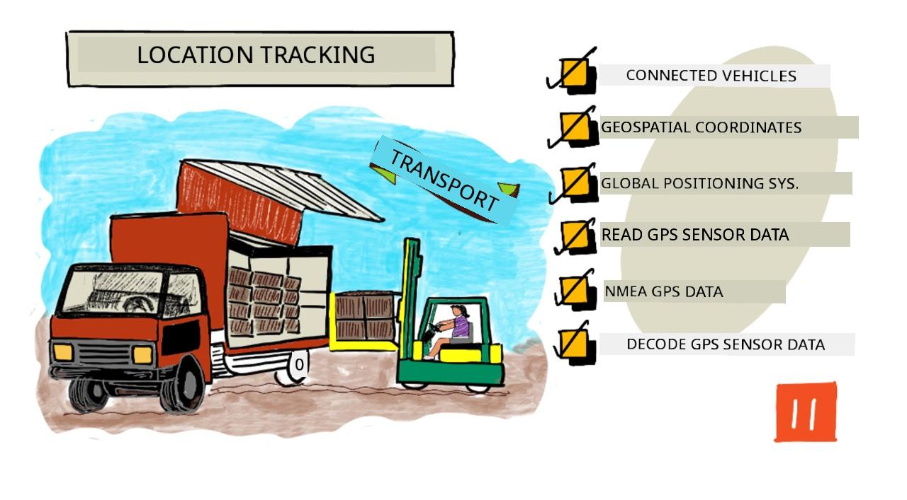
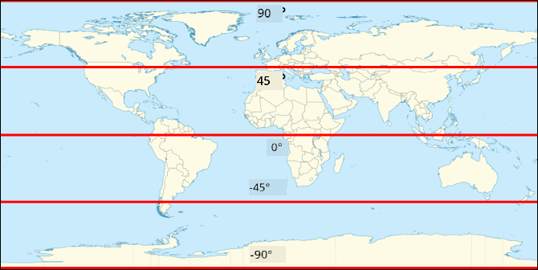
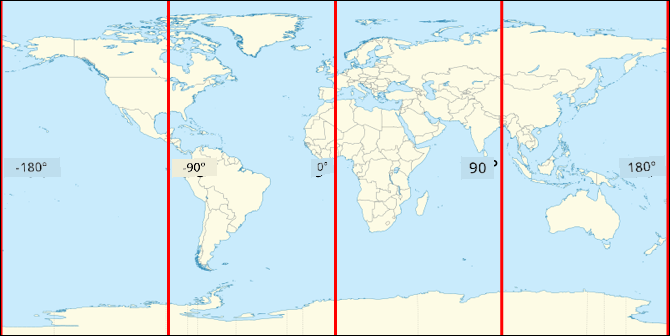
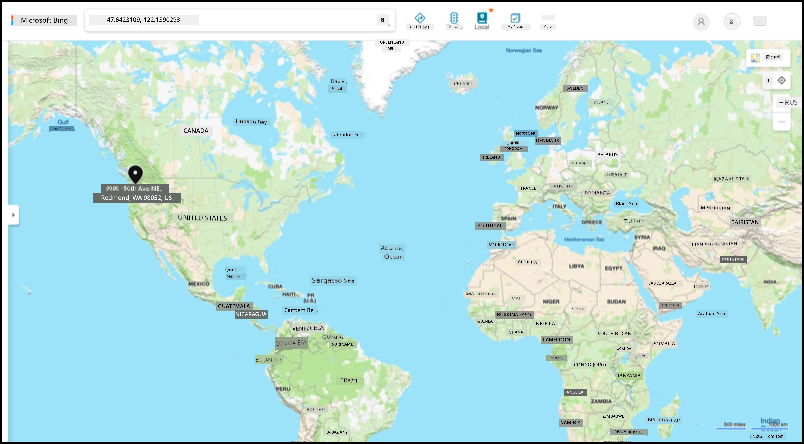
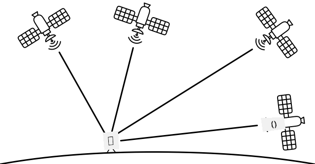

<!--
CO_OP_TRANSLATOR_METADATA:
{
  "original_hash": "52ed2bd997d08040f79a1a6ef2bac958",
  "translation_date": "2025-11-18T19:04:26+00:00",
  "source_file": "3-transport/lessons/1-location-tracking/README.md",
  "language_code": "pcm"
}
-->
# Location tracking

> Sketchnote by [Nitya Narasimhan](https://github.com/nitya). Click the image for a larger version.

## Pre-lecture quiz

[Pre-lecture quiz](https://black-meadow-040d15503.1.azurestaticapps.net/quiz/21)

## Introduction

Di main process wey dey carry food from farmer go consumer na to load di boxes of produce for trucks, ships, airplanes, or other transport vehicles, den deliver di food go somewhere - either directly to di customer, or to central hub or warehouse for processing. Di whole process from farm to consumer na wetin dem dey call *supply chain*. Di video wey dey below from Arizona State University's W. P. Carey School of Business go explain di idea of supply chain and how dem dey manage am well well.

> 🎥 Click di image above to watch di video

If you add IoT devices, e fit help your supply chain well well, make you sabi where items dey, plan transport and goods handling better, and quick quick solve problems.

If you dey manage fleet of vehicles like trucks, e go good make you sabi where each vehicle dey at any time. Vehicles fit get GPS sensors wey dey send their location go IoT systems, so di owners fit know where di vehicle dey, di route wey e don pass, and when e go reach di destination. Most vehicles dey operate outside WiFi coverage, so dem dey use cellular networks to send dis kind data. Sometimes di GPS sensor dey inside more complex IoT devices like electronic log books. Dis devices dey track how long di truck don dey transit to make sure say di drivers dey follow di local laws for working hours.

For dis lesson, you go learn how to track vehicle location using Global Positioning System (GPS) sensor.

For dis lesson we go talk about:

* [Connected vehicles](../../../../../3-transport/lessons/1-location-tracking)
* [Geospatial coordinates](../../../../../3-transport/lessons/1-location-tracking)
* [Global Positioning Systems (GPS)](../../../../../3-transport/lessons/1-location-tracking)
* [Read GPS sensor data](../../../../../3-transport/lessons/1-location-tracking)
* [NMEA GPS data](../../../../../3-transport/lessons/1-location-tracking)
* [Decode GPS sensor data](../../../../../3-transport/lessons/1-location-tracking)

## Connected vehicles

IoT dey change di way wey goods dey transport by creating fleets of *connected vehicles*. Dis vehicles dey connect to central IT systems wey dey report information about their location and other sensor data. If you get fleet of connected vehicles, e get plenty benefits:

* Location tracking - you fit know where vehicle dey at any time, so you fit:

  * Get alerts when vehicle wan reach destination so crew go prepare to unload
  * Locate stolen vehicles
  * Combine location and route data with traffic problems to re-route vehicles for middle journey
  * Follow tax law. Some countries dey charge vehicles for di mileage wey dem drive for public roads (like [New Zealand's RUC](https://www.nzta.govt.nz/vehicles/licensing-rego/road-user-charges/)), so if you sabi when vehicle dey public roads vs private roads, e go easy to calculate tax wey dem go pay.
  * Know where to send maintenance crew if vehicle break down

* Driver telemetry - make sure say drivers dey follow speed limits, corner well, brake early and drive safe. Connected vehicles fit get cameras wey dey record incidents. Dis fit link to insurance, give reduced rates for good drivers.

* Driver hours compliance - make sure say drivers dey drive only di hours wey law allow based on di time dem turn engine on and off.

You fit combine dis benefits - for example, combine driver hours compliance with location tracking to re-route drivers if dem no fit reach destination within di allowed driving hours. You fit also combine am with other vehicle-specific telemetry, like temperature data from temperature-controlled trucks, to re-route vehicles if di current route go make goods no dey at di right temperature.

> 🎓 Logistics na di process of transporting goods from one place go another, like from farm go supermarket through one or more warehouses. Farmer go pack boxes of tomatoes, load am for truck, deliver am go central warehouse, and put am for second truck wey fit carry mixture of different types of produce wey dem go deliver go supermarket.

Di main thing for vehicle tracking na GPS - sensors wey fit know their location anywhere for Earth. For dis lesson, you go learn how to use GPS sensor, starting with how to define location for Earth.

## Geospatial coordinates

Geospatial coordinates dey used to define points for Earth's surface, like how coordinates dey used to draw pixel for computer screen or position stitches for cross stitch. For one point, you go get pair of coordinates. For example, Microsoft Campus for Redmond, Washington, USA dey for 47.6423109, -122.1390293.

### Latitude and longitude

Di Earth na sphere - three-dimensional circle. Because of dis, points dey defined by dividing am into 360 degrees, di same way wey circle geometry dey. Latitude dey measure di number of degrees north to south, longitude dey measure di number of degrees east to west.

> 💁 Nobody sabi di original reason why circles dey divided into 360 degrees. Di [degree (angle) page for Wikipedia](https://wikipedia.org/wiki/Degree_(angle)) dey explain some possible reasons.

Latitude dey measured using lines wey dey circle di Earth and run parallel to di equator, dividing di Northern and Southern Hemispheres into 90° each. Di equator dey 0°, di North Pole dey 90°, also known as 90° North, and di South Pole dey -90°, or 90° South.

Longitude dey measured as di number of degrees wey dem measure east and west. Di 0° origin of longitude na di *Prime Meridian*, wey dem define for 1884 as line wey dey go from North to South Pole wey pass through di [British Royal Observatory for Greenwich, England](https://wikipedia.org/wiki/Royal_Observatory,_Greenwich).

> 🎓 Meridian na imaginary straight line wey dey go from North Pole to South Pole, form semicircle.

To measure di longitude of one point, you go measure di number of degrees round di equator from di Prime Meridian go one meridian wey pass through di point. Longitude dey go from -180°, or 180° West, through 0° for di Prime Meridian, go 180°, or 180° East. 180° and -180° dey refer to di same point, di antimeridian or 180th meridian. Dis na meridian wey dey opposite side of di Earth from di Prime Meridian.

> 💁 Di antimeridian no be di same as di International Date Line, wey dey almost di same position, but no be straight line and e dey change to fit geo-political boundaries.

✅ Do some research: Try find di latitude and longitude of where you dey now.

### Degrees, minutes and seconds vs decimal degrees

Traditionally, dem dey measure degrees of latitude and longitude using sexagesimal numbering, or base-60, numbering system wey Ancient Babylonians use wey first measure and record time and distance. You dey use sexagesimal everyday without even knowing - dividing hours into 60 minutes and minutes into 60 seconds.

Longitude and latitude dey measured in degrees, minutes and seconds, with one minute being 1/60 of a degree, and 1 second being 1/60 minute.

For example, for di equator:

* 1° of latitude na **111.3 kilometers**
* 1 minute of latitude na 111.3/60 = **1.855 kilometers**
* 1 second of latitude na 1.855/60 = **0.031 kilometers**

Di symbol for minute na single quote, for second na double quote. 2 degrees, 17 minutes, and 43 seconds for example, go be 2°17'43". Parts of seconds dey given as decimals, for example half second na 0°0'0.5".

Computers no dey work for base-60, so dis coordinates dey given as decimal degrees when using GPS data for most computer systems. For example, 2°17'43" na 2.295277. Di degree symbol dey usually omitted.

Coordinates for one point dey always given as `latitude, longitude`, so di example wey we talk before of Microsoft Campus for 47.6423109,-122.117198 get:

* Latitude of 47.6423109 (47.6423109 degrees north of di equator)
* Longitude of -122.1390293 (122.1390293 degrees west of di Prime Meridian).

## Global Positioning Systems (GPS)

GPS systems dey use plenty satellites wey dey orbit di Earth to locate your position. You don probably use GPS systems without even knowing - to find your location for mapping app for your phone like Apple Maps or Google Maps, or to see where your ride dey for ride hailing app like Uber or Lyft, or when you dey use satellite navigation (sat-nav) for your car.

> 🎓 Di satellites for 'satellite navigation' na GPS satellites!

GPS systems dey work by having plenty satellites wey dey send signal with each satellite current position, and accurate timestamp. Dis signals dey sent over radio waves and di antenna for GPS sensor dey detect am. GPS sensor go detect di signals, and using di current time measure how long e take for di signal to reach di sensor from di satellite. Because di speed of radio waves dey constant, di GPS sensor fit use di timestamp wey dem send to calculate how far di sensor dey from di satellite. By combining di data from at least 3 satellites with di positions wey dem send, di GPS sensor fit pinpoint di location for Earth.

> 💁 GPS sensors dey need antennas to detect radio waves. Di antennas wey dem build into trucks and cars wey get on-board GPS dey positioned to get better signal, usually for windshield or roof. If you dey use separate GPS system, like smartphone or IoT device, you need make sure say di antenna wey dem build into di GPS system or phone get clear view of di sky, like mounting am for windshield.

GPS satellites dey circle di Earth, no dey fixed point above di sensor, so location data dey include altitude above sea level as well as latitude and longitude.

Before, GPS get limitation for accuracy wey US military enforce, wey limit accuracy to around 5 meters. Dem remove dis limitation for 2000, so accuracy fit reach 30 centimeters. But to get dis accuracy no dey always possible because interference fit dey affect di signals.

✅ If you get smart phone, open di mapping app and check how accurate your location dey. E fit take small time for your phone to detect plenty satellites to get more accurate location.

> 💁 Di satellites get atomic clocks wey dey very accurate, but dem dey drift by 38 microseconds (0.0000038 seconds) per day compared to atomic clocks for Earth, because time dey slow down as speed dey increase as Einstein predict for special and general relativity - di satellites dey travel faster than di Earth's rotation. Dis drift don prove di predictions of special and general relativity, and dem dey adjust am for di design of GPS systems. Time dey literally run slower for GPS satellite.

Plenty countries and political unions like US, Russia, Japan, India, EU, and China don develop and deploy GPS systems. Modern GPS sensors fit connect to most of dis systems to get faster and more accurate fixes.

> 🎓 Di groups of satellites for each deployment dey called constellations.

## Read GPS sensor data

Most GPS sensors dey send GPS data over UART.

> ⚠️ UART na wetin we cover for [project 2, lesson 2](../../../2-farm/lessons/2-detect-soil-moisture/README.md#universal-asynchronous-receiver-transmitter-uart). If you need am, check dat lesson again.

You fit use GPS sensor for your IoT device to get GPS data.

### Task - connect a GPS sensor and read GPS data
Make you follow di guide wey dey show how you go fit read GPS data wit your IoT device:

* [Arduino - Wio Terminal](wio-terminal-gps-sensor.md)
* [Single-board computer - Raspberry Pi](pi-gps-sensor.md)
* [Single-board computer - Virtual device](virtual-device-gps-sensor.md)

## NMEA GPS data

When you run your code, you go see wetin fit look like jargons for di output. But na standard GPS data be dat, and e get meaning.

GPS sensors dey send data using NMEA messages, wey dey follow di NMEA 0183 standard. NMEA na short for [National Marine Electronics Association](https://www.nmea.org), one trade organization for US wey dey set standard for communication between marine electronics.

> 💁 Dis standard na proprietary and e dey sell for at least US$2,000, but enough information about am dey public domain so dat most of di standard don dey reverse engineer and e fit dey use for open source and other non-commercial code.

Di messages na text-based. Each message dey consist of one *sentence* wey dey start wit `$` character, followed by 2 characters wey dey show di source of di message (like GP for di US GPS system, GN for GLONASS, di Russian GPS system), and 3 characters wey dey show di type of message. Di rest of di message na fields wey comma dey separate, and e dey end wit new line character.

Some types of messages wey you fit receive na:

| Type | Description |
| ---- | ----------- |
| GGA | GPS Fix Data, wey include latitude, longitude, and altitude of di GPS sensor, plus di number of satellites wey dey view to calculate di fix. |
| ZDA | Di current date and time, plus di local time zone |
| GSV | Details of di satellites wey dey view - di satellites wey GPS sensor fit detect signal from |

> 💁 GPS data dey include time stamps, so your IoT device fit collect di time if e need am from GPS sensor, instead of to depend on NTP server or internal real-time clock.

Di GGA message dey include di current location using `(dd)dmm.mmmm` format, plus one single character wey dey show direction. Di `d` for di format na degrees, di `m` na minutes, wit seconds as decimals of minutes. For example, 2°17'43" go be 217.716666667 - 2 degrees, 17.716666667 minutes.

Di direction character fit be `N` or `S` for latitude to show north or south, and `E` or `W` for longitude to show east or west. For example, latitude of 2°17'43" go get direction character `N`, -2°17'43" go get direction character `S`.

For example - di NMEA sentence `$GNGGA,020604.001,4738.538654,N,12208.341758,W,1,3,,164.7,M,-17.1,M,,*67`

* Di latitude part na `4738.538654,N`, wey go convert to 47.6423109 for decimal degrees. `4738.538654` na 47.6423109, and di direction na `N` (north), so e be positive latitude.

* Di longitude part na `12208.341758,W`, wey go convert to -122.1390293 for decimal degrees. `12208.341758` na 122.1390293°, and di direction na `W` (west), so e be negative longitude.

## Decode GPS sensor data

Instead of to use di raw NMEA data, e better make you decode am into format wey go dey more useful. Plenty open-source libraries dey wey fit help you extract useful data from di raw NMEA messages.

### Task - decode GPS sensor data

Follow di guide wey dey show how you go fit decode GPS sensor data wit your IoT device:

* [Arduino - Wio Terminal](wio-terminal-gps-decode.md)
* [Single-board computer - Raspberry Pi/Virtual IoT device](single-board-computer-gps-decode.md)

---

## 🚀 Challenge

Try write your own NMEA decoder! Instead of to depend on third party libraries to decode NMEA sentences, you fit write your own decoder to extract latitude and longitude from NMEA sentences?

## Post-lecture quiz

[Post-lecture quiz](https://black-meadow-040d15503.1.azurestaticapps.net/quiz/22)

## Review & Self Study

* Read more about Geospatial Coordinates for di [Geographic coordinate system page for Wikipedia](https://wikipedia.org/wiki/Geographic_coordinate_system).
* Learn about di Prime Meridians for other celestial bodies apart from Earth for di [Prime Meridian page for Wikipedia](https://wikipedia.org/wiki/Prime_meridian#Prime_meridian_on_other_planetary_bodies)
* Research di different GPS systems wey dey from different world governments and political unions like EU, Japan, Russia, India and US.

## Assignment

[Investigate other GPS data](assignment.md)

---

<!-- CO-OP TRANSLATOR DISCLAIMER START -->
**Disclaimer**:  
Dis dokyument don use AI translation service [Co-op Translator](https://github.com/Azure/co-op-translator) do di translation. Even as we dey try make am correct, abeg sabi say machine translation fit get mistake or no dey accurate well. Di original dokyument for im native language na di main source wey you go trust. For important mata, e better make professional human translator check am. We no go fit take blame for any misunderstanding or wrong interpretation wey fit happen because you use dis translation.
<!-- CO-OP TRANSLATOR DISCLAIMER END -->