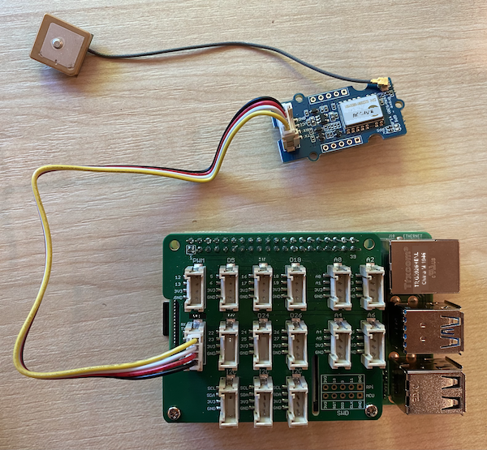

<!--
CO_OP_TRANSLATOR_METADATA:
{
  "original_hash": "3b2448c7ab4e9673e77e35a50c5e350d",
  "translation_date": "2025-11-18T19:06:12+00:00",
  "source_file": "3-transport/lessons/1-location-tracking/pi-gps-sensor.md",
  "language_code": "pcm"
}
-->
# Read GPS data - Raspberry Pi

For dis part of di lesson, you go add GPS sensor to your Raspberry Pi, and read di values wey e dey give.

## Hardware

Di Raspberry Pi need GPS sensor.

Di sensor wey you go use na [Grove GPS Air530 sensor](https://www.seeedstudio.com/Grove-GPS-Air530-p-4584.html). Dis sensor fit connect to plenty GPS systems to get fast and correct location. Di sensor get two parts - di main electronics of di sensor, and one external antenna wey connect with thin wire to collect radio waves from di satellites.

Dis na UART sensor, so e dey send GPS data through UART.

## Connect di GPS sensor

Di Grove GPS sensor fit connect to di Raspberry Pi.

### Task - connect di GPS sensor

Connect di GPS sensor.


1. Put one end of Grove cable inside di socket for di GPS sensor. E go only enter one way.

1. When di Raspberry Pi dey off, connect di other end of di Grove cable to di UART socket wey dem mark **UART** for di Grove Base hat wey dey attach to di Pi. Dis socket dey middle row, for di side wey near di SD Card slot, opposite di USB ports and ethernet socket.

    

1. Arrange di GPS sensor so di antenna wey dey attach go fit see di sky - e go better if e dey near open window or outside. E go easy to get better signal if nothing dey block di antenna.

## Program di GPS sensor

Di Raspberry Pi fit now dey programmed to use di GPS sensor wey dey attach.

### Task - program di GPS sensor

Program di device.

1. On di Pi and wait make e boot.

1. Di GPS sensor get 2 LEDs - one blue LED wey dey flash when e dey transmit data, and one green LED wey dey flash every second when e dey receive data from satellites. Make sure say di blue LED dey flash when you power di Pi. After some minutes, di green LED go dey flash - if e no flash, you fit need to reposition di antenna.

1. Open VS Code, either directly for di Pi, or connect am through di Remote SSH extension.

    > ⚠️ You fit check [di instructions for how to set up and open VS Code for lesson 1 if you need am](../../../1-getting-started/lessons/1-introduction-to-iot/pi.md).

1. For di newer Raspberry Pi wey support Bluetooth, e get wahala between di serial port wey Bluetooth dey use and di one wey di Grove UART port dey use. To fix am, do dis:

    1. From di VS Code terminal, edit di `/boot/config.txt` file using `nano`, one terminal text editor wey dey built-in, with dis command:

        ```sh
        sudo nano /boot/config.txt
        ```

        > You no fit edit dis file with VS Code because you need `sudo` permissions, wey be elevated permission. VS Code no dey run dis permission.

    1. Use your cursor keys to go di end of di file, then copy di code below and paste am for di end of di file:

        ```ini
        dtoverlay=pi3-miniuart-bt
        dtoverlay=pi3-disable-bt
        enable_uart=1
        ```

        You fit paste am using di normal keyboard shortcuts for your device (`Ctrl+v` for Windows, Linux or Raspberry Pi OS, `Cmd+v` for macOS).

    1. Save di file and comot nano by pressing `Ctrl+x`. Press `y` when dem ask if you wan save di modified buffer, then press `enter` to confirm say you wan overwrite `/boot/config.txt`.

        > If you make mistake, you fit comot without saving, then repeat di steps.

    1. Edit di `/boot/cmdline.txt` file for nano with dis command:

        ```sh
        sudo nano /boot/cmdline.txt
        ```

    1. Dis file get plenty key/value pairs wey space dey separate. Remove any key/value pairs wey get di key `console`. Dem go look like dis:

        ```output
        console=serial0,115200 console=tty1 
        ```

        You fit use di cursor keys go di entries, then delete am with di normal `del` or `backspace` keys.

        For example, if your original file look like dis:

        ```output
        console=serial0,115200 console=tty1 root=PARTUUID=058e2867-02 rootfstype=ext4 elevator=deadline fsck.repair=yes rootwait
        ```

        Di new version go be:

        ```output
        root=PARTUUID=058e2867-02 rootfstype=ext4 elevator=deadline fsck.repair=yes rootwait
        ```

    1. Follow di steps wey dey above to save di file and comot nano.

    1. Reboot your Pi, then reconnect for VS Code after di Pi don reboot.

1. From di terminal, create new folder for di `pi` user home directory wey dem call `gps-sensor`. Create file for dis folder wey dem call `app.py`.

1. Open dis folder for VS Code.

1. Di GPS module dey send UART data through serial port. Install di `pyserial` Pip package to fit communicate with di serial port from your Python code:

    ```sh
    pip3 install pyserial
    ```

1. Add di code below to your `app.py` file:

    ```python
    import time
    import serial
    
    serial = serial.Serial('/dev/ttyAMA0', 9600, timeout=1)
    serial.reset_input_buffer()
    serial.flush()
    
    def print_gps_data(line):
        print(line.rstrip())
    
    while True:
        line = serial.readline().decode('utf-8')
    
        while len(line) > 0:
            print_gps_data(line)
            line = serial.readline().decode('utf-8')
    
        time.sleep(1)
    ```

    Dis code dey import di `serial` module from di `pyserial` Pip package. E then connect to di `/dev/ttyAMA0` serial port - dis na di address of di serial port wey di Grove Pi Base Hat dey use for di UART port. E go clear any data wey don already dey di serial connection.

    Next, e define one function wey dem call `print_gps_data` wey dey print di line wey e pass to am for di console.

    After dat, di code go dey loop forever, dey read as many lines of text as e fit from di serial port for each loop. E go dey call di `print_gps_data` function for each line.

    After e don read all di data, di loop go sleep for 1 second, then e go try again.

1. Run dis code. You go see di raw output from di GPS sensor, something like dis:

    ```output
    $GNGGA,020604.001,4738.538654,N,12208.341758,W,1,3,,164.7,M,-17.1,M,,*67
    $GPGSA,A,1,,,,,,,,,,,,,,,*1E
    $BDGSA,A,1,,,,,,,,,,,,,,,*0F
    $GPGSV,1,1,00*79
    $BDGSV,1,1,00*68
    ```

    > If you see one of di errors below when you stop and restart your code, add `try - except` block to your while loop.

      ```output
      UnicodeDecodeError: 'utf-8' codec can't decode byte 0x93 in position 0: invalid start byte
      UnicodeDecodeError: 'utf-8' codec can't decode byte 0xf1 in position 0: invalid continuation byte
      ```

    ```python
    while True:
        try:
            line = serial.readline().decode('utf-8')
              
            while len(line) > 0:
                print_gps_data()
                line = serial.readline().decode('utf-8')
      
        # There's a random chance the first byte being read is part way through a character.
        # Read another full line and continue.

        except UnicodeDecodeError:
            line = serial.readline().decode('utf-8')

    time.sleep(1)
    ```

> 💁 You fit find dis code for di [code-gps/pi](../../../../../3-transport/lessons/1-location-tracking/code-gps/pi) folder.

😀 Your GPS sensor program don work well!

---

<!-- CO-OP TRANSLATOR DISCLAIMER START -->
**Disclaimer**:  
Dis dokyument don use AI transleshion service [Co-op Translator](https://github.com/Azure/co-op-translator) do di transleshion. Even as we dey try make am accurate, abeg make you sabi say automatik transleshion fit get mistake or no dey correct well. Di original dokyument wey dey for im native language na di one wey you go take as di main source. For important informashun, e good make you use professional human transleshion. We no go fit take blame for any misunderstanding or wrong interpretation wey fit happen because you use dis transleshion.
<!-- CO-OP TRANSLATOR DISCLAIMER END -->