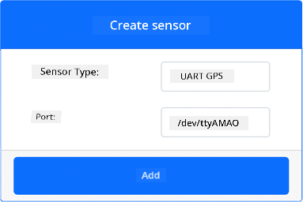
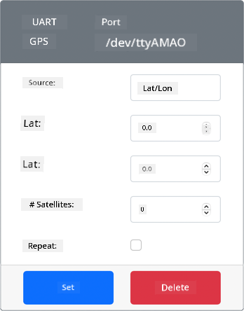
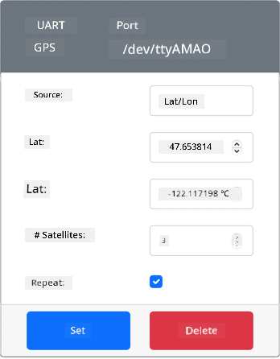
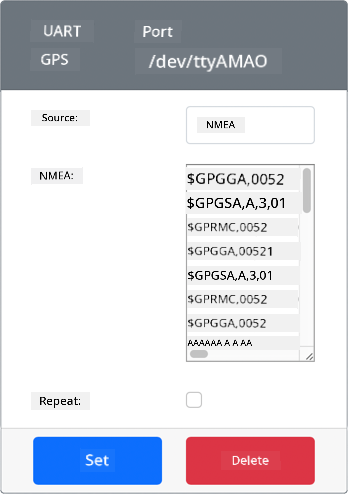
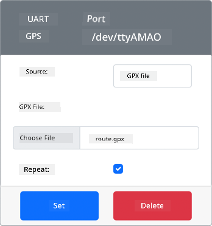

<!--
CO_OP_TRANSLATOR_METADATA:
{
  "original_hash": "64f18a8f8aaa1fef5e7320e0992d8b3a",
  "translation_date": "2025-11-18T19:07:13+00:00",
  "source_file": "3-transport/lessons/1-location-tracking/virtual-device-gps-sensor.md",
  "language_code": "pcm"
}
-->
# Read GPS data - Virtual IoT Hardware

For dis part of di lesson, you go add GPS sensor to your virtual IoT device, and read di values wey e dey give.

## Virtual Hardware

Di virtual IoT device go use one GPS sensor wey dem dey simulate, wey you fit access through UART via serial port.

Real GPS sensor dey get antenna wey dey collect radio wave from GPS satellites, and e go change di GPS signals to GPS data. Di virtual version dey simulate am by allowing you to set latitude and longitude, send raw NMEA sentences, or upload GPX file wey get plenty locations wey e fit return one by one.

> 🎓 NMEA sentences go dey explain later for dis lesson

### Add di sensor to CounterFit

To use di virtual GPS sensor, you go need add am to di CounterFit app.

#### Task - add di sensor to CounterFit

Add di GPS sensor to di CounterFit app.

1. Create new Python app for your computer inside one folder wey you go call `gps-sensor` wey get one file wey dem call `app.py` and Python virtual environment, then add di CounterFit pip packages.

    > ⚠️ You fit check [di instructions for how to create and setup CounterFit Python project for lesson 1 if you need am](../../../1-getting-started/lessons/1-introduction-to-iot/virtual-device.md).

1. Install one extra Pip package wey go install CounterFit shim wey fit work with UART sensors through serial connection. Make sure say you dey install am from terminal wey di virtual environment dey active.

    ```sh
    pip install counterfit-shims-serial
    ```

1. Make sure say di CounterFit web app dey run.

1. Create GPS sensor:

    1. For di *Create sensor* box inside di *Sensors* pane, drop di *Sensor type* box and choose *UART GPS*.

    1. Leave di *Port* as */dev/ttyAMA0*

    1. Click di **Add** button to create di GPS sensor for port `/dev/ttyAMA0`

    

    Di GPS sensor go dey create and e go show for di sensors list.

    

## Program di GPS sensor

Di Virtual IoT device fit now dey program to use di virtual GPS sensor.

### Task - program di GPS sensor

Program di GPS sensor app.

1. Make sure say di `gps-sensor` app dey open for VS Code.

1. Open di `app.py` file.

1. Add dis code for di top of `app.py` to connect di app to CounterFit:

    ```python
    from counterfit_connection import CounterFitConnection
    CounterFitConnection.init('127.0.0.1', 5000)
    ```

1. Add dis code under di one wey dey above to import some libraries wey you need, including di library for di CounterFit serial port:

    ```python
    import time
    import counterfit_shims_serial
    
    serial = counterfit_shims_serial.Serial('/dev/ttyAMA0')
    ```

    Dis code dey import di `serial` module from di `counterfit_shims_serial` Pip package. E then connect to di `/dev/ttyAMA0` serial port - na di address of di serial port wey di virtual GPS sensor dey use for e UART port.

1. Add dis code under di one wey dey above to read from di serial port and print di values for console:

    ```python
    def print_gps_data(line):
        print(line.rstrip())
    
    while True:
        line = serial.readline().decode('utf-8')
    
        while len(line) > 0:
            print_gps_data(line)
            line = serial.readline().decode('utf-8')
    
        time.sleep(1)
    ```

    One function wey dem call `print_gps_data` dey define wey dey print di line wey dem pass give am for console.

    Next, di code go dey loop forever, dey read as many lines of text as e fit from di serial port for each loop. E go call di `print_gps_data` function for each line.

    After e don read all di data, di loop go sleep for 1 second, then e go try again.

1. Run dis code, make sure say you dey use different terminal from di one wey di CounterFit app dey run, so dat di CounterFit app go still dey run.

1. From di CounterFit app, change di value of di GPS sensor. You fit do am like dis:

    * Set di **Source** to `Lat/Lon`, then set di latitude, longitude and di number of satellites wey dem use to get di GPS fix. Dis value go send only once, so check di **Repeat** box to make di data dey repeat every second.

      

    * Set di **Source** to `NMEA` and add some NMEA sentences inside di text box. All di values go dey send, with delay of 1 second before each new GGA (position fix) sentence fit dey read.

      

      You fit use tool like [nmeagen.org](https://www.nmeagen.org) to generate dis sentences by drawing for map. Dis values go send only once, so check di **Repeat** box to make di data dey repeat one second after e don send all.

    * Set di **Source** to GPX file, then upload GPX file wey get track locations. You fit download GPX files from popular mapping and hiking sites like [AllTrails](https://www.alltrails.com/). Dis files dey contain plenty GPS locations as trail, and di GPS sensor go dey return each new location every 1 second.

      

      Dis values go send only once, so check di **Repeat** box to make di data dey repeat one second after e don send all.

    Once you don configure di GPS settings, click di **Set** button to save di values for di sensor.

1. You go see di raw output from di GPS sensor, something like dis:

    ```output
    $GNGGA,020604.001,4738.538654,N,12208.341758,W,1,3,,164.7,M,-17.1,M,,*67
    $GNGGA,020604.001,4738.538654,N,12208.341758,W,1,3,,164.7,M,-17.1,M,,*67
    ```

> 💁 You fit find dis code for di [code-gps/virtual-device](../../../../../3-transport/lessons/1-location-tracking/code-gps/virtual-device) folder.

😀 Your GPS sensor program don work well!

---

<!-- CO-OP TRANSLATOR DISCLAIMER START -->
**Disclaimer**:  
Dis dokyument don use AI transleshion service [Co-op Translator](https://github.com/Azure/co-op-translator) do di transleshion. Even as we dey try make am accurate, abeg make you sabi say automatik transleshion fit get mistake or no dey correct well. Di original dokyument wey dey di native language na di main source wey you go fit trust. For important informashon, e good make you use professional human transleshion. We no go fit take blame for any misunderstanding or wrong meaning wey fit happen because you use dis transleshion.
<!-- CO-OP TRANSLATOR DISCLAIMER END -->