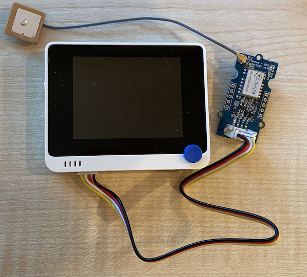

<!--
CO_OP_TRANSLATOR_METADATA:
{
  "original_hash": "da6ae0a795cf06be33d23ca5b8493fc8",
  "translation_date": "2025-11-18T19:04:07+00:00",
  "source_file": "3-transport/lessons/1-location-tracking/wio-terminal-gps-sensor.md",
  "language_code": "pcm"
}
-->
# Read GPS data - Wio Terminal

For dis part of di lesson, you go add GPS sensor to your Wio Terminal, and read di values wey e dey give.

## Hardware

Di Wio Terminal go need GPS sensor.

Di sensor wey you go use na [Grove GPS Air530 sensor](https://www.seeedstudio.com/Grove-GPS-Air530-p-4584.html). Dis sensor fit connect to plenty GPS systems to give quick and correct location. Di sensor get two parts - di main electronics of di sensor, and one external antenna wey dem connect with thin wire to catch di radio waves from di satellites.

Dis na UART sensor, so e dey send GPS data through UART.

### Connect di GPS sensor

You fit connect di Grove GPS sensor to di Wio Terminal.

#### Task - connect di GPS sensor

Connect di GPS sensor.


1. Put one end of di Grove cable for di socket wey dey di GPS sensor. E go only enter one way.

1. Make sure say di Wio Terminal no dey connect to your computer or any power source, then connect di other end of di Grove cable to di left-hand side Grove socket for di Wio Terminal as you dey look di screen. Na di socket wey near di power button.

    

1. Arrange di GPS sensor so di antenna wey dey attach fit see di sky well - e go better if e dey near open window or outside. E go easy to get clear signal if nothing dey block di antenna.

1. Now, you fit connect di Wio Terminal to your computer.

1. Di GPS sensor get 2 LEDs - one blue LED wey dey blink when e dey send data, and one green LED wey dey blink every second when e dey receive data from satellites. Make sure say di blue LED dey blink when you power di Wio Terminal. After some minutes, di green LED go start to blink - if e no blink, you fit need adjust di antenna position.

## Program di GPS sensor

Now, you fit program di Wio Terminal to use di GPS sensor wey you don connect.

### Task - program di GPS sensor

Program di device.

1. Create new Wio Terminal project with PlatformIO. Name di project `gps-sensor`. Add code for di `setup` function to configure di serial port.

1. Add dis include directive for di top of di `main.cpp` file. E go include one header file wey get functions to configure di left-hand Grove port for UART.

    ```cpp
    #include <wiring_private.h>
    ```

1. After dis one, add dis line of code to declare one serial port connection to di UART port:

    ```cpp
    static Uart Serial3(&sercom3, PIN_WIRE_SCL, PIN_WIRE_SDA, SERCOM_RX_PAD_1, UART_TX_PAD_0);
    ```

1. You go need add some code to redirect some internal signal handlers to dis serial port. Add dis code below di `Serial3` declaration:

    ```cpp
    void SERCOM3_0_Handler()
    {
        Serial3.IrqHandler();
    }
    
    void SERCOM3_1_Handler()
    {
        Serial3.IrqHandler();
    }
    
    void SERCOM3_2_Handler()
    {
        Serial3.IrqHandler();
    }
    
    void SERCOM3_3_Handler()
    {
        Serial3.IrqHandler();
    }
    ```

1. For di `setup` function, after di `Serial` port configuration, configure di UART serial port with dis code:

    ```cpp
    Serial3.begin(9600);

    while (!Serial3)
        ; // Wait for Serial3 to be ready

    delay(1000);
    ```

1. After dis code for di `setup` function, add dis code to connect di Grove pin to di serial port:

    ```cpp
    pinPeripheral(PIN_WIRE_SCL, PIO_SERCOM_ALT);
    ```

1. Add dis function before di `loop` function to send di GPS data go di serial monitor:

    ```cpp
    void printGPSData()
    {
        Serial.println(Serial3.readStringUntil('\n'));
    }
    ```

1. For di `loop` function, add dis code to read from di UART serial port and print di output go di serial monitor:

    ```cpp
    while (Serial3.available() > 0)
    {
        printGPSData();
    }
    
    delay(1000);
    ```

    Dis code dey read from di UART serial port. Di `readStringUntil` function dey read until e see one terminator character, for dis case na new line. E go read one whole NMEA sentence (NMEA sentences dey end with new line character). As data dey available for di UART serial port, e go dey read am and send am go di serial monitor through di `printGPSData` function. Once data no dey again, di `loop` go delay for 1 second (1,000ms).

1. Build and upload di code go di Wio Terminal.

1. Once you don upload am, you fit monitor di GPS data with di serial monitor.

    ```output
    > Executing task: platformio device monitor <
    
    --- Available filters and text transformations: colorize, debug, default, direct, hexlify, log2file, nocontrol, printable, send_on_enter, time
    --- More details at http://bit.ly/pio-monitor-filters
    --- Miniterm on /dev/cu.usbmodem1201  9600,8,N,1 ---
    --- Quit: Ctrl+C | Menu: Ctrl+T | Help: Ctrl+T followed by Ctrl+H ---
    $GNGGA,020604.001,4738.538654,N,12208.341758,W,1,3,,164.7,M,-17.1,M,,*67
    $GPGSA,A,1,,,,,,,,,,,,,,,*1E
    $BDGSA,A,1,,,,,,,,,,,,,,,*0F
    $GPGSV,1,1,00*79
    $BDGSV,1,1,00*68
    ```

> 💁 You fit find dis code for di [code-gps/wio-terminal](../../../../../3-transport/lessons/1-location-tracking/code-gps/wio-terminal) folder.

😀 Your GPS sensor program don work well!

---

<!-- CO-OP TRANSLATOR DISCLAIMER START -->
**Disclaimer**:  
Dis dokyument don use AI transle-shon service [Co-op Translator](https://github.com/Azure/co-op-translator) do di transle-shon. Even as we dey try make am correct, abeg sabi say transle-shon wey machine do fit get mistake or no dey accurate well. Di original dokyument for im native language na di one wey you go take as di correct source. For important mata, e good make professional human transle-shon dey use. We no go fit take blame for any misunderstanding or wrong interpretation wey fit happen because you use dis transle-shon.
<!-- CO-OP TRANSLATOR DISCLAIMER END -->