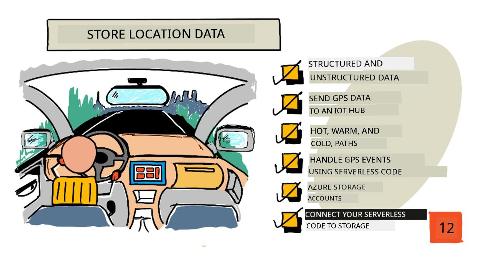
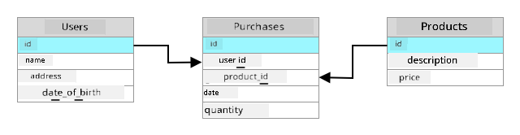
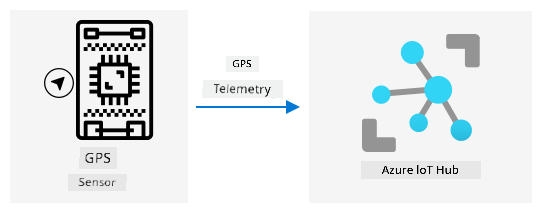
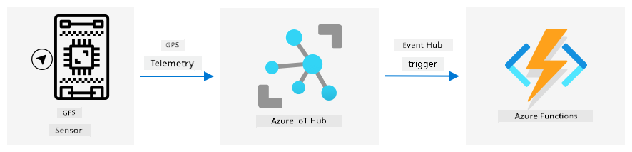
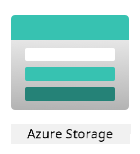
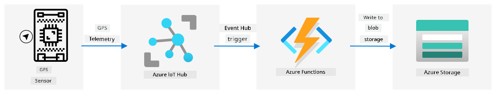

<!--
CO_OP_TRANSLATOR_METADATA:
{
  "original_hash": "e345843ccfeb7261d81500d19c64d476",
  "translation_date": "2025-11-18T19:09:42+00:00",
  "source_file": "3-transport/lessons/2-store-location-data/README.md",
  "language_code": "pcm"
}
-->
# Store location data



> Sketchnote by [Nitya Narasimhan](https://github.com/nitya). Click the image for a larger version.

## Pre-lecture quiz

[Pre-lecture quiz](https://black-meadow-040d15503.1.azurestaticapps.net/quiz/23)

## Introduction

For di last lesson, you don learn how to use GPS sensor to capture location data. To use dis data to show di location of one truck wey dey carry food, and di journey, e need to send am go one IoT service for cloud, and store am somewhere.

For dis lesson, you go learn di different ways wey you fit store IoT data, and how to store data from your IoT service using serverless code.

For dis lesson we go talk about:

* [Structured and unstructured data](../../../../../3-transport/lessons/2-store-location-data)
* [Send GPS data to an IoT Hub](../../../../../3-transport/lessons/2-store-location-data)
* [Hot, warm, and cold paths](../../../../../3-transport/lessons/2-store-location-data)
* [Handle GPS events using serverless code](../../../../../3-transport/lessons/2-store-location-data)
* [Azure Storage Accounts](../../../../../3-transport/lessons/2-store-location-data)
* [Connect your serverless code to storage](../../../../../3-transport/lessons/2-store-location-data)

## Structured and unstructured data

Computer systems dey work with data, and dis data dey come in different shapes and sizes. E fit be single numbers, plenty text, videos, images, or IoT data. Data dey usually fall into two categories - *structured* data and *unstructured* data.

* **Structured data** na data wey get well-defined, rigid structure wey no dey change, and e dey usually match tables of data wey get relationships. Example na person details like name, date of birth, and address.

* **Unstructured data** na data wey no get well-defined, rigid structure, including data wey fit dey change structure anyhow. Example na documents like written documents or spreadsheets.

✅ Do small research: You fit think of other examples of structured and unstructured data?

> 💁 E still get semi-structured data wey dey structured but e no fit enter fixed tables of data.

IoT data dey usually dey consider as unstructured data.

Imagine say you wan add IoT devices to one fleet of vehicles for one big commercial farm. You fit wan use different devices for different types of vehicle. For example:

* For farm vehicles like tractors, you go wan GPS data to make sure say dem dey work for di correct fields.
* For delivery trucks wey dey carry food go warehouses, you go wan GPS data plus speed and acceleration data to make sure say di driver dey drive safely, and drive identity plus start/stop data to make sure say di driver dey follow local laws for working hours.
* For refrigerated trucks, you go wan temperature data to make sure say di food no too hot or cold spoil for transit.

Dis data fit dey change anyhow. For example, if di IoT device dey inside truck cab, di data wey e dey send fit change as di trailer change, like sending temperature data only when refrigerated trailer dey used.

✅ Wetin be other IoT data wey fit dey captured? Think about di kind loads wey trucks fit carry, plus maintenance data.

Dis data dey vary from vehicle to vehicle, but e go still dey send go di same IoT service for processing. Di IoT service need to fit process dis unstructured data, store am in way wey go allow am to dey searched or analyzed, but e go still work with different structures of di data.

### SQL vs NoSQL storage

Databases na services wey dey allow you store and query data. Database dey come in two types - SQL and NoSQL.

#### SQL databases

Di first databases na Relational Database Management Systems (RDBMS), or relational database. Dem dey also call am SQL databases because of di Structured Query Language (SQL) wey dem dey use to add, remove, update or query data. Dis database get schema - one well-defined set of tables of data, like spreadsheet. Each table get plenty named columns. When you insert data, you dey add one row to di table, put values inside each of di columns. Dis dey keep di data for very rigid structure - even though you fit leave columns empty, if you wan add new column, you go need do am for di database, populate values for di existing rows. Dis databases dey relational - one table fit get relationship to another.



For example, if you store one user personal details for one table, you go get one kind internal unique ID per user wey dey used for one row for table wey get di user name and address. If you wan store other details about di user, like di purchases, for another table, you go get one column for di new table for di user ID. When you look up one user, you fit use di ID to get di personal details from one table, and di purchases from another.

SQL databases dey perfect for storing structured data, and for when you wan make sure say di data match di schema.

✅ If you never use SQL before, take small time read about am for di [SQL page on Wikipedia](https://wikipedia.org/wiki/SQL).

Some popular SQL databases na Microsoft SQL Server, MySQL, and PostgreSQL.

✅ Do small research: Read about some of dis SQL databases and wetin dem fit do.

#### NoSQL database

NoSQL databases dey called NoSQL because dem no get di same rigid structure wey SQL databases get. Dem dey also call am document databases because dem fit store unstructured data like documents.

> 💁 Even though dem name na NoSQL, some NoSQL databases dey allow you use SQL to query di data.


NoSQL database no get pre-defined schema wey dey limit how data dey stored, instead you fit insert any unstructured data, usually using JSON documents. Dis documents fit dey organized into folders, like files for your computer. Each document fit get different fields from other documents - for example, if you dey store IoT data from your farm vehicles, some fit get fields for accelerometer and speed data, others fit get fields for di temperature for di trailer. If you wan add new truck type, like one wey get built-in scales to track di weight of produce wey e dey carry, di IoT device fit add dis new field and e fit dey stored without any changes to di database.

Some popular NoSQL databases na Azure CosmosDB, MongoDB, and CouchDB.

✅ Do small research: Read about some of dis NoSQL databases and wetin dem fit do.

For dis lesson, you go dey use NoSQL storage to store IoT data.

## Send GPS data to an IoT Hub

For di last lesson, you don capture GPS data from GPS sensor wey connect to your IoT device. To store dis IoT data for cloud, you need to send am go one IoT service. You go still dey use Azure IoT Hub, di same IoT cloud service wey you use for di previous project.



### Task - send GPS data to an IoT Hub

1. Create new IoT Hub using di free tier.

    > ⚠️ You fit check di [instructions for creating an IoT Hub from project 2, lesson 4](../../../2-farm/lessons/4-migrate-your-plant-to-the-cloud/README.md#create-an-iot-service-in-the-cloud) if you need help.

    Make sure say you create new Resource Group. Name di new Resource Group `gps-sensor`, and di new IoT Hub one unique name wey base on `gps-sensor`, like `gps-sensor-<your name>`.

    > 💁 If you still get your IoT Hub from di previous project, you fit use am again. Make sure say you use di name of dis IoT Hub and di Resource Group wey e dey inside when you dey create other services.

1. Add new device to di IoT Hub. Call dis device `gps-sensor`. Collect di connection string for di device.

1. Update your device code to send di GPS data go di new IoT Hub using di device connection string wey you collect for di previous step.

    > ⚠️ You fit check di [instructions for connecting your device to an IoT from project 2, lesson 4](../../../2-farm/lessons/4-migrate-your-plant-to-the-cloud/README.md#connect-your-device-to-the-iot-service) if you need help.

1. When you dey send di GPS data, send am as JSON for dis format:

    ```json
    {
        "gps" :
        {
            "lat" : <latitude>,
            "lon" : <longitude>
        }
    }
    ```

1. Send GPS data every minute so you no go use up your daily message allocation.

If you dey use di Wio Terminal, make sure say you add all di necessary libraries, and set di time using NTP server. Your code go also need make sure say e don read all di data from di serial port before e send di GPS location, using di existing code from di last lesson. Use dis code to construct di JSON document:

```cpp
DynamicJsonDocument doc(1024);
doc["gps"]["lat"] = gps.location.lat();
doc["gps"]["lon"] = gps.location.lng();
```

If you dey use Virtual IoT device, make sure say you install all di needed libraries using virtual environment.

For both di Raspberry Pi and Virtual IoT device, use di existing code from di last lesson to get di latitude and longitude values, then send dem for di correct JSON format with dis code:

```python
message_json = { "gps" : { "lat":lat, "lon":lon } }
print("Sending telemetry", message_json)
message = Message(json.dumps(message_json))
```

> 💁 You fit find dis code for di [code/wio-terminal](../../../../../3-transport/lessons/2-store-location-data/code/wio-terminal), [code/pi](../../../../../3-transport/lessons/2-store-location-data/code/pi) or [code/virtual-device](../../../../../3-transport/lessons/2-store-location-data/code/virtual-device) folder.

Run your device code and make sure say messages dey flow enter IoT Hub using di `az iot hub monitor-events` CLI command.

## Hot, warm, and cold paths

Data wey dey flow from IoT device go cloud no dey always dey processed for real time. Some data need real time processing, others fit dey processed small time later, and others fit dey processed much later. Di flow of data go different services wey dey process di data for different times na wetin dem dey call hot, warm and cold paths.

### Hot path

Hot path na data wey need to dey processed for real time or near real time. You fit use hot path data for alerts, like getting alerts say one vehicle dey near depot, or say di temperature for refrigerated truck don too high.

To use hot path data, your code go respond to events as dem dey received by your cloud services.

### Warm path

Warm path na data wey fit dey processed small time after e don dey received, like for reporting or short term analytics. You fit use warm path data for daily reports on vehicle mileage, using data wey dem gather di previous day.

Warm path data dey stored once e don dey received by di cloud service inside one kind storage wey fit dey accessed quickly.

### Cold path

Cold path na historic data, storing data for long term to dey processed anytime wey e dey needed. For example, you fit use cold path to get annual mileage reports for vehicles, or run analytics on routes to find di best route to reduce fuel costs.

Cold path data dey stored for data warehouses - databases wey dem design to store plenty data wey no go change and fit dey queried quickly and easily. You go normally get one regular job for your cloud application wey go dey run for regular time each day, week, or month to move data from warm path storage enter di data warehouse.

✅ Think about di data wey you don capture so far for dis lessons. E dey hot, warm or cold path data?

## Handle GPS events using serverless code

Once data don dey flow enter your IoT Hub, you fit write some serverless code to dey listen for events wey dem publish to di Event-Hub compatible endpoint. Dis na di warm path - dis data go dey stored and used for di next lesson for reporting di journey.



### Task - handle GPS events using serverless code

1. Create one Azure Functions app using di Azure Functions CLI. Use di Python runtime, and create am for one folder wey you go call `gps-trigger`, and use di same name for di Functions App project name. Make sure say you create one virtual environment to use for dis.

    > ⚠️ You fit check di [instructions for creating an Azure Functions Project from project 2, lesson 5](../../../2-farm/lessons/5-migrate-application-to-the-cloud/README.md#create-a-serverless-application) if you need help.

1. Add one IoT Hub event trigger wey dey use di IoT Hub Event Hub compatible endpoint.
> ⚠️ You fit check [di instructions for how to create IoT Hub event trigger from project 2, lesson 5](../../../2-farm/lessons/5-migrate-application-to-the-cloud/README.md#create-an-iot-hub-event-trigger) if you need am.

1. Put di Event Hub compatible endpoint connection string for inside `local.settings.json` file, and use di key for dat entry for inside `function.json` file.

1. Use di Azurite app as local storage emulator.

1. Run your functions app make sure say e dey receive events from your GPS device. Make sure say your IoT device dey run and dey send GPS data.

    ```output
    Python EventHub trigger processed an event: {"gps": {"lat": 47.73481, "lon": -122.25701}}
    ```

## Azure Storage Accounts



Azure Storage Accounts na general purpose storage service wey fit store data in different ways. You fit store data as blobs, for queues, for tables, or as files, and all of dem fit dey at di same time.

### Blob storage

Di word *Blob* mean binary large objects, but e don turn to di name for any unstructured data. You fit store any data for blob storage, from JSON documents wey get IoT data, to image and movie files. Blob storage get di concept of *containers*, wey be buckets wey you fit store data inside, e dey similar to tables for relational database. Dis containers fit get one or more folders to store blobs, and each folder fit get other folders, e dey similar to how files dey store for your computer hard disk.

You go use blob storage for dis lesson to store IoT data.

✅ Do small research: Read about [Azure Blob Storage](https://docs.microsoft.com/azure/storage/blobs/storage-blobs-overview?WT.mc_id=academic-17441-jabenn)

### Table storage

Table storage dey allow you store semi-structured data. Table storage na NoSQL database, so e no need defined set of tables upfront, but e dey designed to store data for one or more tables, with unique keys to define each row.

✅ Do small research: Read about [Azure Table Storage](https://docs.microsoft.com/azure/storage/tables/table-storage-overview?WT.mc_id=academic-17441-jabenn)

### Queue storage

Queue storage dey allow you store messages wey reach 64KB for size for queue. You fit add messages for di back of di queue, and read dem from di front. Queues dey store messages indefinitely as long as storage space still dey, so e dey allow messages to dey store long term, then read am when e dey needed. For example, if you wan run monthly job to process GPS data, you fit dey add am to queue every day for one month, then for di end of di month process all di messages from di queue.

✅ Do small research: Read about [Azure Queue Storage](https://docs.microsoft.com/azure/storage/queues/storage-queues-introduction?WT.mc_id=academic-17441-jabenn)

### File storage

File storage na storage of files for di cloud, and any apps or devices fit connect using industry standard protocols. You fit write files to file storage, then mount am as drive for your PC or Mac.

✅ Do small research: Read about [Azure File Storage](https://docs.microsoft.com/azure/storage/files/storage-files-introduction?WT.mc_id=academic-17441-jabenn)

## Connect your serverless code to storage

Your function app now need to connect to blob storage to store di messages from di IoT Hub. Two ways dey to do dis:

* Inside di function code, connect to blob storage using di blob storage Python SDK and write di data as blobs.
* Use output function binding to bind di return value of di function to blob storage and make di blob save automatically.

For dis lesson, you go use di Python SDK to see how to interact with blob storage.



Di data go dey save as JSON blob with dis format:

```json
{
    "device_id": <device_id>,
    "timestamp" : <time>,
    "gps" :
    {
        "lat" : <latitude>,
        "lon" : <longitude>
    }
}
```

### Task - connect your serverless code to storage

1. Create Azure Storage account. Name am something like `gps<your name>`.

    > ⚠️ You fit check [di instructions for how to create storage account from project 2, lesson 5](../../../2-farm/lessons/5-migrate-application-to-the-cloud/README.md#task---create-the-cloud-resources) if you need am.

    If you still get storage account from di previous project, you fit use am again.

    > 💁 You go fit use di same storage account to deploy your Azure Functions app later for dis lesson.

1. Run dis command to get di connection string for di storage account:

    ```sh
    az storage account show-connection-string --output table \
                                              --name <storage_name>
    ```

    Replace `<storage_name>` with di name of di storage account wey you create for di previous step.

1. Add new entry to di `local.settings.json` file for your storage account connection string, using di value from di previous step. Name am `STORAGE_CONNECTION_STRING`.

1. Add dis to di `requirements.txt` file to install di Azure storage Pip packages:

    ```sh
    azure-storage-blob
    ```

    Install di packages from dis file for your virtual environment.

    > If error show, upgrade your Pip version for your virtual environment to di latest version with dis command, then try again:
    >
    > ```sh
    > pip install --upgrade pip
    > ```

1. For di `__init__.py` file for di `iot-hub-trigger`, add dis import statements:

    ```python
    import json
    import os
    import uuid
    from azure.storage.blob import BlobServiceClient, PublicAccess
    ```

    Di `json` system module go dey used to read and write JSON, di `os` system module go dey used to read di connection string, di `uuid` system module go dey used to generate unique ID for di GPS reading.

    Di `azure.storage.blob` package get di Python SDK to work with blob storage.

1. Before di `main` method, add dis helper function:

    ```python
    def get_or_create_container(name):
        connection_str = os.environ['STORAGE_CONNECTION_STRING']
        blob_service_client = BlobServiceClient.from_connection_string(connection_str)
    
        for container in blob_service_client.list_containers():
            if container.name == name:
                return blob_service_client.get_container_client(container.name)
        
        return blob_service_client.create_container(name, public_access=PublicAccess.Container)
    ```

    Di Python blob SDK no get helper method to create container if e no dey exist. Dis code go load di connection string from di `local.settings.json` file (or di Application Settings once e deploy to di cloud), then create `BlobServiceClient` class from dis to interact with di blob storage account. E go loop through all di containers for di blob storage account, dey look for one wey get di provided name - if e find one e go return `ContainerClient` class wey fit interact with di container to create blobs. If e no find one, di container go dey create and di client for di new container go dey return.

    When di new container dey create, public access go dey grant to query di blobs for di container. Dis go dey used for di next lesson to visualize di GPS data for map.

1. Unlike di soil moisture, for dis code we wan store every event, so add dis code inside di `for event in events:` loop for di `main` function, below di `logging` statement:

    ```python
    device_id = event.iothub_metadata['connection-device-id']
    blob_name = f'{device_id}/{str(uuid.uuid1())}.json'
    ```

    Dis code go get di device ID from di event metadata, then use am to create blob name. Blobs fit dey store for folders, and device ID go dey used for di folder name, so each device go get all di GPS events for one folder. Di blob name na dis folder, followed by document name, separated with forward slashes, e dey similar to Linux and macOS paths (similar to Windows too, but Windows dey use back slashes). Di document name na unique ID wey Python `uuid` module generate, with di file type of `json`.

    For example, for di `gps-sensor` device ID, di blob name fit be `gps-sensor/a9487ac2-b9cf-11eb-b5cd-1e00621e3648.json`.

1. Add dis code below dis:

    ```python
    container_client = get_or_create_container('gps-data')
    blob = container_client.get_blob_client(blob_name)
    ```

    Dis code go get di container client using di `get_or_create_container` helper class, and then get blob client object using di blob name. Dis blob clients fit refer to existing blobs, or as e dey for dis case, to new blob.

1. Add dis code after dis:

    ```python
    event_body = json.loads(event.get_body().decode('utf-8'))
    blob_body = {
        'device_id' : device_id,
        'timestamp' : event.iothub_metadata['enqueuedtime'],
        'gps': event_body['gps']
    }
    ```

    Dis dey build di body of di blob wey go dey write to blob storage. E be JSON document wey get di device ID, di time wey di telemetry dey send to IoT Hub, and di GPS coordinates from di telemetry.

    > 💁 E dey important to use di enqueued time of di message instead of di current time to get di time wey di message dey send. E fit dey for di hub for some time before e dey pick up if di Functions App no dey run.

1. Add dis below dis code:

    ```python
    logging.info(f'Writing blob to {blob_name} - {blob_body}')
    blob.upload_blob(json.dumps(blob_body).encode('utf-8'))
    ```

    Dis code dey log say blob dey about to dey write with di details, then e dey upload di blob body as di content of di new blob.

1. Run di Functions app. You go see blobs dey write for all di GPS events for di output:

    ```output
    [2021-05-21T01:31:14.325Z] Python EventHub trigger processed an event: {"gps": {"lat": 47.73092, "lon": -122.26206}}
    ...
    [2021-05-21T01:31:14.351Z] Writing blob to gps-sensor/4b6089fe-ba8d-11eb-bc7b-1e00621e3648.json - {'device_id': 'gps-sensor', 'timestamp': '2021-05-21T00:57:53.878Z', 'gps': {'lat': 47.73092, 'lon': -122.26206}}
    ```

    > 💁 Make sure say you no dey run di IoT Hub event monitor at di same time.

> 💁 You fit find dis code for di [code/functions](../../../../../3-transport/lessons/2-store-location-data/code/functions) folder.

### Task - verify di uploaded blobs

1. To view di blobs wey dey create, you fit use [Azure Storage Explorer](https://azure.microsoft.com/features/storage-explorer/?WT.mc_id=academic-17441-jabenn), free tool wey dey allow you view and manage your storage accounts, or from di CLI.

    1. To use di CLI, first you go need account key. Run dis command to get di key:

        ```sh
        az storage account keys list --output table \
                                     --account-name <storage_name>
        ```

        Replace `<storage_name>` with di name of di storage account.

        Copy di value of `key1`.

    1. Run dis command to list di blobs for di container:

        ```sh
        az storage blob list --container-name gps-data \
                             --output table \
                             --account-name <storage_name> \
                             --account-key <key1>
        ```

        Replace `<storage_name>` with di name of di storage account, and `<key1>` with di value of `key1` wey you copy for di last step.

        Dis go list out all di blobs for di container:

        ```output
        Name                                                  Blob Type    Blob Tier    Length    Content Type              Last Modified              Snapshot
        ----------------------------------------------------  -----------  -----------  --------  ------------------------  -------------------------  ----------
        gps-sensor/1810d55e-b9cf-11eb-9f5b-1e00621e3648.json  BlockBlob    Hot          45        application/octet-stream  2021-05-21T00:54:27+00:00
        gps-sensor/18293e46-b9cf-11eb-9f5b-1e00621e3648.json  BlockBlob    Hot          45        application/octet-stream  2021-05-21T00:54:28+00:00
        gps-sensor/1844549c-b9cf-11eb-9f5b-1e00621e3648.json  BlockBlob    Hot          45        application/octet-stream  2021-05-21T00:54:28+00:00
        gps-sensor/1894d714-b9cf-11eb-9f5b-1e00621e3648.json  BlockBlob    Hot          45        application/octet-stream  2021-05-21T00:54:28+00:00
        ```

    1. Download one of di blobs using dis command:

        ```sh
        az storage blob download --container-name gps-data \
                                 --account-name <storage_name> \
                                 --account-key <key1> \
                                 --name <blob_name> \
                                 --file <file_name>
        ```

        Replace `<storage_name>` with di name of di storage account, and `<key1>` with di value of `key1` wey you copy for di earlier step.

        Replace `<blob_name>` with di full name from di `Name` column of di output of di last step, including di folder name. Replace `<file_name>` with di name of local file to save di blob to.

    Once e download, you fit open di JSON file for VS Code, and you go see di blob wey get di GPS location details:

    ```json
    {"device_id": "gps-sensor", "timestamp": "2021-05-21T00:57:53.878Z", "gps": {"lat": 47.73092, "lon": -122.26206}}
    ```

### Task - deploy your Functions App to di cloud

Now wey your Function app dey work, you fit deploy am to di cloud.

1. Create new Azure Functions app, using di storage account wey you create earlier. Name am something like `gps-sensor-` and add unique identifier for di end, like random words or your name.

    > ⚠️ You fit check [di instructions for how to create Functions app from project 2, lesson 5](../../../2-farm/lessons/5-migrate-application-to-the-cloud/README.md#task---create-the-cloud-resources) if you need am.

1. Upload di `IOT_HUB_CONNECTION_STRING` and `STORAGE_CONNECTION_STRING` values to di Application Settings.

    > ⚠️ You fit check [di instructions for how to upload Application Settings from project 2, lesson 5](../../../2-farm/lessons/5-migrate-application-to-the-cloud/README.md#task---upload-your-application-settings) if you need am.

1. Deploy your local Functions app to di cloud.

    > ⚠️ You fit check [di instructions for how to deploy your Functions app from project 2, lesson 5](../../../2-farm/lessons/5-migrate-application-to-the-cloud/README.md#task---deploy-your-functions-app-to-the-cloud) if you need am.

---

## 🚀 Challenge

GPS data no dey perfectly accurate, and di locations wey dem dey detect fit dey off by few meters, if no be more especially for tunnels and areas wey get tall buildings.

Think about how satellite navigation fit overcome dis? Wetin your sat-nav get wey fit help am make better predictions for your location?

## Post-lecture quiz

[Post-lecture quiz](https://black-meadow-040d15503.1.azurestaticapps.net/quiz/24)

## Review & Self Study

* Read about structured data for di [Data model page for Wikipedia](https://wikipedia.org/wiki/Data_model)
* Read about semi-structured data for di [Semi-structured data page for Wikipedia](https://wikipedia.org/wiki/Semi-structured_data)
* Read about unstructured data for di [Unstructured data page for Wikipedia](https://wikipedia.org/wiki/Unstructured_data)
* Read more about Azure Storage and di different storage types for di [Azure Storage documentation](https://docs.microsoft.com/azure/storage/?WT.mc_id=academic-17441-jabenn)

## Assignment

[Check function bindings](assignment.md)

---

<!-- CO-OP TRANSLATOR DISCLAIMER START -->
**Disclaimer**:  
Dis dokyument don translate wit AI translation service [Co-op Translator](https://github.com/Azure/co-op-translator). Even as we dey try make am accurate, abeg sabi say machine translation fit get mistake or no dey correct well. Di original dokyument for im native language na di main source wey you go trust. For important mata, e better make professional human translator check am. We no go fit take blame for any misunderstanding or wrong interpretation wey fit happen because you use dis translation.
<!-- CO-OP TRANSLATOR DISCLAIMER END -->