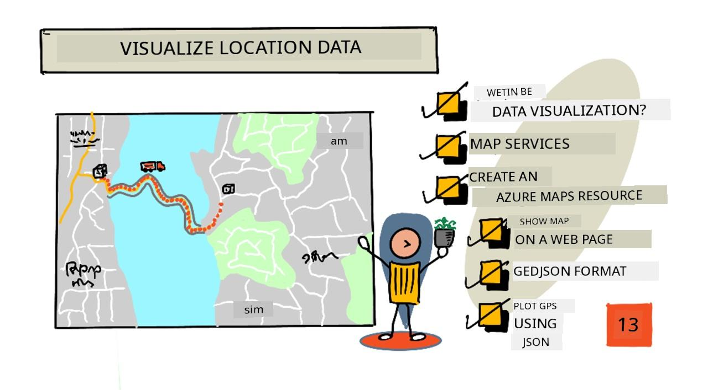
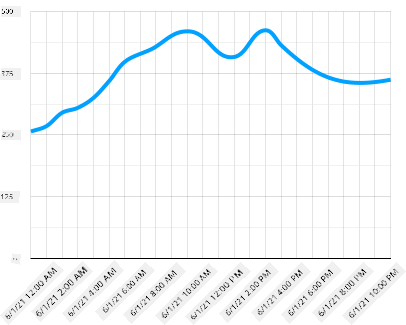
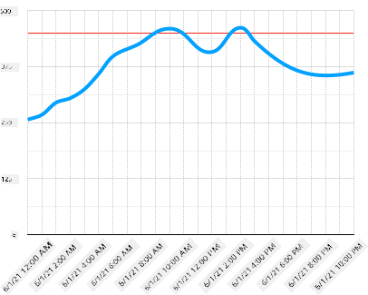
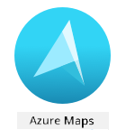
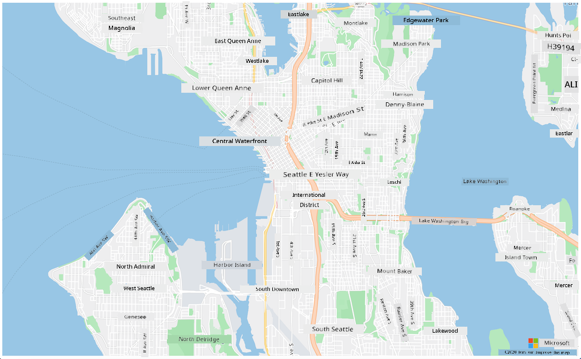
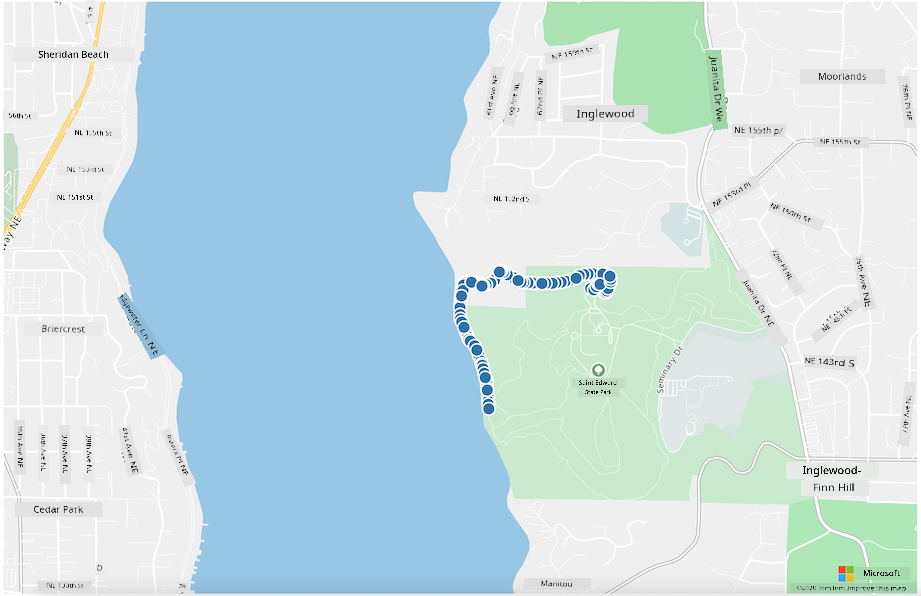

<!--
CO_OP_TRANSLATOR_METADATA:
{
  "original_hash": "9095c61445c2bca7245ef9b59a186a11",
  "translation_date": "2025-11-18T19:08:23+00:00",
  "source_file": "3-transport/lessons/3-visualize-location-data/README.md",
  "language_code": "pcm"
}
-->
# Visualize location data



> Sketchnote by [Nitya Narasimhan](https://github.com/nitya). Click di image for bigger version.

Dis video dey show overview of Azure Maps wit IoT, one service wey we go talk about for dis lesson.

[](https://www.youtube.com/watch?v=P5i2GFTtb2s)

> 🎥 Click di image above to watch di video

## Pre-lecture quiz

[Pre-lecture quiz](https://black-meadow-040d15503.1.azurestaticapps.net/quiz/25)

## Introduction

For di last lesson, you don learn how to collect GPS data from your sensors and save am for di cloud inside storage container using serverless code. Now, you go learn how to show di points for Azure map. You go sabi how to create map for web page, learn about GeoJSON data format and how to use am plot all di GPS points wey you collect for your map.

For dis lesson we go talk about:

* [Wetin be data visualization](../../../../../3-transport/lessons/3-visualize-location-data)
* [Map services](../../../../../3-transport/lessons/3-visualize-location-data)
* [Create Azure Maps resource](../../../../../3-transport/lessons/3-visualize-location-data)
* [Show map for web page](../../../../../3-transport/lessons/3-visualize-location-data)
* [Di GeoJSON format](../../../../../3-transport/lessons/3-visualize-location-data)
* [Plot GPS data for Map using GeoJSON](../../../../../3-transport/lessons/3-visualize-location-data)

> 💁 Dis lesson go need small HTML and JavaScript. If you wan sabi more about web development using HTML and JavaScript, check [Web development for beginners](https://github.com/microsoft/Web-Dev-For-Beginners).

## Wetin be data visualization

Data visualization na di way wey people dey use show data so e go easy for humans to understand. E dey usually involve charts and graphs, but e fit be any way wey dem dey use pictures represent data to help humans understand di data well and make better decisions.

Make we use one simple example - for di farm project, you collect soil moisture readings. Table of soil moisture data wey dem collect every hour for 1st June 2021 fit look like dis:

| Date             | Reading |
| ---------------- | ------: |
| 01/06/2021 00:00 |     257 |
| 01/06/2021 01:00 |     268 |
| 01/06/2021 02:00 |     295 |
| 01/06/2021 03:00 |     305 |
| 01/06/2021 04:00 |     325 |
| 01/06/2021 05:00 |     359 |
| 01/06/2021 06:00 |     398 |
| 01/06/2021 07:00 |     410 |
| 01/06/2021 08:00 |     429 |
| 01/06/2021 09:00 |     451 |
| 01/06/2021 10:00 |     460 |
| 01/06/2021 11:00 |     452 |
| 01/06/2021 12:00 |     420 |
| 01/06/2021 13:00 |     408 |
| 01/06/2021 14:00 |     431 |
| 01/06/2021 15:00 |     462 |
| 01/06/2021 16:00 |     432 |
| 01/06/2021 17:00 |     402 |
| 01/06/2021 18:00 |     387 |
| 01/06/2021 19:00 |     360 |
| 01/06/2021 20:00 |     358 |
| 01/06/2021 21:00 |     354 |
| 01/06/2021 22:00 |     356 |
| 01/06/2021 23:00 |     362 |

As human, to understand dis data fit hard. E be like wall of numbers wey no get meaning. Di first step to visualize dis data na to plot am for line chart:



We fit make am better by adding one line wey go show when di automated watering system turn on for soil moisture reading of 450:



Dis chart dey show quick quick wetin di soil moisture levels be, and di points wey di watering system turn on.

Charts no be di only way to visualize data. IoT devices wey dey track weather fit get web apps or mobile apps wey dey show weather conditions using symbols, like cloud symbol for cloudy days, rain cloud for rainy days and so on. Plenty ways dey to visualize data, some serious, some dey fun.

✅ Think about di ways wey you don see data dey visualized. Which method clear pass and help you make decisions fast?

Di best visualizations na di one wey dey help humans make decisions quick. For example, if you get wall of gauges wey dey show plenty readings from industrial machines, e go hard to process, but if you get flashing red light when something spoil, e go help human make decision. Sometimes di best visualization na flashing light!

When you dey work with GPS data, di clearest visualization fit be to plot di data for map. Map wey dey show delivery trucks fit help workers for processing plant see when trucks go arrive. If di map dey show more than just pictures of trucks for their current locations, but dey give idea of wetin dey inside di truck, di workers for di plant fit plan well - if dem see refrigerated truck dey near, dem go sabi say make dem prepare space for fridge.

## Map services

To work with maps dey interesting, and plenty options dey like Bing Maps, Leaflet, Open Street Maps, and Google Maps. For dis lesson, you go learn about [Azure Maps](https://azure.microsoft.com/services/azure-maps/?WT.mc_id=academic-17441-jabenn) and how e fit show your GPS data.



Azure Maps na "collection of geospatial services and SDKs wey dey use fresh mapping data to provide geographic context to web and mobile applications." Developers dey get tools to create fine, interactive maps wey fit do things like recommend traffic routes, give info about traffic incidents, indoor navigation, search capabilities, elevation info, weather services and more.

✅ Try some [mapping code samples](https://docs.microsoft.com/samples/browse?WT.mc_id=academic-17441-jabenn&products=azure-maps)

You fit show di maps as blank canvas, tiles, satellite images, satellite images with roads on top, different types of grayscale maps, maps wey dey show elevation, night view maps, and high contrast map. You fit get real-time updates for your maps if you connect am with [Azure Event Grid](https://azure.microsoft.com/services/event-grid/?WT.mc_id=academic-17441-jabenn). You fit control di behavior and look of your maps by enabling controls wey go allow di map react to events like pinch, drag, and click. To control di look of your map, you fit add layers wey include bubbles, lines, polygons, heat maps, and more. Di style of map wey you go use depend on di SDK wey you choose.

You fit access Azure Maps APIs by using di [REST API](https://docs.microsoft.com/javascript/api/azure-maps-rest/?WT.mc_id=academic-17441-jabenn&view=azure-maps-typescript-latest), di [Web SDK](https://docs.microsoft.com/azure/azure-maps/how-to-use-map-control?WT.mc_id=academic-17441-jabenn), or, if you dey build mobile app, di [Android SDK](https://docs.microsoft.com/azure/azure-maps/how-to-use-android-map-control-library?WT.mc_id=academic-17441-jabenn&pivots=programming-language-java-android).

For dis lesson, you go use di web SDK to draw map and show your sensor GPS location path.

## Create Azure Maps resource

Di first step na to create Azure Maps account.

### Task - create Azure Maps resource

1. Run dis command for your Terminal or Command Prompt to create Azure Maps resource for your `gps-sensor` resource group:

    ```sh
    az maps account create --name gps-sensor \
                           --resource-group gps-sensor \
                           --accept-tos \
                           --sku S1
    ```

    Dis go create Azure Maps resource wey dem call `gps-sensor`. Di tier wey dem dey use na `S1`, wey be paid tier wey get plenty features, but e get generous amount of free calls.

    > 💁 To see di cost of using Azure Maps, check di [Azure Maps pricing page](https://azure.microsoft.com/pricing/details/azure-maps/?WT.mc_id=academic-17441-jabenn).

1. You go need API key for di maps resource. Use dis command to get di key:

    ```sh
    az maps account keys list --name gps-sensor \
                              --resource-group gps-sensor \
                              --output table
    ```

    Copy di `PrimaryKey` value.

## Show map for web page

Now you fit take di next step wey be to show your map for web page. We go use just one `html` file for your small web app; remember say for production or team environment, your web app go get more moving parts!

### Task - show map for web page

1. Create file wey dem call index.html for one folder for your local computer. Add HTML markup to hold map:

    ```html
    <html>
    <head>
        <style>
            #myMap {
                width:100%;
                height:100%;
            }
        </style>
    </head>
    
    <body onload="init()">
        <div id="myMap"></div>
    </body>
    </html>
    ```

    Di map go load for di `myMap` `div`. Small styles go allow am cover di width and height of di page.

    > 🎓 `div` na section of web page wey fit get name and style.

1. Under di opening `<head>` tag, add external style sheet to control di map display, and external script from di Web SDK to manage di behavior:

    ```html
    <link rel="stylesheet" href="https://atlas.microsoft.com/sdk/javascript/mapcontrol/2/atlas.min.css" type="text/css" />
    <script src="https://atlas.microsoft.com/sdk/javascript/mapcontrol/2/atlas.min.js"></script>
    ```

    Dis style sheet get di settings for how di map go look, and di script file get code to load di map. To add dis code dey similar to how you dey include C++ header files or import Python modules.

1. Under di script, add script block to launch di map.

    ```javascript
    <script type='text/javascript'>
        function init() {
            var map = new atlas.Map('myMap', {
                center: [-122.26473, 47.73444],
                zoom: 12,
                authOptions: {
                    authType: "subscriptionKey",
                    subscriptionKey: "<subscription_key>",

                }
            });
        }
    </script>
    ```

    Replace `<subscription_key>` with di API key for your Azure Maps account.

    If you open your `index.html` page for web browser, you go see map wey don load, and e go dey focus for Seattle area.

    

    ✅ Try di zoom and center parameters to change how your map go show. You fit add different coordinates wey match your data latitude and longitude to re-center di map.

> 💁 Better way to work with web apps locally na to install [http-server](https://www.npmjs.com/package/http-server). You go need [node.js](https://nodejs.org/) and [npm](https://www.npmjs.com/) installed before you fit use dis tool. Once you don install di tools, you fit go di location of your `index.html` file and type `http-server`. Di web app go open for local webserver [http://127.0.0.1:8080/](http://127.0.0.1:8080/).

## Di GeoJSON format

Now wey you don set your web app wey dey show map, you need to collect GPS data from your storage account and show am for layer of markers on top di map. Before we do dat, make we look di [GeoJSON](https://wikipedia.org/wiki/GeoJSON) format wey Azure Maps dey need.

[GeoJSON](https://geojson.org/) na open standard JSON specification wey get special formatting wey dey handle geographic-specific data. You fit learn about am by testing sample data using [geojson.io](https://geojson.io), wey also dey useful to debug GeoJSON files.

Sample GeoJSON data dey look like dis:

```json
{
  "type": "FeatureCollection",
  "features": [
    {
      "type": "Feature",
      "geometry": {
        "type": "Point",
        "coordinates": [
          -2.10237979888916,
          57.164918677004714
        ]
      }
    }
  ]
}
```

Di important part na how di data dey nested as `Feature` inside `FeatureCollection`. Inside dat object, you go see `geometry` wey get `coordinates` wey dey show latitude and longitude.

✅ When you dey build your geoJSON, make sure say you check di order of `latitude` and `longitude` for di object, or your points no go show for where dem suppose dey! GeoJSON dey expect data for di order `lon,lat` for points, no be `lat,lon`.
`Geometry` fit get different kain types, like one single point or polygon. For dis example, e be point wey get two coordinates wey dem don specify, longitude and latitude.

✅ Azure Maps dey support standard GeoJSON plus some [better features](https://docs.microsoft.com/azure/azure-maps/extend-geojson?WT.mc_id=academic-17441-jabenn) wey include ability to draw circles and other geometries.

## Plot GPS data for Map using GeoJSON

Now you don ready to use data wey dey inside the storage wey you build for the last lesson. Make I remind you, e dey store as plenty files for blob storage so you go need collect the files and arrange am so say Azure Maps fit use the data.

### Task - configure storage make e fit dey accessed from web page

If you try call your storage to collect the data, you fit surprise say error go dey show for your browser console. Na because you need set permission for [CORS](https://developer.mozilla.org/docs/Web/HTTP/CORS) for dis storage so say external web apps fit read the data.

> 🎓 CORS mean "Cross-Origin Resource Sharing" and e dey usually need make you set am for Azure for security reasons. E dey stop sites wey you no expect from accessing your data.

1. Run dis command to enable CORS:

    ```sh
    az storage cors add --methods GET \
                        --origins "*" \
                        --services b \
                        --account-name <storage_name> \
                        --account-key <key1>
    ```

    Change `<storage_name>` to the name of your storage account. Change `<key1>` to the account key for your storage account.

    Dis command go allow any website (the wildcard `*` mean any) to make *GET* request, wey be say collect data, from your storage account. The `--services b` mean make e only apply dis setting for blobs.

### Task - load the GPS data from storage

1. Change the whole content of the `init` function with dis code:

    ```javascript
    fetch("https://<storage_name>.blob.core.windows.net/gps-data/?restype=container&comp=list")
        .then(response => response.text())
        .then(str => new window.DOMParser().parseFromString(str, "text/xml"))
        .then(xml => {
            let blobList = Array.from(xml.querySelectorAll("Url"));
                blobList.forEach(async blobUrl => {
                    loadJSON(blobUrl.innerHTML)                
        });
    })
    .then( response => {
        map = new atlas.Map('myMap', {
            center: [-122.26473, 47.73444],
            zoom: 14,
            authOptions: {
                authType: "subscriptionKey",
                subscriptionKey: "<subscription_key>",
    
            }
        });
        map.events.add('ready', function () {
            var source = new atlas.source.DataSource();
            map.sources.add(source);
            map.layers.add(new atlas.layer.BubbleLayer(source));
            source.add(features);
        })
    })
    ```

    Change `<storage_name>` to the name of your storage account. Change `<subscription_key>` to the API key for your Azure Maps account.

    Plenty things dey happen for here. First, the code dey collect your GPS data from your blob container using one URL endpoint wey dem build with your storage account name. Dis URL dey collect from `gps-data`, wey show say the resource type na container (`restype=container`), and e dey list information about all the blobs. Dis list no go return the blobs themselves, but e go return URL for each blob wey fit dey used to load the blob data.

    > 💁 You fit put dis URL for your browser to see details of all the blobs wey dey your container. Each item go get `Url` property wey you fit also load for your browser to see the content of the blob.

    Dis code go then load each blob, dey call one `loadJSON` function, wey you go create next. E go then create the map control, and add code to the `ready` event. Dis event dey called when the map don show for the web page.

    The ready event go create one Azure Maps data source - one container wey get GeoJSON data wey dem go later put data inside. Dis data source go then dey used to create one bubble layer - wey be set of circles for the map wey dey center for each point for the GeoJSON.

1. Add the `loadJSON` function to your script block, under the `init` function:

    ```javascript
    var map, features;

    function loadJSON(file) {
        var xhr = new XMLHttpRequest();
        features = [];
        xhr.onreadystatechange = function () {
            if (xhr.readyState === XMLHttpRequest.DONE) {
                if (xhr.status === 200) {
                    gps = JSON.parse(xhr.responseText)
                    features.push(
                        new atlas.data.Feature(new atlas.data.Point([parseFloat(gps.gps.lon), parseFloat(gps.gps.lat)]))
                    )
                }
            }
        };
        xhr.open("GET", file, true);
        xhr.send();
    }    
    ```

    Dis function dey called by the fetch routine to arrange the JSON data and change am so say e fit dey read as longitude and latitude coordinates as geoJSON.
    Once dem don arrange am, the data go dey set as part of geoJSON `Feature`. The map go dey initialized and small bubbles go show for the path wey your data dey plot:

1. Load the HTML page for your browser. E go load the map, then e go load all the GPS data from storage and plot am for the map.

    

> 💁 You fit find dis code for the [code](../../../../../3-transport/lessons/3-visualize-location-data/code) folder.

---

## 🚀 Challenge

E sweet to fit show static data for map as markers. You fit try improve dis web app to add animation and show the path of the markers over time, using the timestamped json files? Here be [some samples](https://azuremapscodesamples.azurewebsites.net/) of how to use animation inside maps.

## Post-lecture quiz

[Post-lecture quiz](https://black-meadow-040d15503.1.azurestaticapps.net/quiz/26)

## Review & Self Study

Azure Maps dey very useful for working with IoT devices.

* Check some of the uses for the [Azure Maps documentation on Microsoft docs](https://docs.microsoft.com/azure/azure-maps/tutorial-iot-hub-maps?WT.mc_id=academic-17441-jabenn).
* Learn more about map making and waypoints with the [create your first route finding app with Azure Maps self-guided learning module on Microsoft Learn](https://docs.microsoft.com/learn/modules/create-your-first-app-with-azure-maps/?WT.mc_id=academic-17441-jabenn).

## Assignment

[Deploy your app](assignment.md)

---

<!-- CO-OP TRANSLATOR DISCLAIMER START -->
**Disclaimer**:  
Dis dokyument don use AI translet service [Co-op Translator](https://github.com/Azure/co-op-translator) do di translet. Even as we dey try make am correct, abeg sabi say AI translet fit get mistake or no dey accurate well. Di original dokyument wey dey for im native language na di one wey you go take as di correct source. For important mata, e good make professional human translet am. We no go fit take blame for any misunderstanding or wrong interpretation wey fit happen because you use dis translet.
<!-- CO-OP TRANSLATOR DISCLAIMER END -->