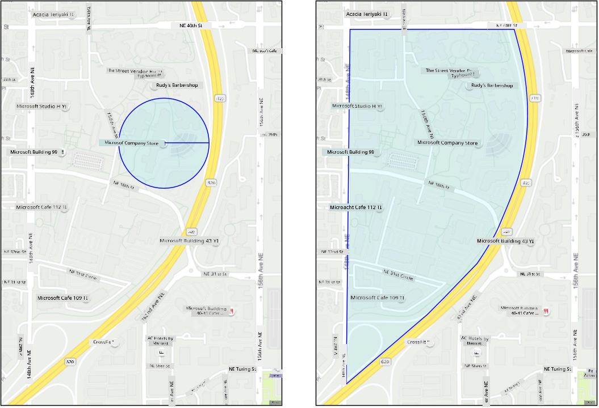
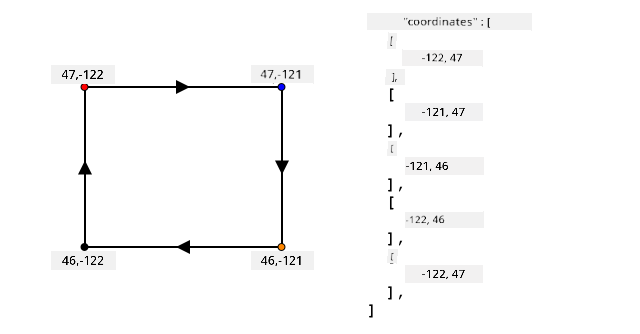
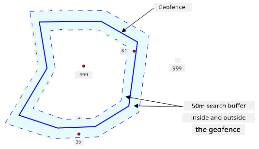
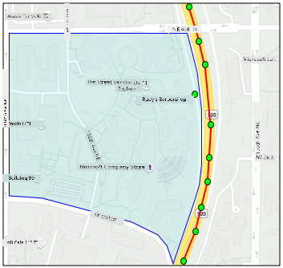
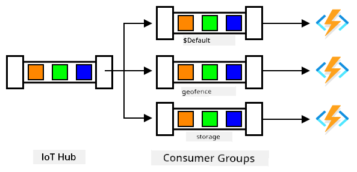

<!--
CO_OP_TRANSLATOR_METADATA:
{
  "original_hash": "078ae664c7b686bf069545e9a5fc95b2",
  "translation_date": "2025-11-18T19:02:01+00:00",
  "source_file": "3-transport/lessons/4-geofences/README.md",
  "language_code": "pcm"
}
-->
# Geofences


> Sketchnote by [Nitya Narasimhan](https://github.com/nitya). Click di image for bigger version.

Dis video dey show wetin geofences be and how you fit use dem for Azure Maps, na di topics wey dis lesson go cover:

[](https://www.youtube.com/watch?v=nsrgYhaYNVY)

> 🎥 Click di image above to watch di video

## Pre-lecture quiz

[Pre-lecture quiz](https://black-meadow-040d15503.1.azurestaticapps.net/quiz/27)

## Introduction

For di last 3 lessons, you don use IoT track di trucks wey dey carry your farm produce go processing hub. You don collect GPS data, send am go cloud to store, and show am for map. Di next step to make your supply chain better na to get alert wen truck dey near di processing hub, so dat di crew wey go offload go ready with forklifts and other equipment as di truck land. Dis way, dem go offload fast, and you no go dey pay truck and driver to dey wait.

For dis lesson, you go learn about geofences - defined geospatial areas like di area wey dey 2km drive from di processing hub, and how to test if GPS coordinates dey inside or outside di geofence, so you fit know if your GPS sensor don reach or commot di area.

Dis lesson go cover:

* [Wetin be geofences](../../../../../3-transport/lessons/4-geofences)
* [Define geofence](../../../../../3-transport/lessons/4-geofences)
* [Test points against geofence](../../../../../3-transport/lessons/4-geofences)
* [Use geofences from serverless code](../../../../../3-transport/lessons/4-geofences)

> 🗑 Dis na di last lesson for dis project, so after you finish dis lesson and di assignment, no forget to clean up your cloud services. You go need di services to finish di assignment, so make sure say you complete am first.
>
> Check [di clean up your project guide](../../../clean-up.md) if you need instructions on how to do am.

## Wetin be Geofences

Geofence na virtual boundary for real-world geographic area. Geofences fit be circle wey dem define as point and radius (like circle wey wide 100m around one building), or polygon wey cover area like school zone, city limits, or university or office campus.



> 💁 You fit don use geofences before and no know. If you don set reminder with iOS reminders app or Google Keep based on location, you don use geofence. Dis apps go set geofence based on di location wey you give and alert you wen your phone enter di geofence.

Plenty reasons dey why you go wan know if vehicle dey inside or outside geofence:

* Preparation for offloading - notification say vehicle don land go help crew ready to offload di vehicle, reduce waiting time. Dis fit make driver deliver more in one day without plenty waiting.
* Tax compliance - some countries like New Zealand dey charge road tax for diesel vehicles based on di weight wen dem dey drive for public roads only. Geofences fit help track mileage for public roads versus private roads like farms or logging areas.
* Monitoring theft - if vehicle suppose dey one area like farm, and e commot di geofence, e fit mean say dem don thief am.
* Location compliance - some parts of work site, farm or factory fit dey off-limits to some vehicles, like keeping vehicles wey carry artificial fertilizers and pesticides away from fields wey dey grow organic produce. If vehicle enter geofence, e mean say e no dey comply and driver fit get notification.

✅ You fit think of other ways to use geofences?

Azure Maps, di service wey you use for di last lesson to show GPS data, fit help you define geofences, then test if point dey inside or outside di geofence.

## Define geofence

Geofences dey defined using GeoJSON, same way as di points wey dem add to map for di last lesson. For dis case, instead of `FeatureCollection` of `Point` values, e go be `FeatureCollection` wey get `Polygon`.

```json
{
   "type": "FeatureCollection",
   "features": [
     {
       "type": "Feature",
       "geometry": {
         "type": "Polygon",
         "coordinates": [
           [
             [
               -122.13393688201903,
               47.63829579223815
             ],
             [
               -122.13389128446579,
               47.63782047131512
             ],
             [
               -122.13240802288054,
               47.63783312249837
             ],
             [
               -122.13238388299942,
               47.63829037035086
             ],
             [
               -122.13393688201903,
               47.63829579223815
             ]
           ]
         ]
       },
       "properties": {
         "geometryId": "1"
       }
     }
   ]
}
```

Each point for di polygon dey defined as longitude, latitude pair inside array, and di points dey inside array wey dem set as `coordinates`. For `Point` for di last lesson, di `coordinates` na array wey get 2 values, latitude and longitude. For `Polygon`, e dey be array of arrays wey get 2 values, longitude, latitude.

> 💁 Remember, GeoJSON dey use `longitude, latitude` for points, no be `latitude, longitude`

Di polygon coordinates array go always get 1 extra entry pass di number of points for di polygon, di last entry go be same as di first one, to close di polygon. For example, rectangle go get 5 points.



For di image above, di rectangle polygon coordinates start for top-left at 47,-122, then e go right to 47,-121, then e go down to 46,-121, then e go left to 46, -122, then e go back up to di start point at 47, -122. Dis go give di polygon 5 points - top-left, top-right, bottom-right, bottom-left, then top-left to close am.

✅ Try create GeoJSON polygon around your house or school. Use tool like [GeoJSON.io](https://geojson.io/).

### Task - define geofence

To use geofence for Azure Maps, first you go upload am to your Azure Maps account. Once you upload am, you go get unique ID wey you fit use test point against di geofence. To upload geofences to Azure Maps, you go need use maps web API. You fit call Azure Maps web API with tool wey dem call [curl](https://curl.se).

> 🎓 Curl na command line tool wey dey make requests to web endpoints

1. If you dey use Linux, macOS, or recent Windows 10 version, you fit don get curl installed already. Run dis command for your terminal or command line to check:

    ```sh
    curl --version
    ```

    If you no see version info for curl, you go need install am from [curl downloads page](https://curl.se/download.html).

    > 💁 If you sabi Postman, you fit use am instead if you like.

1. Create GeoJSON file wey get polygon. You go test dis with your GPS sensor, so create polygon around your current location. You fit create am manually by editing di GeoJSON example wey dem give above, or use tool like [GeoJSON.io](https://geojson.io/).

    Di GeoJSON go need contain `FeatureCollection`, wey get `Feature` with `geometry` wey be type `Polygon`.

    You **MUST** also add `properties` element for di same level as di `geometry` element, and dis one go need contain `geometryId`:

    ```json
    "properties": {
        "geometryId": "1"
    }
    ```

    If you dey use [GeoJSON.io](https://geojson.io/), you go need manually add dis item to di empty `properties` element, either after you download di JSON file, or for di JSON editor for di app.

    Dis `geometryId` go need dey unique for dis file. You fit upload plenty geofences as plenty `Features` for di `FeatureCollection` for di same GeoJSON file, as long as each one get different `geometryId`. Polygons fit get same `geometryId` if dem upload am from different file at different time.

1. Save dis file as `geofence.json`, and go where you save am for your terminal or console.

1. Run dis curl command to create di GeoFence:

    ```sh
    curl --request POST 'https://atlas.microsoft.com/mapData/upload?api-version=1.0&dataFormat=geojson&subscription-key=<subscription_key>' \
         --header 'Content-Type: application/json' \
         --include \
         --data @geofence.json
    ```

    Replace `<subscription_key>` for di URL with di API key for your Azure Maps account.

    Di URL dey upload map data via di `https://atlas.microsoft.com/mapData/upload` API. Di call get `api-version` parameter to specify which Azure Maps API to use, dis na to allow di API change over time but still dey backward compatible. Di data format wey dem upload na `geojson`.

    Dis go run di POST request to di upload API and return list of response headers wey get header wey dem call `location`

    ```output
    content-type: application/json
    location: https://us.atlas.microsoft.com/mapData/operations/1560ced6-3a80-46f2-84b2-5b1531820eab?api-version=1.0
    x-ms-azuremaps-region: West US 2
    x-content-type-options: nosniff
    strict-transport-security: max-age=31536000; includeSubDomains
    x-cache: CONFIG_NOCACHE
    date: Sat, 22 May 2021 21:34:57 GMT
    content-length: 0
    ```

    > 🎓 Wen you dey call web endpoint, you fit pass parameters to di call by adding `?` followed by key value pairs as `key=value`, separate di key value pairs with `&`.

1. Azure Maps no dey process dis immediately, so you go need check if di upload request don finish by using di URL wey dem give for di `location` header. Make GET request to dis location to see di status. You go need add your subscription key to di end of di `location` URL by adding `&subscription-key=<subscription_key>` to di end, replace `<subscription_key>` with di API key for your Azure Maps account. Run dis command:

    ```sh
    curl --request GET '<location>&subscription-key=<subscription_key>'
    ```

    Replace `<location>` with di value of di `location` header, and `<subscription_key>` with di API key for your Azure Maps account.

1. Check di value of `status` for di response. If e no be `Succeeded`, wait one minute and try again.

1. Once di status show `Succeeded`, check di `resourceLocation` for di response. Dis one get details of di unique ID (UDID) for di GeoJSON object. Di UDID na di value after `metadata/`, and no include di `api-version`. For example, if di `resourceLocation` be:

    ```json
    {
      "resourceLocation": "https://us.atlas.microsoft.com/mapData/metadata/7c3776eb-da87-4c52-ae83-caadf980323a?api-version=1.0"
    }
    ```

    Di UDID go be `7c3776eb-da87-4c52-ae83-caadf980323a`.

    Keep copy of dis UDID as you go need am to test di geofence.

## Test points against geofence

Once di polygon don upload to Azure Maps, you fit test point to see if e dey inside or outside di geofence. You go do dis by making web API request, pass di UDID of di geofence, and di latitude and longitude of di point wey you wan test.

Wen you dey make dis request, you fit also pass value wey dem call `searchBuffer`. Dis one dey tell Maps API how accurate e go dey wen e dey return results. Di reason na say GPS no dey perfectly accurate, and sometimes location fit dey off by meters or more. Di default for search buffer na 50m, but you fit set values from 0m to 500m.

Wen results return from di API call, one part of di result na `distance` wey dem measure to di closest point for di edge of di geofence, with positive value if di point dey outside di geofence, negative if e dey inside di geofence. If dis distance dey less than di search buffer, di actual distance go return for meters, otherwise di value go be 999 or -999. 999 mean say di point dey outside di geofence pass di search buffer, -999 mean say e dey inside di geofence pass di search buffer.



For di image above, di geofence get 50m search buffer.

* Point for di center of di geofence, well inside di search buffer get distance of **-999**
* Point well outside di search buffer get distance of **999**
* Point inside di geofence and inside di search buffer, 6m from di geofence, get distance of **6m**
* Point outside di geofence and inside di search buffer, 39m from di geofence, get distance of **39m**

E dey important to know di distance to di edge of di geofence, and combine am with other info like other GPS readings, speed and road data wen you dey make decisions based on vehicle location.

For example, imagine GPS readings dey show say vehicle dey drive for road wey dey near geofence. If one GPS value no dey accurate and e place di vehicle inside di geofence, even though road no dey enter, you fit ignore am.


For di image wey dey up dia, e get one geofence wey dey cover part of Microsoft campus. Di red line dey show one truck wey dey drive for 520, wit circles wey dey show di GPS readings. Most of di readings dey correct and dey follow di 520, but one reading no dey correct as e dey inside di geofence. E no possible say dat reading dey correct - no road dey wey di truck fit suddenly divert from di 520 enter campus, then go back to di 520. Di code wey dey check dis geofence go need to look di previous readings before e go act based on di result of di geofence test.

✅ Wetin extra data you go need check to confirm if GPS reading fit dey correct?

### Task - test points against geofence

1. Start by building di URL for di web API query. Di format na:

    ```output
    https://atlas.microsoft.com/spatial/geofence/json?api-version=1.0&deviceId=gps-sensor&subscription-key=<subscription-key>&udid=<UDID>&lat=<lat>&lon=<lon>
    ```

    Replace `<subscription_key>` wit di API key for your Azure Maps account.

    Replace `<UDID>` wit di UDID of di geofence from di previous task.

    Replace `<lat>` and `<lon>` wit di latitude and longitude wey you wan test.

    Dis URL dey use di `https://atlas.microsoft.com/spatial/geofence/json` API to query geofence wey dem define wit GeoJSON. E dey target di `1.0` API version. Di `deviceId` parameter na compulsory and e suppose be di name of di device wey di latitude and longitude dey come from.

    Di default search buffer na 50m, and you fit change am by passing extra parameter of `searchBuffer=<distance>`, wey go set `<distance>` to di search buffer distance in meters, from 0 to 500.

1. Use curl to make GET request to dis URL:

    ```sh
    curl --request GET '<URL>'
    ```

    > 💁 If you get response code of `BadRequest`, wit error wey be:
    >
    > ```output
    > Invalid GeoJSON: All feature properties should contain a geometryId, which is used for identifying the geofence.
    > ```
    >
    > E mean say your GeoJSON no get di `properties` section wit di `geometryId`. You go need fix di GeoJSON, then repeat di steps wey dey up to re-upload and get new UDID.

1. Di response go contain list of `geometries`, one for each polygon wey dey di GeoJSON wey dem use create di geofence. Each geometry get 3 fields wey dey important, `distance`, `nearestLat` and `nearestLon`.

    ```output
    {
        "geometries": [
            {
                "deviceId": "gps-sensor",
                "udId": "7c3776eb-da87-4c52-ae83-caadf980323a",
                "geometryId": "1",
                "distance": 999.0,
                "nearestLat": 47.645875,
                "nearestLon": -122.142713
            }
        ],
        "expiredGeofenceGeometryId": [],
        "invalidPeriodGeofenceGeometryId": []
    }
    ```

    * `nearestLat` and `nearestLon` na di latitude and longitude of one point for di edge of di geofence wey dey closest to di location wey dem dey test.

    * `distance` na di distance from di location wey dem dey test to di closest point for di edge of di geofence. Negative numbers mean say e dey inside di geofence, positive mean outside. Dis value go dey less than 50 (di default search buffer), or 999.

1. Repeat dis multiple times wit locations wey dey inside and outside di geofence.

## Use geofences from serverless code

You fit now add new trigger to your Functions app to test di IoT Hub GPS event data against di geofence.

### Consumer groups

As you go remember from di previous lessons, di IoT Hub go allow you replay events wey dem don receive but never process. But wetin go happen if multiple triggers connect? How e go know which one don process which events?

Di answer na e no fit! Instead, you fit define multiple separate connections to read di events, and each one go manage di replay of unread messages. Dem dey call dis *consumer groups*. When you connect to di endpoint, you fit specify which consumer group you wan connect to. Each component of your application go connect to different consumer group.



For theory, up to 5 applications fit connect to each consumer group, and dem go all receive messages when dem arrive. E dey best to make sure say only one application dey access each consumer group to avoid duplicate message processing, and make sure say when you restart, all di queued messages go process well. For example, if you launch your Functions app locally as well as dey run am for di cloud, dem go both process messages, wey go lead to duplicate blobs wey dem store for di storage account.

If you check di `function.json` file for di IoT Hub trigger wey you create for di earlier lesson, you go see di consumer group for di event hub trigger binding section:

```json
"consumerGroup": "$Default"
```

When you create IoT Hub, you go get di `$Default` consumer group wey dem create by default. If you wan add extra trigger, you fit add am using new consumer group.

> 💁 For dis lesson, you go use different function to test di geofence from di one wey dem use store di GPS data. Dis na to show how to use consumer groups and separate di code to make am easy to read and understand. For production application, e get many ways wey you fit architect am - put di two for one function, use trigger for di storage account to run function to check di geofence, or use multiple functions. No 'correct way' dey, e depend on di rest of your application and wetin you need.

### Task - create new consumer group

1. Run di command wey dey below to create new consumer group wey dem call `geofence` for your IoT Hub:

    ```sh
    az iot hub consumer-group create --name geofence \
                                     --hub-name <hub_name>
    ```

    Replace `<hub_name>` wit di name wey you use for your IoT Hub.

1. If you wan see all di consumer groups for IoT Hub, run di command wey dey below:

    ```sh
    az iot hub consumer-group list --output table \
                                   --hub-name <hub_name>
    ```

    Replace `<hub_name>` wit di name wey you use for your IoT Hub. Dis go list all di consumer groups.

    ```output
    Name      ResourceGroup
    --------  ---------------
    $Default  gps-sensor
    geofence  gps-sensor
    ```

> 💁 When you run di IoT Hub event monitor for di earlier lesson, e connect to di `$Default` consumer group. Na why you no fit run di event monitor and event trigger. If you wan run di two, then you fit use other consumer groups for all your function apps, and keep `$Default` for di event monitor.

### Task - create new IoT Hub trigger

1. Add new IoT Hub event trigger to your `gps-trigger` function app wey you create for di earlier lesson. Call dis function `geofence-trigger`.

    > ⚠️ You fit check [di instructions for creating IoT Hub event trigger from project 2, lesson 5 if you need am](../../../2-farm/lessons/5-migrate-application-to-the-cloud/README.md#create-an-iot-hub-event-trigger).

1. Configure di IoT Hub connection string for di `function.json` file. Di `local.settings.json` dey share between all triggers for di Function App.

1. Update di value of di `consumerGroup` for di `function.json` file to reference di new `geofence` consumer group:

    ```json
    "consumerGroup": "geofence"
    ```

1. You go need use di subscription key for your Azure Maps account for dis trigger, so add new entry to di `local.settings.json` file wey dem call `MAPS_KEY`.

1. Run di Functions App to make sure say e dey connect and dey process messages. Di `iot-hub-trigger` from di earlier lesson go also run and upload blobs to storage.

    > To avoid duplicate GPS readings for blob storage, you fit stop di Functions App wey you dey run for di cloud. To do dis, use di command wey dey below:
    >
    > ```sh
    > az functionapp stop --resource-group gps-sensor \
    >                     --name <functions_app_name>
    > ```
    >
    > Replace `<functions_app_name>` wit di name wey you use for your Functions App.
    >
    > You fit restart am later wit di command wey dey below:
    >
    > ```sh
    > az functionapp start --resource-group gps-sensor \
    >                     --name <functions_app_name>
    > ```
    >
    > Replace `<functions_app_name>` wit di name wey you use for your Functions App.

### Task - test di geofence from di trigger

For di earlier part of dis lesson, you use curl to query geofence to see if point dey inside or outside. You fit make similar web request from inside your trigger.

1. To query di geofence, you need di UDID. Add new entry to di `local.settings.json` file wey dem call `GEOFENCE_UDID` wit dis value.

1. Open di `__init__.py` file from di new `geofence-trigger` trigger.

1. Add di import wey dey below to di top of di file:

    ```python
    import json
    import os
    import requests
    ```

    Di `requests` package dey allow you make web API calls. Azure Maps no get Python SDK, you go need make web API calls to use am from Python code.

1. Add di 2 lines wey dey below to di start of di `main` method to get di Maps subscription key:

    ```python
    maps_key = os.environ['MAPS_KEY']
    geofence_udid = os.environ['GEOFENCE_UDID']    
    ```

1. Inside di `for event in events` loop, add di code wey dey below to get di latitude and longitude from each event:

    ```python
    event_body = json.loads(event.get_body().decode('utf-8'))
    lat = event_body['gps']['lat']
    lon = event_body['gps']['lon']
    ```

    Dis code dey convert di JSON from di event body to dictionary, then e dey extract di `lat` and `lon` from di `gps` field.

1. When you dey use `requests`, instead of building long URL like you do wit curl, you fit use just di URL part and pass di parameters as dictionary. Add di code wey dey below to define di URL to call and configure di parameters:

    ```python
    url = 'https://atlas.microsoft.com/spatial/geofence/json'

    params = {
        'api-version': 1.0,
        'deviceId': 'gps-sensor',
        'subscription-key': maps_key,
        'udid' : geofence_udid,
        'lat' : lat,
        'lon' : lon
    }
    ```

    Di items for di `params` dictionary go match di key value pairs wey you use when you dey call di web API wit curl.

1. Add di lines of code wey dey below to call di web API:

    ```python
    response = requests.get(url, params=params)
    response_body = json.loads(response.text)
    ```

    Dis dey call di URL wit di parameters, and e dey get back response object.

1. Add di code wey dey below under dis:

    ```python
    distance = response_body['geometries'][0]['distance']

    if distance == 999:
        logging.info('Point is outside geofence')
    elif distance > 0:
        logging.info(f'Point is just outside geofence by a distance of {distance}m')
    elif distance == -999:
        logging.info(f'Point is inside geofence')
    else:
        logging.info(f'Point is just inside geofence by a distance of {distance}m')
    ```

    Dis code dey assume 1 geometry, and e dey extract di distance from dat single geometry. E go log different messages based on di distance.

1. Run dis code. You go see for di logging output if di GPS coordinates dey inside or outside di geofence, wit distance if di point dey within 50m. Try dis code wit different geofences based on di location of your GPS sensor, try move di sensor (like tethered to WiFi from mobile phone, or wit different coordinates for di virtual IoT device) to see di change.

1. When you ready, deploy dis code to your Functions app for di cloud. No forget to deploy di new Application Settings.

    > ⚠️ You fit check [di instructions for uploading Application Settings from project 2, lesson 5 if you need am](../../../2-farm/lessons/5-migrate-application-to-the-cloud/README.md#task---upload-your-application-settings).

    > ⚠️ You fit check [di instructions for deploying your Functions app from project 2, lesson 5 if you need am](../../../2-farm/lessons/5-migrate-application-to-the-cloud/README.md#task---deploy-your-functions-app-to-the-cloud).

> 💁 You fit find dis code for di [code/functions](../../../../../3-transport/lessons/4-geofences/code/functions) folder.

---

## 🚀 Challenge

For dis lesson, you add one geofence using GeoJSON file wit single polygon. You fit upload multiple polygons at di same time, as long as dem get different `geometryId` values for di `properties` section.

Try upload GeoJSON file wit multiple polygons and adjust your code to find which polygon di GPS coordinates dey closest to or dey inside.

## Post-lecture quiz

[Post-lecture quiz](https://black-meadow-040d15503.1.azurestaticapps.net/quiz/28)

## Review & Self Study

* Read more about geofences and di use cases for di [Geofencing page for Wikipedia](https://en.wikipedia.org/wiki/Geo-fence).
* Read more about Azure Maps geofencing API for di [Microsoft Azure Maps Spatial - Get Geofence documentation](https://docs.microsoft.com/rest/api/maps/spatial/getgeofence?WT.mc_id=academic-17441-jabenn).
* Read more about consumer groups for di [Features and terminology for Azure Event Hubs - Event consumers documentation for Microsoft docs](https://docs.microsoft.com/azure/event-hubs/event-hubs-features?WT.mc_id=academic-17441-jabenn#event-consumers).

## Assignment

[Send notifications using Twilio](assignment.md)

---

<!-- CO-OP TRANSLATOR DISCLAIMER START -->
**Disclaimer**:  
Dis dokyument don use AI transleto service [Co-op Translator](https://github.com/Azure/co-op-translator) do di translation. Even as we dey try make am correct, abeg sabi say machine translation fit get mistake or no dey accurate well. Di original dokyument for im native language na di main source wey you go trust. For important mata, e good make professional human transleto check am. We no go fit take blame for any misunderstanding or wrong interpretation wey fit happen because you use dis translation.
<!-- CO-OP TRANSLATOR DISCLAIMER END -->