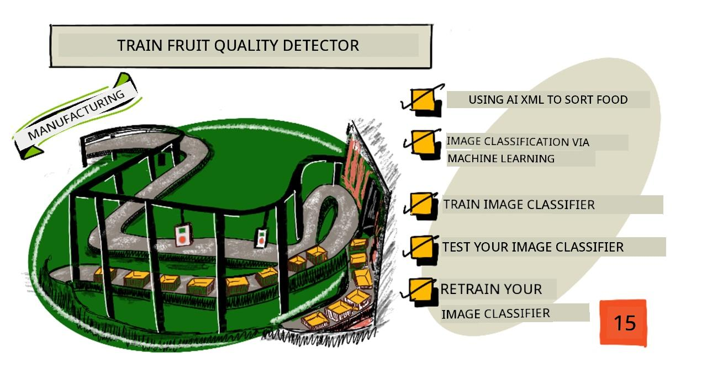
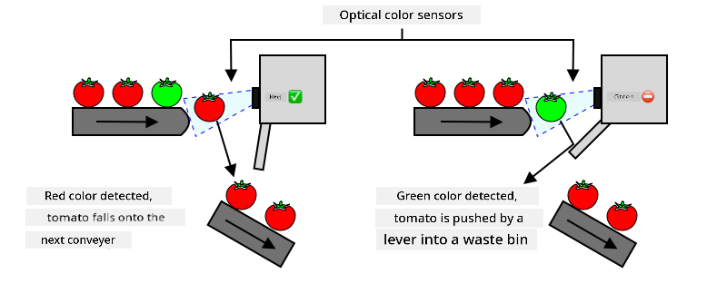
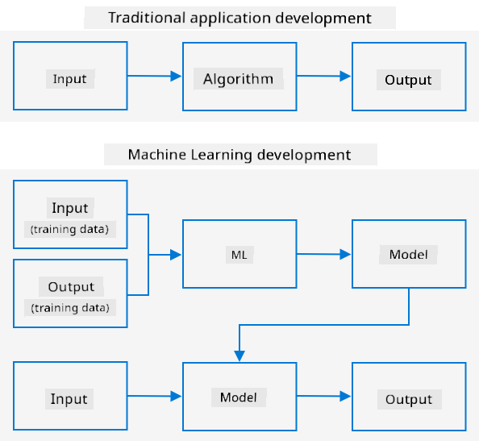
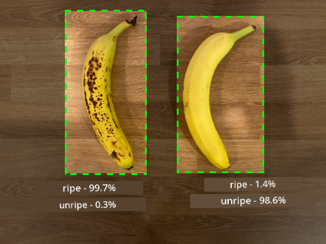
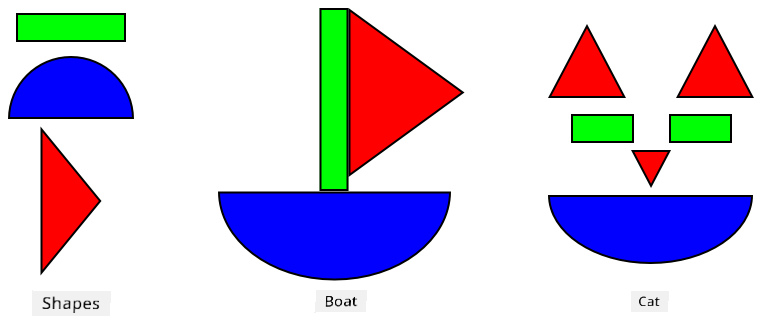
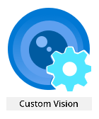
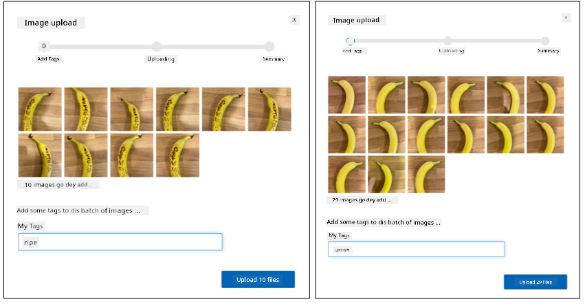
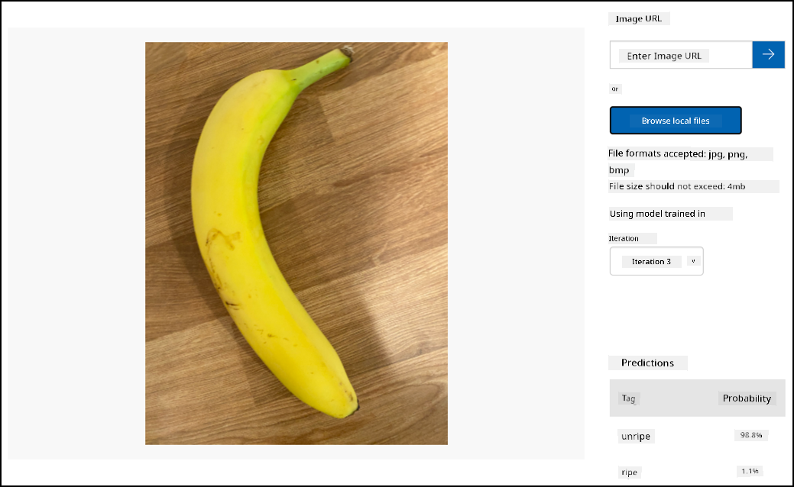

<!--
CO_OP_TRANSLATOR_METADATA:
{
  "original_hash": "f5e63c916d2dd97d58be12aaf76bd9f1",
  "translation_date": "2025-11-18T18:56:37+00:00",
  "source_file": "4-manufacturing/lessons/1-train-fruit-detector/README.md",
  "language_code": "pcm"
}
-->
# Train fruit quality detector



> Sketchnote by [Nitya Narasimhan](https://github.com/nitya). Click di image for bigger version.

Dis video go show wetin Azure Custom Vision service fit do, na di service wey we go talk about for dis lesson.

[](https://www.youtube.com/watch?v=TETcDLJlWR4)

> 🎥 Click di image above to watch di video

## Pre-lecture quiz

[Pre-lecture quiz](https://black-meadow-040d15503.1.azurestaticapps.net/quiz/29)

## Introduction

Di way Artificial Intelligence (AI) and Machine Learning (ML) dey grow fast, e dey give developers plenty new things wey dem fit do. ML models fit learn how to sabi different tins for pictures, like fruit wey never ripe, and dis one fit help IoT devices sort food as dem dey harvest am or as e dey process for factory or warehouse.

For dis lesson, you go learn about image classification - how ML models fit sabi di difference between pictures of different tins. You go learn how to train image classifier wey go sabi di difference between fruit wey good and di one wey bad, like fruit wey don spoil, bruised, or never ripe.

For dis lesson we go talk about:

* [How AI and ML dey help sort food](../../../../../4-manufacturing/lessons/1-train-fruit-detector)
* [Image classification with Machine Learning](../../../../../4-manufacturing/lessons/1-train-fruit-detector)
* [How to train image classifier](../../../../../4-manufacturing/lessons/1-train-fruit-detector)
* [How to test your image classifier](../../../../../4-manufacturing/lessons/1-train-fruit-detector)
* [How to retrain your image classifier](../../../../../4-manufacturing/lessons/1-train-fruit-detector)

## Using AI and ML to sort food

To feed di whole world no easy, especially to make food cheap for everybody. One big cost na labor, so farmers dey use automation and IoT tools to reduce di money wey dem dey spend on labor. To harvest food by hand na hard work (and e dey break back), so richer countries dey use machine to do am. But di problem be say di machine no fit sort di food as e dey harvest am.

No be all crops dey ripe at di same time. For example, tomatoes fit still get green ones for di vine when di rest don ready to harvest. E dey wasteful to harvest di green ones, but e dey cheaper and easier for di farmer to harvest everything with machine and later throway di ones wey never ripe.

✅ Check di fruits or vegetables wey dey grow near you for farm, garden, or shop. Dem dey ripe at di same time or you dey see difference?

As machine dey harvest food, di sorting work don move go factory. Food go dey pass conveyor belt wey people go dey remove di ones wey no good. Machine dey make harvesting cheaper, but di sorting still dey cost money.



Di next level na machine wey dey sort food, either for di harvester or di factory. Di first type of dis machine dey use optical sensor to check color, then e go use lever or air to push green tomatoes enter waste bin, while red tomatoes go continue for conveyor belt.

For dis video, as tomatoes dey fall from one conveyor belt to another, di machine go see di green ones and push dem enter bin.

✅ Wetin you think say factory or farm need make dis optical sensor work well?

Di latest type of sorting machine dey use AI and ML. Dem dey train di model to sabi di difference between good and bad food, not just by color like green vs red tomatoes, but by di small small difference wey fit show disease or bruising.

## Image classification via Machine Learning

Traditional programming na when you use data, apply algorithm, and get result. For example, for di last project, you use GPS coordinates and geofence, apply Azure Maps algorithm, and e tell you if di point dey inside or outside di geofence. You put more data, you get more result.



Machine learning dey different - you go start with data and di result wey you sabi already, then di machine learning algorithm go learn from di data. Di trained algorithm wey dem dey call *machine learning model* or *model* fit use new data to give new result.

> 🎓 Di process wey machine learning dey use learn from data na *training*. Di inputs and di result wey you sabi already na *training data*.

For example, you fit give di model plenty pictures of banana wey never ripe as input training data, and di result go be `unripe`. Then you go give am plenty pictures of ripe banana as training data, and di result go be `ripe`. Di ML algorithm go use dis data create model. Later, you fit give di model new picture of banana and e go tell you if di banana ripe or never ripe.

> 🎓 Di result wey ML models dey give na *predictions*



ML models no dey give yes or no answer, dem dey give probability. For example, di model fit see banana picture and predict `ripe` 99.7% and `unripe` 0.3%. Your code go pick di best prediction and decide say di banana ripe.

Di ML model wey dey detect images like dis na *image classifier* - e dey use labelled images to sabi new images based on di labels.

> 💁 Dis na simple explanation, but plenty other ways dey to train models wey no need labelled outputs, like unsupervised learning. If you wan learn more about ML, check [ML for beginners, 24 lesson curriculum on Machine Learning](https://aka.ms/ML-beginners).

## Train an image classifier

To train image classifier well, you need plenty pictures. But if you get image classifier wey dem don train with plenty pictures, you fit use am again and retrain am with small set of pictures and still get good result. Dis process na *transfer learning*.

> 🎓 Transfer learning na when you use di learning from one ML model to train new model with new data.

Once image classifier don train with plenty pictures, e go sabi shapes, colors, and patterns well. Transfer learning go help di model use wetin e don sabi to recognize new pictures.



You fit think am like children shape books, once you sabi semi-circle, rectangle, and triangle, you fit sabi sailboat or cat based on how dem arrange di shapes. Di image classifier go sabi di shapes, and transfer learning go teach am wetin di arrangement mean - like ripe banana.

Plenty tools dey to help you do dis, including cloud-based services wey fit help you train di model and use am through web APIs.

> 💁 To train models dey need plenty computer power, like Graphics Processing Units (GPUs). Di same hardware wey dey make Xbox games fine fit train machine learning models. With cloud, you fit rent time on powerful computers with GPUs to train di models, so you go get di power wey you need only for di time wey you need am.

## Custom Vision

Custom Vision na cloud tool wey dey train image classifiers. E dey allow you train classifier with small number of pictures. You fit upload pictures through web portal, web API or SDK, give each picture *tag* wey go show di classification. You go train di model, test am to see how e dey perform, and if e good, you fit publish di model wey people fit use through web API or SDK.



> 💁 You fit train custom vision model with only 5 pictures per classification, but di more pictures you get, di better. At least 30 pictures go give better result.

Custom Vision na part of Microsoft AI tools wey dem dey call Cognitive Services. Dis AI tools fit work without training or with small training. Dem include speech recognition, translation, language understanding, and image analysis. Dem dey available for free tier as services for Azure.

> 💁 Di free tier dey enough to create model, train am, and use am for development work. You fit read di limits of di free tier for [Custom Vision Limits and quotas page on Microsoft docs](https://docs.microsoft.com/azure/cognitive-services/custom-vision-service/limits-and-quotas?WT.mc_id=academic-17441-jabenn).

### Task - create cognitive services resource

To use Custom Vision, you need to create two cognitive services resources for Azure with Azure CLI, one for Custom Vision training and one for Custom Vision prediction.

1. Create Resource Group for dis project wey you go call `fruit-quality-detector`

1. Use dis command to create free Custom Vision training resource:

    ```sh
    az cognitiveservices account create --name fruit-quality-detector-training \
                                        --resource-group fruit-quality-detector \
                                        --kind CustomVision.Training \
                                        --sku F0 \
                                        --yes \
                                        --location <location>
    ```

    Replace `<location>` with di location wey you use when you create di Resource Group.

    Dis go create Custom Vision training resource for your Resource Group. E go dey called `fruit-quality-detector-training` and e go use `F0` sku, wey be free tier. Di `--yes` option mean say you agree to di terms and conditions of di cognitive services.

> 💁 Use `S0` sku if you don already get free account wey dey use any of di Cognitive Services.

1. Use dis command to create free Custom Vision prediction resource:

    ```sh
    az cognitiveservices account create --name fruit-quality-detector-prediction \
                                        --resource-group fruit-quality-detector \
                                        --kind CustomVision.Prediction \
                                        --sku F0 \
                                        --yes \
                                        --location <location>
    ```

    Replace `<location>` with di location wey you use when you create di Resource Group.

    Dis go create Custom Vision prediction resource for your Resource Group. E go dey called `fruit-quality-detector-prediction` and e go use `F0` sku, wey be free tier. Di `--yes` option mean say you agree to di terms and conditions of di cognitive services.

### Task - create image classifier project

1. Open Custom Vision portal for [CustomVision.ai](https://customvision.ai), and sign in with di Microsoft account wey you use for your Azure account.

1. Follow di [create new Project section for di build classifier quickstart for Microsoft docs](https://docs.microsoft.com/azure/cognitive-services/custom-vision-service/getting-started-build-a-classifier?WT.mc_id=academic-17441-jabenn#create-a-new-project) to create new Custom Vision project. Di UI fit change, so di docs go always dey up to date.

    Call your project `fruit-quality-detector`.

    When you dey create di project, make sure say you use di `fruit-quality-detector-training` resource wey you create before. Use *Classification* project type, *Multiclass* classification type, and *Food* domain.

    

✅ Take time to check di Custom Vision UI for your image classifier.

### Task - train your image classifier project

To train image classifier, you need plenty pictures of fruit, both good and bad quality, like ripe and overripe banana.

> 💁 Dis classifiers fit classify pictures of anything, so if you no get fruit wey dey different quality, you fit use two different types of fruit, or cats and dogs!

Make sure say each picture na just di fruit, with either same background or plenty different backgrounds. No let di background get anything wey dey show ripe vs unripe fruit.
> 💁 E dey important make you no use background wey no relate to wetin you wan classify for each tag, because if you do am, the classifier fit dey classify based on the background. One time, dem train classifier for skin cancer using moles wey normal and cancerous, but the cancerous moles get ruler for the picture to measure size. E come be say the classifier dey almost 100% accurate to sabi ruler for picture, no be cancerous moles.

Image classifiers dey work for very low resolution. For example, Custom Vision fit take training and prediction images up to 10240x10240, but e dey train and run the model for images wey be 227x227. Big images go shrink to this size, so make sure say wetin you wan classify dey take big part of the image, otherwise e fit too small for the smaller image wey the classifier go use.

1. Gather pictures for your classifier. You go need at least 5 pictures for each label to train the classifier, but the more, the better. You go also need some extra images to test the classifier. All these images suppose be different pictures of the same thing. For example:

    * Use 2 ripe bananas, take pictures of each one from different angles, at least 7 pictures (5 for training, 2 for testing), but if you fit take more, e go better.

        

    * Do the same thing for 2 unripe bananas.

    You suppose get at least 10 training images, with at least 5 ripe and 5 unripe, and 4 testing images, 2 ripe, 2 unripe. Your images suppose be png or jpeg, small pass 6MB. If you use iPhone take the pictures, dem fit be high-resolution HEIC images, so you go need convert and maybe shrink dem. The more images, the better, and you suppose get similar number of ripe and unripe.

    If you no get both ripe and unripe fruit, you fit use different fruits, or any two objects wey you get. You fit also find example images for the [images](../../../../../4-manufacturing/lessons/1-train-fruit-detector/images) folder of ripe and unripe bananas wey you fit use.

1. Follow the [upload and tag images section of the build a classifier quickstart on the Microsoft docs](https://docs.microsoft.com/azure/cognitive-services/custom-vision-service/getting-started-build-a-classifier?WT.mc_id=academic-17441-jabenn#upload-and-tag-images) to upload your training images. Tag the ripe fruit as `ripe`, and the unripe fruit as `unripe`.

    

1. Follow the [train the classifier section of the build a classifier quickstart on the Microsoft docs](https://docs.microsoft.com/azure/cognitive-services/custom-vision-service/getting-started-build-a-classifier?WT.mc_id=academic-17441-jabenn#train-the-classifier) to train the image classifier with your uploaded images.

    You go get option to choose training type. Select **Quick Training**.

The classifier go train. E go take few minutes to finish the training.

> 🍌 If you wan chop your fruit while the classifier dey train, make sure say you don get enough images to test first!

## Test your image classifier

Once your classifier don train finish, you fit test am by giving am new image to classify.

### Task - test your image classifier

1. Follow the [test your model documentation on the Microsoft docs](https://docs.microsoft.com/azure/cognitive-services/custom-vision-service/test-your-model?WT.mc_id=academic-17441-jabenn#test-your-model) to test your image classifier. Use the testing images wey you don create before, no use any of the images wey you use for training.

    

1. Try all the testing images wey you get and check the probabilities.

## Retrain your image classifier

When you test your classifier, e fit no give you the result wey you dey expect. Image classifiers dey use machine learning to predict wetin dey inside image, based on probabilities wey show say particular features for image mean say e match particular label. E no sabi wetin dey inside the image - e no know wetin banana be or understand wetin make banana be banana instead of boat. You fit improve your classifier by retraining am with images wey e dey get wrong.

Every time you make prediction using the quick test option, the image and results go dey stored. You fit use these images retrain your model.

### Task - retrain your image classifier

1. Follow the [use the predicted image for training documentation on the Microsoft docs](https://docs.microsoft.com/azure/cognitive-services/custom-vision-service/test-your-model?WT.mc_id=academic-17441-jabenn#use-the-predicted-image-for-training) to retrain your model, using the correct tag for each image.

1. Once your model don retrain finish, test am with new images.

---

## 🚀 Challenge

Wetin you think go happen if you use picture of strawberry with model wey dem train on bananas, or picture of inflatable banana, or person wey wear banana suit, or even yellow cartoon character like person from the Simpsons?

Try am and see wetin the predictions go be. You fit find images to try with using [Bing Image search](https://www.bing.com/images/trending).

## Post-lecture quiz

[Post-lecture quiz](https://black-meadow-040d15503.1.azurestaticapps.net/quiz/30)

## Review & Self Study

* When you train your classifier, you go see values for *Precision*, *Recall*, and *AP* wey dey rate the model wey dem create. Read about wetin these values mean using [the evaluate the classifier section of the build a classifier quickstart on the Microsoft docs](https://docs.microsoft.com/azure/cognitive-services/custom-vision-service/getting-started-build-a-classifier?WT.mc_id=academic-17441-jabenn#evaluate-the-classifier)
* Read about how to improve your classifier from the [how to improve your Custom Vision model on the Microsoft docs](https://docs.microsoft.com/azure/cognitive-services/custom-vision-service/getting-started-improving-your-classifier?WT.mc_id=academic-17441-jabenn)

## Assignment

[Train your classifier for multiple fruits and vegetables](assignment.md)

---

<!-- CO-OP TRANSLATOR DISCLAIMER START -->
**Disclaimer**:  
Dis dokyument don use AI translation service [Co-op Translator](https://github.com/Azure/co-op-translator) do di translation. Even as we dey try make am accurate, abeg sabi say machine translation fit get mistake or no dey correct well. Di original dokyument for im native language na di main source wey you go fit trust. For important information, e better make professional human translator check am. We no go fit take blame for any misunderstanding or wrong interpretation wey fit happen because you use dis translation.
<!-- CO-OP TRANSLATOR DISCLAIMER END -->