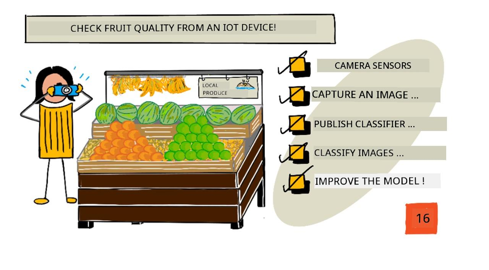
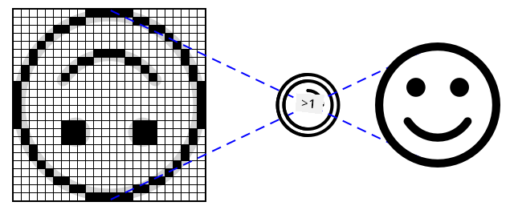
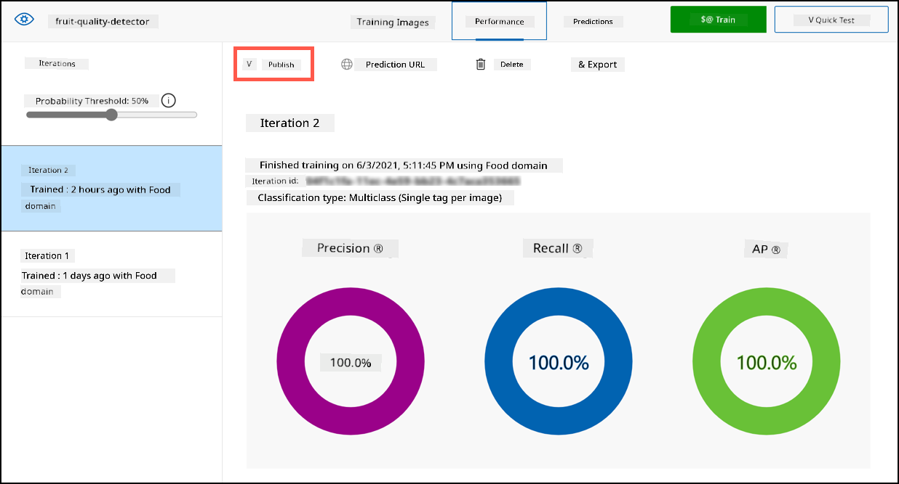

<!--
CO_OP_TRANSLATOR_METADATA:
{
  "original_hash": "557f4ee96b752e0651d2e6e74aa6bd14",
  "translation_date": "2025-11-18T18:53:59+00:00",
  "source_file": "4-manufacturing/lessons/2-check-fruit-from-device/README.md",
  "language_code": "pcm"
}
-->
# Check fruit quality from IoT device



> Sketchnote by [Nitya Narasimhan](https://github.com/nitya). Click di image for bigger version.

## Pre-lecture quiz

[Pre-lecture quiz](https://black-meadow-040d15503.1.azurestaticapps.net/quiz/31)

## Introduction

For di last lesson, you don learn about image classifiers, and how to train dem to sabi good and bad fruit. To use dis image classifier for IoT application, you go need to fit capture image wit camera, and send di image go cloud make dem classify am.

For dis lesson, you go learn about camera sensors, and how to use dem wit IoT device to capture image. You go also learn how to call di image classifier from your IoT device.

For dis lesson we go talk about:

* [Camera sensors](../../../../../4-manufacturing/lessons/2-check-fruit-from-device)
* [Capture image wit IoT device](../../../../../4-manufacturing/lessons/2-check-fruit-from-device)
* [Publish your image classifier](../../../../../4-manufacturing/lessons/2-check-fruit-from-device)
* [Classify images from your IoT device](../../../../../4-manufacturing/lessons/2-check-fruit-from-device)
* [Improve di model](../../../../../4-manufacturing/lessons/2-check-fruit-from-device)

## Camera sensors

Camera sensors na cameras wey you fit connect to your IoT device. Dem fit take still images or capture streaming video. Some go return raw image data, others go compress di image data into image file like JPEG or PNG. Normally, di cameras wey dey work wit IoT devices dey small and get lower resolution compared to wetin you dey used to, but you fit get high resolution cameras wey go match di top-end phones. You fit get different types of lenses, multiple camera setups, infra-red thermal cameras, or UV cameras.



Most camera sensors dey use image sensors wey each pixel na photodiode. Lens dey focus di image onto di image sensor, and thousands or millions of photodiodes dey detect di light wey dey fall on each one, and dem dey record am as pixel data.

> 💁 Lenses dey turn image upside down, di camera sensor go then flip di image back to di correct way. Na di same thing dey happen for your eyes - wetin you dey see dey detect upside down for di back of your eye, but your brain dey correct am.

> 🎓 Di image sensor dey known as Active-Pixel Sensor (APS), and di most popular type of APS na complementary metal-oxide semiconductor sensor, or CMOS. You fit don hear di term CMOS sensor for camera sensors.

Camera sensors na digital sensors, dem dey send image data as digital data, usually wit di help of library wey dey provide di communication. Cameras dey connect using protocols like SPI to allow dem send plenty data - images big pass single numbers from sensor like temperature sensor.

✅ Wetin be di limitations wey dey around image size for IoT devices? Think about di constraints especially for microcontroller hardware.

## Capture image wit IoT device

You fit use your IoT device to capture image wey dem go classify.

### Task - capture image wit IoT device

Follow di correct guide to capture image wit your IoT device:

* [Arduino - Wio Terminal](wio-terminal-camera.md)
* [Single-board computer - Raspberry Pi](pi-camera.md)
* [Single-board computer - Virtual device](virtual-device-camera.md)

## Publish your image classifier

You don train your image classifier for di last lesson. Before you fit use am from your IoT device, you go need to publish di model.

### Model iterations

When your model dey train for di last lesson, you fit notice say di **Performance** tab dey show iterations for di side. When you first train di model, you go see *Iteration 1* for training. When you improve di model using di prediction images, you go see *Iteration 2* for training.

Every time you train di model, you go get new iteration. Dis na way to track di different versions of your model wey dem train on different data sets. When you do **Quick Test**, you go see drop-down wey you fit use to select di iteration, so you fit compare di results across multiple iterations.

When you dey happy wit one iteration, you fit publish am to make am available to use from external applications. Dis way, you fit get published version wey your devices dey use, then work on new version over multiple iterations, then publish am once you dey happy wit am.

### Task - publish iteration

Iterations dey published from di Custom Vision portal.

1. Open di Custom Vision portal for [CustomVision.ai](https://customvision.ai) and sign in if you never open am before. Then open your `fruit-quality-detector` project.

1. Select di **Performance** tab from di options for di top.

1. Select di latest iteration from di *Iterations* list for di side.

1. Select di **Publish** button for di iteration.

    

1. For di *Publish Model* dialog, set di *Prediction resource* to di `fruit-quality-detector-prediction` resource wey you create for di last lesson. Leave di name as `Iteration2`, and select di **Publish** button.

1. Once you don publish am, select di **Prediction URL** button. Dis go show details of di prediction API, and you go need dem to call di model from your IoT device. Di lower section dey labelled *If you have an image file*, and na di details you go need. Copy di URL wey dem show wey go look like:

    ```output
    https://<location>.api.cognitive.microsoft.com/customvision/v3.0/Prediction/<id>/classify/iterations/Iteration2/image
    ```

    Where `<location>` go be di location wey you use when you dey create your custom vision resource, and `<id>` go be long ID wey get letters and numbers.

    Also copy di *Prediction-Key* value. Dis na secure key wey you go pass when you dey call di model. Only applications wey pass dis key go fit use di model, any other applications dem go reject.

    

✅ When new iteration dey published, e go get different name. How you think say you go fit change di iteration wey IoT device dey use?

## Classify images from your IoT device

You fit now use dis connection details to call di image classifier from your IoT device.

### Task - classify images from your IoT device

Follow di correct guide to classify images using your IoT device:

* [Arduino - Wio Terminal](wio-terminal-classify-image.md)
* [Single-board computer - Raspberry Pi/Virtual IoT device](single-board-computer-classify-image.md)

## Improve di model

You fit notice say di results wey you dey get when you dey use di camera wey connect to your IoT device no dey match wetin you dey expect. Di predictions no dey always accurate like di images wey you upload from your computer. Dis na because di model train on different data compared to wetin dem dey use for predictions.

To get better results for image classifier, you go wan train di model wit images wey dey similar to di images wey dem dey use for predictions. If you use your phone camera to capture images for training, for example, di image quality, sharpness, and color go dey different from di camera wey connect to IoT device.


For di image above, di banana picture for left na from Raspberry Pi Camera, di one for right na di same banana for di same location wey dem take wit iPhone. You go notice di difference for quality - di iPhone picture sharp, wit brighter colors and more contrast.

✅ Wetin else fit make di images wey IoT device capture dey give wrong predictions? Think about di environment wey IoT device dey, wetin fit affect di image wey dem dey capture?

To improve di model, you fit retrain am using di images wey IoT device capture.

### Task - improve di model

1. Classify plenty images of both ripe and unripe fruit using your IoT device.

1. For di Custom Vision portal, retrain di model using di images for di *Predictions* tab.

    > ⚠️ You fit check [di instructions for retraining your classifier for lesson 1 if you need am](../1-train-fruit-detector/README.md#retrain-your-image-classifier).

1. If your images dey look very different from di original ones wey dem use train, you fit delete all di original images by selecting dem for di *Training Images* tab and selecting di **Delete** button. To select image, move your cursor over am and tick go appear, select di tick to select or deselect di image.

1. Train new iteration of di model and publish am using di steps above.

1. Update di endpoint URL for your code, and re-run di app.

1. Repeat dis steps until you dey happy wit di results of di predictions.

---

## 🚀 Challenge

How image resolution or lighting dey affect di prediction?

Try change di resolution of di images for your device code and see if e go make difference for di quality of di images. Also try change lighting.

If you wan create production device to sell to farms or factories, how you go make sure say e dey give consistent results all di time?

## Post-lecture quiz

[Post-lecture quiz](https://black-meadow-040d15503.1.azurestaticapps.net/quiz/32)

## Review & Self Study

You don train your custom vision model using di portal. Dis dey depend on having images available - and for real world, you fit no fit get training data wey match wetin di camera for your device dey capture. You fit work around dis by training directly from your device using di training API, to train model wit images wey IoT device capture.

* Read about di training API for [using di Custom Vision SDK quick start](https://docs.microsoft.com/azure/cognitive-services/custom-vision-service/quickstarts/image-classification?WT.mc_id=academic-17441-jabenn&tabs=visual-studio&pivots=programming-language-python)

## Assignment

[Respond to classification results](assignment.md)

---

<!-- CO-OP TRANSLATOR DISCLAIMER START -->
**Disclaimer**:  
Dis docu don dey translate wit AI translation service [Co-op Translator](https://github.com/Azure/co-op-translator). Even though we dey try make am accurate, abeg sabi say automated translations fit get mistake or no dey 100% correct. Di original docu for di native language na di main correct source. For important information, e better make una use professional human translation. We no go fit take blame for any misunderstanding or wrong interpretation wey fit happen because of dis translation.
<!-- CO-OP TRANSLATOR DISCLAIMER END -->