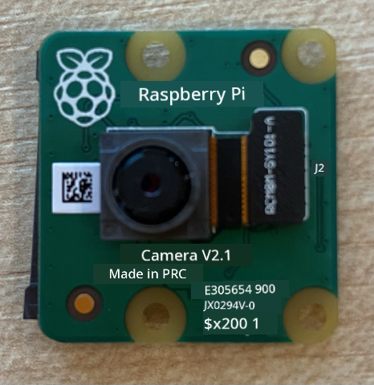
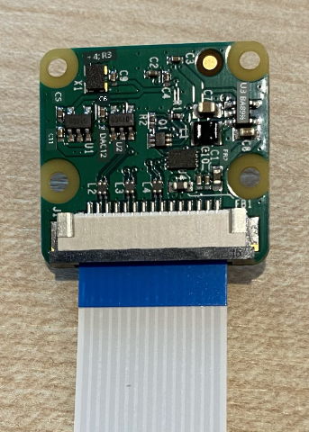
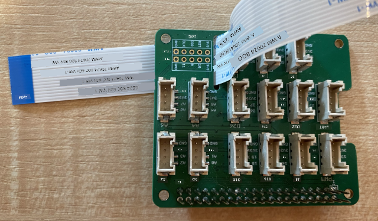
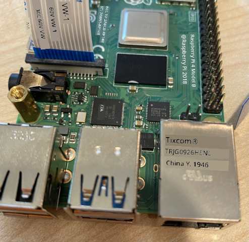
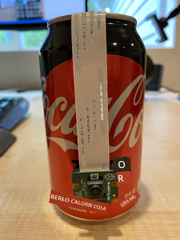

<!--
CO_OP_TRANSLATOR_METADATA:
{
  "original_hash": "c677667095f6133eee418c7e53615d05",
  "translation_date": "2025-11-18T18:50:51+00:00",
  "source_file": "4-manufacturing/lessons/2-check-fruit-from-device/pi-camera.md",
  "language_code": "pcm"
}
-->
# Capture image - Raspberry Pi

For dis part of di lesson, you go add camera sensor to your Raspberry Pi, and read image from am.

## Hardware

Raspberry Pi need camera.

Di camera wey you go use na [Raspberry Pi Camera Module](https://www.raspberrypi.org/products/camera-module-v2/). Dis camera na for Raspberry Pi and e dey connect through special connector for di Pi.

> 💁 Dis camera dey use [Camera Serial Interface, na protocol wey di Mobile Industry Processor Interface Alliance create](https://wikipedia.org/wiki/Camera_Serial_Interface), dem dey call am MIPI-CSI. Na special protocol for sending image.

## Connect di camera

You fit connect di camera to di Raspberry Pi with ribbon cable.

### Task - connect di camera



1. Off di Pi.

1. Connect di ribbon cable wey come with di camera to di camera. To do dis one, gently pull di black plastic clip for di holder so e go comot small, then slide di cable enter di socket, make di blue side face away from di lens, di metal pin strips go face di lens. Once e don enter finish, push di black plastic clip back to di place.

    You fit see animation wey dey show how to open di clip and put di cable for di [Raspberry Pi Getting Started with the Camera module documentation](https://projects.raspberrypi.org/en/projects/getting-started-with-picamera/2).

    

1. Remove di Grove Base Hat from di Pi.

1. Pass di ribbon cable through di camera slot for di Grove Base Hat. Make sure say di blue side of di cable dey face di analog ports wey dem label **A0**, **A1** etc.

    

1. Put di ribbon cable for di camera port for di Pi. Again, pull di black plastic clip up, put di cable, then push di clip back. Di blue side of di cable suppose face di USB and ethernet ports.

    

1. Put back di Grove Base Hat.

## Program di camera

Raspberry Pi fit dey programmed to use di camera with di [PiCamera](https://pypi.org/project/picamera/) Python library.

### Task - enable legacy camera mode

Unfortunately, when dem release Raspberry Pi OS Bullseye, di camera software wey dey come with di OS change, so by default PiCamera no dey work again. Dem dey work on replacement wey dem dey call PiCamera2, but e never ready to use.

For now, you fit set your Pi to legacy camera mode so PiCamera go fit work. Di camera socket dey disabled by default, but once you turn on di legacy camera software, e go automatically enable di socket.

1. Power di Pi and wait make e boot.

1. Open VS Code, either directly for di Pi, or connect am through di Remote SSH extension.

1. Run dis commands for your terminal:

    ```sh
    sudo raspi-config nonint do_legacy 0
    sudo reboot
    ```

    Dis one go change di setting to enable di legacy camera software, then reboot di Pi so di setting go work.

1. Wait make di Pi reboot, then open VS Code again.

### Task - program di camera

Program di device.

1. From di terminal, create new folder for di `pi` user home directory wey dem call `fruit-quality-detector`. Create file for dis folder wey dem call `app.py`.

1. Open dis folder for VS Code.

1. To use di camera, you fit use di PiCamera Python library. Install di Pip package for dis one with dis command:

    ```sh
    pip3 install picamera
    ```

1. Add dis code to your `app.py` file:

    ```python
    import io
    import time
    from picamera import PiCamera
    ```

    Dis code dey import some libraries wey you need, including di `PiCamera` library.

1. Add dis code below dis one to initialize di camera:

    ```python
    camera = PiCamera()
    camera.resolution = (640, 480)
    camera.rotation = 0
    
    time.sleep(2)
    ```

    Dis code dey create PiCamera object, set di resolution to 640x480. Even though higher resolutions dey supported (up to 3280x2464), di image classifier dey work on smaller images (227x227) so e no necessary to capture and send bigger images.

    Di `camera.rotation = 0` line dey set di rotation of di image. Di ribbon cable dey enter di bottom of di camera, but if your camera rotate to make e point well to di item wey you wan classify, you fit change dis line to di number of degrees wey e rotate.

    

    For example, if you suspend di ribbon cable over something so e dey for di top of di camera, then set di rotation to be 180:

    ```python
    camera.rotation = 180
    ```

    Di camera dey take few seconds to start, na why `time.sleep(2)` dey.

1. Add dis code below dis one to capture di image as binary data:

    ```python
    image = io.BytesIO()
    camera.capture(image, 'jpeg')
    image.seek(0)
    ```

    Dis code dey create `BytesIO` object to store binary data. Di image dey read from di camera as JPEG file and e dey store for dis object. Dis object get position indicator to know where e dey for di data so more data fit dey write to di end if e need am, so di `image.seek(0)` line dey move dis position back to di start so all di data fit dey read later.

1. Below dis one, add dis code to save di image to file:

    ```python
    with open('image.jpg', 'wb') as image_file:
        image_file.write(image.read())
    ```

    Dis code dey open file wey dem call `image.jpg` for writing, then e dey read all di data from di `BytesIO` object and e dey write am to di file.

    > 💁 You fit capture di image directly to file instead of `BytesIO` object by passing di file name to di `camera.capture` call. Di reason wey we dey use `BytesIO` object na so later for dis lesson you fit send di image to your image classifier.

1. Point di camera to something and run dis code.

1. Di image go dey captured and e go save as `image.jpg` for di current folder. You go see dis file for di VS Code explorer. Select di file to see di image. If e need rotation, update di `camera.rotation = 0` line as e need and take another picture.

> 💁 You fit find dis code for di [code-camera/pi](../../../../../4-manufacturing/lessons/2-check-fruit-from-device/code-camera/pi) folder.

😀 Your camera program don work!

---

<!-- CO-OP TRANSLATOR DISCLAIMER START -->
**Disclaimer**:  
Dis dokyument don use AI transleshion service [Co-op Translator](https://github.com/Azure/co-op-translator) do di transleshion. Even as we dey try make am accurate, abeg make you sabi say automatik transleshion fit get mistake or no dey correct well. Di original dokyument wey dey for im native language na di one wey you go take as di correct source. For important informashon, e good make you use professional human transleshion. We no go fit take blame for any misunderstanding or wrong meaning wey fit happen because you use dis transleshion.
<!-- CO-OP TRANSLATOR DISCLAIMER END -->