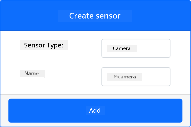
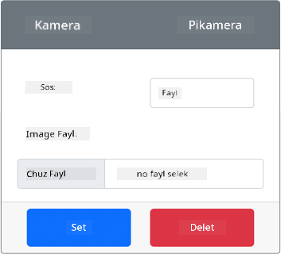

<!--
CO_OP_TRANSLATOR_METADATA:
{
  "original_hash": "3ba7150ffc4a6999f6c3cfb4906ec7df",
  "translation_date": "2025-11-18T18:51:35+00:00",
  "source_file": "4-manufacturing/lessons/2-check-fruit-from-device/virtual-device-camera.md",
  "language_code": "pcm"
}
-->
# Capture image - Virtual IoT Hardware

For dis part of di lesson, you go add camera sensor to your virtual IoT device, and you go dey read images from am.

## Hardware

Di virtual IoT device go use one simulated camera wey dey send images either from files or from your webcam.

### Add di camera to CounterFit

To use virtual camera, you need to add am to di CounterFit app.

#### Task - Add di camera to CounterFit

Add di Camera to di CounterFit app.

1. Create new Python app for your computer inside one folder wey dem call `fruit-quality-detector` wey get one file wey dem call `app.py` and one Python virtual environment, then add di CounterFit pip packages.

    > ⚠️ You fit check [di instructions for how to create and setup CounterFit Python project for lesson 1 if you need am](../../../1-getting-started/lessons/1-introduction-to-iot/virtual-device.md).

1. Install one extra Pip package to install CounterFit shim wey fit talk to Camera sensors by simulating some of di [Picamera Pip package](https://pypi.org/project/picamera/). Make sure say you dey install am from terminal wey get di virtual environment activated.

    ```sh
    pip install counterfit-shims-picamera
    ```

1. Make sure say di CounterFit web app dey run.

1. Create camera:

    1. For di *Create sensor* box for di *Sensors* pane, drop down di *Sensor type* box and select *Camera*.

    1. Set di *Name* to `Picamera`.

    1. Select di **Add** button to create di camera.

    

    Di camera go dey created and e go show for di sensors list.

    

## Program di camera

Di virtual IoT device fit now dey programmed to use di virtual camera.

### Task - Program di camera

Program di device.

1. Make sure say di `fruit-quality-detector` app dey open for VS Code.

1. Open di `app.py` file.

1. Add di code wey dey below to di top of `app.py` to connect di app to CounterFit:

    ```python
    from counterfit_connection import CounterFitConnection
    CounterFitConnection.init('127.0.0.1', 5000)
    ```

1. Add di code wey dey below to your `app.py` file:

    ```python
    import io
    from counterfit_shims_picamera import PiCamera
    ```

    Dis code dey import some libraries wey you need, including di `PiCamera` class from di counterfit_shims_picamera library.

1. Add di code wey dey below dis one to initialize di camera:

    ```python
    camera = PiCamera()
    camera.resolution = (640, 480)
    camera.rotation = 0
    ```

    Dis code dey create one PiCamera object, set di resolution to 640x480. Even though higher resolutions dey supported, di image classifier dey work on smaller images (227x227), so e no necessary to capture and send bigger images.

    Di `camera.rotation = 0` line dey set di rotation of di image in degrees. If you need to rotate di image from di webcam or di file, set am as e dey appropriate. For example, if you wan change di image of banana for webcam wey dey landscape mode to portrait, set `camera.rotation = 90`.

1. Add di code wey dey below dis one to capture di image as binary data:

    ```python
    image = io.BytesIO()
    camera.capture(image, 'jpeg')
    image.seek(0)
    ```

    Dis code dey create one `BytesIO` object to store binary data. Di image dey read from di camera as JPEG file and e dey stored for dis object. Dis object get one position indicator to know where e dey for di data so dat more data fit dey written to di end if e dey needed, so di `image.seek(0)` line dey move dis position go back to di start so dat all di data fit dey read later.

1. Below dis one, add di code wey dey below to save di image to file:

    ```python
    with open('image.jpg', 'wb') as image_file:
        image_file.write(image.read())
    ```

    Dis code dey open one file wey dem call `image.jpg` for writing, then e dey read all di data from di `BytesIO` object and e dey write am to di file.

    > 💁 You fit capture di image directly to file instead of `BytesIO` object by passing di file name to di `camera.capture` call. Di reason why we dey use di `BytesIO` object na so dat later for dis lesson you fit send di image to your image classifier.

1. Configure di image wey di camera for CounterFit go capture. You fit either set di *Source* to *File*, then upload one image file, or set di *Source* to *WebCam*, and images go dey captured from your webcam. Make sure say you select di **Set** button after you select picture or select your webcam.

    

1. One image go dey captured and e go dey saved as `image.jpg` for di current folder. You go see dis file for di VS Code explorer. Select di file to view di image. If e need rotation, update di `camera.rotation = 0` line as e dey necessary and take another picture.

> 💁 You fit find dis code for di [code-camera/virtual-iot-device](../../../../../4-manufacturing/lessons/2-check-fruit-from-device/code-camera/virtual-iot-device) folder.

😀 Your camera program don work well!

---

<!-- CO-OP TRANSLATOR DISCLAIMER START -->
**Disclaimer**:  
Dis dokyument don use AI translation service [Co-op Translator](https://github.com/Azure/co-op-translator) do di translation. Even as we dey try make am accurate, abeg sabi say machine translation fit get mistake or no dey correct well. Di original dokyument for im native language na di main source wey you go fit trust. For important information, e good make professional human translator check am. We no go fit take blame for any misunderstanding or wrong interpretation wey fit happen because you use dis translation.
<!-- CO-OP TRANSLATOR DISCLAIMER END -->