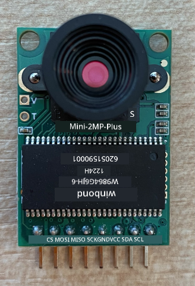
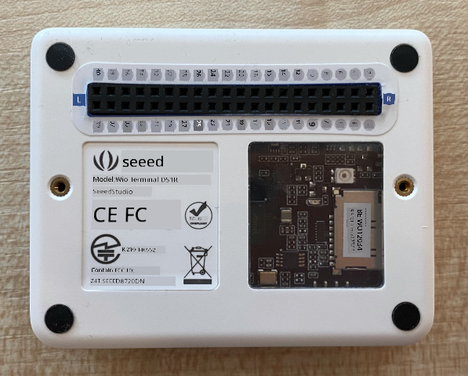
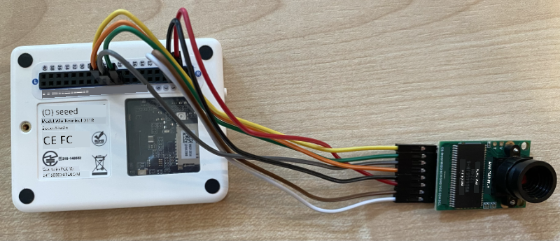

<!--
CO_OP_TRANSLATOR_METADATA:
{
  "original_hash": "160be8c0f558687f6686dca64f10f739",
  "translation_date": "2025-11-18T18:52:46+00:00",
  "source_file": "4-manufacturing/lessons/2-check-fruit-from-device/wio-terminal-camera.md",
  "language_code": "pcm"
}
-->
# Capture image - Wio Terminal

For dis part of di lesson, you go add camera to your Wio Terminal, and take picture from am.

## Hardware

Di Wio Terminal need camera.

Di camera wey you go use na [ArduCam Mini 2MP Plus](https://www.arducam.com/product/arducam-2mp-spi-camera-b0067-arduino/). E be 2 megapixel camera wey dey use OV2640 image sensor. E dey use SPI interface to take picture, and I<sup>2</sup>C to set di sensor.

## Connect di camera

Di ArduCam no get Grove socket, e dey connect to SPI and I<sup>2</sup>C buses through GPIO pins for di Wio Terminal.

### Task - connect di camera

Connect di camera.



1. Di pins wey dey di bottom of di ArduCam suppose connect to di GPIO pins for di Wio Terminal. To make am easy to find di correct pins, put di GPIO pin sticker wey come with di Wio Terminal around di pins:

    

1. Use jumper wires, make di following connections:

    | ArduCAM pin | Wio Terminal pin | Description                             |
    | ----------- | ---------------- | --------------------------------------- |
    | CS          | 24 (SPI_CS)      | SPI Chip Select                         |
    | MOSI        | 19 (SPI_MOSI)    | SPI Controller Output, Peripheral Input |
    | MISO        | 21 (SPI_MISO)    | SPI Controller Input, peripheral Output |
    | SCK         | 23 (SPI_SCLK)    | SPI Serial Clock                        |
    | GND         | 6 (GND)          | Ground - 0V                             |
    | VCC         | 4 (5V)           | 5V power supply                         |
    | SDA         | 3 (I2C1_SDA)     | I<sup>2</sup>C Serial Data              |
    | SCL         | 5 (I2C1_SCL)     | I<sup>2</sup>C Serial Clock             |

    

    Di GND and VCC connections dey provide 5V power supply to di ArduCam. E dey run for 5V, unlike Grove sensors wey dey run for 3V. Dis power dey come directly from di USB-C connection wey dey power di device.

    > 💁 For di SPI connection, di pin labels for di ArduCam and di Wio Terminal pin names wey dey use for code still dey use di old naming style. Di instructions for dis lesson go use di new naming style, except when di pin names dey use for code.

1. You fit now connect di Wio Terminal to your computer.

## Program di device to connect to di camera

Di Wio Terminal fit now dey programmed to use di ArduCAM camera wey you attach.

### Task - program di device to connect to di camera

1. Create new Wio Terminal project using PlatformIO. Call di project `fruit-quality-detector`. Add code for di `setup` function to configure di serial port.

1. Add code to connect to WiFi, with your WiFi credentials for file wey dem call `config.h`. No forget to add di libraries wey you need for di `platformio.ini` file.

1. Di ArduCam library no dey available as Arduino library wey fit install from di `platformio.ini` file. Instead, you go need install am from source from their GitHub page. You fit get am by either:

    * Cloning di repo from [https://github.com/ArduCAM/Arduino.git](https://github.com/ArduCAM/Arduino.git)
    * Go di repo for GitHub for [github.com/ArduCAM/Arduino](https://github.com/ArduCAM/Arduino) and download di code as zip from di **Code** button

1. You only need di `ArduCAM` folder from dis code. Copy di whole folder enter di `lib` folder for your project.

    > ⚠️ Di whole folder suppose dey copied, so di code go dey for `lib/ArduCam`. No just copy di contents of di `ArduCam` folder enter di `lib` folder, copy di whole folder.

1. Di ArduCam library code dey work for plenty types of camera. Di type of camera wey you wan use dey configured using compiler flags - dis dey make di built library small as e fit by removing code for cameras wey you no dey use. To configure di library for di OV2640 camera, add di following to di end of di `platformio.ini` file:

    ```ini
    build_flags =
        -DARDUCAM_SHIELD_V2
        -DOV2640_CAM
    ```

    Dis dey set 2 compiler flags:

      * `ARDUCAM_SHIELD_V2` to tell di library say di camera dey for Arduino board, wey dem dey call shield.
      * `OV2640_CAM` to tell di library to only include code for di OV2640 camera.

1. Add header file enter di `src` folder wey dem call `camera.h`. Dis go contain code to communicate with di camera. Add di following code to dis file:

    ```cpp
    #pragma once
    
    #include <ArduCAM.h>
    #include <Wire.h>
    
    class Camera
    {
    public:
        Camera(int format, int image_size) : _arducam(OV2640, PIN_SPI_SS)
        {
            _format = format;
            _image_size = image_size;
        }
    
        bool init()
        {
            // Reset the CPLD
            _arducam.write_reg(0x07, 0x80);
            delay(100);
    
            _arducam.write_reg(0x07, 0x00);
            delay(100);
    
            // Check if the ArduCAM SPI bus is OK
            _arducam.write_reg(ARDUCHIP_TEST1, 0x55);
            if (_arducam.read_reg(ARDUCHIP_TEST1) != 0x55)
            {
                return false;
            }
                
            // Change MCU mode
            _arducam.set_mode(MCU2LCD_MODE);
    
            uint8_t vid, pid;
    
            // Check if the camera module type is OV2640
            _arducam.wrSensorReg8_8(0xff, 0x01);
            _arducam.rdSensorReg8_8(OV2640_CHIPID_HIGH, &vid);
            _arducam.rdSensorReg8_8(OV2640_CHIPID_LOW, &pid);
            if ((vid != 0x26) && ((pid != 0x41) || (pid != 0x42)))
            {
                return false;
            }
            
            _arducam.set_format(_format);
            _arducam.InitCAM();
            _arducam.OV2640_set_JPEG_size(_image_size);
            _arducam.OV2640_set_Light_Mode(Auto);
            _arducam.OV2640_set_Special_effects(Normal);
            delay(1000);
    
            return true;
        }
    
        void startCapture()
        {
            _arducam.flush_fifo();
            _arducam.clear_fifo_flag();
            _arducam.start_capture();
        }
    
        bool captureReady()
        {
            return _arducam.get_bit(ARDUCHIP_TRIG, CAP_DONE_MASK);
        }
    
        bool readImageToBuffer(byte **buffer, uint32_t &buffer_length)
        {
            if (!captureReady()) return false;
    
            // Get the image file length
            uint32_t length = _arducam.read_fifo_length();
            buffer_length = length;
    
            if (length >= MAX_FIFO_SIZE)
            {
                return false;
            }
            if (length == 0)
            {
                return false;
            }
    
            // create the buffer
            byte *buf = new byte[length];
    
            uint8_t temp = 0, temp_last = 0;
            int i = 0;
            uint32_t buffer_pos = 0;
            bool is_header = false;
    
            _arducam.CS_LOW();
            _arducam.set_fifo_burst();
            
            while (length--)
            {
                temp_last = temp;
                temp = SPI.transfer(0x00);
                //Read JPEG data from FIFO
                if ((temp == 0xD9) && (temp_last == 0xFF)) //If find the end ,break while,
                {
                    buf[buffer_pos] = temp;
    
                    buffer_pos++;
                    i++;
                    
                    _arducam.CS_HIGH();
                }
                if (is_header == true)
                {
                    //Write image data to buffer if not full
                    if (i < 256)
                    {
                        buf[buffer_pos] = temp;
                        buffer_pos++;
                        i++;
                    }
                    else
                    {
                        _arducam.CS_HIGH();
    
                        i = 0;
                        buf[buffer_pos] = temp;
    
                        buffer_pos++;
                        i++;
    
                        _arducam.CS_LOW();
                        _arducam.set_fifo_burst();
                    }
                }
                else if ((temp == 0xD8) & (temp_last == 0xFF))
                {
                    is_header = true;
    
                    buf[buffer_pos] = temp_last;
                    buffer_pos++;
                    i++;
    
                    buf[buffer_pos] = temp;
                    buffer_pos++;
                    i++;
                }
            }
            
            _arducam.clear_fifo_flag();
    
            _arducam.set_format(_format);
            _arducam.InitCAM();
            _arducam.OV2640_set_JPEG_size(_image_size);
    
            // return the buffer
            *buffer = buf;
        }
    
    private:
        ArduCAM _arducam;
        int _format;
        int _image_size;
    };
    ```

    Dis na low level code wey dey configure di camera using di ArduCam libraries, and dey extract di images when e need am using di SPI bus. Dis code dey very specific to di ArduCam, so you no need worry about how e dey work for now.

1. For `main.cpp`, add di following code under di other `include` statements to include dis new file and create instance of di camera class:

    ```cpp
    #include "camera.h"

    Camera camera = Camera(JPEG, OV2640_640x480);
    ```

    Dis dey create `Camera` wey dey save di images as JPEGs for resolution of 640 by 480. Even though higher resolutions dey supported (up to 3280x2464), di image classifier dey work for smaller images (227x227) so e no dey necessary to capture and send bigger images.

1. Add di following code under dis to define function to setup di camera:

    ```cpp
    void setupCamera()
    {
        pinMode(PIN_SPI_SS, OUTPUT);
        digitalWrite(PIN_SPI_SS, HIGH);
    
        Wire.begin();
        SPI.begin();
    
        if (!camera.init())
        {
            Serial.println("Error setting up the camera!");
        }
    }
    ```

    Dis `setupCamera` function dey start by configuring di SPI chip select pin (`PIN_SPI_SS`) as high, making di Wio Terminal di SPI controller. E then dey start di I<sup>2</sup>C and SPI buses. Finally, e dey initialize di camera class wey dey configure di camera sensor settings and make sure say everything dey wired correctly.

1. Call dis function for di end of di `setup` function:

    ```cpp
    setupCamera();
    ```

1. Build and upload dis code, and check di output from di serial monitor. If you see `Error setting up the camera!` then check di wiring to make sure say all cables dey connect di correct pins for di ArduCam to di correct GPIO pins for di Wio Terminal, and all jumper cables dey seated well.

## Capture image

Di Wio Terminal fit now dey programmed to capture image when you press button.

### Task - capture image

1. Microcontrollers dey run your code continuously, so e no dey easy to trigger something like taking photo without reacting to sensor. Di Wio Terminal get buttons, so di camera fit dey setup to dey triggered by one of di buttons. Add di following code to di end of di `setup` function to configure di C button (one of di three buttons for di top, di one wey dey close to di power switch).

    

    ```cpp
    pinMode(WIO_KEY_C, INPUT_PULLUP);
    ```

    Di mode of `INPUT_PULLUP` dey invert input. For example, normally button go send low signal when e no press, and high signal when e press. When e set to `INPUT_PULLUP`, e go send high signal when e no press, and low signal when e press.

1. Add empty function to respond to di button press before di `loop` function:

    ```cpp
    void buttonPressed()
    {
        
    }
    ```

1. Call dis function for di `loop` method when di button dey pressed:

    ```cpp
    void loop()
    {
        if (digitalRead(WIO_KEY_C) == LOW)
        {
            buttonPressed();
            delay(2000);
        }
    
        delay(200);
    }
    ```

    Dis key dey check if di button dey pressed. If e dey pressed, di `buttonPressed` function go dey called, and di loop go delay for 2 seconds. Dis na to give time for di button to release so say long press no go register twice.

    > 💁 Di button for di Wio Terminal dey set to `INPUT_PULLUP`, so e dey send high signal when e no press, and low signal when e press.

1. Add di following code to di `buttonPressed` function:

    ```cpp
    camera.startCapture();
 
    while (!camera.captureReady())
        delay(100);

    Serial.println("Image captured");

    byte *buffer;
    uint32_t length;

    if (camera.readImageToBuffer(&buffer, length))
    {
        Serial.print("Image read to buffer with length ");
        Serial.println(length);

        delete(buffer);
    }
    ```

    Dis code dey start di camera capture by calling `startCapture`. Di camera hardware no dey work by returning di data when you request am, instead you dey send instruction to start capturing, and di camera go dey work for background to capture di image, convert am to JPEG, and store am for local buffer for di camera itself. Di `captureReady` call dey check if di image capture don finish.

    Once di capture don finish, di image data dey copy from di buffer for di camera enter local buffer (array of bytes) with di `readImageToBuffer` call. Di length of di buffer go then dey sent to di serial monitor.

1. Build and upload dis code, and check di output for di serial monitor. Every time you press di C button, image go dey captured and you go see di image size wey dem send to di serial monitor.

    ```output
    Connecting to WiFi..
    Connected!
    Image captured
    Image read to buffer with length 9224
    Image captured
    Image read to buffer with length 11272
    ```

    Different images go get different sizes. Dem dey compress as JPEGs and di size of JPEG file for given resolution dey depend on wetin dey di image.

> 💁 You fit find dis code for di [code-camera/wio-terminal](../../../../../4-manufacturing/lessons/2-check-fruit-from-device/code-camera/wio-terminal) folder.

😀 You don successfully capture images with your Wio Terminal.

## Optional - verify di camera images using SD card

Di easiest way to see di images wey di camera capture na to write dem to SD card for di Wio Terminal and then view dem for your computer. Do dis step if you get spare microSD card and microSD card socket for your computer, or adapter.

Di Wio Terminal only dey support microSD cards wey no pass 16GB size. If you get bigger SD card, e no go work.

### Task - verify di camera images using SD card

1. Format microSD card as FAT32 or exFAT using di relevant applications for your computer (Disk Utility for macOS, File Explorer for Windows, or using command line tools for Linux).

1. Insert di microSD card for di socket wey dey just below di power switch. Make sure say e enter well until e click and stay for place, you fit need push am using fingernail or thin tool.

1. Add di following include statements for di top of di `main.cpp` file:

    ```cpp
    #include "SD/Seeed_SD.h"
    #include <Seeed_FS.h>
    ```

1. Add di following function before di `setup` function:

    ```cpp
    void setupSDCard()
    {
        while (!SD.begin(SDCARD_SS_PIN, SDCARD_SPI))
        {
            Serial.println("SD Card Error");
        }
    }
    ```

    Dis dey configure di SD card using di SPI bus.

1. Call dis from di `setup` function:

    ```cpp
    setupSDCard();
    ```

1. Add di following code above di `buttonPressed` function:

    ```cpp
    int fileNum = 1;

    void saveToSDCard(byte *buffer, uint32_t length)
    {
        char buff[16];
        sprintf(buff, "%d.jpg", fileNum);
        fileNum++;
    
        File outFile = SD.open(buff, FILE_WRITE );
        outFile.write(buffer, length);
        outFile.close();

        Serial.print("Image written to file ");
        Serial.println(buff);
    }
    ```

    Dis dey define global variable for file count. Dis dey used for di image file names so say multiple images fit dey captured with incrementing file names - `1.jpg`, `2.jpg` and so on.

    E then dey define di `saveToSDCard` wey dey take buffer of byte data, and di length of di buffer. File name go dey created using di file count, and di file count go dey increment ready for di next file. Di binary data from di buffer go then dey written to di file.

1. Call di `saveToSDCard` function from di `buttonPressed` function. Di call suppose dey **before** di buffer dey deleted:

    ```cpp
    Serial.print("Image read to buffer with length ");
    Serial.println(length);

    saveToSDCard(buffer, length);
    
    delete(buffer);
    ```

1. Build and upload dis code, and check di output for di serial monitor. Every time you press di C button, image go dey captured and saved to di SD card.

    ```output
    Connecting to WiFi..
    Connected!
    Image captured
    Image read to buffer with length 16392
    Image written to file 1.jpg
    Image captured
    Image read to buffer with length 14344
    Image written to file 2.jpg
    ```

1. Power off di microSD card and eject am by pushing am small and releasing, e go pop out. You fit need use thin tool to do dis. Plug di microSD card enter your computer to view di images.

    

    > 💁 E fit take few images for di white balance of di camera to adjust itself. You go notice dis based on di color of di images wey dem capture, di first few fit look off color. You fit always work around dis by changing di code to capture few images wey dem go ignore for di `setup` function.

---

<!-- CO-OP TRANSLATOR DISCLAIMER START -->
**Disclaimer**:  
Dis dokyument don use AI transleshion service [Co-op Translator](https://github.com/Azure/co-op-translator) do di transleshion. Even as we dey try make am accurate, abeg make you sabi say automatik transleshion fit get mistake or no dey correct well. Di original dokyument wey dey for im native language na di one wey you go take as di main source. For important informashon, e good make you use professional human transleshion. We no go fit take blame for any misunderstanding or wrong interpretation wey fit happen because you use dis transleshion.
<!-- CO-OP TRANSLATOR DISCLAIMER END -->