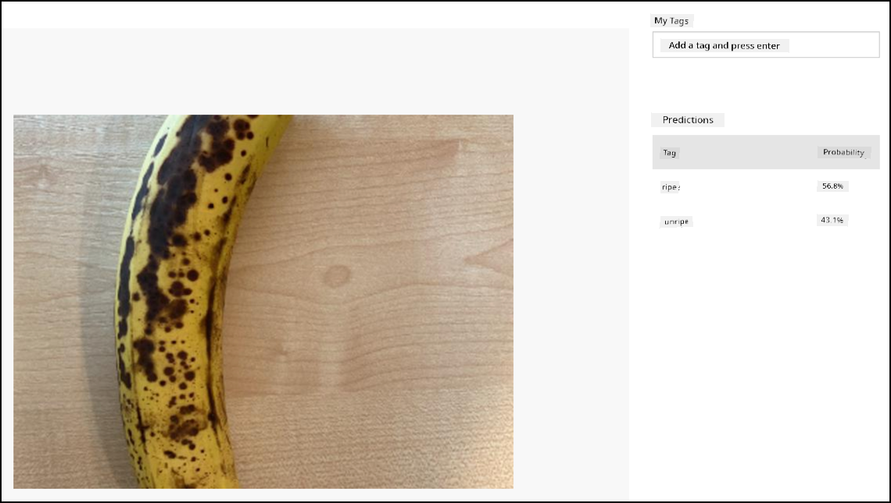

<!--
CO_OP_TRANSLATOR_METADATA:
{
  "original_hash": "32a1f23e7834fbe7715da8c4ebb450b9",
  "translation_date": "2025-11-18T18:55:10+00:00",
  "source_file": "4-manufacturing/lessons/2-check-fruit-from-device/wio-terminal-classify-image.md",
  "language_code": "pcm"
}
-->
# Classify Image - Wio Terminal

For dis part of di lesson, you go send di image wey di camera capture go di Custom Vision service to classify am.

## Classify Image

Di Custom Vision service get REST API wey you fit call from Wio Terminal to classify images. Dis REST API dey work through HTTPS connection - na secure HTTP connection.

When you dey interact with HTTPS endpoints, di client code go need request di public key certificate from di server wey e dey access, and use am encrypt di traffic wey e dey send. Your web browser dey do dis one automatically, but microcontrollers no dey do am. You go need request dis certificate manually and use am create secure connection to di REST API. Dis certificates no dey change, so once you don get di certificate, you fit hard code am for your application.

Dis certificates get public keys, and no need to dey hide dem. You fit use dem for your source code and share dem publicly for places like GitHub.

### Task - Set up SSL client

1. Open di `fruit-quality-detector` app project if e never dey open.

1. Open di `config.h` header file, and add dis one:

    ```cpp
    const char *CERTIFICATE =
        "-----BEGIN CERTIFICATE-----\r\n"
        "MIIF8zCCBNugAwIBAgIQAueRcfuAIek/4tmDg0xQwDANBgkqhkiG9w0BAQwFADBh\r\n"
        "MQswCQYDVQQGEwJVUzEVMBMGA1UEChMMRGlnaUNlcnQgSW5jMRkwFwYDVQQLExB3\r\n"
        "d3cuZGlnaWNlcnQuY29tMSAwHgYDVQQDExdEaWdpQ2VydCBHbG9iYWwgUm9vdCBH\r\n"
        "MjAeFw0yMDA3MjkxMjMwMDBaFw0yNDA2MjcyMzU5NTlaMFkxCzAJBgNVBAYTAlVT\r\n"
        "MR4wHAYDVQQKExVNaWNyb3NvZnQgQ29ycG9yYXRpb24xKjAoBgNVBAMTIU1pY3Jv\r\n"
        "c29mdCBBenVyZSBUTFMgSXNzdWluZyBDQSAwNjCCAiIwDQYJKoZIhvcNAQEBBQAD\r\n"
        "ggIPADCCAgoCggIBALVGARl56bx3KBUSGuPc4H5uoNFkFH4e7pvTCxRi4j/+z+Xb\r\n"
        "wjEz+5CipDOqjx9/jWjskL5dk7PaQkzItidsAAnDCW1leZBOIi68Lff1bjTeZgMY\r\n"
        "iwdRd3Y39b/lcGpiuP2d23W95YHkMMT8IlWosYIX0f4kYb62rphyfnAjYb/4Od99\r\n"
        "ThnhlAxGtfvSbXcBVIKCYfZgqRvV+5lReUnd1aNjRYVzPOoifgSx2fRyy1+pO1Uz\r\n"
        "aMMNnIOE71bVYW0A1hr19w7kOb0KkJXoALTDDj1ukUEDqQuBfBxReL5mXiu1O7WG\r\n"
        "0vltg0VZ/SZzctBsdBlx1BkmWYBW261KZgBivrql5ELTKKd8qgtHcLQA5fl6JB0Q\r\n"
        "gs5XDaWehN86Gps5JW8ArjGtjcWAIP+X8CQaWfaCnuRm6Bk/03PQWhgdi84qwA0s\r\n"
        "sRfFJwHUPTNSnE8EiGVk2frt0u8PG1pwSQsFuNJfcYIHEv1vOzP7uEOuDydsmCjh\r\n"
        "lxuoK2n5/2aVR3BMTu+p4+gl8alXoBycyLmj3J/PUgqD8SL5fTCUegGsdia/Sa60\r\n"
        "N2oV7vQ17wjMN+LXa2rjj/b4ZlZgXVojDmAjDwIRdDUujQu0RVsJqFLMzSIHpp2C\r\n"
        "Zp7mIoLrySay2YYBu7SiNwL95X6He2kS8eefBBHjzwW/9FxGqry57i71c2cDAgMB\r\n"
        "AAGjggGtMIIBqTAdBgNVHQ4EFgQU1cFnOsKjnfR3UltZEjgp5lVou6UwHwYDVR0j\r\n"
        "BBgwFoAUTiJUIBiV5uNu5g/6+rkS7QYXjzkwDgYDVR0PAQH/BAQDAgGGMB0GA1Ud\r\n"
        "JQQWMBQGCCsGAQUFBwMBBggrBgEFBQcDAjASBgNVHRMBAf8ECDAGAQH/AgEAMHYG\r\n"
        "CCsGAQUFBwEBBGowaDAkBggrBgEFBQcwAYYYaHR0cDovL29jc3AuZGlnaWNlcnQu\r\n"
        "Y29tMEAGCCsGAQUFBzAChjRodHRwOi8vY2FjZXJ0cy5kaWdpY2VydC5jb20vRGln\r\n"
        "aUNlcnRHbG9iYWxSb290RzIuY3J0MHsGA1UdHwR0MHIwN6A1oDOGMWh0dHA6Ly9j\r\n"
        "cmwzLmRpZ2ljZXJ0LmNvbS9EaWdpQ2VydEdsb2JhbFJvb3RHMi5jcmwwN6A1oDOG\r\n"
        "MWh0dHA6Ly9jcmw0LmRpZ2ljZXJ0LmNvbS9EaWdpQ2VydEdsb2JhbFJvb3RHMi5j\r\n"
        "cmwwHQYDVR0gBBYwFDAIBgZngQwBAgEwCAYGZ4EMAQICMBAGCSsGAQQBgjcVAQQD\r\n"
        "AgEAMA0GCSqGSIb3DQEBDAUAA4IBAQB2oWc93fB8esci/8esixj++N22meiGDjgF\r\n"
        "+rA2LUK5IOQOgcUSTGKSqF9lYfAxPjrqPjDCUPHCURv+26ad5P/BYtXtbmtxJWu+\r\n"
        "cS5BhMDPPeG3oPZwXRHBJFAkY4O4AF7RIAAUW6EzDflUoDHKv83zOiPfYGcpHc9s\r\n"
        "kxAInCedk7QSgXvMARjjOqdakor21DTmNIUotxo8kHv5hwRlGhBJwps6fEVi1Bt0\r\n"
        "trpM/3wYxlr473WSPUFZPgP1j519kLpWOJ8z09wxay+Br29irPcBYv0GMXlHqThy\r\n"
        "8y4m/HyTQeI2IMvMrQnwqPpY+rLIXyviI2vLoI+4xKE4Rn38ZZ8m\r\n"
        "-----END CERTIFICATE-----\r\n";
    ```

    Dis na *Microsoft Azure DigiCert Global Root G2 certificate* - e be one of di certificates wey many Azure services dey use globally.

    > 💁 To confirm say na dis certificate you go use, run dis command for macOS or Linux. If you dey use Windows, you fit run dis command with [Windows Subsystem for Linux (WSL)](https://docs.microsoft.com/windows/wsl/?WT.mc_id=academic-17441-jabenn):
    >
    > ```sh
    > openssl s_client -showcerts -verify 5 -connect api.cognitive.microsoft.com:443
    > ```
    >
    > Di output go show di DigiCert Global Root G2 certificate.

1. Open `main.cpp` and add dis include directive:

    ```cpp
    #include <WiFiClientSecure.h>
    ```

1. Under di include directives, declare one instance of `WifiClientSecure`:

    ```cpp
    WiFiClientSecure client;
    ```

    Dis class get code wey dey help communicate with web endpoints through HTTPS.

1. For di `connectWiFi` method, set di WiFiClientSecure to use di DigiCert Global Root G2 certificate:

    ```cpp
    client.setCACert(CERTIFICATE);
    ```

### Task - Classify Image

1. Add dis one as extra line for di `lib_deps` list for di `platformio.ini` file:

    ```ini
    bblanchon/ArduinoJson @ 6.17.3
    ```

    Dis one go import [ArduinoJson](https://arduinojson.org), one Arduino JSON library, wey go help decode di JSON response from di REST API.

1. For `config.h`, add constants for di prediction URL and Key from di Custom Vision service:

    ```cpp
    const char *PREDICTION_URL = "<PREDICTION_URL>";
    const char *PREDICTION_KEY = "<PREDICTION_KEY>";
    ```

    Replace `<PREDICTION_URL>` with di prediction URL from Custom Vision. Replace `<PREDICTION_KEY>` with di prediction key.

1. For `main.cpp`, add include directive for di ArduinoJson library:

    ```cpp
    #include <ArduinoJSON.h>
    ```

1. Add dis function to `main.cpp`, above di `buttonPressed` function.

    ```cpp
    void classifyImage(byte *buffer, uint32_t length)
    {
        HTTPClient httpClient;
        httpClient.begin(client, PREDICTION_URL);
        httpClient.addHeader("Content-Type", "application/octet-stream");
        httpClient.addHeader("Prediction-Key", PREDICTION_KEY);
    
        int httpResponseCode = httpClient.POST(buffer, length);
    
        if (httpResponseCode == 200)
        {
            String result = httpClient.getString();
    
            DynamicJsonDocument doc(1024);
            deserializeJson(doc, result.c_str());
    
            JsonObject obj = doc.as<JsonObject>();
            JsonArray predictions = obj["predictions"].as<JsonArray>();
    
            for(JsonVariant prediction : predictions) 
            {
                String tag = prediction["tagName"].as<String>();
                float probability = prediction["probability"].as<float>();
    
                char buff[32];
                sprintf(buff, "%s:\t%.2f%%", tag.c_str(), probability * 100.0);
                Serial.println(buff);
            }
        }
    
        httpClient.end();
    }
    ```

    Dis code go first declare one `HTTPClient` - one class wey get methods to interact with REST APIs. E go then connect di client to di prediction URL using di `WiFiClientSecure` instance wey you don set up with di Azure public key.

    Once e don connect, e go send headers - information about di request wey e go make against di REST API. Di `Content-Type` header dey show say di API call go send raw binary data, di `Prediction-Key` header dey pass di Custom Vision prediction key.

    Next, e go make POST request to di HTTP client, upload one byte array. Dis one go contain di JPEG image wey di camera capture when dis function dey called.

    > 💁 POST request na for sending data and getting response. Other request types dey like GET requests wey dey retrieve data. GET requests na wetin your web browser dey use load web pages.

    Di POST request go return response status code. Dis codes get well-defined values, with 200 meaning **OK** - di POST request work well.

    > 💁 You fit see all di response status codes for [List of HTTP status codes page for Wikipedia](https://wikipedia.org/wiki/List_of_HTTP_status_codes)

    If 200 dey return, di result go dey read from di HTTP client. Dis na text response from di REST API with di prediction results as JSON document. Di JSON dey like dis:

    ```jSON
    {
        "id":"45d614d3-7d6f-47e9-8fa2-04f237366a16",
        "project":"135607e5-efac-4855-8afb-c93af3380531",
        "iteration":"04f1c1fa-11ec-4e59-bb23-4c7aca353665",
        "created":"2021-06-10T17:58:58.959Z",
        "predictions":[
            {
                "probability":0.5582016,
                "tagId":"05a432ea-9718-4098-b14f-5f0688149d64",
                "tagName":"ripe"
            },
            {
                "probability":0.44179836,
                "tagId":"bb091037-16e5-418e-a9ea-31c6a2920f17",
                "tagName":"unripe"
            }
        ]
    }
    ```

    Di important part na di `predictions` array. Dis one get di predictions, with one entry for each tag wey get di tag name and di probability. Di probabilities wey dey return na floating point numbers from 0-1, with 0 meaning 0% chance say e match di tag, and 1 meaning 100% chance.

    > 💁 Image classifiers dey return di percentages for all tags wey dem use. Each tag go get probability say di image match dat tag.

    Dis JSON go decode, and di probabilities for each tag go dey send to di serial monitor.

1. For di `buttonPressed` function, either replace di code wey dey save to di SD card with call to `classifyImage`, or add am after di image don write, but **before** di buffer dey delete:

    ```cpp
    classifyImage(buffer, length);
    ```

    > 💁 If you replace di code wey dey save to di SD card, you fit clean up your code remove di `setupSDCard` and `saveToSDCard` functions.

1. Upload and run your code. Point di camera to some fruit and press di C button. You go see di output for di serial monitor:

    ```output
    Connecting to WiFi..
    Connected!
    Image captured
    Image read to buffer with length 8200
    ripe:   56.84%
    unripe: 43.16%
    ```

    You go fit see di image wey dem take, and dis values for di **Predictions** tab for Custom Vision.

    

> 💁 You fit find dis code for [code-classify/wio-terminal](../../../../../4-manufacturing/lessons/2-check-fruit-from-device/code-classify/wio-terminal) folder.

😀 Your fruit quality classifier program don work well!

---

<!-- CO-OP TRANSLATOR DISCLAIMER START -->
**Disclaimer**:  
Dis dokyument don use AI transleshion service [Co-op Translator](https://github.com/Azure/co-op-translator) do di transleshion. Even as we dey try make am accurate, abeg make you sabi say machine transleshion fit get mistake or no dey correct well. Di original dokyument wey dey di native language na di main source wey you go fit trust. For important informashon, e good make you use professional human transleshion. We no go fit take blame for any misunderstanding or wrong interpretashon wey fit happen because you use dis transleshion.
<!-- CO-OP TRANSLATOR DISCLAIMER END -->