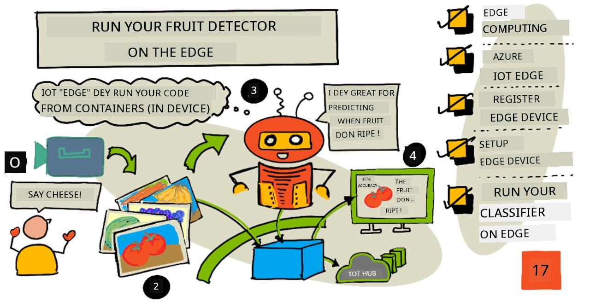
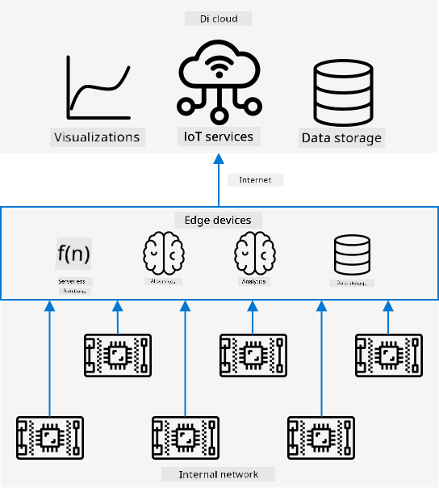
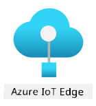
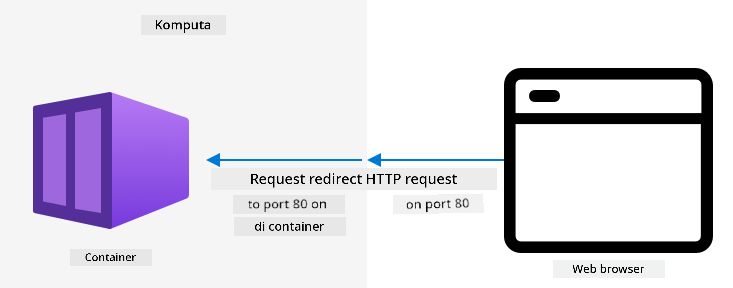
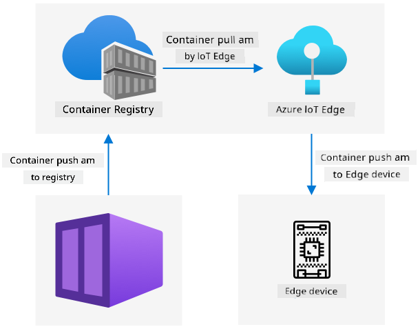
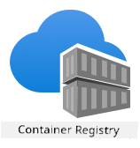

<!--
CO_OP_TRANSLATOR_METADATA:
{
  "original_hash": "2625af24587465c5547ae33d6cc000a5",
  "translation_date": "2025-11-18T18:47:14+00:00",
  "source_file": "4-manufacturing/lessons/3-run-fruit-detector-edge/README.md",
  "language_code": "pcm"
}
-->
# Run your fruit detector for edge



> Sketchnote by [Nitya Narasimhan](https://github.com/nitya). Click di image for bigger version.

Dis video dey show how image classifiers fit run for IoT devices, na wetin dis lesson dey talk about.

[](https://www.youtube.com/watch?v=_K5fqGLO8us)

## Pre-lecture quiz

[Pre-lecture quiz](https://black-meadow-040d15503.1.azurestaticapps.net/quiz/33)

## Introduction

For di last lesson, you use image classifier to sabi ripe and unripe fruit, you send di image wey camera for your IoT device capture go cloud service for internet. Dis kain calls dey take time, dey cost money, and e fit get privacy wahala depending on di kain image data wey you dey use.

For dis lesson, you go learn how to run machine learning (ML) models for edge - for IoT devices wey dey your own network instead of di cloud. You go sabi di benefits and di wahala wey dey edge computing compared to cloud computing, how to deploy your AI model for edge, and how to use am from your IoT device.

Dis lesson go cover:

* [Edge computing](../../../../../4-manufacturing/lessons/3-run-fruit-detector-edge)
* [Azure IoT Edge](../../../../../4-manufacturing/lessons/3-run-fruit-detector-edge)
* [Register IoT Edge device](../../../../../4-manufacturing/lessons/3-run-fruit-detector-edge)
* [Set up IoT Edge device](../../../../../4-manufacturing/lessons/3-run-fruit-detector-edge)
* [Export your model](../../../../../4-manufacturing/lessons/3-run-fruit-detector-edge)
* [Prepare container for deployment](../../../../../4-manufacturing/lessons/3-run-fruit-detector-edge)
* [Deploy container](../../../../../4-manufacturing/lessons/3-run-fruit-detector-edge)
* [Use IoT Edge device](../../../../../4-manufacturing/lessons/3-run-fruit-detector-edge)

## Edge computing

Edge computing mean say computers go dey process IoT data close to where di data dey come from. Instead of processing for di cloud, e go dey for di edge of di cloud - your internal network.


For di lessons wey don pass, your devices dey gather data and dey send am go cloud to analyze am, dey run serverless functions or AI models for di cloud.



Edge computing mean say some of di cloud services go move comot cloud go computers wey dey di same network as di IoT devices, dem go only talk to di cloud if e dey necessary. Example, you fit run AI models for edge devices to check fruit ripeness, and only send analytics go cloud, like di number of ripe fruit versus unripe.

✅ Think about di IoT apps wey you don build before. Which part of dem fit move go edge?

### Benefits

Di benefits of edge computing na:

1. **Speed** - edge computing dey good for data wey need quick action because e dey di same network as di device, instead of dey make calls go internet. E dey faster because internal networks dey run faster pass internet connections, and di data no dey travel far.

    > 💁 Even though optical cables dey make internet data travel fast like light, e still dey take time for data to waka go cloud providers. Example, if you dey send data from Europe go US cloud services, e go take at least 28ms for di data to cross Atlantic, and dat one no include di time to convert di signals and reach di cloud provider.

    Edge computing dey reduce network traffic, so e no go slow down because of congestion for di internet connection.

1. **Remote accessibility** - edge compute dey work even if connectivity dey limited or dey expensive. Example, for humanitarian disaster areas or developing countries.

1. **Lower costs** - if you dey collect, store, analyze data, and dey trigger actions for edge device, e go reduce di use of cloud services, wey fit make di IoT app cheaper. Nowadays, devices wey dey good for edge computing don dey plenty, like AI accelerator boards like [Jetson Nano from NVIDIA](https://developer.nvidia.com/embedded/jetson-nano-developer-kit), wey fit run AI workloads for less than $100.

1. **Privacy and security** - edge compute dey keep data for your network, e no dey upload go cloud. Dis one dey good for sensitive or personal data, and e dey reduce di risk of data leaks. Example na medical data or security camera footage.

1. **Handling insecure devices** - if you get devices wey get security wahala, you fit connect dem to separate network wey dey talk to gateway IoT Edge device. Di edge device fit connect to di wider network or internet and manage di data flow.

1. **Support for incompatible devices** - if you get devices wey no fit connect to IoT Hub, like devices wey dey use HTTP or Bluetooth only, you fit use IoT edge device as gateway to forward di messages.

✅ Do some research: Wetin be other benefits of edge computing?

### Wahala

Di wahala wey dey edge computing na where cloud fit better:

1. **Scale and flexibility** - cloud fit adjust to network and data needs anytime by adding or reducing servers. To add more edge computers, you go need to manually add devices.

1. **Reliability and resiliency** - cloud dey use multiple servers for different locations for backup and disaster recovery. To get di same level for edge, you go need plenty investment and work.

1. **Maintenance** - cloud service providers dey handle system maintenance and updates.

✅ Do some research: Wetin be other wahala of edge computing?

Di wahala na di opposite of di benefits of cloud - you go need to build and manage di devices yourself instead of dey depend on cloud providers.

Some risks dey reduce because of how edge computing dey work. Example, if edge device dey factory dey gather data from machines, you no need backup edge device if power go off, because di machines wey dey generate di data no go get power too.

For IoT systems, you go need mix cloud and edge computing, use di one wey fit di system, customers, and maintainers.

## Azure IoT Edge



Azure IoT Edge na service wey fit help you move workloads comot cloud go edge. You go set up device as edge device, and from di cloud you fit deploy code go di edge device. Dis one go allow you mix di cloud and edge capabilities.

> 🎓 *Workloads* na any service wey dey do work, like AI models, apps, or serverless functions.

Example, you fit train image classifier for cloud, then deploy am go edge device from di cloud. Your IoT device go dey send images go edge device for classification instead of internet. If you need new model version, you fit train am for cloud and use IoT Edge to update di edge device.

> 🎓 Software wey dem deploy go IoT Edge na *modules*. IoT Edge dey run modules wey dey talk to IoT Hub, like `edgeAgent` and `edgeHub`. If you deploy image classifier, e go be extra module.

IoT Edge dey inside IoT Hub, so you fit manage edge devices with di same service wey you dey use for IoT devices, with di same security level.

IoT Edge dey run code from *containers* - self-contained apps wey dey run separate from di rest apps for your computer. When you run container, e dey act like separate computer inside your computer, with e own software, services, and apps. Most times, containers no fit access anything for your computer unless you share am, like folder. Di container go expose services via open port wey you fit connect to or expose to your network.



Example, you fit get container wey dey run website for port 80, di default HTTP port, and expose am for your computer also for port 80.

✅ Do some research: Read about containers and services like Docker or Moby.

You fit use Custom Vision to download image classifiers and deploy dem as containers, either direct to device or via IoT Edge. Once dem dey run for container, you fit access dem with di same REST API as di cloud version, but di endpoint go dey point to di Edge device wey dey run di container.

## Register IoT Edge device

To use IoT Edge device, you go need register am for IoT Hub.

### Task - register IoT Edge device

1. Create IoT Hub for `fruit-quality-detector` resource group. Give am unique name wey dey related to `fruit-quality-detector`.

1. Register IoT Edge device wey dem call `fruit-quality-detector-edge` for your IoT Hub. Di command dey similar to di one wey dem dey use register non-edge device, but you go add `--edge-enabled` flag.

    ```sh
    az iot hub device-identity create --edge-enabled \
                                      --device-id fruit-quality-detector-edge \
                                      --hub-name <hub_name>
    ```

    Replace `<hub_name>` with di name of your IoT Hub.

1. Get di connection string for your device with dis command:

    ```sh
    az iot hub device-identity connection-string show --device-id fruit-quality-detector-edge \
                                                      --output table \
                                                      --hub-name <hub_name>
    ```

    Replace `<hub_name>` with di name of your IoT Hub.

    Copy di connection string wey dey di output.

## Set up IoT Edge device

After you don create di edge device registration for IoT Hub, you fit set up di edge device.

### Task - Install and start IoT Edge Runtime

**IoT Edge runtime dey run Linux containers only.** E fit run for Linux, or for Windows with Linux Virtual Machines.

* If you dey use Raspberry Pi as IoT device, e dey run supported Linux version and fit host IoT Edge runtime. Follow [install Azure IoT Edge for Linux guide for Microsoft docs](https://docs.microsoft.com/azure/iot-edge/how-to-install-iot-edge?WT.mc_id=academic-17441-jabenn) to install IoT Edge and set di connection string.

    > 💁 Remember, Raspberry Pi OS na Debian Linux variant.

* If you no dey use Raspberry Pi, but get Linux computer, you fit run IoT Edge runtime. Follow [install Azure IoT Edge for Linux guide for Microsoft docs](https://docs.microsoft.com/azure/iot-edge/how-to-install-iot-edge?WT.mc_id=academic-17441-jabenn) to install IoT Edge and set di connection string.

* If you dey use Windows, you fit install IoT Edge runtime for Linux Virtual Machine by following [install and start IoT Edge runtime section for deploy your first IoT Edge module to Windows device quickstart for Microsoft docs](https://docs.microsoft.com/azure/iot-edge/quickstart?WT.mc_id=academic-17441-jabenn#install-and-start-the-iot-edge-runtime). Stop when you reach *Deploy a module* section.

* If you dey use macOS, you fit create virtual machine (VM) for cloud to use as IoT Edge device. Dis na computers wey you fit create for cloud and access via internet. Create Linux VM wey get IoT Edge installed. Follow [create virtual machine wey dey run IoT Edge guide](vm-iotedge.md) for instructions.

## Export your model

To run classifier for edge, you go need export am from Custom Vision. Custom Vision fit generate two types of models - standard models and compact models. Compact models dey use techniques to reduce di model size, so e go small enough to download and deploy for IoT devices.
Wen you create di image classifier, you use di *Food* domain, wey be one version of di model wey dem don optimize to train food images. For Custom Vision, you fit change di domain of your project, use di training data train new model wey get di new domain. All di domains wey Custom Vision support dey available as standard and compact.

### Task - train your model using di Food (compact) domain

1. Open di Custom Vision portal for [CustomVision.ai](https://customvision.ai) and sign in if e never dey open. Then open your `fruit-quality-detector` project.

1. Click di **Settings** button (di ⚙ icon)

1. For di *Domains* list, choose *Food (compact)*

1. For *Export Capabilities*, make sure say *Basic platforms (Tensorflow, CoreML, ONNX, ...)* dey selected.

1. For di bottom of di Settings page, click **Save Changes**.

1. Retrain di model with di **Train** button, choose *Quick training*.

### Task - export your model

Wen di model don train finish, e go need to export am as container.

1. Click di **Performance** tab, find di latest iteration wey dem train using di compact domain.

1. Click di **Export** button for di top.

1. Choose **DockerFile**, then select di version wey match your edge device:

    * If you dey run IoT Edge for Linux computer, Windows computer or Virtual Machine, choose di *Linux* version.
    * If you dey run IoT Edge for Raspberry Pi, choose di *ARM (Raspberry Pi 3)* version.

    > 🎓 Docker na one of di most popular tools to manage containers, and DockerFile na set of instructions on how to set up di container.

1. Click **Export** make Custom Vision create di files wey you need, then **Download** to download dem as zip file.

1. Save di files for your computer, then unzip di folder.

## Prepare your container for deployment



Wen you don download your model, e go need to build am into container, then push am go container registry - na online place wey you fit store containers. IoT Edge go fit download di container from di registry and push am go your device.



Di container registry wey you go use for dis lesson na Azure Container Registry. Dis one no be free service, so to save money make sure say you [clean up your project](../../../clean-up.md) wen you don finish.

> 💁 You fit see di cost to use Azure Container Registry for di [Azure Container Registry pricing page](https://azure.microsoft.com/pricing/details/container-registry/?WT.mc_id=academic-17441-jabenn)

### Task - install Docker

To build and deploy di classifier, you fit need to install [Docker](https://www.docker.com/).

You go only need dis one if you wan build your container from different device from di one wey you install IoT Edge on - as part of di IoT Edge installation, Docker go dey installed for you.

1. If you dey build di docker container for different device from your IoT Edge device, follow di Docker installation instructions for di [Docker install page](https://www.docker.com/products/docker-desktop) to install Docker Desktop or di Docker engine. Make sure say e dey run after installation.

### Task - create container registry resource

1. Run dis command from your Terminal or command prompt to create Azure Container Registry resource:

    ```sh
    az acr create --resource-group fruit-quality-detector \
                  --sku Basic \
                  --name <Container registry name>
    ```

    Replace `<Container registry name>` with unique name for your container registry, use only letters and numbers. Base am around `fruitqualitydetector`. Dis name go become part of di URL to access di container registry, so e need to dey globally unique.

1. Log in to di Azure Container Registry with dis command:

    ```sh
    az acr login --name <Container registry name>
    ```

    Replace `<Container registry name>` with di name wey you use for your container registry.

1. Set di container registry into admin mode so you fit generate password with dis command:

    ```sh
    az acr update --admin-enabled true \
                 --name <Container registry name>
    ```

    Replace `<Container registry name>` with di name wey you use for your container registry.

1. Generate passwords for your container registry with dis command:

    ```sh
     az acr credential renew --password-name password \
                             --output table \
                             --name <Container registry name>
    ```

    Replace `<Container registry name>` with di name wey you use for your container registry.

    Copy di value of `PASSWORD`, you go need am later.

### Task - build your container

Wetin you download from Custom Vision na DockerFile wey get instructions on how di container go dey build, plus application code wey go run inside di container to host your custom vision model, plus REST API to call am. You fit use Docker to build tagged container from di DockerFile, then push am go your container registry.

> 🎓 Containers dey get tag wey dey define name and version for dem. Wen you wan update container, you fit build am with di same tag but newer version.

1. Open your terminal or command prompt and go di unzipped model wey you download from Custom Vision.

1. Run dis command to build and tag di image:

    ```sh
    docker build --platform <platform> -t <Container registry name>.azurecr.io/classifier:v1 .
    ```

    Replace `<platform>` with di platform wey dis container go run on. If you dey run IoT Edge for Raspberry Pi, set am to `linux/armhf`, if not set am to `linux/amd64`.

    > 💁 If you dey run dis command from di device wey you dey run IoT Edge from, like Raspberry Pi, you fit remove di `--platform <platform>` part as e go default to di current platform.

    Replace `<Container registry name>` with di name wey you use for your container registry.

    > 💁 If you dey run on Linux or Raspberry Pi OS you fit need to use `sudo` to run dis command.

    Docker go build di image, configure all di software wey e need. Di image go then dey tagged as `classifier:v1`.

    ```output
    ➜  d4ccc45da0bb478bad287128e1274c3c.DockerFile.Linux docker build --platform linux/amd64 -t  fruitqualitydetectorjimb.azurecr.io/classifier:v1 .
    [+] Building 102.4s (11/11) FINISHED
     => [internal] load build definition from Dockerfile
     => => transferring dockerfile: 131B
     => [internal] load .dockerignore
     => => transferring context: 2B
     => [internal] load metadata for docker.io/library/python:3.7-slim
     => [internal] load build context
     => => transferring context: 905B
     => [1/6] FROM docker.io/library/python:3.7-slim@sha256:b21b91c9618e951a8cbca5b696424fa5e820800a88b7e7afd66bba0441a764d6
     => => resolve docker.io/library/python:3.7-slim@sha256:b21b91c9618e951a8cbca5b696424fa5e820800a88b7e7afd66bba0441a764d6
     => => sha256:b4d181a07f8025e00e0cb28f1cc14613da2ce26450b80c54aea537fa93cf3bda 27.15MB / 27.15MB
     => => sha256:de8ecf497b753094723ccf9cea8a46076e7cb845f333df99a6f4f397c93c6ea9 2.77MB / 2.77MB
     => => sha256:707b80804672b7c5d8f21e37c8396f319151e1298d976186b4f3b76ead9f10c8 10.06MB / 10.06MB
     => => sha256:b21b91c9618e951a8cbca5b696424fa5e820800a88b7e7afd66bba0441a764d6 1.86kB / 1.86kB
     => => sha256:44073386687709c437586676b572ff45128ff1f1570153c2f727140d4a9accad 1.37kB / 1.37kB
     => => sha256:3d94f0f2ca798607808b771a7766f47ae62a26f820e871dd488baeccc69838d1 8.31kB / 8.31kB
     => => sha256:283715715396fd56d0e90355125fd4ec57b4f0773f306fcd5fa353b998beeb41 233B / 233B
     => => sha256:8353afd48f6b84c3603ea49d204bdcf2a1daada15f5d6cad9cc916e186610a9f 2.64MB / 2.64MB
     => => extracting sha256:b4d181a07f8025e00e0cb28f1cc14613da2ce26450b80c54aea537fa93cf3bda
     => => extracting sha256:de8ecf497b753094723ccf9cea8a46076e7cb845f333df99a6f4f397c93c6ea9
     => => extracting sha256:707b80804672b7c5d8f21e37c8396f319151e1298d976186b4f3b76ead9f10c8
     => => extracting sha256:283715715396fd56d0e90355125fd4ec57b4f0773f306fcd5fa353b998beeb41
     => => extracting sha256:8353afd48f6b84c3603ea49d204bdcf2a1daada15f5d6cad9cc916e186610a9f
     => [2/6] RUN pip install -U pip
     => [3/6] RUN pip install --no-cache-dir numpy~=1.17.5 tensorflow~=2.0.2 flask~=1.1.2 pillow~=7.2.0
     => [4/6] RUN pip install --no-cache-dir mscviplib==2.200731.16
     => [5/6] COPY app /app
     => [6/6] WORKDIR /app
     => exporting to image
     => => exporting layers
     => => writing image sha256:1846b6f134431f78507ba7c079358ed66d944c0e185ab53428276bd822400386
     => => naming to fruitqualitydetectorjimb.azurecr.io/classifier:v1
    ```

### Task - push your container go container registry

1. Use dis command to push your container go container registry:

    ```sh
    docker push <Container registry name>.azurecr.io/classifier:v1
    ```

    Replace `<Container registry name>` with di name wey you use for your container registry.

    > 💁 If you dey run Linux you fit need to use `sudo` to run dis command.

    Di container go dey pushed go di container registry.

    ```output
    ➜  d4ccc45da0bb478bad287128e1274c3c.DockerFile.Linux docker push fruitqualitydetectorjimb.azurecr.io/classifier:v1
    The push refers to repository [fruitqualitydetectorjimb.azurecr.io/classifier]
    5f70bf18a086: Pushed 
    8a1ba9294a22: Pushed 
    56cf27184a76: Pushed 
    b32154f3f5dd: Pushed 
    36103e9a3104: Pushed 
    e2abb3cacca0: Pushed 
    4213fd357bbe: Pushed 
    7ea163ba4dce: Pushed 
    537313a13d90: Pushed 
    764055ebc9a7: Pushed 
    v1: digest: sha256:ea7894652e610de83a5a9e429618e763b8904284253f4fa0c9f65f0df3a5ded8 size: 2423
    ```

1. To confirm di push, you fit list di containers for your registry with dis command:

    ```sh
    az acr repository list --output table \
                           --name <Container registry name> 
    ```

    Replace `<Container registry name>` with di name wey you use for your container registry.

    ```output
    ➜  d4ccc45da0bb478bad287128e1274c3c.DockerFile.Linux az acr repository list --name fruitqualitydetectorjimb --output table
    Result
    ----------
    classifier
    ```

    You go see your classifier for di output.

## Deploy your container

Your container fit now dey deployed go your IoT Edge device. To deploy am you go need to define deployment manifest - na JSON document wey dey list di modules wey go dey deployed go di edge device.

### Task - create di deployment manifest

1. Create new file wey dem call `deployment.json` for somewhere for your computer.

1. Add dis one to di file:

    ```json
    {
        "content": {
            "modulesContent": {
                "$edgeAgent": {
                    "properties.desired": {
                        "schemaVersion": "1.1",
                        "runtime": {
                            "type": "docker",
                            "settings": {
                                "minDockerVersion": "v1.25",
                                "loggingOptions": "",
                                "registryCredentials": {
                                    "ClassifierRegistry": {
                                        "username": "<Container registry name>",
                                        "password": "<Container registry password>",
                                        "address": "<Container registry name>.azurecr.io"
                                      }
                                }
                            }
                        },
                        "systemModules": {
                            "edgeAgent": {
                                "type": "docker",
                                "settings": {
                                    "image": "mcr.microsoft.com/azureiotedge-agent:1.1",
                                    "createOptions": "{}"
                                }
                            },
                            "edgeHub": {
                                "type": "docker",
                                "status": "running",
                                "restartPolicy": "always",
                                "settings": {
                                    "image": "mcr.microsoft.com/azureiotedge-hub:1.1",
                                    "createOptions": "{\"HostConfig\":{\"PortBindings\":{\"5671/tcp\":[{\"HostPort\":\"5671\"}],\"8883/tcp\":[{\"HostPort\":\"8883\"}],\"443/tcp\":[{\"HostPort\":\"443\"}]}}}"
                                }
                            }
                        },
                        "modules": {
                            "ImageClassifier": {
                                "version": "1.0",
                                "type": "docker",
                                "status": "running",
                                "restartPolicy": "always",
                                "settings": {
                                    "image": "<Container registry name>.azurecr.io/classifier:v1",
                                    "createOptions": "{\"ExposedPorts\": {\"80/tcp\": {}},\"HostConfig\": {\"PortBindings\": {\"80/tcp\": [{\"HostPort\": \"80\"}]}}}"
                                }
                            }
                        }
                    }
                },
                "$edgeHub": {
                    "properties.desired": {
                        "schemaVersion": "1.1",
                        "routes": {
                            "upstream": "FROM /messages/* INTO $upstream"
                        },
                        "storeAndForwardConfiguration": {
                            "timeToLiveSecs": 7200
                        }
                    }
                }
            }
        }
    }
    ```

    > 💁 You fit find dis file for di [code-deployment/deployment](../../../../../4-manufacturing/lessons/3-run-fruit-detector-edge/code-deployment/deployment) folder.

    Replace di three instances of `<Container registry name>` with di name wey you use for your container registry. One dey for di `ImageClassifier` module section, di other two dey for di `registryCredentials` section.

    Replace `<Container registry password>` for di `registryCredentials` section with your container registry password.

1. From di folder wey get your deployment manifest, run dis command:

    ```sh
    az iot edge set-modules --device-id fruit-quality-detector-edge \
                            --content deployment.json \
                            --hub-name <hub_name>
    ```

    Replace `<hub_name>` with di name of your IoT Hub.

    Di image classifier module go dey deployed go your edge device.

### Task - confirm say di classifier dey run

1. Connect to di IoT edge device:

    * If you dey use Raspberry Pi to run IoT Edge, connect using ssh either from your terminal, or through remote SSH session for VS Code
    * If you dey run IoT Edge for Linux container for Windows, follow di steps for di [verify successful configuration guide](https://docs.microsoft.com/azure/iot-edge/how-to-install-iot-edge-on-windows?WT.mc_id=academic-17441-jabenn&view=iotedge-2018-06&tabs=powershell#verify-successful-configuration) to connect to di IoT Edge device.
    * If you dey run IoT Edge for virtual machine, you fit SSH into di machine using di `adminUsername` and `password` wey you set wen you dey create di VM, and use either di IP address or DNS name:

        ```sh
        ssh <adminUsername>@<IP address>
        ```

        Or:

        ```sh
        ssh <adminUsername>@<DNS Name>
        ```

        Enter your password wen dem ask.

1. Wen you don connect, run dis command to get di list of IoT Edge modules:

    ```sh
    iotedge list
    ```

    > 💁 You fit need to run dis command with `sudo`.

    You go see di running modules:

    ```output
    jim@fruit-quality-detector-jimb:~$ iotedge list
    NAME             STATUS           DESCRIPTION      CONFIG
    ImageClassifier  running          Up 42 minutes    fruitqualitydetectorjimb.azurecr.io/classifier:v1
    edgeAgent        running          Up 42 minutes    mcr.microsoft.com/azureiotedge-agent:1.1
    edgeHub          running          Up 42 minutes    mcr.microsoft.com/azureiotedge-hub:1.1
    ```

1. Check di logs for di Image classifier module with dis command:

    ```sh
    iotedge logs ImageClassifier
    ```

    > 💁 You fit need to run dis command with `sudo`.

    ```output
    jim@fruit-quality-detector-jimb:~$ iotedge logs ImageClassifier
    2021-07-05 20:30:15.387144: I tensorflow/core/platform/cpu_feature_guard.cc:142] Your CPU supports instructions that this TensorFlow binary was not compiled to use: AVX2 FMA
    2021-07-05 20:30:15.392185: I tensorflow/core/platform/profile_utils/cpu_utils.cc:94] CPU Frequency: 2394450000 Hz
    2021-07-05 20:30:15.392712: I tensorflow/compiler/xla/service/service.cc:168] XLA service 0x55ed9ac83470 executing computations on platform Host. Devices:
    2021-07-05 20:30:15.392806: I tensorflow/compiler/xla/service/service.cc:175]   StreamExecutor device (0): Host, Default Version
    Loading model...Success!
    Loading labels...2 found. Success!
     * Serving Flask app "app" (lazy loading)
     * Environment: production
       WARNING: This is a development server. Do not use it in a production deployment.
       Use a production WSGI server instead.
     * Debug mode: off
     * Running on http://0.0.0.0:80/ (Press CTRL+C to quit)
    ```

### Task - test di image classifier

1. You fit use CURL to test di image classifier using di IP address or host name of di computer wey dey run di IoT Edge agent. Find di IP address:

    * If you dey on di same machine wey IoT Edge dey run, you fit use `localhost` as di host name.
    * If you dey use VM, you fit use either di IP address or di DNS name of di VM
    * If not, you fit get di IP address of di machine wey dey run IoT Edge:
      * For Windows 10, follow di [find your IP address guide](https://support.microsoft.com/windows/find-your-ip-address-f21a9bbc-c582-55cd-35e0-73431160a1b9?WT.mc_id=academic-17441-jabenn)
      * For macOS, follow di [how to find you IP address on a Mac guide](https://www.hellotech.com/guide/for/how-to-find-ip-address-on-mac)
      * For linux, follow di section on finding your private IP address for di [how to find your IP address in Linux guide](https://opensource.com/article/18/5/how-find-ip-address-linux)

1. You fit test di container with local file by running dis curl command:

    ```sh
    curl --location \
         --request POST 'http://<IP address or name>/image' \
         --header 'Content-Type: image/png' \
         --data-binary '@<file_Name>' 
    ```

    Replace `<IP address or name>` with di IP address or host name of di computer wey dey run IoT Edge. Replace `<file_Name>` with di name of di file to test.

    You go see di prediction results for di output:

    ```output
    {
        "created": "2021-07-05T21:44:39.573181",
        "id": "",
        "iteration": "",
        "predictions": [
            {
                "boundingBox": null,
                "probability": 0.9995615482330322,
                "tagId": "",
                "tagName": "ripe"
            },
            {
                "boundingBox": null,
                "probability": 0.0004384400090202689,
                "tagId": "",
                "tagName": "unripe"
            }
        ],
        "project": ""
    }
    ```

    > 💁 No need to provide prediction key here, as dis one no dey use Azure resource. Instead security go dey configured for di internal network based on internal security needs, no be public endpoint and API key.

## Use your IoT Edge device

Now wey your Image Classifier don dey deployed go IoT Edge device, you fit use am from your IoT device.

### Task - use your IoT Edge device

Follow di correct guide to classify images using di IoT Edge classifier:

* [Arduino - Wio Terminal](wio-terminal.md)
* [Single-board computer - Raspberry Pi/Virtual IoT device](single-board-computer.md)

### Model retraining

One downside to run image classifiers for IoT Edge na say dem no dey connected to your Custom Vision project. If you check di **Predictions** tab for Custom Vision you no go see di images wey dem classify using di Edge-based classifier.

Dis na di expected behavior - images no dey go cloud for classification, so dem no go dey available for di cloud. One upside of using IoT Edge na privacy, e dey make sure say images no dey leave your network, another na say e fit work offline, so no need to upload images wen di device no get internet connection. Di downside na to improve your model - you go need to implement another way to store images wey fit dey manually re-classified to improve and re-train di image classifier.

✅ Think about ways to upload images to retrain di classifier.

---

## 🚀 Challenge

To run AI models for edge devices fit fast pass di cloud - di network hop dey shorter. E fit also slow because di hardware wey dey run di model fit no strong reach di cloud.

Do some timing and compare if di call to your edge device fast or slow pass di call to di cloud? Think about reasons wey fit explain di difference, or why e no get difference. Research ways to run AI models faster for di edge using special hardware.

## Post-lecture quiz
[Post-lecture quiz](https://black-meadow-040d15503.1.azurestaticapps.net/quiz/34)

## Review & Self Study

* Make you read more about containers for di [OS-level virtualization page for Wikipedia](https://wikipedia.org/wiki/OS-level_virtualization)
* Check more about edge computing, especially how 5G fit help grow edge computing for di [wetin be edge computing and why e matter? article for NetworkWorld](https://www.networkworld.com/article/3224893/what-is-edge-computing-and-how-its-changing-the-network.html)
* Learn more about how to run AI services for IoT Edge by watching di [learn how to use Azure IoT Edge for pre-built AI service for di Edge to do language detection episode for Learn Live for Microsoft Channel9](https://channel9.msdn.com/Shows/Learn-Live/Sharpen-Your-AI-Edge-Skills-Episode-4-Learn-How-to-Use-Azure-IoT-Edge-on-a-Pre-Built-AI-Service-on-t?WT.mc_id=academic-17441-jabenn)

## Assignment

[Run other services for di edge](assignment.md)

---

<!-- CO-OP TRANSLATOR DISCLAIMER START -->
**Disclaimer**:  
Dis dokyument don use AI transleshion service [Co-op Translator](https://github.com/Azure/co-op-translator) do di transleshion. Even as we dey try make am accurate, abeg make you sabi say transleshion wey machine do fit get mistake or no dey correct well. Di original dokyument for im native language na di one wey you go take as di correct source. For important informashon, e good make you use professional human transleshion. We no go fit take blame for any misunderstanding or wrong meaning wey fit happen because you use dis transleshion.
<!-- CO-OP TRANSLATOR DISCLAIMER END -->