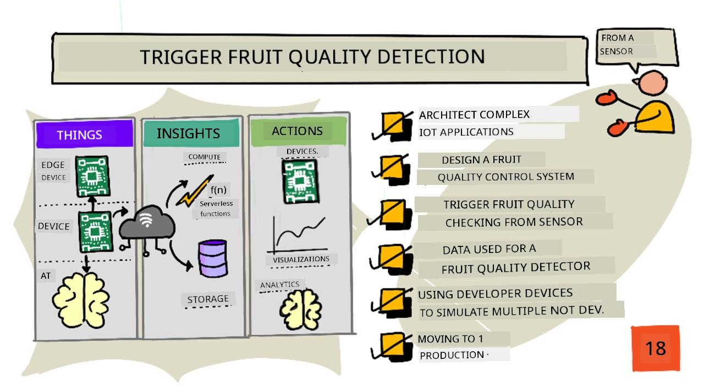
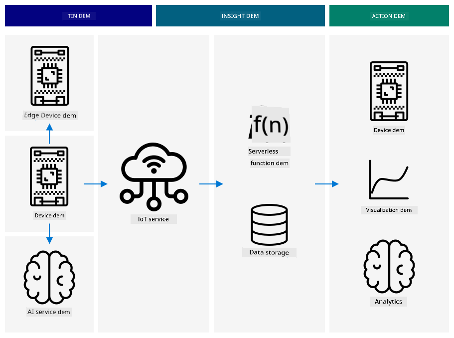
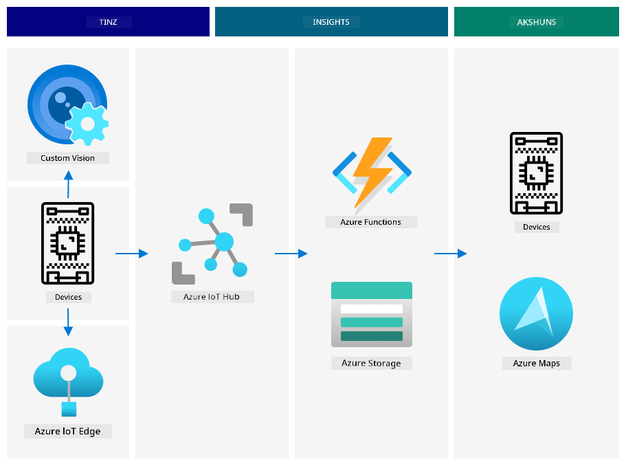
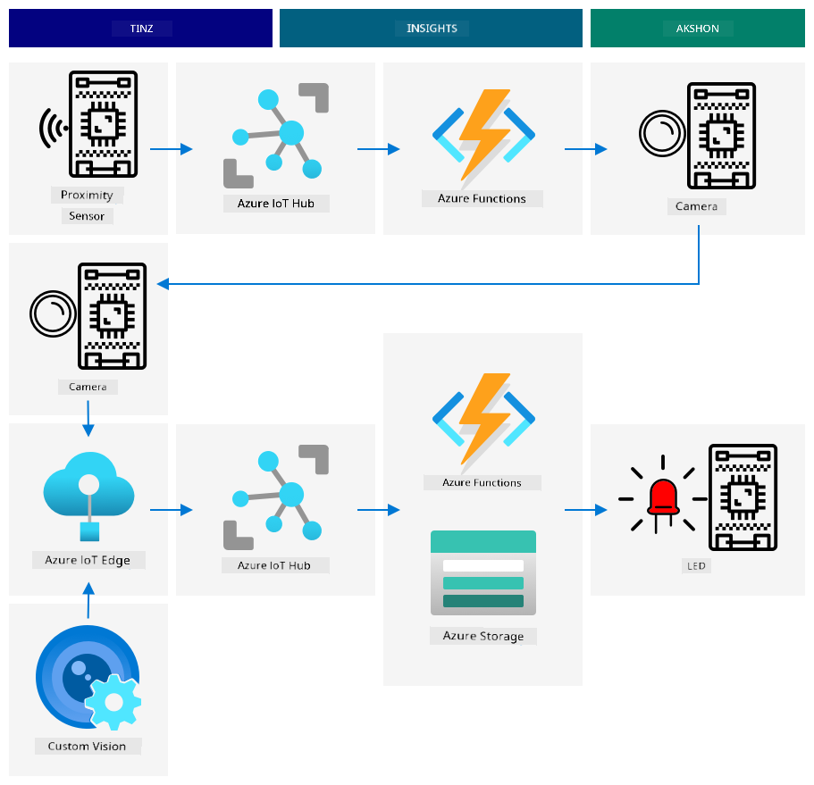
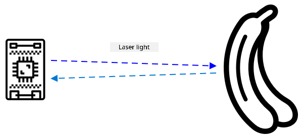
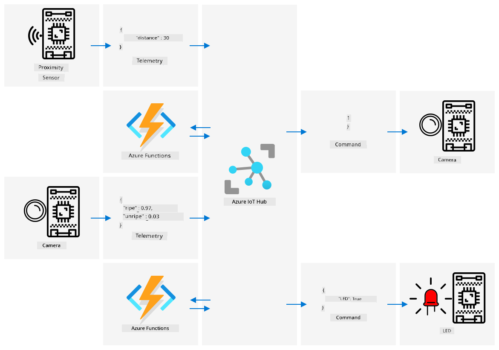

<!--
CO_OP_TRANSLATOR_METADATA:
{
  "original_hash": "f74f4ccb61f00e5f7e9f49c3ed416e36",
  "translation_date": "2025-11-18T18:58:33+00:00",
  "source_file": "4-manufacturing/lessons/4-trigger-fruit-detector/README.md",
  "language_code": "pcm"
}
-->
# Trigger fruit quality detection from sensor



> Sketchnote by [Nitya Narasimhan](https://github.com/nitya). Click di image for bigger version.

## Pre-lecture quiz

[Pre-lecture quiz](https://black-meadow-040d15503.1.azurestaticapps.net/quiz/35)

## Introduction

IoT application no be just one device wey dey capture data and send am go cloud, e dey involve plenty devices wey dey work together to capture data from di physical world using sensors, make decisions based on di data, and interact back wit di physical world through actuators or visualizations.

For dis lesson, you go learn how to design complex IoT applications, add multiple sensors, use cloud services to analyze and store data, and show response through actuator. You go learn how to design fruit quality control system prototype, including how to use proximity sensors to trigger di IoT application, and wetin di architecture of dis prototype go be.

For dis lesson we go cover:

* [Design complex IoT applications](../../../../../4-manufacturing/lessons/4-trigger-fruit-detector)
* [Plan fruit quality control system](../../../../../4-manufacturing/lessons/4-trigger-fruit-detector)
* [Trigger fruit quality check from sensor](../../../../../4-manufacturing/lessons/4-trigger-fruit-detector)
* [Data wey fruit quality detector dey use](../../../../../4-manufacturing/lessons/4-trigger-fruit-detector)
* [Use developer devices to simulate plenty IoT devices](../../../../../4-manufacturing/lessons/4-trigger-fruit-detector)
* [Move to production](../../../../../4-manufacturing/lessons/4-trigger-fruit-detector)

> 🗑 Dis na di last lesson for dis project, so after you finish di lesson and assignment, no forget to clean up your cloud services. You go need di services to complete di assignment, so make sure say you finish am first.
>
> Check [di clean up your project guide](../../../clean-up.md) if you need instructions on how to do am.

## Architect complex IoT applications

IoT applications get plenty parts. E include different things and internet services.

IoT applications fit be described as *things* (devices) wey dey send data wey dey generate *insights*. Dis *insights* dey generate *actions* to improve business or process. Example na engine (di thing) wey dey send temperature data. Dis data dey used to check if di engine dey work well (di insight). Di insight go help plan di maintenance schedule for di engine (di action).

* Different things dey gather different data.
* IoT services dey give insights from di data, sometimes dey add data from other sources.
* Di insights dey drive actions, like controlling actuators for devices, or showing data.

### Reference IoT architecture



Di diagram above show reference IoT architecture.

> 🎓 A *reference architecture* na example architecture wey you fit use as guide when you dey design new systems. For dis case, if you wan build new IoT system, you fit follow di reference architecture, replace am wit your own devices and services where e dey necessary.

* **Things** na devices wey dey gather data from sensors, maybe dey interact wit edge services to interpret di data, like image classifiers to interpret image data. Di data from di devices dey sent to IoT service.
* **Insights** dey come from serverless applications, or from analytics wey dey run on stored data.
* **Actions** fit be commands wey dem send to devices, or visualization of data wey go help humans make decisions.



Di diagram above show some of di components and services wey we don cover so far for dis lessons and how dem dey connect for reference IoT architecture.

* **Things** - you don write device code to capture data from sensors, and analyze images using Custom Vision wey dey run for di cloud and edge device. Dis data dey sent to IoT Hub.
* **Insights** - you don use Azure Functions to respond to messages wey dem send to IoT Hub, and store data for later analysis for Azure Storage.
* **Actions** - you don control actuators based on decisions wey dem make for di cloud and commands wey dem send to di devices, and you don visualize data using Azure Maps.

✅ Think about other IoT devices wey you don use, like smart home appliances. Wetin be di things, insights and actions wey dey involved for di device and di software?

Dis pattern fit scale big or small as you need, add more devices and services.

### Data and security

As you dey define di architecture of your system, you need to dey think about data and security.

* Wetin be di data wey your device dey send and receive?
* How you go secure and protect di data?
* How you go control access to di device and cloud service?

✅ Think about di data security of any IoT devices wey you get. How much of di data na personal and suppose dey private, both when e dey transit or when e dey stored? Wetin be di data wey no suppose dey stored?

## Design a fruit quality control system

Make we use dis idea of things, insights, and actions to design di fruit quality detector for bigger end-to-end application.

Imagine say dem give you task to build fruit quality detector wey dem go use for processing plant. Fruit dey move for conveyor belt system where workers dey check di fruit by hand and dey remove unripe fruit as e dey arrive. To reduce cost, di plant owner wan automated system.

✅ One trend wey dey rise wit IoT (and technology in general) na say manual jobs dey replaced by machines. Do small research: How many jobs dem estimate go lost to IoT? How many new jobs dem go create to build IoT devices?

You need to build system wey go detect fruit as e dey arrive for conveyor belt, e go take photo and check am using AI model wey dey run for edge. Di results go dey sent to di cloud to store, and if di fruit no ripe, notification go dey given so dem fit remove di unripe fruit.

|   |   |
| - | - |
| **Things** | Detector for fruit wey dey arrive for conveyor belt<br>Camera to take photo and classify di fruit<br>Edge device wey dey run di classifier<br>Device wey dey notify about unripe fruit |
| **Insights** | Decide to check di ripeness of di fruit<br>Store di results of di ripeness classification<br>Check if e dey necessary to alert about unripe fruit |
| **Actions** | Send command to device to take photo of di fruit and check am wit image classifier<br>Send command to device to alert say di fruit no ripe |

### Prototyping your application



Di diagram above show reference architecture for dis prototype application.

* IoT device wit proximity sensor dey detect di arrival of fruit. E go send message to di cloud to talk say fruit don dey detected.
* Serverless application for di cloud go send command to another device to take photo and classify di image.
* IoT device wit camera go take picture and send am to image classifier wey dey run for edge. Di results go dey sent to di cloud.
* Serverless application for di cloud go store dis information to analyze later to see di percentage of fruit wey no ripe. If di fruit no ripe, e go send command to another IoT device to alert factory workers say unripe fruit dey via LED.

> 💁 Dis whole IoT application fit dey implemented as one device, wit all di logic to start di image classification and control di LED inside. E fit use IoT Hub just to track di number of unripe fruits wey dem detect and configure di device. For dis lesson, e dey expanded to show di concepts for large scale IoT applications.

For di prototype, you go implement all dis for one device. If you dey use microcontroller, you go use separate edge device to run di image classifier. You don already learn most of di things wey you need to fit build dis.

## Trigger fruit quality checking from sensor

Di IoT device need trigger to show when fruit don ready to classify. One trigger fit be to measure when di fruit dey di correct location for conveyor belt by measuring di distance to sensor.



Proximity sensors fit dey used to measure di distance from sensor to object. Dem dey usually send beam of electromagnetic radiation like laser beam or infra-red light, then detect di radiation wey bounce off object. Di time wey e take for di laser beam to send and di signal to bounce back fit dey used to calculate di distance to di sensor.

> 💁 You don probably use proximity sensors before without even knowing. Most smartphones dey turn di screen off when you hold dem for ear to stop you from mistakenly ending call wit your earlobe, and dis dey work using proximity sensor, wey dey detect object close to di screen during call and dey disable di touch capabilities until di phone dey certain distance away.

### Task - trigger fruit quality detection from distance sensor

Follow di guide wey dey relevant to use proximity sensor to detect object using your IoT device:

* [Arduino - Wio Terminal](wio-terminal-proximity.md)
* [Single-board computer - Raspberry Pi](pi-proximity.md)
* [Single-board computer - Virtual device](virtual-device-proximity.md)

## Data used for fruit quality detector

Di prototype fruit detector get plenty components wey dey communicate wit each other.



* Proximity sensor dey measure di distance to fruit and dey send am to IoT Hub
* Di command to control di camera dey come from IoT Hub to di camera device
* Di results of di image classification dey sent to IoT Hub
* Di command to control LED to alert when di fruit no ripe dey sent from IoT Hub to di device wit di LED

E good to define di structure of dis messages before you build di application.

> 💁 Almost every experienced developer don spend hours, days or even weeks dey chase bugs wey dey caused by differences for di data wey dem dey send compared to wetin dem dey expect.

For example - if you dey send temperature information, how you go define di JSON? You fit get field wey dem call `temperature`, or you fit use di common abbreviation `temp`.

```json
{
    "temperature": 20.7
}
```

compared to:

```json
{
    "temp": 20.7
}
```

You go also need to think about units - di temperature na °C or °F? If you dey measure temperature using consumer device and dem change di display units, you need to make sure say di units wey dem dey send to di cloud dey consistent.

✅ Do small research: How unit problems take cause di $125 million Mars Climate Orbiter to crash?

Think about di data wey dem dey send for di fruit quality detector. How you go define each message? Where you go analyze di data and make decisions about wetin data to send?

For example - to trigger di image classification using proximity sensor. Di IoT device dey measure di distance, but where dem dey make di decision? Di device fit decide say di fruit don close enough and send message to IoT Hub to trigger di classification? Or e fit dey send proximity measurements and make IoT Hub decide?

Di answer to dis kind question na - e depend. Each use case dey different, na why as IoT developer you need to understand di system wey you dey build, how dem dey use am, and di data wey dem dey detect.

* If di decision dey made by IoT Hub, you go need to send plenty distance measurements.
* If you dey send too many messages, e go increase di cost of IoT Hub, and di amount of bandwidth wey your IoT devices dey need (especially for factory wey get millions of devices). E fit also slow down your device.
* If you dey make di decision for di device, you go need to provide way to configure di device to fine tune di machine.

## Using developer devices to simulate plenty IoT devices

To build your prototype, you go need your IoT dev kit to act like plenty devices, dey send telemetry and dey respond to commands.

### Simulating plenty IoT devices on Raspberry Pi or virtual IoT hardware

If you dey use single board computer like Raspberry Pi, you fit run plenty applications at once. Dis mean say you fit simulate plenty IoT devices by creating plenty applications, one per 'IoT device'. For example, you fit implement each device as separate Python file and run dem for different terminal sessions.

> 💁 Make sure say you know say some hardware no go work if plenty applications dey run simultaneously dey access am.

### Simulating plenty devices on microcontroller

Microcontrollers dey more complicated to simulate plenty devices. Unlike single board computers, you no fit run plenty applications at once, you go need to include all di logic for all di separate IoT devices inside one application.

Some suggestions to make dis process easier na:
* Create one or more class for each IoT device - like class wey dem fit call `DistanceSensor`, `ClassifierCamera`, `LEDController`. Each one go get dia own `setup` and `loop` method wey main `setup` and `loop` function go dey call.
* Make sure say command dey handle for one place, and direct am go the correct device class as e dey needed.
* For the main `loop` function, you go need think about timing for each different device. For example, if one device class need process every 10 seconds, and another one need process every 1 second, then for your main `loop` function, use 1 second delay. Every `loop` call go trigger the correct code for the device wey need process every second, and use counter to count each loop, process the other device when counter reach 10 (then reset the counter after).

## Moving to production

The prototype go be the foundation for the final production system. Some of the difference wey go dey when you dey move to production na:

* Ruggedized components - use hardware wey dem design to fit handle noise, heat, vibration, and stress wey dey for factory.
* Use internal communication - some components go dey communicate directly instead of jumping go cloud, only send data go cloud to store am. How dem go do am go depend on the factory setup, whether na direct communication or by running part of the IoT service for edge using gateway device.
* Configuration options - every factory and use case dey different, so the hardware go need dey configurable. For example, proximity sensor fit need detect different fruit for different distance. Instead of hard code the distance wey go trigger the classification, you go want make this one dey configurable through the cloud, like using device twin.
* Automated fruit removal - instead of LED wey go alert say fruit no ripe, automated device go dey remove am.

✅ Do some research: Wetin be other way wey production devices go different from developer kits?

---

## 🚀 Challenge

For this lesson, you don learn some concept wey you need sabi on how to design IoT system. Think about the projects wey you don do before. How dem go fit into the reference architecture wey dem show above?

Pick one of the projects wey you don do before and think about how you go design more complex solution wey go join plenty capability pass wetin dem cover for the projects. Draw the architecture and think about all the devices and services wey you go need.

For example - vehicle tracking device wey go join GPS with sensor to monitor things like temperature for refrigerated truck, engine on and off time, and driver identity. Wetin be the devices wey dey involved, the services wey dey involved, the data wey dem dey transmit, and the security and privacy wey you go need consider?

## Post-lecture quiz

[Post-lecture quiz](https://black-meadow-040d15503.1.azurestaticapps.net/quiz/36)

## Review & Self Study

* Read more about IoT architecture for the [Azure IoT reference architecture documentation for Microsoft docs](https://docs.microsoft.com/azure/architecture/reference-architectures/iot?WT.mc_id=academic-17441-jabenn)
* Read more about device twins for the [understand and use device twins in IoT Hub documentation for Microsoft docs](https://docs.microsoft.com/azure/iot-hub/iot-hub-devguide-device-twins?WT.mc_id=academic-17441-jabenn)
* Read about OPC-UA, machine to machine communication protocol wey dem dey use for industrial automation for the [OPC-UA page for Wikipedia](https://wikipedia.org/wiki/OPC_Unified_Architecture)

## Assignment

[Build a fruit quality detector](assignment.md)

---

<!-- CO-OP TRANSLATOR DISCLAIMER START -->
**Disclaimer**:  
Dis dokyument don use AI transle-shon service [Co-op Translator](https://github.com/Azure/co-op-translator) do di transle-shon. Even as we dey try make am correct, abeg sabi say AI transle-shon fit get mistake or no dey accurate well. Di original dokyument for im native language na di one wey you go take as di correct source. For important mata, e good make professional human transle-shon dey use. We no go fit take blame for any misunderstanding or wrong interpretation wey fit happen because you use dis transle-shon.
<!-- CO-OP TRANSLATOR DISCLAIMER END -->