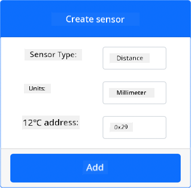
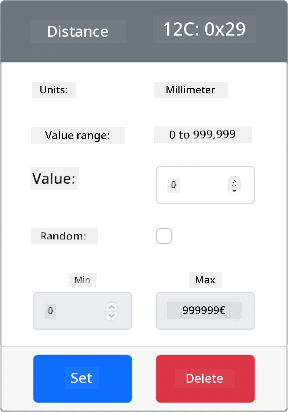

<!--
CO_OP_TRANSLATOR_METADATA:
{
  "original_hash": "7e9f05bdc50a40fd924b1d66934471bf",
  "translation_date": "2025-11-18T18:58:18+00:00",
  "source_file": "4-manufacturing/lessons/4-trigger-fruit-detector/virtual-device-proximity.md",
  "language_code": "pcm"
}
-->
# Detect proximity - Virtual IoT Hardware

For dis part of di lesson, you go add proximity sensor to your virtual IoT device, and read di distance wey e dey measure.

## Hardware

Di virtual IoT device go use one simulated distance sensor.

For physical IoT device, you go use sensor wey get laser ranging module to detect distance.

### Add di distance sensor to CounterFit

To use virtual distance sensor, you go need add am to di CounterFit app.

#### Task - add di distance sensor to CounterFit

Add di distance sensor to di CounterFit app.

1. Open di `fruit-quality-detector` code for VS Code, and make sure say di virtual environment dey activated.

1. Install one extra Pip package to install CounterFit shim wey fit talk to distance sensors by simulating di [rpi-vl53l0x Pip package](https://pypi.org/project/rpi-vl53l0x/), one Python package wey dey interact with [VL53L0X time-of-flight distance sensor](https://wiki.seeedstudio.com/Grove-Time_of_Flight_Distance_Sensor-VL53L0X/). Make sure say you dey install am from terminal wey get di virtual environment activated.

    ```sh
    pip install counterfit-shims-rpi-vl53l0x
    ```

1. Make sure say di CounterFit web app dey run.

1. Create distance sensor:

    1. For di *Create sensor* box for di *Sensors* pane, drop down di *Sensor type* box and select *Distance*.

    1. Leave di *Units* as `Millimeter`.

    1. Dis sensor na I<sup>2</sup>C sensor, so set di address to `0x29`. If you use physical VL53L0X sensor, e go dey hardcoded to dis address.

    1. Select di **Add** button to create di distance sensor.

    

    Di distance sensor go dey created and e go show for di sensors list.

    

## Program di distance sensor

Di virtual IoT device fit now dey programmed to use di simulated distance sensor.

### Task - program di time of flight sensor

1. Create new file for di `fruit-quality-detector` project wey you go call `distance-sensor.py`.

    > 💁 One easy way to simulate plenty IoT devices na to do each one for different Python file, then run dem at di same time.

1. Start connection to CounterFit with di code wey dey below:

    ```python
    from counterfit_connection import CounterFitConnection
    CounterFitConnection.init('127.0.0.1', 5000)
    ```

1. Add di code wey dey below dis one:

    ```python
    import time
    
    from counterfit_shims_rpi_vl53l0x.vl53l0x import VL53L0X
    ```

    Dis one dey import di sensor library shim for di VL53L0X time of flight sensor.

1. Below dis one, add di code wey dey below to access di sensor:

    ```python
    distance_sensor = VL53L0X()
    distance_sensor.begin()
    ```

    Dis code dey declare distance sensor, then e go start di sensor.

1. Finally, add infinite loop to read distances:

    ```python
    while True:
        distance_sensor.wait_ready()
        print(f'Distance = {distance_sensor.get_distance()} mm')
        time.sleep(1)
    ```

    Dis code dey wait for value wey dey ready to read from di sensor, then e go print am for di console.

1. Run dis code.

    > 💁 No forget say dis file na `distance-sensor.py`! Make sure say you dey run am via Python, no be `app.py`.

1. You go see distance measurements dey show for di console. Change di value for CounterFit to see di value change, or use random values.

    ```output
    (.venv) ➜  fruit-quality-detector python distance-sensor.py 
    Distance = 37 mm
    Distance = 42 mm
    Distance = 29 mm
    ```

> 💁 You fit find dis code for di [code-proximity/virtual-iot-device](../../../../../4-manufacturing/lessons/4-trigger-fruit-detector/code-proximity/virtual-iot-device) folder.

😀 Your proximity sensor program don work well!

---

<!-- CO-OP TRANSLATOR DISCLAIMER START -->
**Disclaimer**:  
Dis dokyument don use AI translation service [Co-op Translator](https://github.com/Azure/co-op-translator) do di translation. Even as we dey try make am accurate, abeg sabi say machine translation fit get mistake or no dey 100% correct. Di original dokyument wey dey for im native language na di main source wey you go fit trust. For important information, e better make professional human translator check am. We no go fit take blame for any misunderstanding or wrong interpretation wey fit happen because you use dis translation.
<!-- CO-OP TRANSLATOR DISCLAIMER END -->