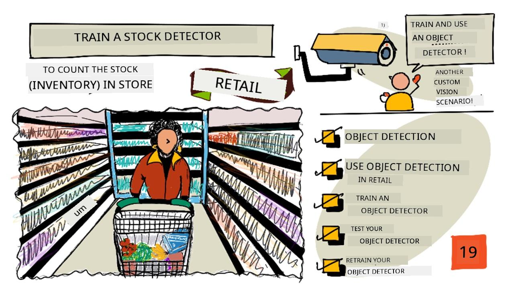
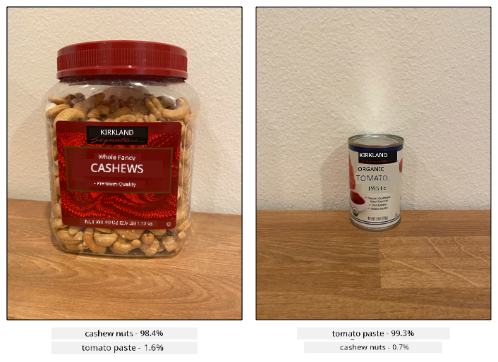
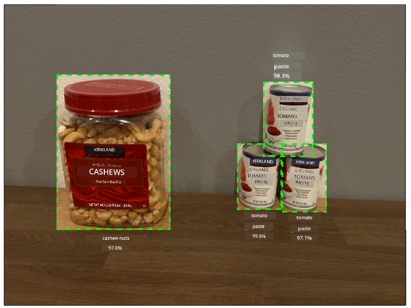
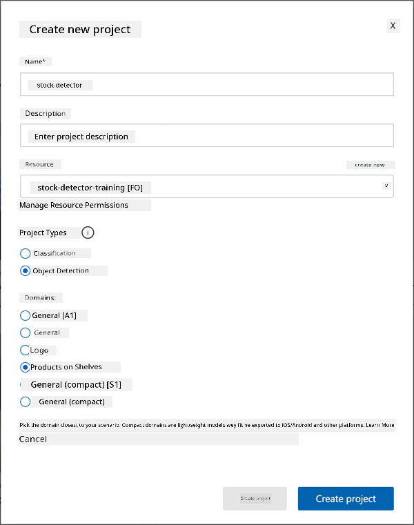
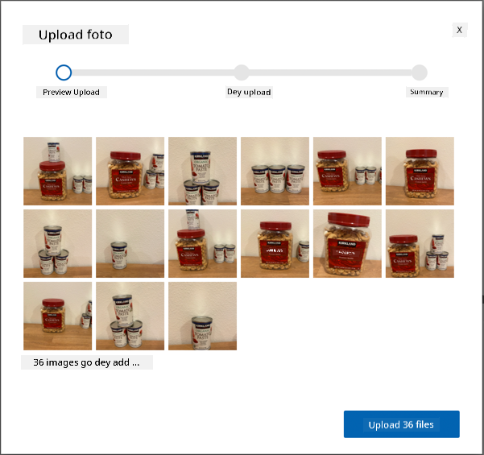
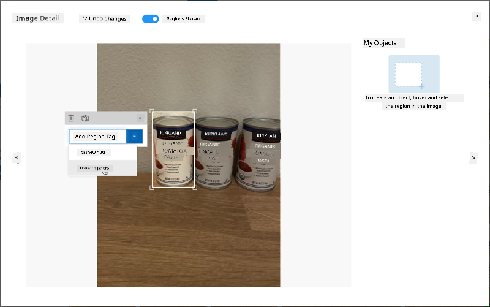
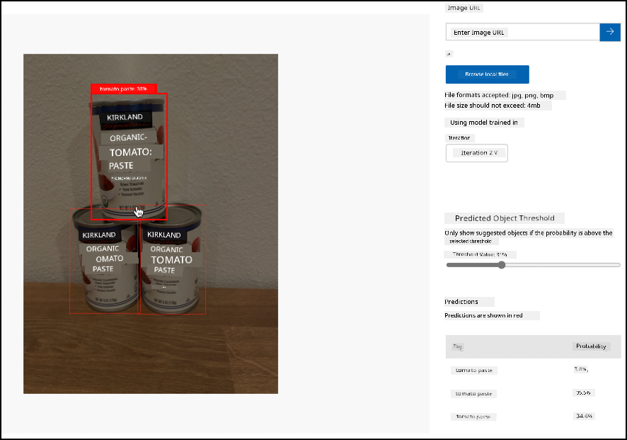

<!--
CO_OP_TRANSLATOR_METADATA:
{
  "original_hash": "8df310a42f902139a01417dacb1ffbef",
  "translation_date": "2025-11-18T19:54:10+00:00",
  "source_file": "5-retail/lessons/1-train-stock-detector/README.md",
  "language_code": "pcm"
}
-->
# Train stock detector

> Sketchnote by [Nitya Narasimhan](https://github.com/nitya). Click di image to see bigger version.

Dis video dey show overview of Object Detection wey dey use Azure Custom Vision service, na di service wey we go talk about for dis lesson.

> 🎥 Click di image wey dey up to watch di video

## Pre-lecture quiz

[Pre-lecture quiz](https://black-meadow-040d15503.1.azurestaticapps.net/quiz/37)

## Introduction

For di last project, you use AI train image classifier - na model wey fit tell if image get something like ripe fruit or unripe fruit. Another type of AI model wey fit work with images na object detection. Dis models no dey classify image by tags, instead dem dey train to sabi objects, and fit find dem for images, no be only to detect say di image dey there, but to detect where e dey for di image. Dis one go help you count objects for images.

For dis lesson, you go learn about object detection, including how e fit work for retail. You go also learn how to train object detector for di cloud.

For dis lesson we go talk about:

* [Object detection](../../../../../5-retail/lessons/1-train-stock-detector)
* [Use object detection for retail](../../../../../5-retail/lessons/1-train-stock-detector)
* [Train object detector](../../../../../5-retail/lessons/1-train-stock-detector)
* [Test your object detector](../../../../../5-retail/lessons/1-train-stock-detector)
* [Retrain your object detector](../../../../../5-retail/lessons/1-train-stock-detector)

## Object detection

Object detection na di process wey AI dey use to find objects for images. E different from di image classifier wey you train for di last project, object detection no dey predict di best tag for di whole image, but e dey find one or more objects for di image.

### Object detection vs image classification

Image classification dey about classifying di whole image - wetin be di probabilities say di whole image match each tag. You go get back probabilities for every tag wey dem use train di model.

For di example wey dey up, two images dey classified using model wey dem train to classify tubs of cashew nuts or cans of tomato paste. Di first image na tub of cashew nuts, e get two results from di image classifier:

| Tag            | Probability |
| -------------- | ----------: |
| `cashew nuts`  | 98.4%       |
| `tomato paste` | 1.6%        |

Di second image na can of tomato paste, and di results be:

| Tag            | Probability |
| -------------- | ----------: |
| `cashew nuts`  | 0.7%        |
| `tomato paste` | 99.3%       |

You fit use dis value with threshold percentage to predict wetin dey di image. But wetin go happen if di image get plenty cans of tomato paste, or both cashew nuts and tomato paste? Di results no go give you wetin you want. Na here object detection go help.

Object detection dey train model to sabi objects. Instead of giving am images wey get di object and telling am say each image na one tag or di other, you go highlight di part of di image wey get di specific object, and tag am. You fit tag one object for image or plenty. Dis way di model go learn wetin di object itself look like, no be just wetin images wey get di object look like.

When you use am predict images, instead of getting back list of tags and percentages, you go get back list of detected objects, with di bounding box and di probability say di object match di assigned tag.

> 🎓 *Bounding boxes* na di boxes wey dey around di object.

Di image wey dey up get both tub of cashew nuts and three cans of tomato paste. Di object detector detect di cashew nuts, e return di bounding box wey dey contain di cashew nuts with di percentage chance say di bounding box get di object, for dis case na 97.6%. Di object detector also detect three cans of tomato paste, e provide three separate bounding boxes, one for each detected can, and each one get percentage probability say di bounding box get can of tomato paste.

✅ Think about some different ways wey you fit use image-based AI models. Which ones go need classification, and which ones go need object detection?

### How object detection dey work

Object detection dey use complex ML models. Dis models dey work by dividing di image into plenty cells, then e go check if di center of di bounding box na di center of image wey match one of di images wey dem use train di model. You fit think am like say you dey run image classifier over different parts of di image to look for matches.

> 💁 Dis na oversimplification. Plenty techniques dey for object detection, and you fit read more about dem for di [Object detection page for Wikipedia](https://wikipedia.org/wiki/Object_detection).

Plenty different models dey wey fit do object detection. One popular model na [YOLO (You only look once)](https://pjreddie.com/darknet/yolo/), e dey very fast and fit detect 20 different class of objects, like people, dogs, bottles and cars.

✅ Read about di YOLO model for [pjreddie.com/darknet/yolo/](https://pjreddie.com/darknet/yolo/)

Object detection models fit retrain using transfer learning to detect custom objects.

## Use object detection for retail

Object detection get plenty use for retail. Some include:

* **Stock checking and counting** - e dey recognize when stock dey low for shelves. If stock dey too low, notifications fit go staff or robots to restock shelves.
* **Mask detection** - for stores wey get mask policy during public health events, object detection fit recognize people wey wear mask and those wey no wear.
* **Automated billing** - e dey detect items wey people pick from shelves for automated stores and dey bill customers well.
* **Hazard detection** - e dey recognize broken items for floor, or spilled liquids, e dey alert cleaning crew.

✅ Do small research: Wetin be some other ways wey object detection fit work for retail?

## Train object detector

You fit train object detector using Custom Vision, same way you train image classifier.

### Task - create object detector

1. Create Resource Group for dis project wey you go call `stock-detector`

1. Create free Custom Vision training resource, and free Custom Vision prediction resource for di `stock-detector` resource group. Name dem `stock-detector-training` and `stock-detector-prediction`.

    > 💁 You fit only get one free training and prediction resource, so make sure say you don clean up your project from di earlier lessons.

    > ⚠️ You fit check [di instructions for creating training and prediction resources from project 4, lesson 1 if you need am](../../../4-manufacturing/lessons/1-train-fruit-detector/README.md#task---create-a-cognitive-services-resource).

1. Open di Custom Vision portal for [CustomVision.ai](https://customvision.ai), and sign in with di Microsoft account wey you use for your Azure account.

1. Follow di [Create new Project section for di Build object detector quickstart for Microsoft docs](https://docs.microsoft.com/azure/cognitive-services/custom-vision-service/get-started-build-detector?WT.mc_id=academic-17441-jabenn#create-a-new-project) to create new Custom Vision project. Di UI fit change and dis docs na di most up-to-date reference.

    Call your project `stock-detector`.

    When you dey create your project, make sure say you dey use di `stock-detector-training` resource wey you create before. Use di *Object Detection* project type, and di *Products on Shelves* domain.

    

    ✅ Di products on shelves domain dey specially designed to detect stock for store shelves. Read more about di different domains for [Select domain documentation for Microsoft Docs](https://docs.microsoft.com/azure/cognitive-services/custom-vision-service/select-domain?WT.mc_id=academic-17441-jabenn#object-detection)

✅ Take small time to explore di Custom Vision UI for your object detector.

### Task - train your object detector

To train your model you go need set of images wey get di objects wey you wan detect.

1. Gather images wey get di object wey you wan detect. You go need at least 15 images wey get each object to detect from different angles and different lighting conditions, but di more di better. Dis object detector dey use di *Products on shelves* domain, so try arrange di objects like say dem dey for store shelf. You go also need small images to test di model. If you dey detect more than one object, you go want some testing images wey get all di objects.

    > 💁 Images wey get plenty different objects dey count for di 15 image minimum for all di objects wey dey di image.

    Your images suppose be png or jpegs, small pass 6MB. If you create dem with iPhone for example, dem fit be high-resolution HEIC images, so you go need convert and maybe shrink dem. Di more images di better, and you suppose get similar number of ripe and unripe.

    Di model dey designed for products on shelves, so try take di photos of di objects for shelves.

    You fit find some example images wey you fit use for di [images](../../../../../5-retail/lessons/1-train-stock-detector/images) folder of cashew nuts and tomato paste wey you fit use.

1. Follow di [Upload and tag images section for di Build object detector quickstart for Microsoft docs](https://docs.microsoft.com/azure/cognitive-services/custom-vision-service/get-started-build-detector?WT.mc_id=academic-17441-jabenn#upload-and-tag-images) to upload your training images. Create relevant tags based on di types of objects wey you wan detect.

    

    When you dey draw bounding boxes for objects, make dem tight around di object. E fit take time to outline all di images, but di tool go detect wetin e think say be di bounding boxes, e go make am faster.

    

    > 💁 If you get more than 15 images for each object, you fit train after 15 then use di **Suggested tags** feature. Dis one go use di trained model to detect di objects for di untagged image. You fit confirm di detected objects, or reject and redraw di bounding boxes. Dis one fit save plenty time.

1. Follow di [Train di detector section for di Build object detector quickstart for Microsoft docs](https://docs.microsoft.com/azure/cognitive-services/custom-vision-service/get-started-build-detector?WT.mc_id=academic-17441-jabenn#train-the-detector) to train di object detector on your tagged images.

    You go get choice of training type. Select **Quick Training**.

Di object detector go train. E go take few minutes for di training to complete.

## Test your object detector

Once your object detector don train, you fit test am by giving am new images to detect objects.

### Task - test your object detector

1. Use di **Quick Test** button to upload testing images and confirm say di objects dey detected. Use di testing images wey you create before, no use any of di images wey you use for training.

    

1. Try all di testing images wey you get and observe di probabilities.

## Retrain your object detector

When you test your object detector, e fit no give di results wey you dey expect, same as image classifiers for di last project. You fit improve your object detector by retraining am with images wey e no get correct.

Every time you make prediction using di quick test option, di image and results go dey stored. You fit use dis images retrain your model.

1. Use di **Predictions** tab to find di images wey you use for testing

1. Confirm any correct detections, delete di wrong ones and add any missing objects.

1. Retrain and retest di model.

---

## 🚀 Challenge
Wetn go happen if you use di object detector for items wey resemble each oda, like di same brand cans of tomato paste and chopped tomatoes?

If you get any items wey resemble each oda, try am by adding dia pictures to your object detector.

## Post-lecture quiz

[Post-lecture quiz](https://black-meadow-040d15503.1.azurestaticapps.net/quiz/38)

## Review & Self Study

* Wen you dey train your object detector, you go see values for *Precision*, *Recall*, and *mAP* wey dey rate di model wey dem create. Make you read about wetin dis values mean for [di Evaluate the detector section of di Build an object detector quickstart for Microsoft docs](https://docs.microsoft.com/azure/cognitive-services/custom-vision-service/get-started-build-detector?WT.mc_id=academic-17441-jabenn#evaluate-the-detector)
* Learn more about object detection for [di Object detection page for Wikipedia](https://wikipedia.org/wiki/Object_detection)

## Assignment

[Compare domains](assignment.md)

---

<!-- CO-OP TRANSLATOR DISCLAIMER START -->
**Disclaimer**:  
Dis dokyument don translate wit AI translation service [Co-op Translator](https://github.com/Azure/co-op-translator). Even as we dey try make am accurate, abeg sabi say machine translation fit get mistake or no dey correct well. Di original dokyument for im native language na di main source wey you go trust. For important information, e better make professional human translator check am. We no go fit take blame for any misunderstanding or wrong interpretation wey fit happen because you use dis translation.
<!-- CO-OP TRANSLATOR DISCLAIMER END -->