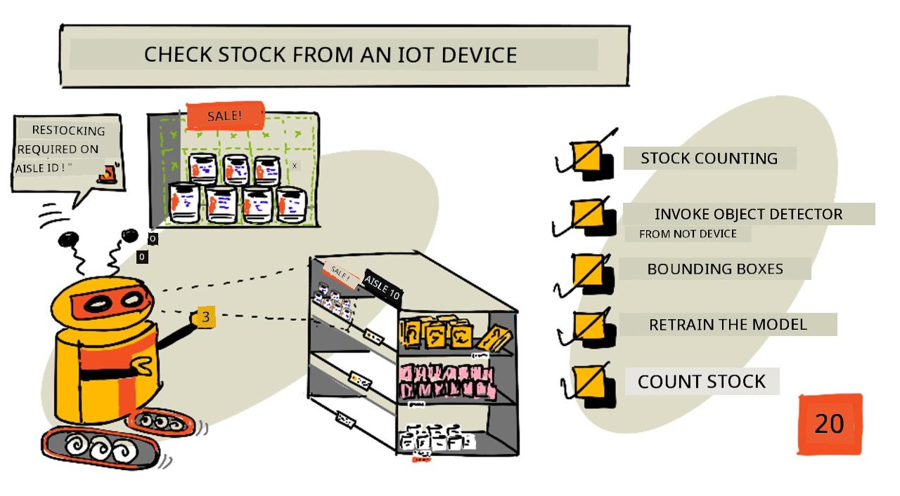
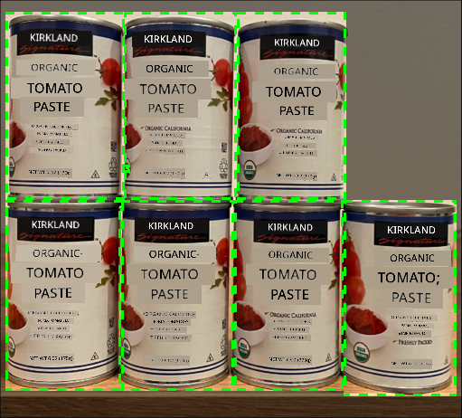
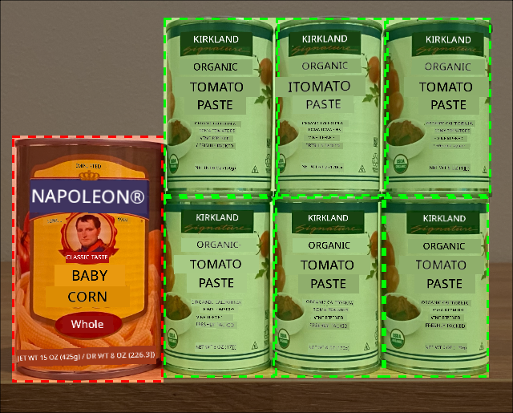
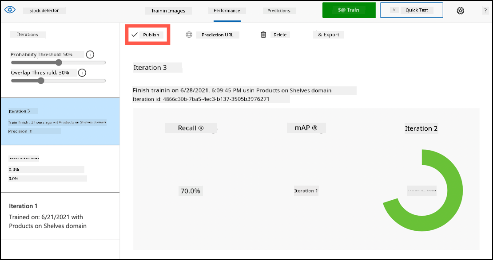
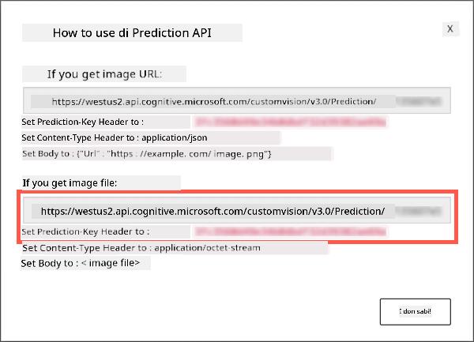
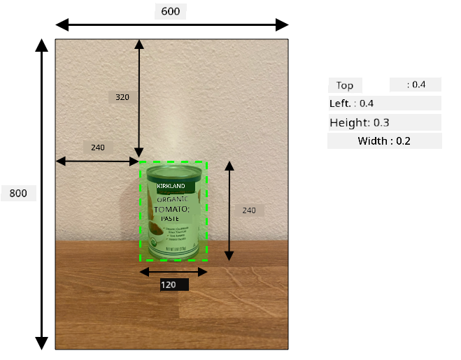
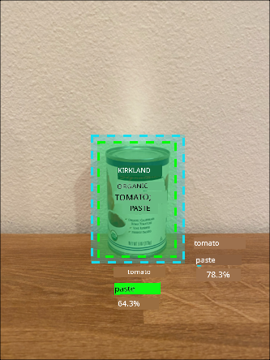

<!--
CO_OP_TRANSLATOR_METADATA:
{
  "original_hash": "1c9e5fa8b7be726c75a97232b1e41c97",
  "translation_date": "2025-11-18T19:52:14+00:00",
  "source_file": "5-retail/lessons/2-check-stock-device/README.md",
  "language_code": "pcm"
}
-->
# Check stock from an IoT device



> Sketchnote by [Nitya Narasimhan](https://github.com/nitya). Click the image for a larger version.

## Pre-lecture quiz

[Pre-lecture quiz](https://black-meadow-040d15503.1.azurestaticapps.net/quiz/39)

## Introduction

For di last lesson, you don learn how object detection fit dey useful for retail. You also learn how to train object detector wey go sabi identify stock. For dis lesson, you go learn how to use di object detector wey you train from your IoT device to count stock.

For dis lesson, we go talk about:

* [Stock counting](../../../../../5-retail/lessons/2-check-stock-device)
* [Call your object detector from your IoT device](../../../../../5-retail/lessons/2-check-stock-device)
* [Bounding boxes](../../../../../5-retail/lessons/2-check-stock-device)
* [Retrain the model](../../../../../5-retail/lessons/2-check-stock-device)
* [Count stock](../../../../../5-retail/lessons/2-check-stock-device)

> 🗑 Dis na di last lesson for dis project, so after you don finish di lesson and di assignment, no forget to clean up your cloud services. You go need di services to complete di assignment, so make sure say you finish am first.
>
> Check [di clean up your project guide](../../../clean-up.md) if you need instructions on how to do am.

## Stock counting

Object detectors fit dey useful for stock checking, whether na to count stock or to make sure say stock dey where e suppose dey. IoT devices wey get cameras fit dey put for different places for di store to monitor stock, especially for areas wey dey important to restock items, like places wey dey carry small numbers of high-value items.

For example, if camera dey look one shelf wey fit carry 8 cans of tomato paste, and di object detector only detect 7 cans, e mean say one don miss and dem need to restock am.



For di image wey dey up, di object detector don detect 7 cans of tomato paste for shelf wey fit carry 8 cans. Di IoT device fit send notification say dem need to restock, and e fit even show di location of di missing item, wey go be important data if you dey use robots to restock shelves.

> 💁 Depending on di store and how popular di item be, dem fit no restock if na only 1 can dey miss. You go need to build algorithm wey go decide when to restock based on your product, customers, and other criteria.

✅ Which other ways you fit combine object detection and robots?

Sometimes, wrong stock fit dey for di shelves. E fit be human error when dem dey restock, or customers fit change their mind about wetin dem wan buy and put di item for di first available space. If na non-perishable item like canned goods, e go just dey annoying. But if na perishable item like frozen or chilled goods, e fit mean say di product no fit sell again because e go hard to know how long di item don dey outside freezer.

Object detection fit help detect items wey no suppose dey there, and e go alert human or robot to return di item as dem detect am.



For di image wey dey up, one can of baby corn don dey put for di shelf wey tomato paste suppose dey. Di object detector don detect am, so di IoT device fit notify human or robot to return di can go di correct place.

## Call your object detector from your IoT device

Di object detector wey you train for di last lesson fit dey call from your IoT device.

### Task - publish an iteration of your object detector

Iterations dey publish from di Custom Vision portal.

1. Open di Custom Vision portal for [CustomVision.ai](https://customvision.ai) and sign in if you never open am before. Then open your `stock-detector` project.

1. Select di **Performance** tab from di options wey dey top.

1. Select di latest iteration from di *Iterations* list wey dey side.

1. Select di **Publish** button for di iteration.

    

1. For di *Publish Model* dialog, set di *Prediction resource* to di `stock-detector-prediction` resource wey you create for di last lesson. Leave di name as `Iteration2`, and select di **Publish** button.

1. Once you don publish am, select di **Prediction URL** button. Dis one go show di details of di prediction API, and you go need am to call di model from your IoT device. Di lower section dey label *If you have an image file*, and na di details you go need. Copy di URL wey dem show wey go look like:

    ```output
    https://<location>.api.cognitive.microsoft.com/customvision/v3.0/Prediction/<id>/detect/iterations/Iteration2/image
    ```

    Where `<location>` go be di location wey you use when you dey create your custom vision resource, and `<id>` go be long ID wey get letters and numbers.

    Also copy di *Prediction-Key* value. Dis na secure key wey you go pass when you dey call di model. Only apps wey pass dis key fit use di model, any other apps go dey reject.

    

✅ When new iteration don publish, e go get different name. How you think say you go fit change di iteration wey IoT device dey use?

### Task - call your object detector from your IoT device

Follow di guide wey dey relevant below to use di object detector from your IoT device:

* [Arduino - Wio Terminal](wio-terminal-object-detector.md)
* [Single-board computer - Raspberry Pi/Virtual device](single-board-computer-object-detector.md)

## Bounding boxes

When you dey use di object detector, e no go only give you di detected objects with their tags and probabilities, e go also give you di bounding boxes of di objects. Dis bounding boxes dey show where di object detector detect di object with di given probability.

> 💁 Bounding box na box wey dey define di area wey contain di object wey dem detect, na box wey dey show di boundary for di object.

Di results of prediction for di **Predictions** tab for Custom Vision dey get di bounding boxes wey dem draw for di image wey dem send for prediction.


For di image wey dey up, dem detect 4 cans of tomato paste. For di results, red square dey show for each object wey dem detect for di image, wey dey show di bounding box for di image.

✅ Open di predictions for Custom Vision and check di bounding boxes.

Bounding boxes dey define with 4 values - top, left, height, and width. Dis values dey use scale of 0-1, wey dey represent di positions as percentage of di size of di image. Di origin (di 0,0 position) na di top left of di image, so di top value na di distance from di top, and di bottom of di bounding box na di top plus di height.



Di image wey dey up na 600 pixels wide and 800 pixels tall. Di bounding box dey start for 320 pixels down, wey give top coordinate of 0.4 (800 x 0.4 = 320). From di left, di bounding box dey start for 240 pixels across, wey give left coordinate of 0.4 (600 x 0.4 = 240). Di height of di bounding box na 240 pixels, wey give height value of 0.3 (800 x 0.3 = 240). Di width of di bounding box na 120 pixels, wey give width value of 0.2 (600 x 0.2 = 120).

| Coordinate | Value |
| ---------- | ----: |
| Top        | 0.4   |
| Left       | 0.4   |
| Height     | 0.3   |
| Width      | 0.2   |

Using percentage values from 0-1 mean say no matter di size wey dem scale di image to, di bounding box go start 0.4 of di way along and down, and e go be 0.3 of di height and 0.2 of di width.

You fit use bounding boxes join with probabilities to check how accurate di detection be. For example, object detector fit detect multiple objects wey dey overlap, like detecting one can inside another. Your code fit check di bounding boxes, understand say e no possible, and ignore any objects wey dey overlap well well with other objects.



For di example wey dey up, one bounding box dey show predicted can of tomato paste at 78.3%. Another bounding box dey small, and e dey inside di first bounding box with probability of 64.3%. Your code fit check di bounding boxes, see say dem dey overlap completely, and ignore di lower probability because e no possible say one can go dey inside another.

✅ You fit think of situation wey e go valid to detect one object inside another?

## Retrain the model

Like di image classifier, you fit retrain your model using data wey your IoT device capture. Using dis real-world data go make sure say your model dey work well when you dey use am from your IoT device.

Unlike di image classifier, you no fit just tag image. You go need to check every bounding box wey di model detect. If di box dey around wrong thing, you go need delete am. If e dey wrong location, you go need adjust am.

### Task - retrain the model

1. Make sure say you don capture plenty images using your IoT device.

1. From di **Predictions** tab, select one image. You go see red boxes wey dey show di bounding boxes of di detected objects.

1. Work through each bounding box. Select am first and you go see pop-up wey dey show di tag. Use di handles for di corners of di bounding box to adjust di size if e dey necessary. If di tag dey wrong, remove am with di **X** button and add di correct tag. If di bounding box no contain object, delete am with di trashcan button.

1. Close di editor when you don finish and di image go move from di **Predictions** tab go di **Training Images** tab. Repeat di process for all di predictions.

1. Use di **Train** button to re-train your model. Once e don train, publish di iteration and update your IoT device to use di URL of di new iteration.

1. Re-deploy your code and test your IoT device.

## Count stock

Using di number of objects wey dem detect and di bounding boxes, you fit count di stock wey dey shelf.

### Task - count stock

Follow di guide wey dey relevant below to count stock using di results from di object detector from your IoT device:

* [Arduino - Wio Terminal](wio-terminal-count-stock.md)
* [Single-board computer - Raspberry Pi/Virtual device](single-board-computer-count-stock.md)

---

## 🚀 Challenge

You fit detect wrong stock? Train your model on plenty objects, then update your app to alert you if wrong stock dey detected.

You fit even carry am go further and detect stock wey dey side by side for di same shelf, and see if something don dey put for wrong place by setting limits for di bounding boxes.

## Post-lecture quiz

[Post-lecture quiz](https://black-meadow-040d15503.1.azurestaticapps.net/quiz/40)

## Review & Self Study

* Learn more about how to design end-to-end stock detection system from di [Out of stock detection at the edge pattern guide on Microsoft Docs](https://docs.microsoft.com/hybrid/app-solutions/pattern-out-of-stock-at-edge?WT.mc_id=academic-17441-jabenn)
* Learn other ways to build end-to-end retail solutions wey dey combine different IoT and cloud services by watching dis [Behind the scenes of a retail solution - Hands On! video on YouTube](https://www.youtube.com/watch?v=m3Pc300x2Mw).

## Assignment

[Use your object detector on the edge](assignment.md)

---

<!-- CO-OP TRANSLATOR DISCLAIMER START -->
**Disclaimer**:  
Dis document don use AI translation service [Co-op Translator](https://github.com/Azure/co-op-translator) take translate am. Even though we dey try make e accurate, abeg sabi say automated translations fit get mistake or no dey 100% correct. Di original document for di native language na di main correct source. For important information, e better make una use professional human translation. We no go fit take responsibility for any misunderstanding or wrong interpretation wey fit happen because of dis translation.
<!-- CO-OP TRANSLATOR DISCLAIMER END -->