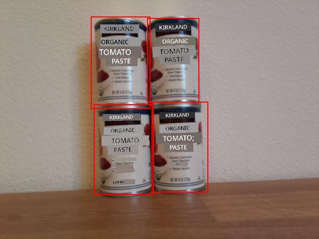

<!--
CO_OP_TRANSLATOR_METADATA:
{
  "original_hash": "9c4320311c0f2c1884a6a21265d98a51",
  "translation_date": "2025-11-18T19:51:04+00:00",
  "source_file": "5-retail/lessons/2-check-stock-device/single-board-computer-count-stock.md",
  "language_code": "pcm"
}
-->
# Count stock from your IoT device - Virtual IoT Hardware and Raspberry Pi

Combination of di predictions and dia bounding boxes fit dey used to count stock wey dey inside one image.

## Show bounding boxes

As one helpful debugging step, you fit no just print di bounding boxes, but you fit also draw dem for di image wey dem save for disk when dem capture di image.

### Task - print di bounding boxes

1. Make sure say di `stock-counter` project dey open for VS Code, and di virtual environment dey activated if you dey use virtual IoT device.

1. Change di `print` statement for di `for` loop to di one wey dey below to print di bounding boxes for di console:

    ```python
    print(f'{prediction.tag_name}:\t{prediction.probability * 100:.2f}%\t{prediction.bounding_box}')
    ```

1. Run di app make di camera face some stock wey dey shelf. Di bounding boxes go show for di console, with left, top, width and height values from 0-1.

    ```output
    pi@raspberrypi:~/stock-counter $ python3 app.py 
    tomato paste:   33.42%  {'additional_properties': {}, 'left': 0.3455171, 'top': 0.09916268, 'width': 0.14175442, 'height': 0.29405564}
    tomato paste:   34.41%  {'additional_properties': {}, 'left': 0.48283678, 'top': 0.10242918, 'width': 0.11782813, 'height': 0.27467814}
    tomato paste:   31.25%  {'additional_properties': {}, 'left': 0.4923783, 'top': 0.35007596, 'width': 0.13668466, 'height': 0.28304994}
    tomato paste:   31.05%  {'additional_properties': {}, 'left': 0.36416405, 'top': 0.37494493, 'width': 0.14024884, 'height': 0.26880276}
    ```

### Task - draw bounding boxes for di image

1. Di Pip package [Pillow](https://pypi.org/project/Pillow/) fit dey used to draw for images. Install am with dis command:

    ```sh
    pip3 install pillow
    ```

    If you dey use virtual IoT device, make sure say you run am from inside di activated virtual environment.

1. Add dis import statement go di top of di `app.py` file:

    ```python
    from PIL import Image, ImageDraw, ImageColor
    ```

    Dis one go import di code wey you need to edit di image.

1. Add dis code go di end of di `app.py` file:

    ```python
    with Image.open('image.jpg') as im:
        draw = ImageDraw.Draw(im)
    
        for prediction in predictions:
            scale_left = prediction.bounding_box.left
            scale_top = prediction.bounding_box.top
            scale_right = prediction.bounding_box.left + prediction.bounding_box.width
            scale_bottom = prediction.bounding_box.top + prediction.bounding_box.height
            
            left = scale_left * im.width
            top = scale_top * im.height
            right = scale_right * im.width
            bottom = scale_bottom * im.height
    
            draw.rectangle([left, top, right, bottom], outline=ImageColor.getrgb('red'), width=2)
    
        im.save('image.jpg')
    ```

    Dis code go open di image wey dem save before for editing. E go then loop through di predictions dey get di bounding boxes, and calculate di bottom right coordinate using di bounding box values from 0-1. Dem go then convert am to image coordinates by multiplying am by di relevant dimension of di image. For example, if di left value na 0.5 for one image wey be 600 pixels wide, e go convert am to 300 (0.5 x 600 = 300).

    Each bounding box go dey drawn for di image using one red line. Finally, di edited image go dey saved, overwriting di original image.

1. Run di app make di camera face some stock wey dey shelf. You go see di `image.jpg` file for di VS Code explorer, and you fit select am to see di bounding boxes.

    

## Count stock

For di image wey dey above, di bounding boxes get small overlap. If di overlap big well well, di bounding boxes fit dey show di same object. To count di objects well, you need to ignore boxes wey get big overlap.

### Task - count stock ignore overlap

1. Di Pip package [Shapely](https://pypi.org/project/Shapely/) fit dey used to calculate di intersection. If you dey use Raspberry Pi, you go need install one library dependency first:

    ```sh
    sudo apt install libgeos-dev
    ```

1. Install di Shapely Pip package:

    ```sh
    pip3 install shapely
    ```

    If you dey use virtual IoT device, make sure say you run am from inside di activated virtual environment.

1. Add dis import statement go di top of di `app.py` file:

    ```python
    from shapely.geometry import Polygon
    ```

    Dis one go import di code wey you need to create polygons to calculate overlap.

1. For di code wey dey draw di bounding boxes, add dis code:

    ```python
    overlap_threshold = 0.20
    ```

    Dis one go define di percentage overlap wey dem go allow before dem go consider di bounding boxes as di same object. 0.20 mean 20% overlap.

1. To calculate overlap using Shapely, di bounding boxes need to dey converted into Shapely polygons. Add dis function to do am:

    ```python
    def create_polygon(prediction):
        scale_left = prediction.bounding_box.left
        scale_top = prediction.bounding_box.top
        scale_right = prediction.bounding_box.left + prediction.bounding_box.width
        scale_bottom = prediction.bounding_box.top + prediction.bounding_box.height
    
        return Polygon([(scale_left, scale_top), (scale_right, scale_top), (scale_right, scale_bottom), (scale_left, scale_bottom)])
    ```

    Dis one go create one polygon using di bounding box of one prediction.

1. Di logic to remove overlapping objects involve comparing all di bounding boxes, and if any pairs of predictions get bounding boxes wey overlap pass di threshold, dem go delete one of di predictions. To compare all di predictions, you go compare prediction 1 with 2, 3, 4, etc., then 2 with 3, 4, etc. Di code wey dey below dey do dis:

    ```python
    to_delete = []

    for i in range(0, len(predictions)):
        polygon_1 = create_polygon(predictions[i])
    
        for j in range(i+1, len(predictions)):
            polygon_2 = create_polygon(predictions[j])
            overlap = polygon_1.intersection(polygon_2).area

            smallest_area = min(polygon_1.area, polygon_2.area)
    
            if overlap > (overlap_threshold * smallest_area):
                to_delete.append(predictions[i])
                break
    
    for d in to_delete:
        predictions.remove(d)

    print(f'Counted {len(predictions)} stock items')
    ```

    Di overlap dey calculated using di Shapely `Polygon.intersection` method wey dey return one polygon wey get di overlap. Di area go then dey calculated from dis polygon. Dis overlap threshold no be absolute value, but e need to be percentage of di bounding box, so dem go find di smallest bounding box, and di overlap threshold go dey used to calculate wetin di area of di overlap fit be to no pass di percentage overlap threshold of di smallest bounding box. If di overlap pass dis one, dem go mark di prediction for deletion.

    Once dem don mark one prediction for deletion, e no need to dey checked again, so di inner loop go break out to check di next prediction. You no fit delete items from one list while you dey iterate through am, so di bounding boxes wey overlap pass di threshold go dey added to di `to_delete` list, then dem go delete dem for di end.

    Finally, di stock count go dey printed for di console. Dis one fit then dey sent to one IoT service to alert if di stock levels dey low. All dis code dey before di bounding boxes dey drawn, so you go see di stock predictions without overlaps for di generated images.

    > 💁 Dis na very simple way to remove overlaps, e just dey remove di first one for di overlapping pair. For production code, you go want add more logic for here, like considering di overlaps between multiple objects, or if one bounding box dey inside another.

1. Run di app make di camera face some stock wey dey shelf. Di output go show di number of bounding boxes wey no overlap pass di threshold. Try adjust di `overlap_threshold` value to see predictions wey dem go ignore.

> 💁 You fit find dis code for di [code-count/pi](../../../../../5-retail/lessons/2-check-stock-device/code-count/pi) or [code-count/virtual-iot-device](../../../../../5-retail/lessons/2-check-stock-device/code-count/virtual-iot-device) folder.

😀 Your stock counter program don work well!

---

<!-- CO-OP TRANSLATOR DISCLAIMER START -->
**Disclaimer**:  
Dis dokyument don use AI translation service [Co-op Translator](https://github.com/Azure/co-op-translator) do di translation. Even as we dey try make am correct, abeg sabi say machine translation fit get mistake or no dey accurate well. Di original dokyument for im native language na di one wey you go take as di correct source. For important information, e better make professional human translation dey use. We no go fit take blame for any misunderstanding or wrong interpretation wey fit happen because you use dis translation.
<!-- CO-OP TRANSLATOR DISCLAIMER END -->