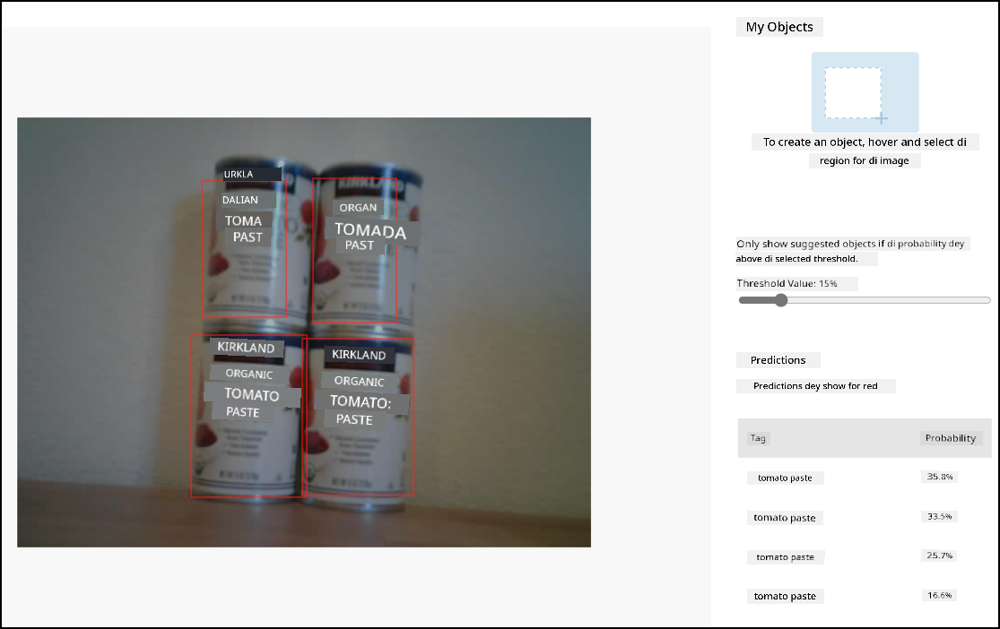

<!--
CO_OP_TRANSLATOR_METADATA:
{
  "original_hash": "4cf1421420a6fab9ab4f2c391bd523b7",
  "translation_date": "2025-11-18T19:53:11+00:00",
  "source_file": "5-retail/lessons/2-check-stock-device/wio-terminal-object-detector.md",
  "language_code": "pcm"
}
-->
# Call your object detector from your IoT device - Wio Terminal

Wen you don publish your object detector, you fit use am from your IoT device.

## Copy di image classifier project

Most of di stock detector na di same as di image classifier wey you don create for one previous lesson.

### Task - copy di image classifier project

1. Connect your ArduCam to your Wio Terminal, follow di steps wey dey for [lesson 2 of di manufacturing project](../../../4-manufacturing/lessons/2-check-fruit-from-device/wio-terminal-camera.md#task---connect-the-camera).

    You fit wan fix di camera for one position, like hang di cable for top box or can, or use double-sided tape take fix di camera to one box.

1. Create new Wio Terminal project with PlatformIO. Give di project name `stock-counter`.

1. Follow di steps wey dey for [lesson 2 of di manufacturing project](../../../4-manufacturing/lessons/2-check-fruit-from-device/README.md#task---capture-an-image-using-an-iot-device) to capture images from di camera.

1. Follow di steps wey dey for [lesson 2 of di manufacturing project](../../../4-manufacturing/lessons/2-check-fruit-from-device/README.md#task---classify-images-from-your-iot-device) to call di image classifier. Most of di code go dey reused to detect objects.

## Change di code from classifier to image detector

Di code wey you use to classify images dey almost di same as di code to detect objects. Di main difference na di URL wey you get from Custom Vision, and di results wey di call go return.

### Task - change di code from classifier to image detector

1. Add dis include directive for di top of di `main.cpp` file:

    ```cpp
    #include <vector>
    ```

1. Change di name of di `classifyImage` function to `detectStock`, both di name of di function and di call for di `buttonPressed` function.

1. For di top of di `detectStock` function, declare one threshold to remove any detections wey get low probability:

    ```cpp
    const float threshold = 0.3f;
    ```

    Unlike image classifier wey dey return only one result per tag, di object detector go return plenty results, so any wey get low probability need to dey filtered out.

1. For di top of di `detectStock` function, declare one function to process di predictions:

    ```cpp
    void processPredictions(std::vector<JsonVariant> &predictions)
    {
        for(JsonVariant prediction : predictions)
        {
            String tag = prediction["tagName"].as<String>();
            float probability = prediction["probability"].as<float>();
    
            char buff[32];
            sprintf(buff, "%s:\t%.2f%%", tag.c_str(), probability * 100.0);
            Serial.println(buff);
        }
    }
    ```

    Dis one go take list of predictions and print dem for di serial monitor.

1. For di `detectStock` function, replace di contents of di `for` loop wey dey loop through di predictions with dis:

    ```cpp
    std::vector<JsonVariant> passed_predictions;

    for(JsonVariant prediction : predictions) 
    {
        float probability = prediction["probability"].as<float>();
        if (probability > threshold)
        {
            passed_predictions.push_back(prediction);
        }
    }

    processPredictions(passed_predictions);
    ```

    Dis one go loop through di predictions, compare di probability to di threshold. All predictions wey get probability wey high pass di threshold go dey added to one `list` and go dey passed to di `processPredictions` function.

1. Upload and run your code. Point di camera to objects wey dey for shelf and press di C button. You go see di output for di serial monitor:

    ```output
    Connecting to WiFi..
    Connected!
    Image captured
    Image read to buffer with length 17416
    tomato paste:   35.84%
    tomato paste:   35.87%
    tomato paste:   34.11%
    tomato paste:   35.16%
    ```

    > 💁 You fit need adjust di `threshold` to better value for your images.

    You go fit see di image wey dem take, and dis values for di **Predictions** tab for Custom Vision.

    

> 💁 You fit find dis code for di [code-detect/wio-terminal](../../../../../5-retail/lessons/2-check-stock-device/code-detect/wio-terminal) folder.

😀 Your stock counter program work well!

---

<!-- CO-OP TRANSLATOR DISCLAIMER START -->
**Disclaimer**:  
Dis dokyument don translate wit AI translation service [Co-op Translator](https://github.com/Azure/co-op-translator). Even as we dey try make sure say e correct, abeg no forget say machine translation fit get mistake or no dey accurate well. Di original dokyument for im native language na di main source wey you go fit trust. For important information, e good make you use professional human translation. We no go fit take blame for any misunderstanding or wrong interpretation wey fit happen because you use dis translation.
<!-- CO-OP TRANSLATOR DISCLAIMER END -->