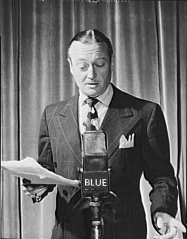
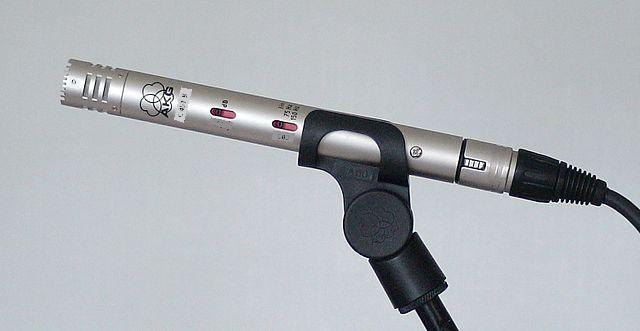
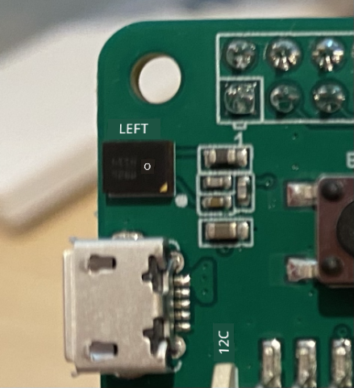

<!--
CO_OP_TRANSLATOR_METADATA:
{
  "original_hash": "6d6aa1be033625d201a190fc9c5cbfb4",
  "translation_date": "2025-11-18T19:26:29+00:00",
  "source_file": "6-consumer/lessons/1-speech-recognition/README.md",
  "language_code": "pcm"
}
-->
# Recognize speech wit IoT device


> Sketchnote by [Nitya Narasimhan](https://github.com/nitya). Click di image for bigger version.

Dis video go show overview of Azure speech service, na wetin we go talk about for dis lesson:

[](https://www.youtube.com/watch?v=iW0Fw0l3mrA)

> 🎥 Click di image above to watch di video

## Pre-lecture quiz

[Pre-lecture quiz](https://black-meadow-040d15503.1.azurestaticapps.net/quiz/41)

## Introduction

'Alexa, set timer for 12 minutes'

'Alexa, wetin remain for di timer?'

'Alexa, set timer for 8 minutes, name am steam broccoli'

Smart devices dey everywhere now. No be only smart speakers like HomePods, Echos, and Google Homes, but dem dey inside our phones, watches, even light fittings and thermostats.

> 💁 I get like 19 devices for my house wey get voice assistant, and na di ones wey I sabi be dat!

Voice control dey make life easy for people wey no fit move well. Whether na permanent disability like person wey no get hand, or temporary one like broken hand, or even when your hand dey full with shopping or you dey carry pikin, to fit control your house with voice instead of hand dey open plenty doors. To shout 'Hey Siri, close my garage door' when you dey change baby diaper and dey handle stubborn toddler fit make life small small better.

One popular way people dey use voice assistant na to set timer, especially for kitchen. To fit set plenty timers with just your voice dey help well well for kitchen - no need to stop kneading dough, stirring soup, or clean hand wey get dumpling filling to use physical timer.

For dis lesson, you go learn how to put voice recognition for IoT devices. You go sabi about microphones as sensors, how to capture audio from microphone wey dey IoT device, and how to use AI to turn wetin e hear to text. For di rest of dis project, you go build smart kitchen timer wey fit set timer with your voice for different languages.

For dis lesson we go talk about:

* [Microphones](../../../../../6-consumer/lessons/1-speech-recognition)
* [Capture audio from your IoT device](../../../../../6-consumer/lessons/1-speech-recognition)
* [Speech to text](../../../../../6-consumer/lessons/1-speech-recognition)
* [Convert speech to text](../../../../../6-consumer/lessons/1-speech-recognition)

## Microphones

Microphones na analog sensors wey dey change sound wave to electrical signal. Vibration for air go make di microphone parts move small small, and e go cause small change for di electrical signal. Dem go amplify di change to create electrical output.

### Microphone types

Microphones get different types:

* Dynamic - Dynamic microphones get magnet wey dey attach to moving diaphragm wey dey move inside wire coil to create electrical current. E dey opposite of loudspeakers wey dey use electrical current to move magnet inside wire coil to create sound. So, speakers fit work as dynamic microphones, and dynamic microphones fit work as speakers. For devices like intercoms wey person dey either talk or listen, one device fit work as both speaker and microphone.

    Dynamic microphones no need power to work, di electrical signal dey come directly from di microphone.

    

* Ribbon - Ribbon microphones dey similar to dynamic microphones, but dem get metal ribbon instead of diaphragm. Di ribbon dey move for magnetic field to create electrical current. Like dynamic microphones, ribbon microphones no need power to work.

    

* Condenser - Condenser microphones get thin metal diaphragm and fixed metal backplate. Electricity dey applied to both, and as di diaphragm dey vibrate, di static charge between di plates dey change to create signal. Condenser microphones need power to work - dem dey call am *Phantom power*.

    

* MEMS - Microelectromechanical systems microphones, or MEMS, na microphones wey dey for chip. Dem get pressure-sensitive diaphragm wey dem etch for silicon chip, and dem dey work like condenser microphone. Dis microphones fit dey very small, and dem dey fit inside circuit.

    

    For di image above, di chip wey dem label **LEFT** na MEMS microphone, with tiny diaphragm wey no reach one millimeter wide.

✅ Do small research: Wetin be di microphones wey dey around you - whether na for your computer, phone, headset or other devices. Wetin be di type of microphones dem be?

### Digital audio

Audio na analog signal wey dey carry plenty fine-grained information. To change dis signal to digital, dem go sample di audio many thousands of times per second.

> 🎓 Sampling na di process to change di audio signal to digital value wey go represent di signal for dat time.


Digital audio dey use Pulse Code Modulation, or PCM. PCM na di process to read di voltage of di signal, and choose di closest value to di voltage using defined size.

> 💁 You fit think of PCM as di sensor version of pulse width modulation, or PWM (PWM na wetin we talk about for [lesson 3 of di getting started project](../../../1-getting-started/lessons/3-sensors-and-actuators/README.md#pulse-width-modulation)). PCM dey change analog signal to digital, while PWM dey change digital signal to analog.

For example, most streaming music services dey use 16-bit or 24-bit audio. Dis mean say dem dey change di voltage to value wey fit enter 16-bit integer, or 24-bit integer. 16-bit audio dey fit di value into number wey dey range from -32,768 to 32,767, while 24-bit dey range from −8,388,608 to 8,388,607. Di more bits, di closer di sample go dey to wetin our ear dey actually hear.

> 💁 You fit don hear of 8-bit audio, wey dem dey call LoFi. Dis na audio wey dem sample with only 8-bits, so -128 to 127. Di first computer audio na 8 bits because of hardware limitation, so you fit see am for retro gaming.

Dem dey take dis samples many thousands of times per second, with well-defined sample rates wey dem dey measure in KHz (thousands of readings per second). Streaming music services dey use 48KHz for most audio, but some 'lossless' audio dey use up to 96KHz or even 192KHz. Di higher di sample rate, di closer di audio go dey to di original, but e get limit. People dey argue whether humans fit sabi di difference above 48KHz.

✅ Do small research: If you dey use streaming music service, wetin be di sample rate and size wey dem dey use? If you dey use CDs, wetin be di sample rate and size of CD audio?

Audio data get different formats. You don probably hear of mp3 files - audio data wey dem compress to make am small without losing quality. Uncompressed audio dey usually dey as WAV file - dis na file wey get 44 bytes of header information, followed by raw audio data. Di header dey carry information like sample rate (e.g., 16000 for 16KHz), sample size (16 for 16-bit), and di number of channels. After di header, di WAV file go carry di raw audio data.

> 🎓 Channels na how many different audio streams dey inside di audio. For example, stereo audio wey get left and right go get 2 channels. For 7.1 surround sound for home theater system, e go get 8.

### Audio data size

Audio data dey big. For example, to capture uncompressed 16-bit audio at 16KHz (wey dey good enough for speech to text model), e go take 32KB of data for each second of audio:

* 16-bit mean 2 bytes per sample (1 byte na 8 bits).
* 16KHz na 16,000 samples per second.
* 16,000 x 2 bytes = 32,000 bytes per second.

E fit sound small, but if you dey use microcontroller wey get small memory, e fit plenty. For example, Wio Terminal get 192KB memory, and dat one go still store program code and variables. Even if your program code dey small, you no fit capture more than 5 seconds of audio.

Microcontrollers fit access extra storage, like SD cards or flash memory. If you dey build IoT device wey dey capture audio, you go need make sure say you get extra storage, and your code dey write di audio wey microphone capture directly to di storage. When you wan send am to di cloud, you go stream am from storage to di web request. Dis one go help you avoid memory wahala wey fit happen if you try hold di whole audio data for memory at once.

## Capture audio from your IoT device

Your IoT device fit connect to microphone to capture audio, ready to change am to text. E fit also connect to speakers to play audio. For later lessons, we go use am to give audio feedback, but e good to set up speakers now to test di microphone.

### Task - configure your microphone and speakers

Follow di guide wey match your device to configure microphone and speakers:

* [Arduino - Wio Terminal](wio-terminal-microphone.md)
* [Single-board computer - Raspberry Pi](pi-microphone.md)
* [Single-board computer - Virtual device](virtual-device-microphone.md)

### Task - capture audio

Follow di guide wey match your device to capture audio:

* [Arduino - Wio Terminal](wio-terminal-audio.md)
* [Single-board computer - Raspberry Pi](pi-audio.md)
* [Single-board computer - Virtual device](virtual-device-audio.md)

## Speech to text

Speech to text, or speech recognition, na di process to use AI to change words for audio signal to text.

### Speech recognition models

To change speech to text, dem dey group di audio signal samples together and put dem inside machine learning model wey dey based on Recurrent Neural Network (RNN). Dis type of machine learning model dey use previous data to decide wetin di new data mean. For example, di RNN fit detect one block of audio samples as di sound 'Hel', and when e see another one wey e think say na 'lo', e fit join dem together, find say 'Hello' na valid word, and choose am as di answer.

ML models dey always accept data wey get di same size every time. Di image classifier wey you build for earlier lesson dey resize images to fixed size before e process dem. Di same thing dey happen for speech models, dem dey process fixed size audio chunks. Speech models dey combine di outputs of multiple predictions to get di answer, so dem fit know di difference between 'Hi' and 'Highway', or 'flock' and 'floccinaucinihilipilification'.

Speech models don advance reach di level wey dem fit understand context, and fit correct di words wey dem detect as dem dey process more sounds. For example, if you talk "I went to the shops to get two bananas and an apple too", you go use three words wey sound di same, but dem spell different - to, two, and too. Speech models fit understand di context and use di correct spelling.

> 💁 Some speech services dey allow customization to make dem work better for noisy places like factories, or with industry-specific words like chemical names. Dis customization dey train by providing sample audio and transcription, and e dey work with transfer learning, di same way you train image classifier with only few images for earlier lesson.

### Privacy

When you dey use speech to text for consumer IoT device, privacy dey very important. Dis devices dey listen to audio steady, so as consumer, you no go want make everything wey you talk dey go cloud dey turn to text. E no go only use plenty Internet bandwidth, e go also get big privacy wahala, especially when some smart device makers dey randomly select audio for [humans to check against di text wey dem generate to help improve di model](https://www.theverge.com/2019/4/10/18305378/amazon-alexa-ai-voice-assistant-annotation-listen-private-recordings).
You go wan make sure say your smart device no dey send audio go cloud for processing unless you dey use am, no be when e dey hear audio for your house, audio wey fit include private meeting or personal gist. Most smart devices dey work with *wake word*, one key phrase like "Alexa", "Hey Siri", or "OK Google" wey go make the device 'wake up' and begin listen to wetin you dey talk until e detect say you don stop to dey talk, wey mean say you don finish to dey talk to the device.

> 🎓 Wake word detection dey also dey call *Keyword spotting* or *Keyword recognition*.

Dem dey detect this wake word for the device, no be for cloud. These smart devices get small AI models wey dey run for the device wey dey listen for the wake word, and when e detect am, e go begin stream the audio go cloud for recognition. These models dey very specialized, and dem dey just dey listen for the wake word.

> 💁 Some tech companies dey add more privacy to their devices and dey do some of the speech to text conversion for the device. Apple don announce say for their 2021 iOS and macOS updates, dem go support speech to text conversion for device, and fit handle many requests without needing to use the cloud. This one na because dem get powerful processors for their devices wey fit run ML models.

✅ Wetin you think say be the privacy and ethical wahala wey dey follow storing the audio wey dem send go cloud? Dem suppose store this audio, and if yes, how dem go do am? You think say using recordings for law enforcement na better trade off for the loss of privacy?

Wake word detection dey usually use one technique wey dem dey call TinyML, wey mean say dem dey convert ML models to fit run for microcontrollers. These models dey small in size, and dem no dey use plenty power to run.

To avoid the wahala of training and using wake word model, the smart timer wey you dey build for this lesson go use button to turn on the speech recognition.

> 💁 If you wan try create wake word detection model wey go run for Wio Terminal or Raspberry Pi, check this [responding to your voice tutorial by Edge Impulse](https://docs.edgeimpulse.com/docs/responding-to-your-voice). If you wan use your computer do am, you fit try the [get started with Custom Keyword quickstart on the Microsoft docs](https://docs.microsoft.com/azure/cognitive-services/speech-service/keyword-recognition-overview?WT.mc_id=academic-17441-jabenn).

## Convert speech to text


Just like how e be for image classification for one earlier project, dem get pre-built AI services wey fit take speech as audio file and convert am to text. One of these services na Speech Service, part of the Cognitive Services, pre-built AI services wey you fit use for your apps.

### Task - configure a speech AI resource

1. Create one Resource Group for this project wey dem go call `smart-timer`

1. Use this command wey dey below to create free speech resource:

    ```sh
    az cognitiveservices account create --name smart-timer \
                                        --resource-group smart-timer \
                                        --kind SpeechServices \
                                        --sku F0 \
                                        --yes \
                                        --location <location>
    ```

    Replace `<location>` with the location wey you use when you dey create the Resource Group.

1. You go need API key to fit access the speech resource from your code. Run this command wey dey below to get the key:

    ```sh
    az cognitiveservices account keys list --name smart-timer \
                                           --resource-group smart-timer \
                                           --output table
    ```

    Copy one of the keys.

### Task - convert speech to text

Follow the guide wey dey relevant to convert speech to text for your IoT device:

* [Arduino - Wio Terminal](wio-terminal-speech-to-text.md)
* [Single-board computer - Raspberry Pi](pi-speech-to-text.md)
* [Single-board computer - Virtual device](virtual-device-speech-to-text.md)

---

## 🚀 Challenge

Speech recognition don dey for long time, and e dey improve every time. Do research about the current capabilities and compare how dem don change over time, including how accurate machine transcriptions dey compared to human.

Wetin you think say the future go be for speech recognition?

## Post-lecture quiz

[Post-lecture quiz](https://black-meadow-040d15503.1.azurestaticapps.net/quiz/42)

## Review & Self Study

* Read about the different microphone types and how dem dey work for the [what's the difference between dynamic and condenser microphones article on Musician's HQ](https://musicianshq.com/whats-the-difference-between-dynamic-and-condenser-microphones/).
* Read more about the Cognitive Services speech service for the [speech service documentation on Microsoft Docs](https://docs.microsoft.com/azure/cognitive-services/speech-service/?WT.mc_id=academic-17441-jabenn)
* Read about keyword spotting for the [keyword recognition documentation on Microsoft Docs](https://docs.microsoft.com/azure/cognitive-services/speech-service/keyword-recognition-overview?WT.mc_id=academic-17441-jabenn)

## Assignment

[](assignment.md)

---

<!-- CO-OP TRANSLATOR DISCLAIMER START -->
**Disclaimer**:  
Dis dokyument don use AI translation service [Co-op Translator](https://github.com/Azure/co-op-translator) do di translation. Even as we dey try make am accurate, abeg sabi say automated translations fit get mistake or no dey correct well. Di original dokyument for im native language na di main source wey you go fit trust. For important information, e better make professional human translation dey use. We no go fit take blame for any misunderstanding or wrong interpretation wey fit happen because you use dis translation.
<!-- CO-OP TRANSLATOR DISCLAIMER END -->