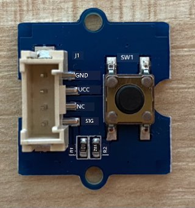
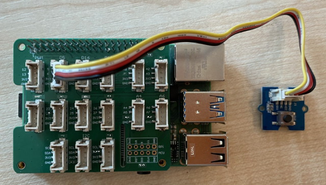

<!--
CO_OP_TRANSLATOR_METADATA:
{
  "original_hash": "0ac0afcfb40cb5970ef4cb74f01c32e9",
  "translation_date": "2025-11-18T19:29:29+00:00",
  "source_file": "6-consumer/lessons/1-speech-recognition/pi-audio.md",
  "language_code": "pcm"
}
-->
# Capture audio - Raspberry Pi

For dis part of di lesson, you go write code wey go capture audio for your Raspberry Pi. Di audio capture go dey control by one button.

## Hardware

Raspberry Pi need one button to control di audio capture.

Di button wey you go use na Grove button. Dis one na digital sensor wey dey turn signal on or off. Di button fit configure to send high signal wen you press am, and low wen you no press am, or low wen you press am and high wen you no press am.

If you dey use ReSpeaker 2-Mics Pi HAT as microphone, you no need connect button because di hat don already get button. Just move go di next section.

### Connect di button

Di button fit connect to di Grove base hat.

#### Task - connect di button



1. Put one end of Grove cable inside di socket for di button module. E go only enter one way.

1. Wen di Raspberry Pi dey off, connect di other end of di Grove cable to di digital socket wey dem mark **D5** for di Grove Base hat wey dey attach to di Pi. Dis socket na di second one from di left, for di row of sockets wey dey near di GPIO pins.



## Capture audio

You fit capture audio from di microphone using Python code.

### Task - capture audio

1. Power di Pi and wait make e boot.

1. Open VS Code, either directly for di Pi, or connect am through di Remote SSH extension.

1. Di PyAudio Pip package get functions to record and play back audio. Dis package dey depend on some audio libraries wey you need install first. Run di commands wey dey below for terminal to install dem:

    ```sh
    sudo apt update
    sudo apt install libportaudio0 libportaudio2 libportaudiocpp0 portaudio19-dev libasound2-plugins --yes 
    ```

1. Install di PyAudio Pip package.

    ```sh
    pip3 install pyaudio
    ```

1. Create new folder wey you go call `smart-timer` and add one file wey you go call `app.py` inside di folder.

1. Add di imports wey dey below to di top of dis file:

    ```python
    import io
    import pyaudio
    import time
    import wave
    
    from grove.factory import Factory
    ```

    Dis one dey import di `pyaudio` module, some standard Python modules to handle wave files, and di `grove.factory` module to import `Factory` wey go create button class.

1. Under dis one, add code to create Grove button.

    If you dey use di ReSpeaker 2-Mics Pi HAT, use dis code:

    ```python
    # The button on the ReSpeaker 2-Mics Pi HAT
    button = Factory.getButton("GPIO-LOW", 17)
    ```

    Dis one dey create button for port **D17**, di port wey di button for di ReSpeaker 2-Mics Pi HAT dey connect to. Dis button dey set to send low signal wen you press am.

    If you no dey use di ReSpeaker 2-Mics Pi HAT, and you dey use Grove button wey connect to di base hat, use dis code.

    ```python
    button = Factory.getButton("GPIO-HIGH", 5)
    ```

    Dis one dey create button for port **D5** wey dem set to send high signal wen you press am.

1. Under dis one, create instance of di PyAudio class wey go handle audio:

    ```python
    audio = pyaudio.PyAudio()
    ```

1. Declare di hardware card number for di microphone and speaker. Dis one go be di number of di card wey you find wen you run `arecord -l` and `aplay -l` earlier for dis lesson.

    ```python
    microphone_card_number = <microphone card number>
    speaker_card_number = <speaker card number>
    ```

    Replace `<microphone card number>` with di number of your microphone card.

    Replace `<speaker card number>` with di number of your speaker card, di same number wey you set for di `alsa.conf` file.

1. Under dis one, declare di sample rate wey you go use for di audio capture and playback. You fit need change dis one depending on di hardware wey you dey use.

    ```python
    rate = 48000 #48KHz
    ```

    If you dey get sample rate errors wen you dey run dis code later, change dis value to `44100` or `16000`. Di higher di value, di better di sound quality.

1. Under dis one, create new function wey you go call `capture_audio`. Dis one go dey called to capture audio from di microphone:

    ```python
    def capture_audio():
    ```

1. Inside dis function, add di code wey dey below to capture di audio:

    ```python
    stream = audio.open(format = pyaudio.paInt16,
                        rate = rate,
                        channels = 1, 
                        input_device_index = microphone_card_number,
                        input = True,
                        frames_per_buffer = 4096)

    frames = []

    while button.is_pressed():
        frames.append(stream.read(4096))

    stream.stop_stream()
    stream.close()
    ```

    Dis code dey open audio input stream using di PyAudio object. Dis stream go capture audio from di microphone at 16KHz, dey capture am inside buffers wey be 4096 bytes in size.

    Di code go dey loop wen di Grove button dey pressed, dey read dis 4096 byte buffers into array each time.

    > 💁 You fit read more about di options wey dem pass to di `open` method for di [PyAudio documentation](https://people.csail.mit.edu/hubert/pyaudio/docs/).

    Wen di button release, di stream go stop and close.

1. Add di code wey dey below to di end of dis function:

    ```python
    wav_buffer = io.BytesIO()
    with wave.open(wav_buffer, 'wb') as wavefile:
        wavefile.setnchannels(1)
        wavefile.setsampwidth(audio.get_sample_size(pyaudio.paInt16))
        wavefile.setframerate(rate)
        wavefile.writeframes(b''.join(frames))
        wav_buffer.seek(0)

    return wav_buffer
    ```

    Dis code dey create binary buffer, and dey write all di captured audio to am as [WAV file](https://wikipedia.org/wiki/WAV). Dis one na standard way to write uncompressed audio to file. Di buffer go then return.

1. Add di `play_audio` function wey dey below to play back di audio buffer:

    ```python
    def play_audio(buffer):
        stream = audio.open(format = pyaudio.paInt16,
                            rate = rate,
                            channels = 1,
                            output_device_index = speaker_card_number,
                            output = True)
    
        with wave.open(buffer, 'rb') as wf:
            data = wf.readframes(4096)
    
            while len(data) > 0:
                stream.write(data)
                data = wf.readframes(4096)
    
            stream.close()
    ```

    Dis function dey open another audio stream, dis time for output - to play di audio. E dey use di same settings as di input stream. Di buffer go then open as wave file and write am to di output stream in 4096 byte chunks, dey play di audio. Di stream go then close.

1. Add di code wey dey below di `capture_audio` function to loop until di button dey pressed. Wen di button dey pressed, di audio go capture, then play.

    ```python
    while True:
        while not button.is_pressed():
            time.sleep(.1)
        
        buffer = capture_audio()
        play_audio(buffer)
    ```

1. Run di code. Press di button and talk inside di microphone. Release di button wen you don finish, and you go hear di recording.

    You fit get some ALSA errors wen di PyAudio instance dey created. Dis one dey happen because of di configuration for di Pi for audio devices wey you no get. You fit ignore dis errors.

    ```output
    pi@raspberrypi:~/smart-timer $ python3 app.py 
    ALSA lib pcm.c:2565:(snd_pcm_open_noupdate) Unknown PCM cards.pcm.front
    ALSA lib pcm.c:2565:(snd_pcm_open_noupdate) Unknown PCM cards.pcm.rear
    ALSA lib pcm.c:2565:(snd_pcm_open_noupdate) Unknown PCM cards.pcm.center_lfe
    ALSA lib pcm.c:2565:(snd_pcm_open_noupdate) Unknown PCM cards.pcm.side
    ```

    If you get dis error:

    ```output
    OSError: [Errno -9997] Invalid sample rate
    ```

    then change di `rate` to either 44100 or 16000.

> 💁 You fit find dis code for di [code-record/pi](../../../../../6-consumer/lessons/1-speech-recognition/code-record/pi) folder.

😀 Your audio recording program don work well!

---

<!-- CO-OP TRANSLATOR DISCLAIMER START -->
**Disclaimer**:  
Dis document don use AI translation service [Co-op Translator](https://github.com/Azure/co-op-translator) take translate am. Even though we dey try make e accurate, abeg sabi say automated translations fit get mistake or no correct well. Di original document for di native language na di main correct source. For important information, e better make una use professional human translation. We no go fit take blame for any misunderstanding or wrong interpretation wey fit happen because of dis translation.
<!-- CO-OP TRANSLATOR DISCLAIMER END -->