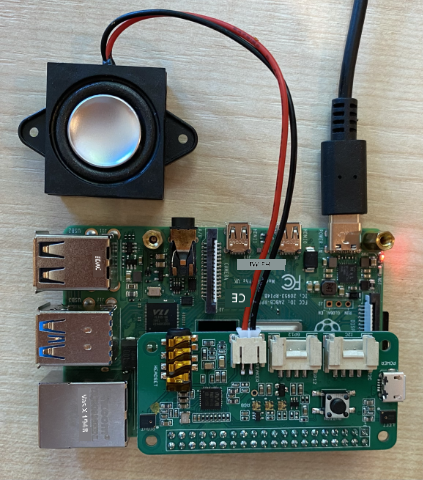

<!--
CO_OP_TRANSLATOR_METADATA:
{
  "original_hash": "7e45d884493c5222348b43fbc4481b6a",
  "translation_date": "2025-11-18T19:28:03+00:00",
  "source_file": "6-consumer/lessons/1-speech-recognition/pi-microphone.md",
  "language_code": "pcm"
}
-->
# Configure your microphone and speakers - Raspberry Pi

For dis part of di lesson, you go add microphone and speakers to your Raspberry Pi.

## Hardware

Raspberry Pi need microphone.

Di Pi no get microphone wey dey inside am, so you go need add external microphone. You fit do am in different ways:

* USB microphone
* USB headset
* USB all in one speakerphone
* USB audio adapter and microphone wey get 3.5mm jack
* [ReSpeaker 2-Mics Pi HAT](https://www.seeedstudio.com/ReSpeaker-2-Mics-Pi-HAT.html)

> 💁 Bluetooth microphones no dey work well for Raspberry Pi, so if you get bluetooth microphone or headset, you fit get wahala to pair am or capture audio.

Raspberry Pi get 3.5mm headphone jack. You fit use am connect headphones, headset or speaker. You fit also add speakers using:

* HDMI audio through monitor or TV
* USB speakers
* USB headset
* USB all in one speakerphone
* [ReSpeaker 2-Mics Pi HAT](https://www.seeedstudio.com/ReSpeaker-2-Mics-Pi-HAT.html) wey get speaker wey you fit attach, either to di 3.5mm jack or di JST port

## Connect and configure di microphone and speakers

Di microphone and speakers need make you connect and configure dem.

### Task - connect and configure di microphone

1. Connect di microphone using di correct method. For example, connect am through one of di USB ports.

1. If you dey use di ReSpeaker 2-Mics Pi HAT, you fit remove di Grove base hat, then put di ReSpeaker hat for di place.

    

    You go need Grove button later for dis lesson, but one dey inside dis hat, so di Grove base hat no dey necessary.

    Once you don fit di hat, you go need install some drivers. Check di [Seeed getting started instructions](https://wiki.seeedstudio.com/ReSpeaker_2_Mics_Pi_HAT_Raspberry/#getting-started) for driver installation instructions.

    > ⚠️ Di instructions dey use `git` to clone repository. If you no get `git` for your Pi, you fit install am by running dis command:
    >
    > ```sh
    > sudo apt install git --yes
    > ```

1. Run dis command for your Terminal either for di Pi, or connect am using VS Code and remote SSH session to see info about di microphone wey you connect:

    ```sh
    arecord -l
    ```

    You go see list of microphones wey dey connect. E go look like dis:

    ```output
    pi@raspberrypi:~ $ arecord -l
    **** List of CAPTURE Hardware Devices ****
    card 1: M0 [eMeet M0], device 0: USB Audio [USB Audio]
      Subdevices: 1/1
      Subdevice #0: subdevice #0
    ```

    If you get only one microphone, you go see only one entry. Configuration of microphones fit hard for Linux, so e better make you use only one microphone and unplug any other one.

    Write down di card number, you go need am later. For di output wey dey above, di card number na 1.

### Task - connect and configure di speaker

1. Connect di speakers using di correct method.

1. Run dis command for your Terminal either for di Pi, or connect am using VS Code and remote SSH session to see info about di speakers wey you connect:

    ```sh
    aplay -l
    ```

    You go see list of speakers wey dey connect. E go look like dis:

    ```output
    pi@raspberrypi:~ $ aplay -l
    **** List of PLAYBACK Hardware Devices ****
    card 0: Headphones [bcm2835 Headphones], device 0: bcm2835 Headphones [bcm2835 Headphones]
      Subdevices: 8/8
      Subdevice #0: subdevice #0
      Subdevice #1: subdevice #1
      Subdevice #2: subdevice #2
      Subdevice #3: subdevice #3
      Subdevice #4: subdevice #4
      Subdevice #5: subdevice #5
      Subdevice #6: subdevice #6
      Subdevice #7: subdevice #7
    card 1: M0 [eMeet M0], device 0: USB Audio [USB Audio]
      Subdevices: 1/1
      Subdevice #0: subdevice #0
    ```

    You go always see `card 0: Headphones` because na di headphone jack wey dey inside di Pi. If you add extra speakers, like USB speaker, you go see am for di list too.

1. If you dey use extra speaker, and no be speaker or headphones wey connect to di headphone jack wey dey inside di Pi, you need configure am as di default. To do dis, run dis command:

    ```sh
    sudo nano /usr/share/alsa/alsa.conf
    ```

    Dis go open configuration file for `nano`, wey be terminal-based text editor. Use di arrow keys for your keyboard scroll down until you see dis line:

    ```output
    defaults.pcm.card 0
    ```

    Change di value from `0` to di card number of di card wey you wan use from di list wey come back from di call to `aplay -l`. For example, for di output wey dey above, e get second sound card wey be `card 1: M0 [eMeet M0], device 0: USB Audio [USB Audio]`, wey dey use card 1. To use dis one, I go update di line to be:

    ```output
    defaults.pcm.card 1
    ```

    Set dis value to di correct card number. You fit use di arrow keys for your keyboard navigate to di number, then delete and type di new number like normal when you dey edit text files.

1. Save di changes and close di file by pressing `Ctrl+x`. Press `y` to save di file, then `return` to select di file name.

### Task - test di microphone and speaker

1. Run dis command to record 5 seconds of audio through di microphone:

    ```sh
    arecord --format=S16_LE --duration=5 --rate=16000 --file-type=wav out.wav
    ```

    As dis command dey run, make noise into di microphone like talk, sing, beat box, play instrument or anything wey you like.

1. After 5 seconds, di recording go stop. Run dis command to play di audio:

    ```sh
    aplay --format=S16_LE --rate=16000 out.wav
    ```

    You go hear di audio wey dey play back through di speakers. Adjust di output volume for your speaker if e dey necessary.

1. If you need adjust di volume of di microphone port wey dey inside di Pi, or adjust di gain of di microphone, you fit use di `alsamixer` utility. You fit read more about dis utility for di [Linux alsamixer man page](https://linux.die.net/man/1/alsamixer)

1. If you get errors to play di audio, check di card wey you set as di `defaults.pcm.card` for di `alsa.conf` file.

---

<!-- CO-OP TRANSLATOR DISCLAIMER START -->
**Disclaimer**:  
Dis dokyument don dey translet wit AI translet service [Co-op Translator](https://github.com/Azure/co-op-translator). Even as we dey try make am correct, abeg make you sabi say translet wey machine do fit get mistake or no dey accurate. Di original dokyument for im native language na di one wey you go take as di correct source. For important mata, e good make you use professional human translet. We no go fit take blame for any misunderstanding or wrong interpretation wey fit happen because you use dis translet.
<!-- CO-OP TRANSLATOR DISCLAIMER END -->