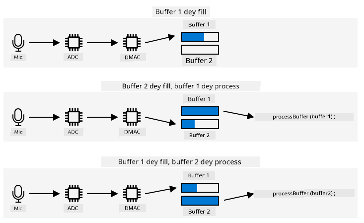

<!--
CO_OP_TRANSLATOR_METADATA:
{
  "original_hash": "2f336726b9410e97c3aaed76cc89b0d8",
  "translation_date": "2025-11-18T19:23:24+00:00",
  "source_file": "6-consumer/lessons/1-speech-recognition/wio-terminal-audio.md",
  "language_code": "pcm"
}
-->
# Capture audio - Wio Terminal

For dis part of di lesson, you go write code wey go capture audio for your Wio Terminal. Di audio capture go dey control by one of di buttons wey dey di top of di Wio Terminal.

## Program di device to capture audio

You fit capture audio from di microphone using C++ code. Di Wio Terminal get only 192KB RAM, e no go fit capture pass few seconds of audio. E also get 4MB flash memory, so you fit use am instead, save di captured audio for di flash memory.

Di microphone wey dey inside di Wio Terminal dey capture analog signal, wey dem go convert to digital signal wey di Wio Terminal fit use. Wen you dey capture audio, di data need to dey capture for di correct time - for example, to capture audio for 16KHz, di audio need to dey capture exactly 16,000 times per second, with equal time gap between each sample. Instead make your code dey do dis one, you fit use di direct memory access controller (DMAC). Dis na hardware wey fit capture signal from somewhere and write am go memory, e no go disturb your code wey dey run for di processor.

✅ Read more about DMA for di [direct memory access page for Wikipedia](https://wikipedia.org/wiki/Direct_memory_access).



Di DMAC fit capture audio from di ADC for fixed time gap, like 16,000 times per second for 16KHz audio. E fit write di captured data go pre-allocated memory buffer, and wen di buffer don full, e go make am available for your code to process. Using dis memory fit delay di audio capture, but you fit set up multiple buffers. Di DMAC go write to buffer 1, wen e don full, e go notify your code to process buffer 1, while di DMAC dey write to buffer 2. Wen buffer 2 don full, e go notify your code, and e go go back to write for buffer 1. Dis way, as long as you dey process each buffer before di time wey e go take fill one, you no go lose any data.

Wen each buffer don capture, e fit write am go di flash memory. Flash memory need make you write am using defined addresses, specify where to write and how big to write, e dey similar to updating array of bytes for memory. Flash memory get granularity, meaning erase and write operations dey depend not only on fixed size, but e need align to dat size. For example, if di granularity na 4096 bytes and you request erase for address 4200, e fit erase all di data from address 4096 to 8192. Dis mean say wen you dey write di audio data go flash memory, e need dey for di correct chunk size.

### Task - configure flash memory

1. Create new Wio Terminal project using PlatformIO. Call di project `smart-timer`. Add code for di `setup` function to configure di serial port.

1. Add di following library dependencies for di `platformio.ini` file to give access to di flash memory:

    ```ini
    lib_deps =
        seeed-studio/Seeed Arduino FS @ 2.1.1
        seeed-studio/Seeed Arduino SFUD @ 2.0.2
    ```

1. Open di `main.cpp` file and add di following include directive for di flash memory library for di top of di file:

    ```cpp
    #include <sfud.h>
    #include <SPI.h>
    ```

    > 🎓 SFUD mean Serial Flash Universal Driver, na library wey dem design to work with all flash memory chips.

1. For di `setup` function, add di following code to set up di flash storage library:

    ```cpp
    while (!(sfud_init() == SFUD_SUCCESS))
        ;

    sfud_qspi_fast_read_enable(sfud_get_device(SFUD_W25Q32_DEVICE_INDEX), 2);
    ```

    Dis code dey loop until di SFUD library don initialize, then e go turn on fast reads. Di flash memory wey dey inside fit dey access using Queued Serial Peripheral Interface (QSPI), na type of SPI controller wey dey allow continuous access through queue with small processor usage. Dis one dey make am fast to read and write to flash memory.

1. Create new file for di `src` folder wey you go call `flash_writer.h`.

1. Add di following for di top of dis file:

    ```cpp
    #pragma once

    #include <Arduino.h>
    #include <sfud.h>
    ```

    Dis one dey include some header files wey you need, including di header file for di SFUD library to interact with flash memory.

1. Define class for dis new header file wey you go call `FlashWriter`:

    ```cpp
    class FlashWriter
    {
    public:
    
    private:
    };
    ```

1. For di `private` section, add di following code:

    ```cpp
    byte *_sfudBuffer;
    size_t _sfudBufferSize;
    size_t _sfudBufferPos;
    size_t _sfudBufferWritePos;

    const sfud_flash *_flash;
    ```

    Dis one dey define some fields for di buffer wey you go use to store data before you write am go di flash memory. E get byte array, `_sfudBuffer`, to write data to, and wen e don full, di data go dey write go flash memory. Di `_sfudBufferPos` field dey store di current location to write to for dis buffer, and `_sfudBufferWritePos` dey store di location for flash memory to write to. `_flash` na pointer to di flash memory wey you go write to - some microcontrollers get multiple flash memory chips.

1. Add di following method for di `public` section to initialize dis class:

    ```cpp
    void init()
    {
        _flash = sfud_get_device_table() + 0;
        _sfudBufferSize = _flash->chip.erase_gran;
        _sfudBuffer = new byte[_sfudBufferSize];
        _sfudBufferPos = 0;
        _sfudBufferWritePos = 0;
    }
    ```

    Dis one dey configure di flash memory for di Wio Terminal to write to, and e dey set up di buffers based on di grain size of di flash memory. Dis one dey for `init` method, e no dey for constructor because e need dey call after di flash memory don set up for di `setup` function.

1. Add di following code for di `public` section:

    ```cpp
    void writeSfudBuffer(byte b)
    {
        _sfudBuffer[_sfudBufferPos++] = b;
        if (_sfudBufferPos == _sfudBufferSize)
        {
            sfud_erase_write(_flash, _sfudBufferWritePos, _sfudBufferSize, _sfudBuffer);
            _sfudBufferWritePos += _sfudBufferSize;
            _sfudBufferPos = 0;
        }
    }

    void writeSfudBuffer(byte *b, size_t len)
    {
        for (size_t i = 0; i < len; ++i)
        {
            writeSfudBuffer(b[i]);
        }
    }

    void flushSfudBuffer()
    {
        if (_sfudBufferPos > 0)
        {
            sfud_erase_write(_flash, _sfudBufferWritePos, _sfudBufferSize, _sfudBuffer);
            _sfudBufferWritePos += _sfudBufferSize;
            _sfudBufferPos = 0;
        }
    }
    ```

    Dis code dey define methods to write bytes to di flash storage system. E dey work by writing to in-memory buffer wey dey di correct size for di flash memory, and wen e don full, e go write am go di flash memory, erase any existing data for dat location. E also get `flushSfudBuffer` to write incomplete buffer, because di data wey you dey capture no go dey exact multiples of di grain size, so di end part of di data need dey write.

    > 💁 Di end part of di data go write extra data wey no dey needed, but e dey ok because na only di data wey you need go dey read.

### Task - set up audio capture

1. Create new file for di `src` folder wey you go call `config.h`.

1. Add di following for di top of dis file:

    ```cpp
    #pragma once

    #define RATE 16000
    #define SAMPLE_LENGTH_SECONDS 4
    #define SAMPLES RATE * SAMPLE_LENGTH_SECONDS
    #define BUFFER_SIZE (SAMPLES * 2) + 44
    #define ADC_BUF_LEN 1600
    ```

    Dis code dey set up some constants for di audio capture.

    | Constant              | Value  | Description |
    | --------------------- | -----: | - |
    | RATE                  | 16000  | Di sample rate for di audio. 16,000 na 16KHz |
    | SAMPLE_LENGTH_SECONDS | 4      | Di length of audio to capture. Dis one dey set to 4 seconds. To record longer audio, increase dis one. |
    | SAMPLES               | 64000  | Di total number of audio samples wey dem go capture. Set am to di sample rate * di number of seconds |
    | BUFFER_SIZE           | 128044 | Di size of di audio buffer to capture. Audio go dey capture as WAV file, wey be 44 bytes of header, then 128,000 bytes of audio data (each sample na 2 bytes) |
    | ADC_BUF_LEN           | 1600   | Di size of di buffers to use to capture audio from di DMAC |

    > 💁 If you feel say 4 seconds dey too short to request timer, you fit increase di `SAMPLE_LENGTH_SECONDS` value, and all di other values go recalculate.

1. Create new file for di `src` folder wey you go call `mic.h`.

1. Add di following for di top of dis file:

    ```cpp
    #pragma once

    #include <Arduino.h>

    #include "config.h"
    #include "flash_writer.h"
    ```

    Dis one dey include some header files wey you need, including di `config.h` and `FlashWriter` header files.

1. Add di following to define `Mic` class wey fit capture from di microphone:

    ```cpp
    class Mic
    {
    public:
        Mic()
        {
            _isRecording = false;
            _isRecordingReady = false;
        }
    
        void startRecording()
        {
            _isRecording = true;
            _isRecordingReady = false;
        }
    
        bool isRecording()
        {
            return _isRecording;
        }
    
        bool isRecordingReady()
        {
            return _isRecordingReady;
        }
    
    private:
        volatile bool _isRecording;
        volatile bool _isRecordingReady;
        FlashWriter _writer;
    };
    
    Mic mic;
    ```

    Dis class get small fields to track if recording don start, and if recording don ready to use. Wen di DMAC don set up, e dey write to memory buffers continuously, so di `_isRecording` flag dey determine if dem go process am or ignore am. Di `_isRecordingReady` flag go dey set wen di required 4 seconds of audio don capture. Di `_writer` field dey save di audio data go flash memory.

    Global variable go dey declare for one instance of di `Mic` class.

1. Add di following code for di `private` section of di `Mic` class:

    ```cpp
    typedef struct
    {
        uint16_t btctrl;
        uint16_t btcnt;
        uint32_t srcaddr;
        uint32_t dstaddr;
        uint32_t descaddr;
    } dmacdescriptor;

    // Globals - DMA and ADC
    volatile dmacdescriptor _wrb[DMAC_CH_NUM] __attribute__((aligned(16)));
    dmacdescriptor _descriptor_section[DMAC_CH_NUM] __attribute__((aligned(16)));
    dmacdescriptor _descriptor __attribute__((aligned(16)));

    void configureDmaAdc()
    {
        // Configure DMA to sample from ADC at a regular interval (triggered by timer/counter)
        DMAC->BASEADDR.reg = (uint32_t)_descriptor_section;                    // Specify the location of the descriptors
        DMAC->WRBADDR.reg = (uint32_t)_wrb;                                    // Specify the location of the write back descriptors
        DMAC->CTRL.reg = DMAC_CTRL_DMAENABLE | DMAC_CTRL_LVLEN(0xf);           // Enable the DMAC peripheral
        DMAC->Channel[1].CHCTRLA.reg = DMAC_CHCTRLA_TRIGSRC(TC5_DMAC_ID_OVF) | // Set DMAC to trigger on TC5 timer overflow
                                        DMAC_CHCTRLA_TRIGACT_BURST;             // DMAC burst transfer

        _descriptor.descaddr = (uint32_t)&_descriptor_section[1];                    // Set up a circular descriptor
        _descriptor.srcaddr = (uint32_t)&ADC1->RESULT.reg;                           // Take the result from the ADC0 RESULT register
        _descriptor.dstaddr = (uint32_t)_adc_buf_0 + sizeof(uint16_t) * ADC_BUF_LEN; // Place it in the adc_buf_0 array
        _descriptor.btcnt = ADC_BUF_LEN;                                             // Beat count
        _descriptor.btctrl = DMAC_BTCTRL_BEATSIZE_HWORD |                            // Beat size is HWORD (16-bits)
                                DMAC_BTCTRL_DSTINC |                                    // Increment the destination address
                                DMAC_BTCTRL_VALID |                                     // Descriptor is valid
                                DMAC_BTCTRL_BLOCKACT_SUSPEND;                           // Suspend DMAC channel 0 after block transfer
        memcpy(&_descriptor_section[0], &_descriptor, sizeof(_descriptor));          // Copy the descriptor to the descriptor section

        _descriptor.descaddr = (uint32_t)&_descriptor_section[0];                    // Set up a circular descriptor
        _descriptor.srcaddr = (uint32_t)&ADC1->RESULT.reg;                           // Take the result from the ADC0 RESULT register
        _descriptor.dstaddr = (uint32_t)_adc_buf_1 + sizeof(uint16_t) * ADC_BUF_LEN; // Place it in the adc_buf_1 array
        _descriptor.btcnt = ADC_BUF_LEN;                                             // Beat count
        _descriptor.btctrl = DMAC_BTCTRL_BEATSIZE_HWORD |                            // Beat size is HWORD (16-bits)
                                DMAC_BTCTRL_DSTINC |                                    // Increment the destination address
                                DMAC_BTCTRL_VALID |                                     // Descriptor is valid
                                DMAC_BTCTRL_BLOCKACT_SUSPEND;                           // Suspend DMAC channel 0 after block transfer
        memcpy(&_descriptor_section[1], &_descriptor, sizeof(_descriptor));          // Copy the descriptor to the descriptor section

        // Configure NVIC
        NVIC_SetPriority(DMAC_1_IRQn, 0); // Set the Nested Vector Interrupt Controller (NVIC) priority for DMAC1 to 0 (highest)
        NVIC_EnableIRQ(DMAC_1_IRQn);      // Connect DMAC1 to Nested Vector Interrupt Controller (NVIC)

        // Activate the suspend (SUSP) interrupt on DMAC channel 1
        DMAC->Channel[1].CHINTENSET.reg = DMAC_CHINTENSET_SUSP;

        // Configure ADC
        ADC1->INPUTCTRL.bit.MUXPOS = ADC_INPUTCTRL_MUXPOS_AIN12_Val; // Set the analog input to ADC0/AIN2 (PB08 - A4 on Metro M4)
        while (ADC1->SYNCBUSY.bit.INPUTCTRL)
            ;                              // Wait for synchronization
        ADC1->SAMPCTRL.bit.SAMPLEN = 0x00; // Set max Sampling Time Length to half divided ADC clock pulse (2.66us)
        while (ADC1->SYNCBUSY.bit.SAMPCTRL)
            ;                                         // Wait for synchronization
        ADC1->CTRLA.reg = ADC_CTRLA_PRESCALER_DIV128; // Divide Clock ADC GCLK by 128 (48MHz/128 = 375kHz)
        ADC1->CTRLB.reg = ADC_CTRLB_RESSEL_12BIT |    // Set ADC resolution to 12 bits
                            ADC_CTRLB_FREERUN;          // Set ADC to free run mode
        while (ADC1->SYNCBUSY.bit.CTRLB)
            ;                       // Wait for synchronization
        ADC1->CTRLA.bit.ENABLE = 1; // Enable the ADC
        while (ADC1->SYNCBUSY.bit.ENABLE)
            ;                       // Wait for synchronization
        ADC1->SWTRIG.bit.START = 1; // Initiate a software trigger to start an ADC conversion
        while (ADC1->SYNCBUSY.bit.SWTRIG)
            ; // Wait for synchronization

        // Enable DMA channel 1
        DMAC->Channel[1].CHCTRLA.bit.ENABLE = 1;

        // Configure Timer/Counter 5
        GCLK->PCHCTRL[TC5_GCLK_ID].reg = GCLK_PCHCTRL_CHEN |     // Enable peripheral channel for TC5
                                            GCLK_PCHCTRL_GEN_GCLK1; // Connect generic clock 0 at 48MHz

        TC5->COUNT16.WAVE.reg = TC_WAVE_WAVEGEN_MFRQ; // Set TC5 to Match Frequency (MFRQ) mode
        TC5->COUNT16.CC[0].reg = 3000 - 1;            // Set the trigger to 16 kHz: (4Mhz / 16000) - 1
        while (TC5->COUNT16.SYNCBUSY.bit.CC0)
            ; // Wait for synchronization

        // Start Timer/Counter 5
        TC5->COUNT16.CTRLA.bit.ENABLE = 1; // Enable the TC5 timer
        while (TC5->COUNT16.SYNCBUSY.bit.ENABLE)
            ; // Wait for synchronization
    }

    uint16_t _adc_buf_0[ADC_BUF_LEN];
    uint16_t _adc_buf_1[ADC_BUF_LEN];
    ```

    Dis code dey define `configureDmaAdc` method wey dey configure di DMAC, connect am to di ADC and set am to dey populate two different alternating buffers, `_adc_buf_0` and `_adc_buf_1`.

    > 💁 One downside of microcontroller development na di complexity of di code wey you need to interact with hardware, because your code dey run for very low level dey interact with hardware directly. Dis code dey more complex pass wetin you go write for single-board computer or desktop computer because e no get operating system to help. Some libraries dey wey fit simplify dis one, but e still get plenty complexity.

1. Below dis, add di following code:

    ```cpp
    // WAV files have a header. This struct defines that header
    struct wavFileHeader
    {
        char riff[4];         /* "RIFF"                                  */
        long flength;         /* file length in bytes                    */
        char wave[4];         /* "WAVE"                                  */
        char fmt[4];          /* "fmt "                                  */
        long chunk_size;      /* size of FMT chunk in bytes (usually 16) */
        short format_tag;     /* 1=PCM, 257=Mu-Law, 258=A-Law, 259=ADPCM */
        short num_chans;      /* 1=mono, 2=stereo                        */
        long srate;           /* Sampling rate in samples per second     */
        long bytes_per_sec;   /* bytes per second = srate*bytes_per_samp */
        short bytes_per_samp; /* 2=16-bit mono, 4=16-bit stereo          */
        short bits_per_samp;  /* Number of bits per sample               */
        char data[4];         /* "data"                                  */
        long dlength;         /* data length in bytes (filelength - 44)  */
    };

    void initBufferHeader()
    {
        wavFileHeader wavh;

        strncpy(wavh.riff, "RIFF", 4);
        strncpy(wavh.wave, "WAVE", 4);
        strncpy(wavh.fmt, "fmt ", 4);
        strncpy(wavh.data, "data", 4);

        wavh.chunk_size = 16;
        wavh.format_tag = 1; // PCM
        wavh.num_chans = 1;  // mono
        wavh.srate = RATE;
        wavh.bytes_per_sec = (RATE * 1 * 16 * 1) / 8;
        wavh.bytes_per_samp = 2;
        wavh.bits_per_samp = 16;
        wavh.dlength = RATE * 2 * 1 * 16 / 2;
        wavh.flength = wavh.dlength + 44;

        _writer.writeSfudBuffer((byte *)&wavh, 44);
    }
    ```

    Dis code dey define di WAV header as struct wey dey take 44 bytes of memory. E dey write details about di audio file rate, size, and number of channels. Dis header go dey write go di flash memory.

1. Below dis code, add di following to declare method wey dem go call wen di audio buffers don ready to process:

    ```cpp
    void audioCallback(uint16_t *buf, uint32_t buf_len)
    {
        static uint32_t idx = 44;

        if (_isRecording)
        {
            for (uint32_t i = 0; i < buf_len; i++)
            {
                int16_t audio_value = ((int16_t)buf[i] - 2048) * 16;

                _writer.writeSfudBuffer(audio_value & 0xFF);
                _writer.writeSfudBuffer((audio_value >> 8) & 0xFF);
            }

            idx += buf_len;
                
            if (idx >= BUFFER_SIZE)
            {
                _writer.flushSfudBuffer();
                idx = 44;
                _isRecording = false;
                _isRecordingReady = true;
            }
        }
    }
    ```

    Di audio buffers na arrays of 16-bit integers wey dey contain di audio from di ADC. Di ADC dey return 12-bit unsigned values (0-1023), so dem need convert am to 16-bit signed values, and then convert am to 2 bytes to store as raw binary data.

    Dis bytes go dey write go di flash memory buffers. Di write go start for index 44 - dis na di offset from di 44 bytes wey dem don write as di WAV file header. Wen dem don capture all di bytes wey dem need for di required audio length, di remaining data go dey write go di flash memory.

1. For di `public` section of di `Mic` class, add di following code:

    ```cpp
    void dmaHandler()
    {
        static uint8_t count = 0;

        if (DMAC->Channel[1].CHINTFLAG.bit.SUSP)
        {
            DMAC->Channel[1].CHCTRLB.reg = DMAC_CHCTRLB_CMD_RESUME;
            DMAC->Channel[1].CHINTFLAG.bit.SUSP = 1;

            if (count)
            {
                audioCallback(_adc_buf_0, ADC_BUF_LEN);
            }
            else
            {
                audioCallback(_adc_buf_1, ADC_BUF_LEN);
            }

            count = (count + 1) % 2;
        }
    }
    ```

    Dis code go dey call by di DMAC to tell your code to process di buffers. E dey check say data dey to process, and e go call di `audioCallback` method with di correct buffer.

1. Outside di class, after di `Mic mic;` declaration, add di following code:

    ```cpp
    void DMAC_1_Handler()
    {
        mic.dmaHandler();
    }
    ```

    Di `DMAC_1_Handler` go dey call by di DMAC wen di buffers don ready to process. Dis function dey find by name, so e just need dey exist to dey call.

1. Add di following two methods for di `public` section of di `Mic` class:

    ```cpp
    void init()
    {
        analogReference(AR_INTERNAL2V23);

        _writer.init();

        initBufferHeader();
        configureDmaAdc();
    }

    void reset()
    {
        _isRecordingReady = false;
        _isRecording = false;

        _writer.reset();

        initBufferHeader();
    }
    ```

    Di `init` method get code to initialize di `Mic` class. Dis method dey set di correct voltage for di Mic pin, set up di flash memory writer, write di WAV file header, and configure di DMAC. Di `reset` method dey reset di flash memory and re-write di header after di audio don capture and use.

### Task - capture audio

1. For di `main.cpp` file, add include directive for di `mic.h` header file:

    ```cpp
    #include "mic.h"
    ```

1. For di `setup` function, initialize di C button. Audio capture go start wen dis button dey press, and e go continue for 4 seconds:

    ```cpp
    pinMode(WIO_KEY_C, INPUT_PULLUP);
    ```

1. Below dis, initialize di microphone, then print for di console say audio don ready to capture:

    ```cpp
    mic.init();

    Serial.println("Ready.");
    ```

1. Above di `loop` function, define function to process di captured audio. For now e no dey do anything, but later for dis lesson e go send di speech to convert am to text:

    ```cpp
    void processAudio()
    {
    
    }
    ```

1. Add di following for di `loop` function:

    ```cpp
    void loop()
    {
        if (digitalRead(WIO_KEY_C) == LOW && !mic.isRecording())
        {
            Serial.println("Starting recording...");
            mic.startRecording();
        }
    
        if (!mic.isRecording() && mic.isRecordingReady())
        {
            Serial.println("Finished recording");
    
            processAudio();
    
            mic.reset();
        }
    }
    ```

    Dis code dey check di C button, and if dem press am and recording never start, di `_isRecording` field of di `Mic` class go dey set to true. Dis one go make di `audioCallback` method of di `Mic` class dey store audio until 4 seconds don capture. Wen dem don capture 4 seconds of audio, di `_isRecording` field go dey set to false, and di `_isRecordingReady` field go dey set to true. Dis one go dey check for di `loop` function, and wen e true di `processAudio` function go dey call, then di mic class go reset.

1. Build dis code, upload am go your Wio Terminal and test am through di serial monitor. Press di C button (di one wey dey left-hand side, close to di power switch), and talk. Dem go capture 4 seconds of audio.

    ```output
    --- Available filters and text transformations: colorize, debug, default, direct, hexlify, log2file, nocontrol, printable, send_on_enter, time
    --- More details at http://bit.ly/pio-monitor-filters
    --- Miniterm on /dev/cu.usbmodem1101  9600,8,N,1 ---
    --- Quit: Ctrl+C | Menu: Ctrl+T | Help: Ctrl+T followed by Ctrl+H ---
    Ready.
    Starting recording...
    Finished recording
    ```

> 💁 You fit find dis code for di [code-record/wio-terminal](../../../../../6-consumer/lessons/1-speech-recognition/code-record/wio-terminal) folder.

😀 Your audio recording program work well!

---

<!-- CO-OP TRANSLATOR DISCLAIMER START -->
**Disclaimer**:  
Dis dokyument don use AI translation service [Co-op Translator](https://github.com/Azure/co-op-translator) do di translation. Even as we dey try make am accurate, abeg sabi say automated translations fit get mistake or no dey correct well. Di original dokyument for im native language na di main source wey you go fit trust. For important information, e good make professional human translation dey use. We no go fit take blame for any misunderstanding or wrong interpretation wey fit happen because you use dis translation.
<!-- CO-OP TRANSLATOR DISCLAIMER END -->