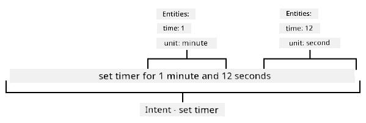
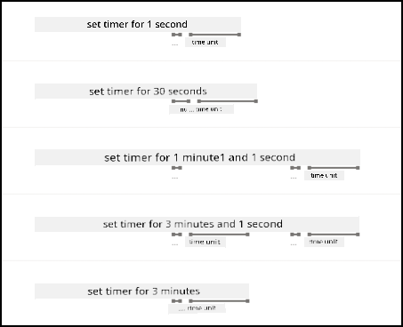

<!--
CO_OP_TRANSLATOR_METADATA:
{
  "original_hash": "6f4ba69d77f16c4a5110623a96a215c3",
  "translation_date": "2025-11-18T19:17:14+00:00",
  "source_file": "6-consumer/lessons/2-language-understanding/README.md",
  "language_code": "pcm"
}
-->
# Understand Language


> Sketchnote by [Nitya Narasimhan](https://github.com/nitya). Click di image for bigger version.

## Pre-lecture quiz

[Pre-lecture quiz](https://black-meadow-040d15503.1.azurestaticapps.net/quiz/43)

## Introduction

For di last lesson, you don turn speech to text. To fit use am program smart timer, your code go need sabi wetin dem talk. You fit assume say di person go talk one fixed sentence like "Set a 3 minute timer", den you go fit parse di sentence to know how long di timer go be. But dis no too friendly for user. If person talk "Set a timer for 3 minutes", you or me go sabi wetin dem mean, but your code no go sabi because e dey expect fixed sentence.

Na here language understanding enter, wey go use AI models to interpret text and return di details wey dem need. For example, e go fit understand both "Set a 3 minute timer" and "Set a timer for 3 minutes" say dem mean di same thing.

For dis lesson, you go learn about language understanding models, how to create dem, train dem, and use dem for your code.

For dis lesson we go cover:

* [Language understanding](../../../../../6-consumer/lessons/2-language-understanding)
* [Create a language understanding model](../../../../../6-consumer/lessons/2-language-understanding)
* [Intents and entities](../../../../../6-consumer/lessons/2-language-understanding)
* [Use the language understanding model](../../../../../6-consumer/lessons/2-language-understanding)

## Language understanding

Humans don dey use language to communicate for hundreds of thousands of years. We dey use words, sounds, or actions to talk and understand wetin dem mean, both di meaning of di words, sounds or actions, and di context. We sabi sincerity and sarcasm, so di same words fit mean different things depending on di tone of voice.

✅ Think about some of di conversations wey you don get recently. How many of di talk go hard computer to understand because e need context?

Language understanding, wey dem dey call natural-language understanding, na part of artificial intelligence wey dem dey call natural-language processing (NLP). E dey deal with reading comprehension, to try understand di details of words or sentences. If you don use voice assistant like Alexa or Siri, you don use language understanding services. Na dem dey behind di AI wey go turn "Alexa, play di latest album by Taylor Swift" to my pikin dey dance for di living room to her favorite songs.

> 💁 Computers, even with all di progress wey dem don make, still get long way to go to really understand text. When we talk about language understanding for computers, we no mean anything wey near human communication. We just mean to take some words and extract di key details.

As humans, we dey understand language without even thinking. If I tell another human "play di latest album by Taylor Swift", dem go sabi wetin I mean. But for computer, e go hard. E go need take di words, wey dem don turn from speech to text, and figure out di following:

* Music need to play
* Di music na by Taylor Swift
* Di music na full album with many tracks for order
* Taylor Swift get many albums, so dem go arrange dem by time and pick di latest one

✅ Think of some other sentences wey you don talk when you dey make requests, like to order coffee or ask person to pass you something. Try break dem down into di pieces of information wey computer go need to extract to understand di sentence.

Language understanding models na AI models wey dem dey train to extract certain details from language, and dem dey train dem for specific tasks using transfer learning, just like how you train Custom Vision model with small set of images. You fit take one model, then train am with di text wey you want make e understand.

## Create a language understanding model


You fit create language understanding models using LUIS, one language understanding service from Microsoft wey be part of Cognitive Services.

### Task - create an authoring resource

To use LUIS, you go need create one authoring resource.

1. Use di command below to create one authoring resource for your `smart-timer` resource group:

    ```python
    az cognitiveservices account create --name smart-timer-luis-authoring \
                                        --resource-group smart-timer \
                                        --kind LUIS.Authoring \
                                        --sku F0 \
                                        --yes \
                                        --location <location>
    ```

    Replace `<location>` with di location wey you use when you create di Resource Group.

    > ⚠️ LUIS no dey available for all regions, so if you see dis error:
    >
    > ```output
    > InvalidApiSetId: The account type 'LUIS.Authoring' is either invalid or unavailable in given region.
    > ```
    >
    > try pick another region.

    Dis go create free-tier LUIS authoring resource.

### Task - create a language understanding app

1. Open di LUIS portal for [luis.ai](https://luis.ai?WT.mc_id=academic-17441-jabenn) for your browser, and sign in with di same account wey you dey use for Azure.

1. Follow di instructions for di dialog to select your Azure subscription, then select di `smart-timer-luis-authoring` resource wey you just create.

1. From di *Conversation apps* list, select di **New app** button to create new application. Name di new app `smart-timer`, and set di *Culture* to your language.

    > 💁 Di field for prediction resource dey optional. You fit create another resource for prediction, but di free authoring resource dey allow 1,000 predictions per month, so e go do for development. You fit leave am blank.

1. Read di guide wey go show after you create di app to understand di steps wey you need to train di language understanding model. Close di guide when you don finish.

## Intents and entities

Language understanding dey based on *intents* and *entities*. Intents na wetin di words wan do, like play music, set timer, or order food. Entities na wetin di intent dey refer to, like di album, di timer length, or di type of food. Each sentence wey di model interpret go get at least one intent, and fit get one or more entities.

Some examples:

| Sentence                                            | Intent           | Entities                                   |
| --------------------------------------------------- | ---------------- | ------------------------------------------ |
| "Play di latest album by Taylor Swift"             | *play music*     | *di latest album by Taylor Swift*         |
| "Set a 3 minute timer"                              | *set a timer*    | *3 minutes*                                |
| "Cancel my timer"                                   | *cancel a timer* | None                                       |
| "Order 3 large pineapple pizzas and a caesar salad" | *order food*     | *3 large pineapple pizzas*, *caesar salad* |

✅ For di sentences wey you think about earlier, wetin go be di intent and di entities for di sentence?

To train LUIS, first you go set di entities. Dem fit be fixed list of terms, or dem fit learn from di text. For example, you fit provide fixed list of food wey dey your menu, with variations (or synonyms) of each word, like *egg plant* and *aubergine* as variations of *aubergine*. LUIS also get pre-built entities wey you fit use, like numbers and locations.

For setting timer, you fit get one entity wey go use di pre-built number entities for di time, and another one for di units, like minutes and seconds. Each unit go get multiple variations to cover singular and plural forms - like minute and minutes.

After you define di entities, you go create intents. Di model go learn di intents based on example sentences wey you provide (dem dey call dem utterances). For example, for *set timer* intent, you fit provide dis sentences:

* `set a 1 second timer`
* `set a timer for 1 minute and 12 seconds`
* `set a timer for 3 minutes`
* `set a 9 minute 30 second timer`

You go then tell LUIS which part of di sentences dey map to di entities:



Di sentence `set a timer for 1 minute and 12 seconds` get di intent of `set timer`. E also get 2 entities with 2 values each:

|            | time | unit   |
| ---------- | ---: | ------ |
| 1 minute   | 1    | minute |
| 12 seconds | 12   | second |

To train better model, you go need different example sentences to cover di many ways wey person fit ask for di same thing.

> 💁 As e be for any AI model, di more data and di more accurate di data wey you use train, di better di model go be.

✅ Think about di different ways wey you fit ask di same thing and expect human to understand.

### Task - add entities to di language understanding models

For di timer, you go need add 2 entities - one for di unit of time (minutes or seconds), and one for di number of minutes or seconds.

You fit find instructions for how to use di LUIS portal for di [Quickstart: Build your app in LUIS portal documentation on Microsoft docs](https://docs.microsoft.com/azure/cognitive-services/luis/luis-get-started-create-app?WT.mc_id=academic-17441-jabenn).

1. From di LUIS portal, select di *Entities* tab and add di *number* prebuilt entity by selecting di **Add prebuilt entity** button, then select *number* from di list.

1. Create new entity for di time unit using di **Create** button. Name di entity `time unit` and set di type to *List*. Add values for `minute` and `second` to di *Normalized values* list, adding di singular and plural forms to di *synonyms* list. Press `return` after you add each synonym to di list.

    | Normalized value | Synonyms        |
    | ---------------- | --------------- |
    | minute           | minute, minutes |
    | second           | second, seconds |

### Task - add intents to di language understanding models

1. From di *Intents* tab, select di **Create** button to create new intent. Name dis intent `set timer`.

1. For di examples, enter different ways to set timer using both minutes, seconds, and minutes and seconds together. Examples fit be:

    * `set a 1 second timer`
    * `set a 4 minute timer`
    * `set a four minute six second timer`
    * `set a 9 minute 30 second timer`
    * `set a timer for 1 minute and 12 seconds`
    * `set a timer for 3 minutes`
    * `set a timer for 3 minutes and 1 second`
    * `set a timer for three minutes and one second`
    * `set a timer for 1 minute and 1 second`
    * `set a timer for 30 seconds`
    * `set a timer for 1 second`

    Mix numbers as words and numerics so di model go sabi handle both.

1. As you dey enter each example, LUIS go start dey detect entities, and e go underline and label any one wey e find.

    

### Task - train and test di model

1. Once you don configure di entities and intents, you fit train di model using di **Train** button for di top menu. Select dis button, and di model go train for few seconds. Di button go grey out while e dey train, and e go re-enable when e finish.

1. Select di **Test** button from di top menu to test di language understanding model. Enter text like `set a timer for 5 minutes and 4 seconds` and press return. Di sentence go show for one box under di text box wey you type am into, and under dat you go see di *top intent*, or di intent wey dem detect with di highest probability. Dis go be `set timer`. Di intent name go dey followed by di probability say na di correct one.

1. Select di **Inspect** option to see breakdown of di results. You go see di top-scoring intent with di percentage probability, along with lists of di entities wey dem detect.

1. Close di *Test* pane when you don finish testing.

### Task - publish di model

To use dis model from code, you go need publish am. When you dey publish from LUIS, you fit publish to either staging environment for testing, or product environment for full release. For dis lesson, staging environment dey okay.

1. From di LUIS portal, select di **Publish** button from di top menu.

1. Make sure say *Staging slot* dey selected, then select **Done**. You go see notification when di app don publish.
1. You fit test dis one wit curl. To build di curl command, you go need three values - di endpoint, di application ID (App ID) and API key. You fit find dem for di **MANAGE** tab wey dey di top menu.

    1. For di *Settings* section, copy di App ID.

    1. For di *Azure Resources* section, select *Authoring Resource*, then copy di *Primary Key* and *Endpoint URL*.

1. Run di curl command wey dey below for your command prompt or terminal:

    ```sh
    curl "<endpoint url>/luis/prediction/v3.0/apps/<app id>/slots/staging/predict" \
          --request GET \
          --get \
          --data "subscription-key=<primary key>" \
          --data "verbose=false" \
          --data "show-all-intents=true" \
          --data-urlencode "query=<sentence>"
    ```

    Change `<endpoint url>` to di Endpoint URL wey dey di *Azure Resources* section.

    Change `<app id>` to di App ID wey dey di *Settings* section.

    Change `<primary key>` to di Primary Key wey dey di *Azure Resources* section.

    Change `<sentence>` to di sentence wey you wan test.

1. Di output wey go come from dis call na JSON document wey go show di query, di top intent, and list of entities wey dem break down by type.

    ```JSON
    {
        "query": "set a timer for 45 minutes and 12 seconds",
        "prediction": {
            "topIntent": "set timer",
            "intents": {
                "set timer": {
                    "score": 0.97031575
                },
                "None": {
                    "score": 0.02205793
                }
            },
            "entities": {
                "number": [
                    45,
                    12
                ],
                "time-unit": [
                    [
                        "minute"
                    ],
                    [
                        "second"
                    ]
                ]
            }
        }
    }
    ```

    Di JSON wey dey above na from query wey use `set a timer for 45 minutes and 12 seconds`:

    * Di `set timer` na di top intent wey get probability of 97%.
    * Dem detect two *number* entities, `45` and `12`.
    * Dem detect two *time-unit* entities, `minute` and `second`.

## Use di language understanding model

Once you don publish am, di LUIS model fit dey called from code. For di lessons wey don pass, you don use IoT Hub to handle communication wit cloud services, dey send telemetry and dey wait for commands. Dis one dey very asynchronous - once telemetry don go, your code no dey wait for response, and if di cloud service no dey work, you no go sabi.

For smart timer, we go need response sharp sharp, so we fit tell di user say timer don set, or alert dem say di cloud services no dey available. To do dis one, our IoT device go call web endpoint directly, instead of dey rely on IoT Hub.

Instead of calling LUIS from di IoT device, you fit use serverless code wey get different type of trigger - HTTP trigger. Dis one go allow your function app to dey listen for REST requests, and respond to dem. Dis function go be REST endpoint wey your device fit call.

> 💁 Even though you fit call LUIS directly from your IoT device, e better make you use serverless code. Dis way, if you wan change di LUIS app wey you dey call, like when you train better model or train model for different language, you go only need update your cloud code, you no go need re-deploy code to plenty IoT devices.

### Task - create serverless functions app

1. Create Azure Functions app wey dem call `smart-timer-trigger`, then open am for VS Code.

1. Add HTTP trigger to dis app wey dem call `speech-trigger` using di command wey dey below from inside di VS Code terminal:

    ```sh
    func new --name text-to-timer --template "HTTP trigger"
    ```

    Dis one go create HTTP trigger wey dem call `text-to-timer`.

1. Test di HTTP trigger by running di functions app. When e run, you go see di endpoint for di output:

    ```output
    Functions:
    
            text-to-timer: [GET,POST] http://localhost:7071/api/text-to-timer
    ```

    Test am by loading di [http://localhost:7071/api/text-to-timer](http://localhost:7071/api/text-to-timer) URL for your browser.

    ```output
    This HTTP triggered function executed successfully. Pass a name in the query string or in the request body for a personalized response.
    ```

### Task - use di language understanding model

1. Di SDK for LUIS dey available through Pip package. Add di line wey dey below to di `requirements.txt` file to add di dependency for dis package:

    ```sh
    azure-cognitiveservices-language-luis
    ```

1. Make sure say di VS Code terminal don activate di virtual environment, then run di command wey dey below to install di Pip packages:

    ```sh
    pip install -r requirements.txt
    ```

    > 💁 If error show, you fit need upgrade pip wit di command wey dey below:
    >
    > ```sh
    > pip install --upgrade pip
    > ```

1. Add new entries to di `local.settings.json` file for your LUIS API Key, Endpoint URL, and App ID wey dey di **MANAGE** tab for di LUIS portal:

    ```JSON
    "LUIS_KEY": "<primary key>",
    "LUIS_ENDPOINT_URL": "<endpoint url>",
    "LUIS_APP_ID": "<app id>"
    ```

    Change `<endpoint url>` to di Endpoint URL wey dey di *Azure Resources* section for di **MANAGE** tab. Dis one go be `https://<location>.api.cognitive.microsoft.com/`.

    Change `<app id>` to di App ID wey dey di *Settings* section for di **MANAGE** tab.

    Change `<primary key>` to di Primary Key wey dey di *Azure Resources* section for di **MANAGE** tab.

1. Add di imports wey dey below to di `__init__.py` file:

    ```python
    import json
    import os
    from azure.cognitiveservices.language.luis.runtime import LUISRuntimeClient
    from msrest.authentication import CognitiveServicesCredentials
    ```

    Dis one go import some system libraries, plus di libraries wey go interact wit LUIS.

1. Delete di contents wey dey di `main` method, then add di code wey dey below:

    ```python
    luis_key = os.environ['LUIS_KEY']
    endpoint_url = os.environ['LUIS_ENDPOINT_URL']
    app_id = os.environ['LUIS_APP_ID']
    
    credentials = CognitiveServicesCredentials(luis_key)
    client = LUISRuntimeClient(endpoint=endpoint_url, credentials=credentials)
    ```

    Dis one go load di values wey you add for di `local.settings.json` file for your LUIS app, create credentials object wit your API key, then create LUIS client object to interact wit your LUIS app.

1. Dis HTTP trigger go dey called passing di text wey you wan understand as JSON, wit di text dey inside property wey dem call `text`. Di code wey dey below go extract di value from di body of di HTTP request, then log am for di console. Add dis code to di `main` function:

    ```python
    req_body = req.get_json()
    text = req_body['text']
    logging.info(f'Request - {text}')
    ```

1. Predictions dey requested from LUIS by sending prediction request - JSON document wey get di text wey you wan predict. Create dis one wit di code wey dey below:

    ```python
    prediction_request = { 'query' : text }
    ```

1. Dis request fit then dey sent to LUIS, using di staging slot wey your app don publish to:

    ```python
    prediction_response = client.prediction.get_slot_prediction(app_id, 'Staging', prediction_request)
    ```

1. Di prediction response go get di top intent - di intent wey get di highest prediction score, plus di entities. If di top intent na `set timer`, then di entities fit dey read to get di time wey dem need for di timer:

    ```python
    if prediction_response.prediction.top_intent == 'set timer':
        numbers = prediction_response.prediction.entities['number']
        time_units = prediction_response.prediction.entities['time unit']
        total_seconds = 0
    ```

    Di `number` entities go be array of numbers. For example, if you talk *"Set a four minute 17 second timer."*, di `number` array go get 2 integers - 4 and 17.

    Di `time unit` entities go be array of arrays of strings, wit each time unit dey as array of strings inside di array. For example, if you talk *"Set a four minute 17 second timer."*, di `time unit` array go get 2 arrays wit single values each - `['minute']` and `['second']`.

    Di JSON version of dis entities for *"Set a four minute 17 second timer."* na:

    ```json
    {
        "number": [4, 17],
        "time unit": [
            ["minute"],
            ["second"]
        ]
    }
    ```

    Dis code also define count for di total time for di timer in seconds. Dis one go dey populated by di values wey dey di entities.

1. Di entities no dey linked, but we fit make some assumptions about dem. Dem go dey for di order wey you talk am, so di position for di array fit dey used to know which number match to which time unit. For example:

    * *"Set a 30 second timer"* - dis one go get one number, `30`, and one time unit, `second` so di single number go match di single time unit.
    * *"Set a 2 minute and 30 second timer"* - dis one go get two numbers, `2` and `30`, and two time units, `minute` and `second` so di first number go dey for di first time unit (2 minutes), and di second number for di second time unit (30 seconds).

    Di code wey dey below go get di count of items wey dey di number entities, then use am to extract di first item from each array, then di second and so on. Add dis one inside di `if` block.

    ```python
    for i in range(0, len(numbers)):
        number = numbers[i]
        time_unit = time_units[i][0]
    ```

    For *"Set a four minute 17 second timer."*, dis one go loop two times, give di values wey dey below:

    | loop count | `number` | `time_unit` |
    | ---------: | -------: | ----------- |
    | 0          | 4        | minute      |
    | 1          | 17       | second      |

1. Inside dis loop, use di number and time unit to calculate di total time for di timer, add 60 seconds for each minute, and di number of seconds for any seconds.

    ```python
    if time_unit == 'minute':
        total_seconds += number * 60
    else:
        total_seconds += number
    ```

1. Outside dis loop wey dey go through di entities, log di total time for di timer:

    ```python
    logging.info(f'Timer required for {total_seconds} seconds')
    ```

1. Di number of seconds go need dey returned from di function as HTTP response. For di end of di `if` block, add di code wey dey below:

    ```python
    payload = {
        'seconds': total_seconds
    }
    return func.HttpResponse(json.dumps(payload), status_code=200)
    ```

    Dis code go create payload wey get di total number of seconds for di timer, convert am to JSON string and return am as HTTP result wit status code of 200, wey mean say di call dey successful.

1. Finally, outside di `if` block, handle if di intent no dey recognized by returning error code:

    ```python
    return func.HttpResponse(status_code=404)
    ```

    404 na di status code for *not found*.

1. Run di function app and test am wit curl.

    ```sh
    curl --request POST 'http://localhost:7071/api/text-to-timer' \
         --header 'Content-Type: application/json' \
         --include \
         --data '{"text":"<text>"}'
    ```

    Change `<text>` to di text of your request, like `set a 2 minutes 27 second timer`.

    You go see di output wey dey below from di functions app:

    ```output
    Functions:

            text-to-timer: [GET,POST] http://localhost:7071/api/text-to-timer
    
    For detailed output, run func with --verbose flag.
    [2021-06-26T19:45:14.502Z] Worker process started and initialized.
    [2021-06-26T19:45:19.338Z] Host lock lease acquired by instance ID '000000000000000000000000951CAE4E'.
    [2021-06-26T19:45:52.059Z] Executing 'Functions.text-to-timer' (Reason='This function was programmatically called via the host APIs.', Id=f68bfb90-30e4-47a5-99da-126b66218e81)
    [2021-06-26T19:45:53.577Z] Timer required for 147 seconds
    [2021-06-26T19:45:53.746Z] Executed 'Functions.text-to-timer' (Succeeded, Id=f68bfb90-30e4-47a5-99da-126b66218e81, Duration=1750ms)
    ```

    Di call to curl go return di one wey dey below:

    ```output
    HTTP/1.1 200 OK
    Date: Tue, 29 Jun 2021 01:14:11 GMT
    Content-Type: text/plain; charset=utf-8
    Server: Kestrel
    Transfer-Encoding: chunked
    
    {"seconds": 147}
    ```

    Di number of seconds for di timer dey inside di `"seconds"` value.

> 💁 You fit find dis code for di [code/functions](../../../../../6-consumer/lessons/2-language-understanding/code/functions) folder.

### Task - make your function available to your IoT device

1. For your IoT device to call your REST endpoint, e go need sabi di URL. When you access am before, you use `localhost`, wey be shortcut to access REST endpoints for your local machine. To allow your IoT device get access, you go need either publish am to di cloud, or get your IP address to access am locally.

    > ⚠️ If you dey use Wio Terminal, e go easy to run di function app locally, because e get dependency on libraries wey mean say you no fit deploy di function app di same way wey you don do before. Run di function app locally and access am through your computer IP address. If you wan deploy am to di cloud, information go dey provided for di lesson wey go come later on how to do dis one.

    * Publish di Functions app - follow di instructions wey dey di lessons wey don pass to publish your functions app to di cloud. Once you don publish am, di URL go be `https://<APP_NAME>.azurewebsites.net/api/text-to-timer`, where `<APP_NAME>` go be di name of your functions app. Make sure say you publish your local settings too.

      When you dey work wit HTTP triggers, dem dey secure by default wit function app key. To get dis key, run di command wey dey below:

      ```sh
      az functionapp keys list --resource-group smart-timer \
                               --name <APP_NAME>                               
      ```

      Copy di value of di `default` entry wey dey di `functionKeys` section.

      ```output
      {
        "functionKeys": {
          "default": "sQO1LQaeK9N1qYD6SXeb/TctCmwQEkToLJU6Dw8TthNeUH8VA45hlA=="
        },
        "masterKey": "RSKOAIlyvvQEQt9dfpabJT018scaLpQu9p1poHIMCxx5LYrIQZyQ/g==",
        "systemKeys": {}
      }
      ```

      Dis key go need dey added as query parameter to di URL, so di final URL go be `https://<APP_NAME>.azurewebsites.net/api/text-to-timer?code=<FUNCTION_KEY>`, where `<APP_NAME>` go be di name of your functions app, and `<FUNCTION_KEY>` go be your default function key.

      > 💁 You fit change di type of authorization wey di HTTP trigger dey use wit `authlevel` setting wey dey di `function.json` file. You fit read more about dis one for di [configuration section of di Azure Functions HTTP trigger documentation for Microsoft docs](https://docs.microsoft.com/azure/azure-functions/functions-bindings-http-webhook-trigger?WT.mc_id=academic-17441-jabenn&tabs=python#configuration).

    * Run di functions app locally, and access am using di IP address - you fit get di IP address of your computer for your local network, then use am to build di URL.

      Find your IP address:

      * For Windows 10, follow di [find your IP address guide](https://support.microsoft.com/windows/find-your-ip-address-f21a9bbc-c582-55cd-35e0-73431160a1b9?WT.mc_id=academic-17441-jabenn)
      * For macOS, follow di [how to find you IP address on a Mac guide](https://www.hellotech.com/guide/for/how-to-find-ip-address-on-mac)
      * For linux, follow di section wey dey find your private IP address for di [how to find your IP address in Linux guide](https://opensource.com/article/18/5/how-find-ip-address-linux)

      Once you don get your IP address, you go fit access di function for `http://<IP_ADDRESS>:7071/api/text-to-timer`, where `<IP_ADDRESS>` go be your IP address, like `http://192.168.1.10:7071/api/text-to-timer`.

      > 💁 Note say dis one dey use port 7071, so after di IP address you go need add `:7071`.
> 💁 Dis go only work if your IoT device dey for di same network as your computer.

1. Test di endpoint by accessing am using curl.

---

## 🚀 Challenge

Plenty ways dey to request di same thing, like to set timer. Think of different ways to do am, and use dem as examples for your LUIS app. Test dem out, make you see how well your model fit handle di different ways to request timer.

## Post-lecture quiz

[Post-lecture quiz](https://black-meadow-040d15503.1.azurestaticapps.net/quiz/44)

## Review & Self Study

* Read more about LUIS and wetin e fit do for di [Language Understanding (LUIS) documentation page for Microsoft docs](https://docs.microsoft.com/azure/cognitive-services/luis/?WT.mc_id=academic-17441-jabenn)
* Read more about language understanding for di [natural-language understanding page for Wikipedia](https://wikipedia.org/wiki/Natural-language_understanding)
* Read more about HTTP triggers for di [Azure Functions HTTP trigger documentation for Microsoft docs](https://docs.microsoft.com/azure/azure-functions/functions-bindings-http-webhook-trigger?WT.mc_id=academic-17441-jabenn&tabs=python)

## Assignment

[Cancel di timer](assignment.md)

---

<!-- CO-OP TRANSLATOR DISCLAIMER START -->
**Disclaimer**:  
Dis dokyument don use AI translation service [Co-op Translator](https://github.com/Azure/co-op-translator) do di translation. Even as we dey try make am accurate, abeg sabi say automated translations fit get mistake or no dey correct well. Di original dokyument for im native language na di main source wey you go trust. For important information, e better make professional human translation dey use. We no go fit take blame for any misunderstanding or wrong interpretation wey fit happen because you use dis translation.
<!-- CO-OP TRANSLATOR DISCLAIMER END -->