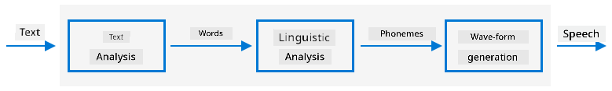

<!--
CO_OP_TRANSLATOR_METADATA:
{
  "original_hash": "b73fe10ec6b580fba2affb6f6e0a5c4d",
  "translation_date": "2025-11-18T19:14:18+00:00",
  "source_file": "6-consumer/lessons/3-spoken-feedback/README.md",
  "language_code": "pcm"
}
-->
# Set Timer and Give Spoken Feedback


> Sketchnote by [Nitya Narasimhan](https://github.com/nitya). Click di image for bigger version.

## Pre-lecture quiz

[Pre-lecture quiz](https://black-meadow-040d15503.1.azurestaticapps.net/quiz/45)

## Introduction

Smart assistants no be one-way communication device. You go talk to dem, dem go respond:

"Alexa, set 3 minute timer"

"Ok, your timer don set for 3 minutes"

For di last 2 lessons, you don learn how to take speech turn am to text, then extract timer request from di text. For dis lesson, you go learn how to set timer for IoT device, respond to di user with spoken words to confirm di timer, and alert dem when di timer don finish.

For dis lesson we go cover:

* [Text to speech](../../../../../6-consumer/lessons/3-spoken-feedback)
* [Set di timer](../../../../../6-consumer/lessons/3-spoken-feedback)
* [Convert text to speech](../../../../../6-consumer/lessons/3-spoken-feedback)

## Text to speech

Text to speech, as di name talk, na di process to turn text to audio wey go talk di text as spoken words. Di basic idea na to break di words for di text into di sounds wey dem dey made up of (dem dey call am phonemes), then join di audio for those sounds together, either with pre-recorded audio or audio wey AI models generate.



Text to speech systems dey usually get 3 stages:

* Text analysis
* Linguistic analysis
* Wave-form generation

### Text analysis

Text analysis na di process to take di text wey dem give, then turn am to words wey fit generate speech. For example, if you wan convert "Hello world", no need text analysis, di two words fit just turn to speech. But if you get "1234", you fit need convert am to "One thousand, two hundred thirty four" or "One, two, three, four" based on di context. For "I have 1234 apples", e go be "One thousand, two hundred thirty four", but for "The child counted 1234" e go be "One, two, three, four".

Di words wey dem go create fit change based on di language and di locale of di language. For example, for American English, 120 go be "One hundred twenty", but for British English e go be "One hundred and twenty", with di "and" after di hundreds.

✅ Some other examples wey need text analysis na "in" as short form of inch, and "st" as short form of saint and street. You fit think of other examples for your language wey words no clear without context?

Once dem don define di words, dem go send am for linguistic analysis.

### Linguistic analysis

Linguistic analysis go break di words into phonemes. Phonemes no just depend on di letters wey dem use, but di other letters for di word. For example, for English di 'a' sound for 'car' and 'care' no be di same. English language get 44 different phonemes for di 26 letters for alphabet, some dey share di same phoneme, like di one wey dey start 'circle' and 'serpent'.

✅ Do small research: Wetin be di phonemes for your language?

Once dem don turn di words to phonemes, di phonemes go need extra data to support intonation, adjust di tone or duration based on di context. One example na for English, pitch fit rise to turn sentence to question, if pitch rise for di last word, e mean question.

For example - di sentence "You have an apple" na statement wey talk say you get apple. If pitch rise for di end, increase for di word apple, e go turn to question "You have an apple?", dey ask if you get apple. Di linguistic analysis go use di question mark for di end to decide to increase pitch.

Once dem don generate di phonemes, dem go send am for wave-form generation to produce di audio output.

### Wave-form generation

Di first electronic text to speech systems dey use single audio recordings for each phoneme, so di voice dey sound robotic and monotonous. Di linguistic analysis go produce phonemes, dem go load am from database of sounds and join dem together to make di audio.

✅ Do small research: Find some audio recordings from early speech synthesis systems. Compare am to modern speech synthesis, like di one wey smart assistants dey use.

Modern wave-form generation dey use ML models wey dem build with deep learning (big neural networks wey dey work like neurons for brain) to produce natural sounding voices wey fit sound like human beings.

> 💁 Some of dis ML models fit re-train with transfer learning to sound like real people. Dis mean say to use voice as security system no too safe again, as anybody wey get few minutes recording of your voice fit impersonate you.

Dis big ML models dey train to combine all di three steps into end-to-end speech synthesizers.

## Set di timer

To set di timer, your IoT device go need call di REST endpoint wey you create with serverless code, then use di number of seconds wey e return to set timer.

### Task - call di serverless function to get di timer time

Follow di guide wey match your IoT device to call di REST endpoint and set timer for di time wey dem need:

* [Arduino - Wio Terminal](wio-terminal-set-timer.md)
* [Single-board computer - Raspberry Pi/Virtual IoT device](single-board-computer-set-timer.md)

## Convert text to speech

Di same speech service wey you use to turn speech to text fit also turn text back to speech, and you fit play am through speaker for your IoT device. Di text wey you wan convert go dey sent to di speech service, with di type of audio wey you need (like di sample rate), and e go return binary data wey get di audio.

When you send dis request, you go use *Speech Synthesis Markup Language* (SSML), XML-based markup language for speech synthesis apps. E dey define not only di text wey you wan convert, but di language of di text, di voice wey you go use, and e fit even define speed, volume, and pitch for some or all di words for di text.

For example, dis SSML dey define request to turn di text "Your 3 minute 5 second time has been set" to speech with British English voice wey dem call `en-GB-MiaNeural`

```xml
<speak version='1.0' xml:lang='en-GB'>
    <voice xml:lang='en-GB' name='en-GB-MiaNeural'>
        Your 3 minute 5 second time has been set
    </voice>
</speak>
```

> 💁 Most text to speech systems get plenty voices for different languages, with di correct accents like British English voice with English accent and New Zealand English voice with New Zealand accent.

### Task - convert text to speech

Follow di guide wey match your IoT device to convert text to speech:

* [Arduino - Wio Terminal](wio-terminal-text-to-speech.md)
* [Single-board computer - Raspberry Pi](pi-text-to-speech.md)
* [Single-board computer - Virtual device](virtual-device-text-to-speech.md)

---

## 🚀 Challenge

SSML get ways to change how words dey sound, like to add emphasis to some words, add pauses, or change pitch. Try some of dem, send different SSML from your IoT device and compare di output. You fit read more about SSML, including how to change di way words dey sound for di [Speech Synthesis Markup Language (SSML) Version 1.1 specification from di World Wide Web consortium](https://www.w3.org/TR/speech-synthesis11/).

## Post-lecture quiz

[Post-lecture quiz](https://black-meadow-040d15503.1.azurestaticapps.net/quiz/46)

## Review & Self Study

* Read more about speech synthesis for di [speech synthesis page for Wikipedia](https://wikipedia.org/wiki/Speech_synthesis)
* Read more about how criminals dey use speech synthesis to steal for di [fake voices 'help cyber crooks steal cash' story for BBC news](https://www.bbc.com/news/technology-48908736)
* Learn more about di risks to voice actors from synthesized versions of their voices for di [this TikTok lawsuit is highlighting how AI is screwing over voice actors article for Vice](https://www.vice.com/en/article/z3xqwj/this-tiktok-lawsuit-is-highlighting-how-ai-is-screwing-over-voice-actors)

## Assignment

[Cancel di timer](assignment.md)

---

<!-- CO-OP TRANSLATOR DISCLAIMER START -->
**Disclaimer**:  
Dis dokyument don use AI transleto service [Co-op Translator](https://github.com/Azure/co-op-translator) do di translation. Even as we dey try make am accurate, abeg sabi say machine translation fit get mistake or no dey 100% correct. Di original dokyument wey dey for im native language na di main source wey you go fit trust. For important information, e good make professional human transleto check am. We no go fit take blame for any misunderstanding or wrong interpretation wey fit happen because you use dis translation.
<!-- CO-OP TRANSLATOR DISCLAIMER END -->