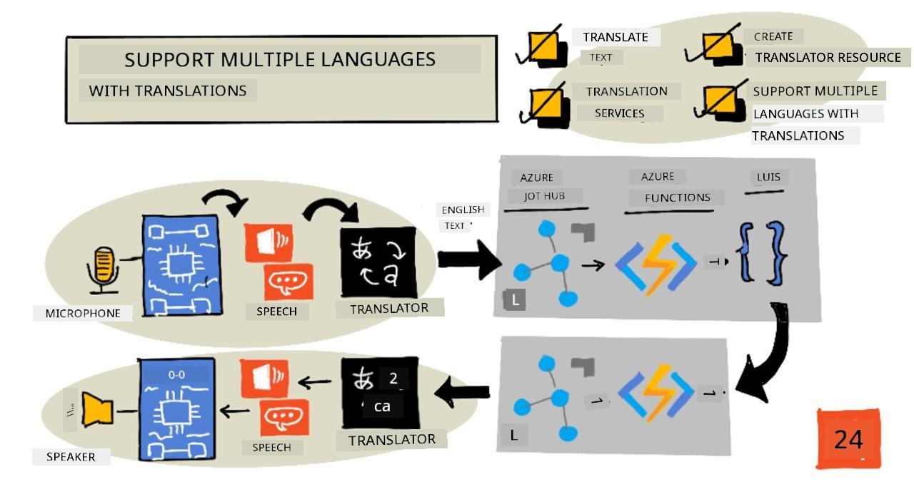
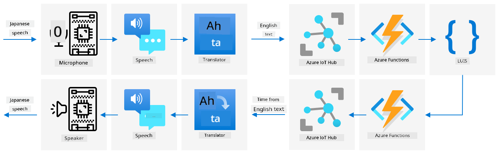

<!--
CO_OP_TRANSLATOR_METADATA:
{
  "original_hash": "c16de27b0074abe81d6a8bad5e5b1a6b",
  "translation_date": "2025-11-18T19:20:07+00:00",
  "source_file": "6-consumer/lessons/4-multiple-language-support/README.md",
  "language_code": "pcm"
}
-->
# Support plenty languages



> Sketchnote by [Nitya Narasimhan](https://github.com/nitya). Click di image for bigger version.

Dis video dey show overview of Azure speech services, e cover speech to text and text to speech from di earlier lessons, plus how to translate speech, wey be di topic for dis lesson:

[](https://www.youtube.com/watch?v=h6xbpMPSGEA)

> 🎥 Click di image above to watch di video

## Pre-lecture quiz

[Pre-lecture quiz](https://black-meadow-040d15503.1.azurestaticapps.net/quiz/47)

## Introduction

For di last 3 lessons, you don learn how to change speech to text, understand language, and change text to speech, all na AI dey power am. Another area wey AI fit help for human communication na language translation - to change one language to another, like English to French.

For dis lesson, you go learn how to use AI to translate text, so your smart timer fit interact with people for plenty languages.

For dis lesson we go talk about:

* [Translate text](../../../../../6-consumer/lessons/4-multiple-language-support)
* [Translation services](../../../../../6-consumer/lessons/4-multiple-language-support)
* [Create a translator resource](../../../../../6-consumer/lessons/4-multiple-language-support)
* [Support plenty languages for apps with translations](../../../../../6-consumer/lessons/4-multiple-language-support)
* [Translate text using AI service](../../../../../6-consumer/lessons/4-multiple-language-support)

> 🗑 Dis na di last lesson for dis project, so after you finish dis lesson and di assignment, no forget to clean up your cloud services. You go need di services to finish di assignment, so make sure say you complete am first.
>
> Check [di clean up your project guide](../../../clean-up.md) if you need instructions on how to do am.

## Translate text

Text translation na one computer science problem wey dem don dey research for over 70 years, and na now because of AI and computer power e dey almost solve am well well, almost like human translators.

> 💁 Di origin fit trace go back even further, to [Al-Kindi](https://wikipedia.org/wiki/Al-Kindi), one 9th century Arabic cryptographer wey develop techniques for language translation.

### Machine translations

Text translation start as one technology wey dem dey call Machine Translation (MT), wey fit translate between different language pairs. MT dey work by swapping words for one language with another, plus techniques to choose di correct way to translate phrases or parts of sentences when word-for-word translation no make sense.

> 🎓 When translators dey support translation between one language and another, dem dey call am *language pairs*. Different tools dey support different language pairs, and e no dey complete. For example, one translator fit support English to Spanish as language pair, and Spanish to Italian as language pair, but e no go support English to Italian.

For example, to translate "Hello world" from English to French fit be substitution - "Bonjour" for "Hello", and "le monde" for "world", wey go give correct translation "Bonjour le monde".

Substitution no dey work when different languages dey use different ways to talk di same thing. For example, di English sentence "My name is Jim", go translate to "Je m'appelle Jim" for French - e mean "I call myself Jim". "Je" na French for "I", "moi" na me, but e dey join di verb because e start with vowel, so e go be "m'", "appelle" na to call, and "Jim" no dey translate because na name, no be word wey fit translate. Word order fit also be wahala - simple substitution of "Je m'appelle Jim" go be "I myself call Jim", wey get different word order from English.

> 💁 Some words no dey translate - my name na Jim no matter di language wey I use introduce myself. If you dey translate to languages wey dey use different alphabets, or different letters for different sounds, di words fit dey *transliterated*, wey mean dem go choose letters or characters wey go make di sound match di original word.

Idioms na another wahala for translation. Dem be phrases wey get meaning wey no match di direct interpretation of di words. For example, for English di idiom "I've got ants in my pants" no mean say you get ants for your cloth, e mean say you dey restless. If you translate am to German, e go confuse di person wey dey hear am, because di German version na "I have bumble bees in the bottom".

> 💁 Different locales dey add different wahala. For di idiom "ants in your pants", for American English "pants" na outerwear, but for British English, "pants" na underwear.

✅ If you sabi speak plenty languages, think of some phrases wey no dey translate directly.

Machine translation systems dey depend on big databases of rules wey dey describe how to translate certain phrases and idioms, plus statistical methods to choose di correct translations from di options wey dey. Dis statistical methods dey use big databases of works wey humans don translate to plenty languages to choose di most likely translation, dis technique dem dey call *statistical machine translation*. Some of dem dey use intermediate representations of di language, so one language fit translate to di intermediate, then from di intermediate to another language. Dis way, to add more languages go involve translations to and from di intermediate, no be to and from all di other languages.

### Neural translations

Neural translations dey use di power of AI to translate, e dey usually translate whole sentences using one model. Dem dey train dis models with big data sets wey humans don translate, like web pages, books, and United Nations documentation.

Neural translation models dey usually smaller than machine translation models because dem no need big databases of phrases and idioms. Modern AI services wey dey provide translations dey mix plenty techniques, like statistical machine translation and neural translation.

No language pair get 1:1 translation. Different translation models go give slightly different results based on di data wey dem use train di model. Translations no dey always symmetrical - if you translate one sentence from one language to another, then back to di first language, you fit see slightly different sentence as di result.

✅ Try different online translators like [Bing Translate](https://www.bing.com/translator), [Google Translate](https://translate.google.com), or di Apple translate app. Compare di translated versions of some sentences. Also try to translate for one, then translate back for another.

## Translation services

Plenty AI services dey wey you fit use from your apps to translate speech and text.

### Cognitive services Speech service


Di speech service wey you don dey use for di past lessons get translation capabilities for speech recognition. When you dey recognize speech, you fit request di text of di speech for di same language, plus for other languages.

> 💁 Dis one dey only available from di speech SDK, di REST API no get translations inside.

### Cognitive services Translator service


Di Translator service na dedicated translation service wey fit translate text from one language to one or more target languages. Apart from translation, e get plenty extra features like masking bad words. E also allow you provide specific translation for one word or sentence, to work with terms wey you no want translate, or get specific well-known translation.

For example, if you dey translate di sentence "I have a Raspberry Pi", wey dey refer to di single-board computer, to another language like French, you go want keep di name "Raspberry Pi" as e be, no translate am, so e go be "J’ai un Raspberry Pi" instead of "J’ai une pi aux framboises".

## Create a translator resource

For dis lesson, you go need Translator resource. You go use di REST API to translate text.

### Task - create a translator resource

1. From your terminal or command prompt, run di command wey dey below to create translator resource for your `smart-timer` resource group.

    ```sh
    az cognitiveservices account create --name smart-timer-translator \
                                        --resource-group smart-timer \
                                        --kind TextTranslation \
                                        --sku F0 \
                                        --yes \
                                        --location <location>
    ```

    Replace `<location>` with di location wey you use when you dey create di Resource Group.

1. Get di key for di translator service:

    ```sh
    az cognitiveservices account keys list --name smart-timer-translator \
                                           --resource-group smart-timer \
                                           --output table
    ```

    Copy one of di keys.

## Support plenty languages for apps with translations

For ideal world, your whole app suppose sabi plenty languages as e fit, from listening to speech, to language understanding, to responding with speech. Dis na plenty work, so translation services fit help you deliver your app faster.



Imagine say you dey build one smart timer wey dey use English from start to finish, e dey understand spoken English and change am to text, e dey run di language understanding for English, e dey build responses for English and reply with English speech. If you wan add support for Japanese, you fit start by translating spoken Japanese to English text, then keep di main part of di app di same, then translate di response text to Japanese before e talk di response. Dis go allow you add Japanese support fast, and you fit expand am later to provide full Japanese support.

> 💁 Di wahala wey dey for machine translation na say different languages and cultures get different ways to talk di same thing, so di translation fit no match di expression wey you dey expect.

Machine translations dey also open possibilities for apps and devices wey fit translate user-created content as dem dey create am. Science fiction dey always show 'universal translators', devices wey fit translate alien languages to (mostly) American English. Dis devices no be science fiction again, na science fact, if you no count di alien part. Apps and devices dey already wey dey provide real-time translation of speech and written text, using combination of speech and translation services.

One example na di [Microsoft Translator](https://www.microsoft.com/translator/apps/?WT.mc_id=academic-17441-jabenn) mobile phone app, wey dem show for dis video:

[](https://www.youtube.com/watch?v=16yAGeP2FuM)

> 🎥 Click di image above to watch di video

Imagine say you get dis kind device, especially when you dey travel or dey interact with people wey you no sabi dia language. If airports or hospitals get automatic translation devices, e go make accessibility better.

✅ Do small research: Any translation IoT devices dey available for market? Wetin about translation features wey dey inside smart devices?

> 👽 Even though we no get true universal translators wey go allow us talk to aliens, di [Microsoft translator dey support Klingon](https://www.microsoft.com/translator/blog/2013/05/14/announcing-klingon-for-bing-translator/?WT.mc_id=academic-17441-jabenn). Qapla’!

## Translate text using AI service

You fit use AI service to add dis translation feature to your smart timer.

### Task - translate text using AI service

Follow di guide wey dey relevant to you to translate text for your IoT device:

* [Arduino - Wio Terminal](wio-terminal-translate-speech.md)
* [Single-board computer - Raspberry Pi](pi-translate-speech.md)
* [Single-board computer - Virtual device](virtual-device-translate-speech.md)

---

## 🚀 Challenge

How machine translations fit help other IoT apps apart from smart devices? Think of different ways translations fit help, no be only for spoken words but also for text.

## Post-lecture quiz

[Post-lecture quiz](https://black-meadow-040d15503.1.azurestaticapps.net/quiz/48)

## Review & Self Study

* Read more about machine translation for di [machine translation page for Wikipedia](https://wikipedia.org/wiki/Machine_translation)
* Read more about neural machine translation for di [neural machine translation page for Wikipedia](https://wikipedia.org/wiki/Neural_machine_translation)
* Check di list of supported languages for Microsoft speech services for di [language and voice support for di Speech service documentation for Microsoft Docs](https://docs.microsoft.com/azure/cognitive-services/speech-service/language-support?WT.mc_id=academic-17441-jabenn)

## Assignment

[Build universal translator](assignment.md)

---

<!-- CO-OP TRANSLATOR DISCLAIMER START -->
**Disclaimer**:  
Dis dokyument don translate wit AI translation service [Co-op Translator](https://github.com/Azure/co-op-translator). Even as we dey try make sure say e correct, abeg make you sabi say machine translation fit get mistake or no dey accurate well. Di original dokyument for im native language na di main source wey you go fit trust. For important information, e good make professional human translation dey use. We no go fit take blame for any misunderstanding or wrong interpretation wey fit happen because of dis translation.
<!-- CO-OP TRANSLATOR DISCLAIMER END -->