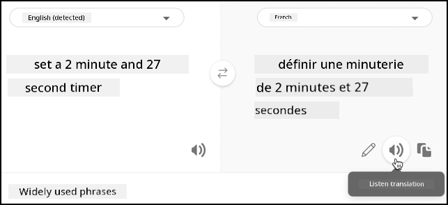

<!--
CO_OP_TRANSLATOR_METADATA:
{
  "original_hash": "5f6c164e349f8989959e02a90f37908d",
  "translation_date": "2025-11-18T19:19:06+00:00",
  "source_file": "6-consumer/lessons/4-multiple-language-support/wio-terminal-translate-speech.md",
  "language_code": "pcm"
}
-->
# Translate speech - Wio Terminal

For dis part of di lesson, you go write code wey go translate text using di translator service.

## Change text to speech using di translator service

Di speech service REST API no dey support direct translations, but you fit use di Translator service to translate di text wey di speech to text service generate, and di text wey di spoken response dey. Dis service get REST API wey you fit use to translate di text, but to make am easy to use, dem go wrap am inside another HTTP trigger for your functions app.

### Task - create serverless function to translate text

1. Open your `smart-timer-trigger` project for VS Code, and open di terminal make sure say di virtual environment dey activated. If e no dey, close di terminal and open am again.

1. Open di `local.settings.json` file and add settings for di translator API key and location:

    ```json
    "TRANSLATOR_KEY": "<key>",
    "TRANSLATOR_LOCATION": "<location>"
    ```

    Change `<key>` to di API key for your translator service resource. Change `<location>` to di location wey you use when you create di translator service resource.

1. Add new HTTP trigger to dis app wey dem call `translate-text` using dis command from inside di VS Code terminal for di root folder of di functions app project:

    ```sh
    func new --name translate-text --template "HTTP trigger"
    ```

    Dis one go create HTTP trigger wey dem call `translate-text`.

1. Change di content of di `__init__.py` file for di `translate-text` folder with dis one:

    ```python
    import logging
    import os
    import requests
    
    import azure.functions as func
    
    location = os.environ['TRANSLATOR_LOCATION']
    translator_key = os.environ['TRANSLATOR_KEY']
    
    def main(req: func.HttpRequest) -> func.HttpResponse:
        req_body = req.get_json()
        from_language = req_body['from_language']
        to_language = req_body['to_language']
        text = req_body['text']
        
        logging.info(f'Translating {text} from {from_language} to {to_language}')
    
        url = f'https://api.cognitive.microsofttranslator.com/translate?api-version=3.0'
    
        headers = {
            'Ocp-Apim-Subscription-Key': translator_key,
            'Ocp-Apim-Subscription-Region': location,
            'Content-type': 'application/json'
        }
    
        params = {
            'from': from_language,
            'to': to_language
        }
    
        body = [{
            'text' : text
        }]
        
        response = requests.post(url, headers=headers, params=params, json=body)
        return func.HttpResponse(response.json()[0]['translations'][0]['text'])
    ```

    Dis code dey extract di text and di languages from di HTTP request. E go then make request to di translator REST API, pass di languages as parameters for di URL and di text wey dem wan translate as di body. At last, e go return di translation.

1. Run your function app for your computer. You fit call am using tool like curl di same way wey you test your `text-to-timer` HTTP trigger. Make sure say you pass di text wey you wan translate and di languages as JSON body:

    ```json
    {
        "text": "Définir une minuterie de 30 secondes",
        "from_language": "fr-FR",
        "to_language": "en-US"
    }
    ```

    Dis example dey translate *Définir une minuterie de 30 secondes* from French to US English. E go return *Set a 30-second timer*.

> 💁 You fit find dis code for di [code/functions](../../../../../6-consumer/lessons/4-multiple-language-support/code/functions) folder.

### Task - use di translator function to translate text

1. Open di `smart-timer` project for VS Code if e no dey open already.

1. Your smart timer go get 2 languages - di language of di server wey dem use train LUIS (di same language dem use build di messages wey dem go talk to di user), and di language wey di user dey speak. Update di `LANGUAGE` constant for di `config.h` header file to be di language wey di user go dey speak, and add new constant wey dem call `SERVER_LANGUAGE` for di language wey dem use train LUIS:

    ```cpp
    const char *LANGUAGE = "<user language>";
    const char *SERVER_LANGUAGE = "<server language>";
    ```

    Change `<user language>` to di locale name for di language wey you go dey speak, like `fr-FR` for French, or `zn-HK` for Cantonese.

    Change `<server language>` to di locale name for di language wey dem use train LUIS.

    You fit find list of di supported languages and their locale names for di [Language and voice support documentation on Microsoft docs](https://docs.microsoft.com/azure/cognitive-services/speech-service/language-support?WT.mc_id=academic-17441-jabenn#speech-to-text).

    > 💁 If you no sabi speak plenty languages, you fit use service like [Bing Translate](https://www.bing.com/translator) or [Google Translate](https://translate.google.com) to translate from your preferred language to di language wey you choose. Dis services fit play audio of di translated text.
    >
    > For example, if you train LUIS for English, but you wan use French as di user language, you fit translate sentences like "set a 2 minute and 27 second timer" from English to French using Bing Translate, then use di **Listen translation** button to talk di translation into your microphone.
    >
    > 

1. Add di translator API key and location under di `SPEECH_LOCATION`:

    ```cpp
    const char *TRANSLATOR_API_KEY = "<KEY>";
    const char *TRANSLATOR_LOCATION = "<LOCATION>";
    ```

    Change `<KEY>` to di API key for your translator service resource. Change `<LOCATION>` to di location wey you use when you create di translator service resource.

1. Add di translator trigger URL under di `VOICE_URL`:

    ```cpp
    const char *TRANSLATE_FUNCTION_URL = "<URL>";
    ```

    Change `<URL>` to di URL for di `translate-text` HTTP trigger for your function app. Dis one go be di same as di value for `TEXT_TO_TIMER_FUNCTION_URL`, but di function name go be `translate-text` instead of `text-to-timer`.

1. Add new file to di `src` folder wey dem call `text_translator.h`.

1. Dis new `text_translator.h` header file go get class wey go translate text. Add dis one to di file to declare di class:

    ```cpp
    #pragma once
    
    #include <Arduino.h>
    #include <ArduinoJson.h>
    #include <HTTPClient.h>
    #include <WiFiClient.h>
    
    #include "config.h"
    
    class TextTranslator
    {
    public:   
    private:
        WiFiClient _client;
    };
    
    TextTranslator textTranslator;
    ```

    Dis one dey declare di `TextTranslator` class, along with one instance of dis class. Di class get one field for di WiFi client.

1. For di `public` section of dis class, add method wey go translate text:

    ```cpp
    String translateText(String text, String from_language, String to_language)
    {
    }
    ```

    Dis method dey take di language wey dem wan translate from, and di language wey dem wan translate to. When e dey handle speech, di speech go translate from di user language to di LUIS server language, and when e dey give response, e go translate from di LUIS server language to di user language.

1. For dis method, add code wey go build JSON body wey get di text wey dem wan translate and di languages:

    ```cpp
    DynamicJsonDocument doc(1024);
    doc["text"] = text;
    doc["from_language"] = from_language;
    doc["to_language"] = to_language;

    String body;
    serializeJson(doc, body);

    Serial.print("Translating ");
    Serial.print(text);
    Serial.print(" from ");
    Serial.print(from_language);
    Serial.print(" to ");
    Serial.print(to_language);
    ```

1. Under dis one, add di code wey go send di body to di serverless function app:

    ```cpp
    HTTPClient httpClient;
    httpClient.begin(_client, TRANSLATE_FUNCTION_URL);

    int httpResponseCode = httpClient.POST(body);
    ```

1. Next, add code wey go collect di response:

    ```cpp
    String translated_text = "";

    if (httpResponseCode == 200)
    {
        translated_text = httpClient.getString();
        Serial.print("Translated: ");
        Serial.println(translated_text);
    }
    else
    {
        Serial.print("Failed to translate text - error ");
        Serial.println(httpResponseCode);
    }
    ```

1. At last, add code wey go close di connection and return di translated text:

    ```cpp
    httpClient.end();

    return translated_text;
    ```

### Task - translate di recognized speech and di responses

1. Open di `main.cpp` file.

1. Add include directive for di top of di file for di `TextTranslator` class header file:

    ```cpp
    #include "text_translator.h"
    ```

1. Di text wey dem dey talk when timer don set or expire need to translate. To do dis, add dis one as di first line for di `say` function:

    ```cpp
    text = textTranslator.translateText(text, LANGUAGE, SERVER_LANGUAGE);
    ```

    Dis one go translate di text to di user language.

1. For di `processAudio` function, text dey collect from di captured audio with di `String text = speechToText.convertSpeechToText();` call. After dis call, translate di text:

    ```cpp
    String text = speechToText.convertSpeechToText();
    text = textTranslator.translateText(text, LANGUAGE, SERVER_LANGUAGE);
    ```

    Dis one go translate di text from di user language to di language wey di server dey use.

1. Build dis code, upload am to your Wio Terminal and test am through di serial monitor. Once you see `Ready` for di serial monitor, press di C button (di one wey dey left-hand side, near di power switch), and talk. Make sure say your function app dey run, and request timer for di user language, either by talking dat language yourself, or using translation app.

    ```output
    Connecting to WiFi..
    Connected!
    Got access token.
    Ready.
    Starting recording...
    Finished recording
    Sending speech...
    Speech sent!
    {"RecognitionStatus":"Success","DisplayText":"Définir une minuterie de 2 minutes 27 secondes.","Offset":9600000,"Duration":40400000}
    Translating Définir une minuterie de 2 minutes 27 secondes. from fr-FR to en-US
    Translated: Set a timer of 2 minutes 27 seconds.
    Set a timer of 2 minutes 27 seconds.
    {"seconds": 147}
    Translating 2 minute 27 second timer started. from en-US to fr-FR
    Translated: 2 minute 27 seconde minute a commencé.
    2 minute 27 seconde minute a commencé.
    Translating Times up on your 2 minute 27 second timer. from en-US to fr-FR
    Translated: Chronométrant votre minuterie de 2 minutes 27 secondes.
    Chronométrant votre minuterie de 2 minutes 27 secondes.
    ```

> 💁 You fit find dis code for di [code/wio-terminal](../../../../../6-consumer/lessons/4-multiple-language-support/code/wio-terminal) folder.

😀 Your multilingual timer program don work well!

---

<!-- CO-OP TRANSLATOR DISCLAIMER START -->
**Disclaimer**:  
Dis dokyument don translate wit AI translation service [Co-op Translator](https://github.com/Azure/co-op-translator). Even as we dey try make sure say e correct, abeg make you sabi say machine translation fit get mistake or no dey accurate well. Di original dokyument for im native language na di main source wey you go fit trust. For important information, e good make professional human translation dey use. We no go fit take blame for any misunderstanding or wrong interpretation wey fit happen because you use dis translation.
<!-- CO-OP TRANSLATOR DISCLAIMER END -->