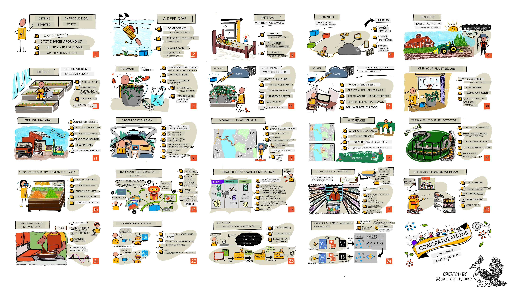

<!--
CO_OP_TRANSLATOR_METADATA:
{
  "original_hash": "72ea6b6dc04ec5e98a8a34a45cbe5042",
  "translation_date": "2025-11-18T18:22:04+00:00",
  "source_file": "README.md",
  "language_code": "pcm"
}
-->
[](https://github.com/microsoft/IoT-For-Beginners/blob/master/LICENSE)
[](https://GitHub.com/microsoft/IoT-For-Beginners/graphs/contributors/)
[](https://GitHub.com/microsoft/IoT-For-Beginners/issues/)
[](https://GitHub.com/microsoft/IoT-For-Beginners/pulls/)
[](http://makeapullrequest.com)

[](https://GitHub.com/microsoft/IoT-For-Beginners/watchers/)
[](https://GitHub.com/microsoft/IoT-For-Beginners/network/)
[](https://GitHub.com/microsoft/IoT-For-Beginners/stargazers/)

### Join di Azure AI Foundry Community 

If e hard you or you get any question about how to build AI apps, join oda learners and developers wey sabi MCP. Na beta community wey dey welcome questions and dey share knowledge free.

[](https://discord.gg/nTYy5BXMWG)

If you get feedback about di product or you dey face wahala wen you dey build, visit:

[](https://aka.ms/foundry/forum)

Follow dis steps to start to use di resources:
1. **Fork di Repository**: Click [](https://GitHub.com/microsoft/IoT-For-Beginners/fork)
2. **Clone di Repository**:   `git clone https://github.com/microsoft/IoT-For-Beginners.git`
3. [**Join di Microsoft Foundry Discord make you meet experts and oda developers**](https://discord.com/invite/ByRwuEEgH4)


### 🌐 Multi-Language Support

#### Supported via GitHub Action (Automated & Always Up-to-Date)

[Arabic](../ar/README.md) | [Bengali](../bn/README.md) | [Bulgarian](../bg/README.md) | [Burmese (Myanmar)](../my/README.md) | [Chinese (Simplified)](../zh/README.md) | [Chinese (Traditional, Hong Kong)](../hk/README.md) | [Chinese (Traditional, Macau)](../mo/README.md) | [Chinese (Traditional, Taiwan)](../tw/README.md) | [Croatian](../hr/README.md) | [Czech](../cs/README.md) | [Danish](../da/README.md) | [Dutch](../nl/README.md) | [Estonian](../et/README.md) | [Finnish](../fi/README.md) | [French](../fr/README.md) | [German](../de/README.md) | [Greek](../el/README.md) | [Hebrew](../he/README.md) | [Hindi](../hi/README.md) | [Hungarian](../hu/README.md) | [Indonesian](../id/README.md) | [Italian](../it/README.md) | [Japanese](../ja/README.md) | [Korean](../ko/README.md) | [Lithuanian](../lt/README.md) | [Malay](../ms/README.md) | [Marathi](../mr/README.md) | [Nepali](../ne/README.md) | [Nigerian Pidgin](./README.md) | [Norwegian](../no/README.md) | [Persian (Farsi)](../fa/README.md) | [Polish](../pl/README.md) | [Portuguese (Brazil)](../br/README.md) | [Portuguese (Portugal)](../pt/README.md) | [Punjabi (Gurmukhi)](../pa/README.md) | [Romanian](../ro/README.md) | [Russian](../ru/README.md) | [Serbian (Cyrillic)](../sr/README.md) | [Slovak](../sk/README.md) | [Slovenian](../sl/README.md) | [Spanish](../es/README.md) | [Swahili](../sw/README.md) | [Swedish](../sv/README.md) | [Tagalog (Filipino)](../tl/README.md) | [Tamil](../ta/README.md) | [Thai](../th/README.md) | [Turkish](../tr/README.md) | [Ukrainian](../uk/README.md) | [Urdu](../ur/README.md) | [Vietnamese](../vi/README.md)

# IoT for Beginners - A Curriculum

Azure Cloud Advocates for Microsoft don prepare 12-week, 24-lesson curriculum wey dey teach di basics of IoT. Each lesson get quiz before and after di lesson, written instructions, solution, assignment and more. Di project-based style go help you learn well as you dey build, wey be one sure way to make new skills stick.

Di projects dey show how food dey move from farm go table. E include farming, logistics, manufacturing, retail and consumer - all na popular industry areas for IoT devices.



> Sketchnote by [Nitya Narasimhan](https://github.com/nitya). Click di image for bigger version.

**Big thanks to our authors [Jen Fox](https://github.com/jenfoxbot), [Jen Looper](https://github.com/jlooper), [Jim Bennett](https://github.com/jimbobbennett), and our sketchnote artist [Nitya Narasimhan](https://github.com/nitya).**

**Thanks too to our team of [Microsoft Learn Student Ambassadors](https://studentambassadors.microsoft.com?WT.mc_id=academic-17441-jabenn) wey don dey review and translate dis curriculum - [Aditya Garg](https://github.com/AdityaGarg00), [Anurag Sharma](https://github.com/Anurag-0-1-A), [Arpita Das](https://github.com/Arpiiitaaa), [Aryan Jain](https://www.linkedin.com/in/aryan-jain-47a4a1145/), [Bhavesh Suneja](https://github.com/EliteWarrior315), [Faith Hunja](https://faithhunja.github.io/), [Lateefah Bello](https://www.linkedin.com/in/lateefah-bello/), [Manvi Jha](https://github.com/Severus-Matthew), [Mireille Tan](https://www.linkedin.com/in/mireille-tan-a4834819a/), [Mohammad Iftekher (Iftu) Ebne Jalal](https://github.com/Iftu119), [Mohammad Zulfikar](https://github.com/mohzulfikar), [Priyanshu Srivastav](https://www.linkedin.com/in/priyanshu-srivastav-b067241ba), [Thanmai Gowducheruvu](https://github.com/innovation-platform), and [Zina Kamel](https://www.linkedin.com/in/zina-kamel/).**

Meet di team!

[](https://youtu.be/-wippUJRi5k)

**Gif by** [Mohit Jaisal](https://linkedin.com/in/mohitjaisal)

> 🎥 Click di image above for video about di project!

> **Teachers**, we don [add some suggestions](for-teachers.md) on how una fit use dis curriculum. If you wan create your own lessons, we don also add [lesson template](lesson-template/README.md).

> **[Students](https://aka.ms/student-page)**, if you wan use dis curriculum by yourself, fork di whole repo and do di exercises by yourself. Start with di pre-lecture quiz, read di lecture and finish di activities. Try build di projects by understanding di lessons instead of copying di solution code; but di code dey available for di /solutions folders for each project-oriented lesson. Another idea na to form study group with your friends and go through di content together. For more study, we recommend [Microsoft Learn](https://docs.microsoft.com/users/jimbobbennett/collections/ke2ehd351jopwr?WT.mc_id=academic-17441-jabenn).

For video overview of dis course, check dis video:

[](https://youtube.com/watch?v=bccEMm8gRuc "Promo video")

> 🎥 Click di image above for video about di project!

## Pedagogy

We choose two teaching styles wen we dey build dis curriculum: make e dey project-based and make e get plenty quizzes. By di end of dis series, students go don build plant monitoring and watering system, vehicle tracker, smart factory setup to track and check food, and voice-controlled cooking timer. Dem go don learn di basics of Internet of Things like how to write device code, connect to di cloud, analyze telemetry and run AI for di edge.

As we make di content align with projects, e go make am more interesting for students and e go help dem remember di concepts well.

Plus, quiz wey no dey too hard before class go help di student focus on di topic wey dem wan learn, while di second quiz after class go help dem remember am well. Dis curriculum dey flexible and fun, and you fit take am complete or small small. Di projects dey start small and e dey grow complex by di end of di 12-week cycle.

Each project dey use real-world hardware wey students and hobbyists fit get. Each project dey look into di specific project domain, dey give background knowledge wey dey relevant. To be beta developer, e good make you understand di domain wey you dey solve problem for. Dis background knowledge go help students think about their IoT solutions and learnings for di context of di kind real-world problem wey dem fit solve as IoT developer. Students go learn di 'why' of di solutions wey dem dey build, and dem go appreciate di end user.

## Hardware

We get two options of IoT hardware wey you fit use for di projects based on wetin you like, di programming language wey you sabi, your learning goals and wetin dey available. We don also provide 'virtual hardware' version for people wey no get access to hardware or wan learn more before dem buy. You fit read more and find 'shopping list' for di [hardware page](./hardware.md), including links to buy complete kits from our friends for Seeed Studio.

> 💁 Check our [Code of Conduct](CODE_OF_CONDUCT.md), [Contributing](CONTRIBUTING.md), and [Translation](TRANSLATIONS.md) guidelines. We dey welcome your constructive feedback!

## Each lesson get:

- sketchnote
- optional video wey dey add more info
- pre-lesson warmup quiz
- written lesson
- for project-based lessons, step-by-step guide on how to build di project
- knowledge checks
- challenge
- extra reading
- assignment
- [post-lesson quiz](https://ff-quizzes.netlify.app/en/)
> **Small info about quizzes**: All di quizzes dey inside di quiz-app folder, e get 48 quizzes wey each one get three questions. Dem link am from di lessons, but di quiz app fit run for your computer or you fit put am for Azure; follow di instruction wey dey inside di `quiz-app` folder. Dem dey localize am small small.

## Lessons

|       |              Project Name              |                       Concepts We Go Learn                       | Wetin You Go Learn                                                                                                                                                 |                                                        Linked Lesson                                                         |
| :---: | :------------------------------------: | :-------------------------------------------------------------: | ------------------------------------------------------------------------------------------------------------------------------------------------------------------- | :--------------------------------------------------------------------------------------------------------------------------: |
|  01   | [Getting started](./1-getting-started/README.md) |                     Introduction to IoT                     | Learn di basic principles of IoT and di basic building blocks of IoT solutions like sensors and cloud services as you dey set up your first IoT device |                      [Introduction to IoT](./1-getting-started/lessons/1-introduction-to-iot/README.md)                      |
|  02   | [Getting started](./1-getting-started/README.md) |                   A deeper dive into IoT                    | Learn more about di components of an IoT system, plus microcontrollers and single-board computers                                                            |                        [A deeper dive into IoT](./1-getting-started/lessons/2-deeper-dive/README.md)                         |
|  03   | [Getting started](./1-getting-started/README.md) | Interact with di physical world with sensors and actuators | Learn about sensors to gather data from di physical world, and actuators to send feedback, as you dey build a nightlight                                           | [Interact with di physical world with sensors and actuators](./1-getting-started/lessons/3-sensors-and-actuators/README.md) |
|  04   | [Getting started](./1-getting-started/README.md) |             Connect your device to di Internet             | Learn how to connect an IoT device to di Internet to send and receive messages by connecting your nightlight to an MQTT broker                               |               [Connect your device to di Internet](./1-getting-started/lessons/4-connect-internet/README.md)                |
|  05   |            [Farm](./2-farm/README.md)            |                    Predict plant growth                     | Learn how to predict plant growth using temperature data wey IoT device capture                                                                                  |                          [Predict plant growth](./2-farm/lessons/1-predict-plant-growth/README.md)                           |
|  06   |            [Farm](./2-farm/README.md)            |                    Detect soil moisture                     | Learn how to detect soil moisture and calibrate a soil moisture sensor                                                                                              |                          [Detect soil moisture](./2-farm/lessons/2-detect-soil-moisture/README.md)                           |
|  07   |            [Farm](./2-farm/README.md)            |                  Automated plant watering                   | Learn how to automate and time watering using a relay and MQTT                                                                                                      |                      [Automated plant watering](./2-farm/lessons/3-automated-plant-watering/README.md)                       |
|  08   |            [Farm](./2-farm/README.md)            |               Migrate your plant to di cloud               | Learn about di cloud and cloud-hosted IoT services and how to connect your plant to one of these instead of a public MQTT broker                                   |               [Migrate your plant to di cloud](./2-farm/lessons/4-migrate-your-plant-to-the-cloud/README.md)                |
|  09   |            [Farm](./2-farm/README.md)            |         Migrate your application logic to di cloud         | Learn how you fit write application logic for di cloud wey go respond to IoT messages                                                                          |         [Migrate your application logic to di cloud](./2-farm/lessons/5-migrate-application-to-the-cloud/README.md)         |
|  10   |            [Farm](./2-farm/README.md)            |                   Keep your plant secure                    | Learn about security with IoT and how to keep your plant secure with keys and certificates                                                                          |                        [Keep your plant secure](./2-farm/lessons/6-keep-your-plant-secure/README.md)                         |
|  11   |       [Transport](./3-transport/README.md)       |                      Location tracking                      | Learn about GPS location tracking for IoT devices                                                                                                                   |                           [Location tracking](./3-transport/lessons/1-location-tracking/README.md)                           |
|  12   |       [Transport](./3-transport/README.md)       |                     Store location data                     | Learn how to store IoT data to fit visualize or analyze later                                                                                                      |                         [Store location data](./3-transport/lessons/2-store-location-data/README.md)                         |
|  13   |       [Transport](./3-transport/README.md)       |                   Visualize location data                   | Learn about visualizing location data on top map, and how maps dey represent di real 3D world for 2 dimensions                                                            |                     [Visualize location data](./3-transport/lessons/3-visualize-location-data/README.md)                     |
|  14   |       [Transport](./3-transport/README.md)       |                          Geofences                          | Learn about geofences, and how dem fit use am to alert when vehicles for di supply chain dey close to their destination                                           |                                   [Geofences](./3-transport/lessons/4-geofences/README.md)                                   |
|  15   |   [Manufacturing](./4-manufacturing/README.md)   |               Train a fruit quality detector                | Learn about training an image classifier for di cloud to detect fruit quality                                                                                       |                 [Train a fruit quality detector](./4-manufacturing/lessons/1-train-fruit-detector/README.md)                 |
|  16   |   [Manufacturing](./4-manufacturing/README.md)   |           Check fruit quality from an IoT device            | Learn about using your fruit quality detector from an IoT device                                                                                                    |           [Check fruit quality from an IoT device](./4-manufacturing/lessons/2-check-fruit-from-device/README.md)            |
|  17   |   [Manufacturing](./4-manufacturing/README.md)   |             Run your fruit detector on di edge             | Learn about running your fruit detector on an IoT device for di edge                                                                                                |             [Run your fruit detector on di edge](./4-manufacturing/lessons/3-run-fruit-detector-edge/README.md)             |
|  18   |   [Manufacturing](./4-manufacturing/README.md)   |        Trigger fruit quality detection from a sensor        | Learn about triggering fruit quality detection from a sensor                                                                                                        |        [Trigger fruit quality detection from a sensor](./4-manufacturing/lessons/4-trigger-fruit-detector/README.md)         |
|  19   |          [Retail](./5-retail/README.md)          |                   Train a stock detector                    | Learn how to use object detection to train a stock detector to count stock for shop                                                                                |                        [Train a stock detector](./5-retail/lessons/1-train-stock-detector/README.md)                         |
|  20   |          [Retail](./5-retail/README.md)          |               Check stock from an IoT device                | Learn how to check stock from an IoT device using an object detection model                                                                                         |                     [Check stock from an IoT device](./5-retail/lessons/2-check-stock-device/README.md)                      |
|  21   |        [Consumer](./6-consumer/README.md)        |             Recognize speech with an IoT device             | Learn how to recognize speech from an IoT device to build a smart timer                                                                                             |                  [Recognize speech with an IoT device](./6-consumer/lessons/1-speech-recognition/README.md)                  |
|  22   |        [Consumer](./6-consumer/README.md)        |                     Understand language                     | Learn how to understand sentences wey dem talk to an IoT device                                                                                                           |                        [Understand language](./6-consumer/lessons/2-language-understanding/README.md)                        |
|  23   |        [Consumer](./6-consumer/README.md)        |           Set a timer and provide spoken feedback           | Learn how to set a timer on an IoT device and give spoken feedback on when di timer set and when e finish                                                    |                 [Set a timer and provide spoken feedback](./6-consumer/lessons/3-spoken-feedback/README.md)                  |
|  24   |        [Consumer](./6-consumer/README.md)        |                 Support multiple languages                  | Learn how to support multiple languages, both di one wey dem dey talk to and di response from your smart timer                                                               |                   [Support multiple languages](./6-consumer/lessons/4-multiple-language-support/README.md)                   |

## Offline access

You fit run dis documentation offline by using [Docsify](https://docsify.js.org/#/). Fork dis repo, [install Docsify](https://docsify.js.org/#/quickstart) for your computer, and then for di root folder of dis repo, type `docsify serve`. Di website go dey available for port 3000 for your localhost: `localhost:3000`.

## Quiz

Thanks to di community wey host di interactive quiz wey dey test your knowledge for each of di chapters. You fit test your knowledge [here](https://ff-quizzes.netlify.app/en/) 

### PDF

You fit generate PDF of dis content for offline access if you need am. To do dis, make sure say you get [npm installed](https://docs.npmjs.com/downloading-and-installing-node-js-and-npm) and run di commands wey dey below for di root folder of dis repo:

```sh
npm i
npm run convert
```

### Slides

Slide decks dey for some of di lessons for di [slides](../../slides) folder.


## Other Curricula

Our team dey produce other curricula! Check dem out:

### Azure / Edge / MCP / Agents
[](https://github.com/microsoft/AZD-for-beginners?WT.mc_id=academic-105485-koreyst)
[](https://github.com/microsoft/edgeai-for-beginners?WT.mc_id=academic-105485-koreyst)
[](https://github.com/microsoft/mcp-for-beginners?WT.mc_id=academic-105485-koreyst)
[](https://github.com/microsoft/ai-agents-for-beginners?WT.mc_id=academic-105485-koreyst)

---

### Generative AI Series
[](https://github.com/microsoft/generative-ai-for-beginners?WT.mc_id=academic-105485-koreyst)
[-9333EA?style=for-the-badge&labelColor=E5E7EB&color=9333EA)](https://github.com/microsoft/Generative-AI-for-beginners-dotnet?WT.mc_id=academic-105485-koreyst)
[-C084FC?style=for-the-badge&labelColor=E5E7EB&color=C084FC)](https://github.com/microsoft/generative-ai-for-beginners-java?WT.mc_id=academic-105485-koreyst)
[-E879F9?style=for-the-badge&labelColor=E5E7EB&color=E879F9)](https://github.com/microsoft/generative-ai-with-javascript?WT.mc_id=academic-105485-koreyst)

---

### Core Learning
[](https://aka.ms/ml-beginners?WT.mc_id=academic-105485-koreyst)  
[](https://aka.ms/datascience-beginners?WT.mc_id=academic-105485-koreyst)  
[](https://aka.ms/ai-beginners?WT.mc_id=academic-105485-koreyst)  
[](https://github.com/microsoft/Security-101?WT.mc_id=academic-96948-sayoung)  
[](https://aka.ms/webdev-beginners?WT.mc_id=academic-105485-koreyst)  
[](https://aka.ms/iot-beginners?WT.mc_id=academic-105485-koreyst)  
[](https://github.com/microsoft/xr-development-for-beginners?WT.mc_id=academic-105485-koreyst)  

---

### Copilot Series
[](https://aka.ms/GitHubCopilotAI?WT.mc_id=academic-105485-koreyst)  
[](https://github.com/microsoft/mastering-github-copilot-for-dotnet-csharp-developers?WT.mc_id=academic-105485-koreyst)  
[](https://github.com/microsoft/CopilotAdventures?WT.mc_id=academic-105485-koreyst)  
<!-- CO-OP TRANSLATOR OTHER COURSES END -->

## Image attributions

You fit see all di attributions for di images wey dem use for dis curriculum where e dey required for di [Attributions](./attributions.md).

---

<!-- CO-OP TRANSLATOR DISCLAIMER START -->
**Disclaimer**:  
Dis dokyument don use AI translation service [Co-op Translator](https://github.com/Azure/co-op-translator) do di translation. Even as we dey try make am accurate, abeg sabi say machine translation fit get mistake or no dey correct well. Di original dokyument wey dey for im native language na di main source wey you go trust. For important mata, e good make professional human translation dey use. We no go fit take blame for any misunderstanding or wrong interpretation wey fit happen because you use dis translation.
<!-- CO-OP TRANSLATOR DISCLAIMER END -->