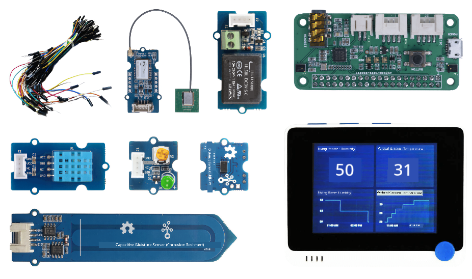
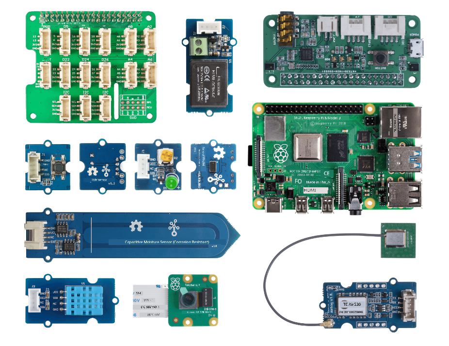

<!--
CO_OP_TRANSLATOR_METADATA:
{
  "original_hash": "3dce18fab38adf93ff30b8c221b1eec5",
  "translation_date": "2025-11-18T18:24:27+00:00",
  "source_file": "hardware.md",
  "language_code": "pcm"
}
-->
# Hardware

Di **T** wey dey for IoT na **Things**, e mean di devices wey dey interact wit di world wey dey around us. Every project dey base on real-world hardware wey students and hobbyists fit use. We get two options of IoT hardware wey you fit choose, e depend on wetin you like, di programming language wey you sabi or prefer, your learning goals, and wetin dey available. We also provide 'virtual hardware' version for people wey no get access to hardware or wan learn more before dem buy.

> 💁 You no need buy any IoT hardware to finish di assignments. You fit do everything wit virtual IoT hardware.

Di physical hardware options na Arduino or Raspberry Pi. Each platform get im own good and bad sides, and we go explain all of dem for one of di first lessons. If you never decide which hardware platform you wan use, you fit check [lesson two of di first project](./1-getting-started/lessons/2-deeper-dive/README.md) to choose di hardware platform wey you go like learn.

Di hardware wey we choose na to make di lessons and assignments no too hard. Even though other hardware fit work, we no fit guarantee say all di assignments go work for your device unless you get extra hardware. For example, plenty Arduino devices no get WiFi, and WiFi dey important to connect to di cloud - na why we choose Wio terminal because e get WiFi inside.

You go also need some non-technical things like soil or pot plant, and fruit or vegetables.

## Buy di kits

Seeed Studios don help us make all di hardware easy to buy as kits:

### Arduino - Wio Terminal

**[IoT for beginners wit Seeed and Microsoft - Wio Terminal Starter Kit](https://www.seeedstudio.com/IoT-for-beginners-with-Seeed-and-Microsoft-Wio-Terminal-Starter-Kit-p-5006.html)**

### Raspberry Pi

**[IoT for beginners wit Seeed and Microsoft - Raspberry Pi 4 Starter Kit](https://www.seeedstudio.com/IoT-for-beginners-with-Seeed-and-Microsoft-Raspberry-Pi-Starter-Kit-p-5004.html)**

## Arduino

All di device code for Arduino dey for C++. To finish all di assignments, you go need di following:

### Arduino hardware

* [Wio Terminal](https://www.seeedstudio.com/Wio-Terminal-p-4509.html)
* *Optional* - USB-C cable or USB-A to USB-C adapter. Di Wio terminal get USB-C port and e dey come wit USB-C to USB-A cable. If your PC or Mac only get USB-C ports, you go need USB-C cable or USB-A to USB-C adapter.

### Arduino specific sensors and actuators

Dis ones na for di Wio terminal Arduino device, e no concern di Raspberry Pi.

* [ArduCam Mini 2MP Plus - OV2640](https://www.arducam.com/product/arducam-2mp-spi-camera-b0067-arduino/)
* [ReSpeaker 2-Mics Pi HAT](https://www.seeedstudio.com/ReSpeaker-2-Mics-Pi-HAT.html)
* [Breadboard Jumper Wires](https://www.seeedstudio.com/Breadboard-Jumper-Wire-Pack-241mm-200mm-160mm-117m-p-234.html)
* Headphones or speaker wey get 3.5mm jack, or JST speaker like:
  * [Mono Enclosed Speaker - 2W 6 Ohm](https://www.seeedstudio.com/Mono-Enclosed-Speaker-2W-6-Ohm-p-2832.html)
* microSD Card 16GB or less, wit connector to use di SD card wit your computer if e no get one built-in. **NOTE** - di Wio Terminal only dey support SD cards wey no pass 16GB, e no dey support bigger ones.

## Raspberry Pi

All di device code for Raspberry Pi dey for Python. To finish all di assignments, you go need di following:

### Raspberry Pi hardware

* [Raspberry Pi](https://www.raspberrypi.org/products/raspberry-pi-4-model-b/)
  > 💁 Versions from di Pi 2B and above go work wit di assignments for dis lessons. If you wan run VS Code directly for di Pi, you go need Pi 4 wey get 2GB RAM or more. If you wan access di Pi remotely, any Pi 2B and above go work.
* microSD Card (You fit buy Raspberry Pi kits wey dey come wit microSD Card), wit connector to use di SD card wit your computer if e no get one built-in.
* USB power supply (You fit buy Raspberry Pi 4 kits wey dey come wit power supply). If you dey use Raspberry Pi 4, you go need USB-C power supply, di earlier devices dey use micro-USB power supply.

### Raspberry Pi specific sensors and actuators

Dis ones na for di Raspberry Pi, e no concern di Arduino device.

* [Grove Pi base hat](https://www.seeedstudio.com/Grove-Base-Hat-for-Raspberry-Pi.html)
* [Raspberry Pi Camera module](https://www.raspberrypi.org/products/camera-module-v2/)
* Microphone and speaker:

  Use one of di following (or similar):
  * Any USB Microphone wit any USB speaker, or speaker wey get 3.5mm jack cable, or use HDMI audio output if your Raspberry Pi dey connect to monitor or TV wey get speakers
  * Any USB headset wey get microphone inside
  * [ReSpeaker 2-Mics Pi HAT](https://www.seeedstudio.com/ReSpeaker-2-Mics-Pi-HAT.html) wit
    * Headphones or speaker wey get 3.5mm jack, or JST speaker like:
    * [Mono Enclosed Speaker - 2W 6 Ohm](https://www.seeedstudio.com/Mono-Enclosed-Speaker-2W-6-Ohm-p-2832.html)
  * [USB Speakerphone](https://www.amazon.com/USB-Speakerphone-Conference-Business-Microphones/dp/B07Q3D7F8S/ref=sr_1_1?dchild=1&keywords=m0&qid=1614647389&sr=8-1)
* [Grove Light sensor](https://www.seeedstudio.com/Grove-Light-Sensor-v1-2-LS06-S-phototransistor.html)
* [Grove button](https://www.seeedstudio.com/Grove-Button.html)

## Sensors and actuators

Most of di sensors and actuators wey you need dey work for both Arduino and Raspberry Pi learning paths:

* [Grove LED](https://www.seeedstudio.com/Grove-LED-Pack-p-4364.html) x 2
* [Grove humidity and temperature sensor](https://www.seeedstudio.com/Grove-Temperature-Humidity-Sensor-DHT11.html)
* [Grove capacitive soil moisture sensor](https://www.seeedstudio.com/Grove-Capacitive-Moisture-Sensor-Corrosion-Resistant.html)
* [Grove relay](https://www.seeedstudio.com/Grove-Relay.html)
* [Grove GPS (Air530)](https://www.seeedstudio.com/Grove-GPS-Air530-p-4584.html)
* [Grove Time of flight Distance Sensor](https://www.seeedstudio.com/Grove-Time-of-Flight-Distance-Sensor-VL53L0X.html)

## Optional hardware

Di lessons wey dey talk about automated watering dey use relay. As option, you fit connect dis relay to water pump wey dey powered by USB wit di hardware wey dey below.

* [6V water pump](https://www.seeedstudio.com/6V-Mini-Water-Pump-p-1945.html)
* [USB terminal](https://www.adafruit.com/product/3628)
* Silicone pipes
* Red and black wires
* Small flat-head screwdriver

## Virtual hardware

Di virtual hardware option go provide simulators for di sensors and actuators, wey dem implement wit Python. Depending on di hardware wey you get, you fit run dis one for your normal development device like Mac, PC, or run am for Raspberry Pi and simulate only di hardware wey you no get. For example, if you get Raspberry Pi camera but you no get Grove sensors, you go fit run di virtual device code for your Pi and simulate di Grove sensors, but use di physical camera.

Di virtual hardware go use di [CounterFit project](https://github.com/CounterFit-IoT/CounterFit).

To finish dis lessons, you go need webcam, microphone, and audio output like speakers or headphones. Dem fit dey built-in or external, and you go need configure dem to work wit your operating system and make dem dey available for use from all applications.

---

<!-- CO-OP TRANSLATOR DISCLAIMER START -->
**Disclaimer**:  
Dis document don use AI translation service [Co-op Translator](https://github.com/Azure/co-op-translator) take translate am. Even though we dey try make e accurate, abeg sabi say automated translations fit get mistake or no correct well. Di original document for di native language na di main correct source. For important information, e better make una use professional human translation. We no go fit take blame for any misunderstanding or wrong interpretation wey fit happen because of dis translation.
<!-- CO-OP TRANSLATOR DISCLAIMER END -->