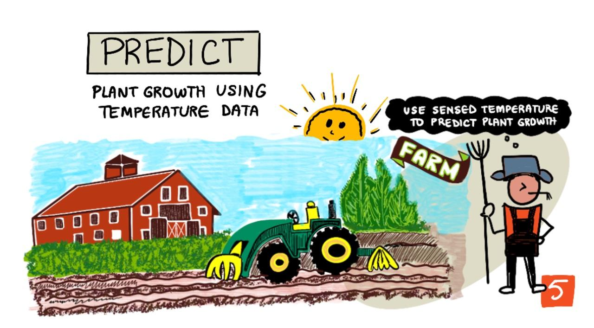

<!--
CO_OP_TRANSLATOR_METADATA:
{
  "original_hash": "d105b44deae539165855c976dcdeca99",
  "translation_date": "2025-08-26T06:41:16+00:00",
  "source_file": "2-farm/lessons/1-predict-plant-growth/README.md",
  "language_code": "pl"
}
-->
## Przewiduj wzrost roślin za pomocą IoT



> Szkic autorstwa [Nitya Narasimhan](https://github.com/nitya). Kliknij obrazek, aby zobaczyć większą wersję.

## Quiz przed wykładem

[Quiz przed wykładem](https://black-meadow-040d15503.1.azurestaticapps.net/quiz/9)

## Wprowadzenie

Rośliny potrzebują określonych rzeczy, aby rosnąć - wody, dwutlenku węgla, składników odżywczych, światła i ciepła. W tej lekcji dowiesz się, jak obliczać tempo wzrostu i dojrzewania roślin, mierząc temperaturę powietrza.

W tej lekcji omówimy:

* [Cyfrowe rolnictwo](../../../../../2-farm/lessons/1-predict-plant-growth)
* [Dlaczego temperatura jest ważna w rolnictwie?](../../../../../2-farm/lessons/1-predict-plant-growth)
* [Pomiar temperatury otoczenia](../../../../../2-farm/lessons/1-predict-plant-growth)
* [Dni stopni wzrostu (GDD)](../../../../../2-farm/lessons/1-predict-plant-growth)
* [Obliczanie GDD za pomocą danych z czujnika temperatury](../../../../../2-farm/lessons/1-predict-plant-growth)

## Cyfrowe rolnictwo

Cyfrowe rolnictwo zmienia sposób, w jaki uprawiamy ziemię, wykorzystując narzędzia do zbierania, przechowywania i analizowania danych z gospodarstw rolnych. Obecnie znajdujemy się w okresie określanym przez Światowe Forum Ekonomiczne jako "Czwarta Rewolucja Przemysłowa", a rozwój cyfrowego rolnictwa został nazwany "Czwartą Rewolucją Rolniczą" lub "Rolnictwem 4.0".

> 🎓 Termin "Cyfrowe rolnictwo" obejmuje również cały "łańcuch wartości rolnictwa", czyli całą drogę od farmy do stołu. Obejmuje to śledzenie jakości produktów spożywczych podczas ich transportu i przetwarzania, systemy magazynowe i e-commerce, a nawet aplikacje do wynajmu traktorów!

Te zmiany pozwalają rolnikom zwiększać plony, używać mniej nawozów i pestycydów oraz efektywniej gospodarować wodą. Chociaż głównie stosowane w bogatszych krajach, czujniki i inne urządzenia stopniowo tanieją, co czyni je bardziej dostępnymi w krajach rozwijających się.

Niektóre techniki umożliwione przez cyfrowe rolnictwo to:

* Pomiar temperatury - pomiar temperatury pozwala rolnikom przewidywać wzrost i dojrzewanie roślin.
* Automatyczne nawadnianie - pomiar wilgotności gleby i włączanie systemów nawadniających, gdy gleba jest zbyt sucha, zamiast nawadniania według harmonogramu. Nawadnianie według harmonogramu może prowadzić do niedostatecznego nawodnienia roślin podczas gorących, suchych okresów lub nadmiernego nawodnienia podczas deszczu. Nawadniając tylko wtedy, gdy gleba tego potrzebuje, rolnicy mogą zoptymalizować zużycie wody.
* Kontrola szkodników - rolnicy mogą używać kamer na zautomatyzowanych robotach lub dronach do sprawdzania obecności szkodników, a następnie stosować pestycydy tylko tam, gdzie są potrzebne, zmniejszając ilość używanych pestycydów i ograniczając ich spływ do lokalnych źródeł wody.

✅ Zrób badania. Jakie inne techniki są stosowane w celu poprawy plonów rolnych?

> 🎓 Termin "Rolnictwo precyzyjne" odnosi się do obserwowania, mierzenia i reagowania na potrzeby upraw na poziomie pola, a nawet jego części. Obejmuje to pomiar poziomu wody, składników odżywczych i szkodników oraz precyzyjne reagowanie, na przykład nawadnianie tylko małej części pola.

## Dlaczego temperatura jest ważna w rolnictwie?

Ucząc się o roślinach, większość uczniów dowiaduje się o konieczności wody, światła, dwutlenku węgla i składników odżywczych. Rośliny potrzebują również ciepła, aby rosnąć - dlatego rośliny kwitną wiosną, gdy temperatura wzrasta, dlaczego przebiśniegi lub żonkile mogą zakwitnąć wcześnie podczas krótkiego okresu ciepła, i dlaczego szklarnie są tak skuteczne w wspomaganiu wzrostu roślin.

> 🎓 Szklarnie i cieplarnie pełnią podobną funkcję, ale z istotną różnicą. Cieplarnie są ogrzewane sztucznie, co pozwala rolnikom dokładniej kontrolować temperaturę, podczas gdy szklarnie polegają na słońcu jako źródle ciepła, a kontrola ogranicza się zwykle do okien lub innych otworów umożliwiających wypuszczenie ciepła.

Rośliny mają temperaturę bazową lub minimalną, optymalną temperaturę oraz maksymalną temperaturę, wszystko oparte na średnich dziennych temperaturach.

* Temperatura bazowa - to minimalna średnia dzienna temperatura potrzebna do wzrostu rośliny.
* Temperatura optymalna - to najlepsza średnia dzienna temperatura, aby uzyskać największy wzrost.
* Temperatura maksymalna - to maksymalna temperatura, którą roślina może wytrzymać. Powyżej tej temperatury roślina przestaje rosnąć, próbując oszczędzać wodę i przetrwać.

> 💁 Są to średnie temperatury, uśrednione z temperatur dziennych i nocnych. Rośliny potrzebują również różnych temperatur w dzień i w nocy, aby efektywniej przeprowadzać fotosyntezę i oszczędzać energię w nocy.

Każdy gatunek rośliny ma różne wartości dla temperatury bazowej, optymalnej i maksymalnej. Dlatego niektóre rośliny dobrze rosną w gorących krajach, a inne w chłodniejszych.

✅ Zrób badania. Dla dowolnych roślin w Twoim ogrodzie, szkole lub lokalnym parku sprawdź, czy możesz znaleźć ich temperaturę bazową.


Powyższy wykres pokazuje przykładowy wykres tempa wzrostu w zależności od temperatury. Do temperatury bazowej nie ma wzrostu. Tempo wzrostu wzrasta do temperatury optymalnej, a następnie spada po osiągnięciu szczytu. 

Kształt tego wykresu różni się w zależności od gatunku rośliny. Niektóre mają ostrzejsze spadki powyżej temperatury optymalnej, inne mają wolniejsze wzrosty od temperatury bazowej do optymalnej.

> 💁 Aby rolnik mógł uzyskać najlepszy wzrost, musi znać trzy wartości temperatury i rozumieć kształt wykresów dla roślin, które uprawia.

Jeśli rolnik ma kontrolę nad temperaturą, na przykład w komercyjnej cieplarni, może zoptymalizować warunki dla swoich roślin. Komercyjna cieplarnia uprawiająca pomidory, na przykład, będzie miała temperaturę ustawioną na około 25°C w ciągu dnia i 20°C w nocy, aby uzyskać najszybszy wzrost.

> 🍅 Łącząc te temperatury ze sztucznym oświetleniem, nawozami i kontrolowanym poziomem dwutlenku węgla, komercyjni hodowcy mogą uprawiać i zbierać plony przez cały rok.

## Pomiar temperatury otoczenia

Czujniki temperatury mogą być używane z urządzeniami IoT do pomiaru temperatury otoczenia.

### Zadanie - pomiar temperatury

Przejdź przez odpowiedni przewodnik, aby monitorować temperatury za pomocą swojego urządzenia IoT:

* [Arduino - Wio Terminal](wio-terminal-temp.md)
* [Komputer jednopłytkowy - Raspberry Pi](pi-temp.md)
* [Komputer jednopłytkowy - Wirtualne urządzenie](virtual-device-temp.md)

## Dni stopni wzrostu

Dni stopni wzrostu (znane również jako jednostki stopni wzrostu) to sposób mierzenia wzrostu roślin na podstawie temperatury. Zakładając, że roślina ma wystarczającą ilość wody, składników odżywczych i dwutlenku węgla, temperatura determinuje tempo wzrostu.

Dni stopni wzrostu, czyli GDD, są obliczane na każdy dzień jako średnia temperatura w stopniach Celsjusza dla danego dnia powyżej temperatury bazowej rośliny. Każda roślina potrzebuje określonej liczby GDD, aby rosnąć, kwitnąć lub dojrzewać i wydawać plony. Im więcej GDD każdego dnia, tym szybciej roślina rośnie.

> 🇺🇸 Dla Amerykanów dni stopni wzrostu można również obliczać w stopniach Fahrenheita. 5 GDD (dni stopni wzrostu w Celsjuszu) odpowiada 9 GDD (dni stopni wzrostu w Fahrenheicie).

Pełna formuła dla GDD jest nieco skomplikowana, ale często używa się uproszczonego równania jako dobrego przybliżenia:


* **GDD** - to liczba dni stopni wzrostu
* **T max** - to dzienna maksymalna temperatura w stopniach Celsjusza
* **T min** - to dzienna minimalna temperatura w stopniach Celsjusza
* **T base** - to temperatura bazowa rośliny w stopniach Celsjusza

> 💁 Istnieją wariacje uwzględniające T max powyżej 30°C lub T min poniżej T base, ale na razie je pominiemy.

### Przykład - Kukurydza 🌽

W zależności od odmiany, kukurydza (lub kukurydza zwyczajna) potrzebuje od 800 do 2700 GDD, aby dojrzeć, z temperaturą bazową wynoszącą 10°C.

Pierwszego dnia powyżej temperatury bazowej zmierzono następujące temperatury:

| Pomiar     | Temp °C |
| :--------- | :-----: |
| Maksymalna | 16      |
| Minimalna  | 12      |

Podstawiając te liczby do naszego równania:

* T max = 16
* T min = 12
* T base = 10

Daje to obliczenie:


Kukurydza otrzymała 4 GDD tego dnia. Zakładając odmianę kukurydzy, która potrzebuje 800 GDD do dojrzewania, będzie potrzebować jeszcze 796 GDD, aby osiągnąć dojrzałość.

✅ Zrób badania. Dla dowolnych roślin w Twoim ogrodzie, szkole lub lokalnym parku sprawdź, czy możesz znaleźć liczbę GDD potrzebną do osiągnięcia dojrzałości lub wydania plonów.

## Obliczanie GDD za pomocą danych z czujnika temperatury

Rośliny nie rosną według ustalonych dat - na przykład nie można posadzić nasiona i wiedzieć, że roślina wyda owoce dokładnie 100 dni później. Zamiast tego rolnik może mieć ogólne pojęcie, ile czasu zajmuje wzrost rośliny, a następnie codziennie sprawdzać, kiedy plony są gotowe.

To ma ogromny wpływ na pracę na dużej farmie i ryzyko, że rolnik przegapi plony, które są gotowe niespodziewanie wcześnie. Mierząc temperatury, rolnik może obliczyć GDD, które roślina otrzymała, pozwalając mu sprawdzać tylko w pobliżu oczekiwanej dojrzałości.

Zbierając dane o temperaturze za pomocą urządzenia IoT, rolnik może automatycznie otrzymywać powiadomienia, gdy rośliny są bliskie dojrzałości. Typowa architektura dla tego procesu polega na tym, że urządzenia IoT mierzą temperaturę, a następnie przesyłają te dane telemetryczne przez Internet, używając czegoś takiego jak MQTT. Kod serwera nasłuchuje tych danych i zapisuje je gdzieś, na przykład w bazie danych. Dzięki temu dane mogą być później analizowane, na przykład w ramach nocnego zadania obliczającego GDD dla danego dnia, sumującego GDD dla każdej uprawy i wysyłającego alert, jeśli roślina jest bliska dojrzałości.


Kod serwera może również wzbogacać dane, dodając dodatkowe informacje. Na przykład urządzenie IoT może przesyłać identyfikator wskazujący, które urządzenie to jest, a kod serwera może używać tego identyfikatora do wyszukiwania lokalizacji urządzenia i upraw, które monitoruje. Może również dodawać podstawowe dane, takie jak aktualny czas, ponieważ niektóre urządzenia IoT nie mają niezbędnego sprzętu do śledzenia dokładnego czasu lub wymagają dodatkowego kodu do odczytu aktualnego czasu przez Internet.

✅ Dlaczego uważasz, że różne pola mogą mieć różne temperatury?

### Zadanie - przesyłanie informacji o temperaturze

Przejdź przez odpowiedni przewodnik, aby przesyłać dane o temperaturze za pomocą MQTT z urządzenia IoT, aby mogły być później analizowane:

* [Arduino - Wio Terminal](wio-terminal-temp-publish.md)
* [Komputer jednopłytkowy - Raspberry Pi/Wirtualne urządzenie IoT](single-board-computer-temp-publish.md)

### Zadanie - przechwytywanie i przechowywanie informacji o temperaturze

Gdy urządzenie IoT przesyła dane telemetryczne, kod serwera może zostać napisany, aby subskrybować te dane i je przechowywać. Zamiast zapisywać je w bazie danych, kod serwera zapisze je w pliku CSV (Comma Separated Values). Pliki CSV przechowują dane jako wiersze wartości w formacie tekstowym, z każdą wartością oddzieloną przecinkiem i każdym rekordem w nowej linii. Są wygodnym, czytelnym dla człowieka i dobrze obsługiwanym sposobem zapisywania danych jako pliku.

Plik CSV będzie miał dwie kolumny - *data* i *temperatura*. Kolumna *data* będzie ustawiona jako aktualna data i czas, kiedy wiadomość została odebrana przez serwer, a *temperatura* pochodzi z wiadomości telemetrycznej.

1. Powtórz kroki z lekcji 4, aby stworzyć kod serwera do subskrybowania danych telemetrycznych. Nie musisz dodawać kodu do przesyłania poleceń.

    Kroki te obejmują:

    * Konfigurację i aktywację wirtualnego środowiska Python

    * Instalację pakietu paho-mqtt za pomocą pip

    * Napisanie kodu do nasłuchiwania wiadomości MQTT publikowanych na temacie telemetrycznym

      > ⚠️ Możesz odwołać się do [instrukcji w lekcji 4 dotyczących tworzenia aplikacji Python do odbierania danych telemetrycznych, jeśli to konieczne](../../../1-getting-started/lessons/4-connect-internet/README.md#receive-telemetry-from-the-mqtt-broker).

    Nazwij folder dla tego projektu `temperature-sensor-server`.

1. Upewnij się, że `client_name` odzwierciedla ten projekt:

    ```cpp
    client_name = id + 'temperature_sensor_server'
    ```

1. Dodaj następujące importy na początku pliku, poniżej istniejących importów:

    ```python
    from os import path
    import csv
    from datetime import datetime
    ```

    To importuje bibliotekę do odczytu plików, bibliotekę do interakcji z plikami CSV oraz bibliotekę pomagającą w obsłudze dat i czasu.

1. Dodaj następujący kod przed funkcją `handle_telemetry`:

    ```python
    temperature_file_name = 'temperature.csv'
    fieldnames = ['date', 'temperature']
    
    if not path.exists(temperature_file_name):
        with open(temperature_file_name, mode='w') as csv_file:
            writer = csv.DictWriter(csv_file, fieldnames=fieldnames)
            writer.writeheader()
    ```

    Ten kod deklaruje kilka stałych dla nazwy pliku, do którego będą zapisywane dane, oraz nazw nagłówków kolumn dla pliku CSV. Pierwszy wiersz pliku CSV tradycyjnie zawiera nagłówki kolumn oddzielone przecinkami.

    Kod następnie sprawdza, czy plik CSV już istnieje. Jeśli nie istnieje, jest tworzony z nagłówkami kolumn w pierwszym wierszu.

1. Dodaj następujący kod na końcu funkcji `handle_telemetry`:

    ```python
    with open(temperature_file_name, mode='a') as temperature_file:        
        temperature_writer = csv.DictWriter(temperature_file, fieldnames=fieldnames)
        temperature_writer.writerow({'date' : datetime.now().astimezone().replace(microsecond=0).isoformat(), 'temperature' : payload['temperature']})
    ```
Ten kod otwiera plik CSV, a następnie dodaje nowy wiersz na końcu. Wiersz zawiera aktualną datę i godzinę sformatowaną w sposób czytelny dla człowieka, a także temperaturę otrzymaną z urządzenia IoT. Dane są przechowywane w [formacie ISO 8601](https://wikipedia.org/wiki/ISO_8601) z uwzględnieniem strefy czasowej, ale bez mikrosekund.

1. Uruchom ten kod w taki sam sposób jak wcześniej, upewniając się, że Twoje urządzenie IoT przesyła dane. W tym samym folderze zostanie utworzony plik CSV o nazwie `temperature.csv`. Jeśli go otworzysz, zobaczysz daty/godziny oraz pomiary temperatury:

    ```output
    date,temperature
    2021-04-19T17:21:36-07:00,25
    2021-04-19T17:31:36-07:00,24
    2021-04-19T17:41:36-07:00,25
    ```

1. Uruchom ten kod przez jakiś czas, aby zebrać dane. Idealnie byłoby uruchomić go przez cały dzień, aby zgromadzić wystarczającą ilość danych do obliczeń GDD.

    
> 💁 Jeśli korzystasz z wirtualnego urządzenia IoT, zaznacz pole wyboru "random" i ustaw zakres, aby uniknąć otrzymywania tej samej temperatury za każdym razem, gdy wartość temperatury jest zwracana.
     

    > 💁 Jeśli chcesz uruchomić to przez cały dzień, musisz upewnić się, że komputer, na którym działa Twój kod serwera, nie przejdzie w tryb uśpienia. Możesz to zrobić, zmieniając ustawienia zasilania lub uruchamiając coś takiego jak [ten skrypt Python, który utrzymuje system aktywny](https://github.com/jaqsparow/keep-system-active).
    
> 💁 Ten kod znajdziesz w folderze [code-server/temperature-sensor-server](../../../../../2-farm/lessons/1-predict-plant-growth/code-server/temperature-sensor-server).

### Zadanie - obliczanie GDD przy użyciu zapisanych danych

Gdy serwer zbierze dane o temperaturze, można obliczyć GDD dla rośliny.

Kroki, aby zrobić to ręcznie:

1. Znajdź temperaturę bazową dla rośliny. Na przykład dla truskawek temperatura bazowa wynosi 10°C.

1. W pliku `temperature.csv` znajdź najwyższą i najniższą temperaturę dnia.

1. Użyj wcześniej podanego wzoru na obliczenie GDD.

Na przykład, jeśli najwyższa temperatura dnia wynosi 25°C, a najniższa 12°C:


* 25 + 12 = 37
* 37 / 2 = 18,5
* 18,5 - 10 = 8,5

Zatem truskawki otrzymały **8,5** GDD. Truskawki potrzebują około 250 GDD, aby wydać owoce, więc jeszcze trochę czasu zostało.

---

## 🚀 Wyzwanie

Rośliny potrzebują więcej niż tylko ciepła, aby rosnąć. Jakie inne czynniki są potrzebne?

Dla tych czynników znajdź, czy istnieją czujniki, które mogą je mierzyć. A co z siłownikami do kontrolowania tych poziomów? Jak połączyłbyś jedno lub więcej urządzeń IoT, aby zoptymalizować wzrost roślin?

## Quiz po wykładzie

[Quiz po wykładzie](https://black-meadow-040d15503.1.azurestaticapps.net/quiz/10)

## Przegląd i samodzielna nauka

* Przeczytaj więcej o cyfrowym rolnictwie na [stronie Wikipedii o cyfrowym rolnictwie](https://wikipedia.org/wiki/Digital_agriculture). Przeczytaj także więcej o precyzyjnym rolnictwie na [stronie Wikipedii o precyzyjnym rolnictwie](https://wikipedia.org/wiki/Precision_agriculture).
* Pełne obliczenie stopniodni wzrostu (GDD) jest bardziej skomplikowane niż uproszczony wzór podany tutaj. Przeczytaj więcej o bardziej skomplikowanym równaniu i jak radzić sobie z temperaturami poniżej wartości bazowej na [stronie Wikipedii o stopniodniach wzrostu](https://wikipedia.org/wiki/Growing_degree-day).
* Żywność może być w przyszłości deficytowa, jeśli nadal będziemy stosować te same metody uprawy. Dowiedz się więcej o zaawansowanych technikach rolniczych w tym [filmie o zaawansowanych farmach przyszłości na YouTube](https://www.youtube.com/watch?v=KIEOuKD9KX8).

## Zadanie

[Wizualizacja danych GDD za pomocą Jupyter Notebook](assignment.md)

**Zastrzeżenie**:  
Ten dokument został przetłumaczony za pomocą usługi tłumaczenia AI [Co-op Translator](https://github.com/Azure/co-op-translator). Chociaż dokładamy wszelkich starań, aby tłumaczenie było precyzyjne, prosimy pamiętać, że automatyczne tłumaczenia mogą zawierać błędy lub nieścisłości. Oryginalny dokument w jego rodzimym języku powinien być uznawany za autorytatywne źródło. W przypadku informacji o kluczowym znaczeniu zaleca się skorzystanie z profesjonalnego tłumaczenia przez człowieka. Nie ponosimy odpowiedzialności za jakiekolwiek nieporozumienia lub błędne interpretacje wynikające z użycia tego tłumaczenia.