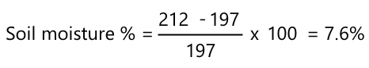

<!--
CO_OP_TRANSLATOR_METADATA:
{
  "original_hash": "506d21b544d5de47406c89ad496a21cd",
  "translation_date": "2025-08-26T06:51:48+00:00",
  "source_file": "2-farm/lessons/2-detect-soil-moisture/assignment.md",
  "language_code": "pl"
}
-->
# Kalibracja czujnika

## Instrukcje

W tej lekcji zebrałeś odczyty z czujnika wilgotności gleby, mierzone w wartościach od 0 do 1023. Aby przekształcić je w rzeczywiste odczyty wilgotności gleby, musisz skalibrować swój czujnik. Możesz to zrobić, wykonując odczyty z próbek gleby, a następnie obliczając grawimetryczną zawartość wilgoci w glebie na podstawie tych próbek.

Będziesz musiał powtórzyć te kroki kilkukrotnie, aby uzyskać potrzebne odczyty, za każdym razem z różnym poziomem wilgotności gleby.

1. Wykonaj odczyt wilgotności gleby za pomocą czujnika wilgotności gleby. Zapisz ten odczyt.

1. Pobierz próbkę gleby i zważ ją. Zapisz tę wagę.

1. Wysusz glebę – najlepiej w ciepłym piekarniku w temperaturze 110°C (230°F) przez kilka godzin. Możesz to zrobić również na słońcu lub umieścić próbkę w ciepłym, suchym miejscu, aż gleba będzie całkowicie sucha. Powinna być sypka i miałka.

    > 💁 W laboratorium, aby uzyskać najdokładniejsze wyniki, suszyłbyś próbkę w piekarniku przez 48-72 godziny. Jeśli w Twojej szkole są dostępne suszarki laboratoryjne, sprawdź, czy możesz z nich skorzystać, aby suszyć próbki dłużej. Im dłużej, tym bardziej sucha próbka i dokładniejsze wyniki.

1. Zważ glebę ponownie.

    > 🔥 Jeśli suszyłeś próbkę w piekarniku, upewnij się, że najpierw ostygła!

Grawimetryczna wilgotność gleby jest obliczana jako:

* W  
- waga mokrej gleby  
* W  
- waga suchej gleby  

Na przykład, załóżmy, że masz próbkę gleby, która waży 212 g w stanie mokrym i 197 g w stanie suchym.

* W = 212 g  
* W = 197 g  
* 212 - 197 = 15  
* 15 / 197 = 0,076  
* 0,076 * 100 = 7,6%  

W tym przykładzie gleba ma grawimetryczną wilgotność na poziomie 7,6%.

Gdy masz odczyty dla co najmniej 3 próbek, narysuj wykres procentowej wilgotności gleby w stosunku do odczytów z czujnika wilgotności gleby i dodaj linię najlepszego dopasowania do punktów. Następnie możesz użyć tego wykresu, aby obliczyć grawimetryczną zawartość wilgoci w glebie dla danego odczytu z czujnika, odczytując wartość z linii.

## Kryteria oceny

| Kryterium | Wzorowe | Wystarczające | Wymaga poprawy |
| --------- | ------- | ------------- | -------------- |
| Zbieranie danych kalibracyjnych | Zebrano co najmniej 3 próbki kalibracyjne | Zebrano co najmniej 2 próbki kalibracyjne | Zebrano co najmniej 1 próbkę kalibracyjną |
| Wykonanie skalibrowanego odczytu | Pomyślnie narysowano wykres kalibracyjny, wykonano odczyt z czujnika i przeliczono go na grawimetryczną wilgotność gleby | Pomyślnie narysowano wykres kalibracyjny | Nie udało się narysować wykresu |

**Zastrzeżenie**:  
Ten dokument został przetłumaczony za pomocą usługi tłumaczenia AI [Co-op Translator](https://github.com/Azure/co-op-translator). Chociaż dokładamy wszelkich starań, aby tłumaczenie było precyzyjne, prosimy pamiętać, że automatyczne tłumaczenia mogą zawierać błędy lub nieścisłości. Oryginalny dokument w jego rodzimym języku powinien być uznawany za wiarygodne źródło. W przypadku informacji o kluczowym znaczeniu zaleca się skorzystanie z profesjonalnego tłumaczenia przez człowieka. Nie ponosimy odpowiedzialności za jakiekolwiek nieporozumienia lub błędne interpretacje wynikające z użycia tego tłumaczenia.