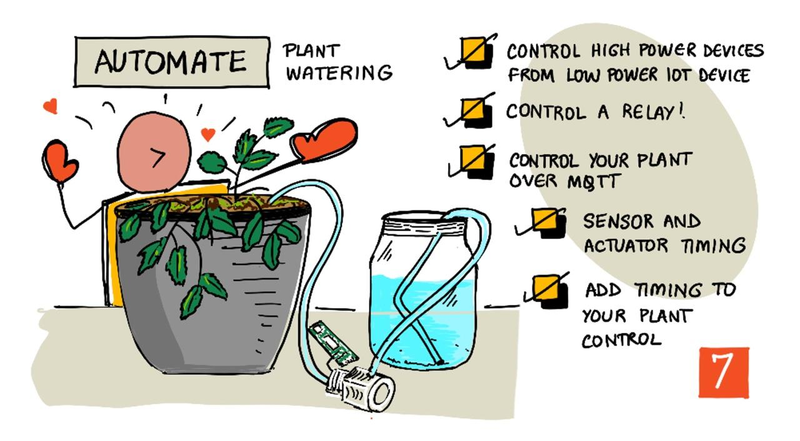

<!--
CO_OP_TRANSLATOR_METADATA:
{
  "original_hash": "f7bb24ba53fb627ddb38a8b24a05e594",
  "translation_date": "2025-08-26T06:44:22+00:00",
  "source_file": "2-farm/lessons/3-automated-plant-watering/README.md",
  "language_code": "pl"
}
-->
# Automatyczne podlewanie roślin



> Szkic autorstwa [Nitya Narasimhan](https://github.com/nitya). Kliknij obraz, aby zobaczyć większą wersję.

Ta lekcja była częścią [Projektu IoT dla początkujących 2 - Cyfrowe rolnictwo](https://youtube.com/playlist?list=PLmsFUfdnGr3yCutmcVg6eAUEfsGiFXgcx) z [Microsoft Reactor](https://developer.microsoft.com/reactor/?WT.mc_id=academic-17441-jabenn).

[](https://youtu.be/g9FfZwv9R58)

## Quiz przed lekcją

[Quiz przed lekcją](https://black-meadow-040d15503.1.azurestaticapps.net/quiz/13)

## Wprowadzenie

W poprzedniej lekcji nauczyłeś się, jak monitorować wilgotność gleby. W tej lekcji dowiesz się, jak zbudować podstawowe elementy automatycznego systemu nawadniania, który reaguje na wilgotność gleby. Poznasz również zagadnienia związane z czasem - jak czujniki mogą potrzebować chwili na reakcję na zmiany oraz jak siłowniki mogą potrzebować czasu na zmianę właściwości mierzonych przez czujniki.

W tej lekcji omówimy:

* [Sterowanie urządzeniami o dużej mocy za pomocą urządzenia IoT o niskiej mocy](../../../../../2-farm/lessons/3-automated-plant-watering)
* [Sterowanie przekaźnikiem](../../../../../2-farm/lessons/3-automated-plant-watering)
* [Sterowanie rośliną za pomocą MQTT](../../../../../2-farm/lessons/3-automated-plant-watering)
* [Czas reakcji czujników i siłowników](../../../../../2-farm/lessons/3-automated-plant-watering)
* [Dodanie czasu do serwera sterującego rośliną](../../../../../2-farm/lessons/3-automated-plant-watering)

## Sterowanie urządzeniami o dużej mocy za pomocą urządzenia IoT o niskiej mocy

Urządzenia IoT korzystają z niskiego napięcia. Chociaż jest ono wystarczające dla czujników i siłowników o niskim poborze mocy, takich jak diody LED, to jest zbyt niskie, aby sterować większym sprzętem, takim jak pompa wodna używana do nawadniania. Nawet małe pompy, które można wykorzystać do podlewania roślin doniczkowych, pobierają zbyt dużo prądu dla zestawu deweloperskiego IoT i mogłyby go uszkodzić.

> 🎓 Prąd, mierzony w amperach (A), to ilość elektryczności przepływającej przez obwód. Napięcie zapewnia "popych", a prąd określa, ile jest "popychane". Więcej o prądzie możesz przeczytać na [stronie o prądzie elektrycznym w Wikipedii](https://wikipedia.org/wiki/Electric_current).

Rozwiązaniem tego problemu jest podłączenie pompy do zewnętrznego źródła zasilania i użycie siłownika do włączania pompy, podobnie jak włączasz światło. Wymaga to niewielkiej ilości energii (w postaci energii z twojego ciała), aby palcem przełączyć włącznik, co łączy światło z siecią elektryczną o napięciu 110V/240V.


> 🎓 [Prąd sieciowy](https://wikipedia.org/wiki/Mains_electricity) odnosi się do elektryczności dostarczanej do domów i firm przez infrastrukturę krajową w wielu częściach świata.

✅ Urządzenia IoT zazwyczaj dostarczają 3,3V lub 5V, przy prądzie mniejszym niż 1 amper (1A). Dla porównania, prąd sieciowy to najczęściej 230V (120V w Ameryce Północnej i 100V w Japonii) i może zasilać urządzenia pobierające prąd o natężeniu 30A.

Istnieje wiele siłowników, które mogą to zrobić, w tym urządzenia mechaniczne, które można przymocować do istniejących przełączników, naśladując ruch palca. Najpopularniejszym rozwiązaniem jest przekaźnik.

### Przekaźniki

Przekaźnik to elektromechaniczny przełącznik, który przekształca sygnał elektryczny w ruch mechaniczny, włączając przełącznik. Rdzeniem przekaźnika jest elektromagnes.

> 🎓 [Elektromagnesy](https://wikipedia.org/wiki/Electromagnet) to magnesy tworzone przez przepływ prądu przez cewkę drutu. Gdy prąd jest włączony, cewka staje się namagnesowana. Gdy prąd jest wyłączony, cewka traci swoje właściwości magnetyczne.


W przekaźniku obwód sterujący zasila elektromagnes. Gdy elektromagnes jest włączony, przyciąga dźwignię, która porusza przełącznik, zamykając parę styków i zamykając obwód wyjściowy.


Gdy obwód sterujący jest wyłączony, elektromagnes wyłącza się, zwalniając dźwignię i otwierając styki, wyłączając obwód wyjściowy. Przekaźniki są cyfrowymi siłownikami - wysoki sygnał włącza przekaźnik, niski sygnał go wyłącza.

Obwód wyjściowy może zasilać dodatkowy sprzęt, taki jak system nawadniania. Urządzenie IoT może włączyć przekaźnik, zamykając obwód wyjściowy, który zasila system nawadniania, a rośliny zostają podlane. Następnie urządzenie IoT może wyłączyć przekaźnik, odcinając zasilanie systemu nawadniania i wyłączając wodę.


Na powyższym filmie przekaźnik jest włączany. Dioda LED na przekaźniku zapala się, wskazując, że jest włączony (niektóre płytki przekaźników mają diody LED wskazujące, czy przekaźnik jest włączony, czy wyłączony), a zasilanie jest przesyłane do pompy, która włącza się i pompuje wodę do rośliny.

> 💁 Przekaźniki mogą być również używane do przełączania między dwoma obwodami wyjściowymi zamiast włączania i wyłączania jednego. Gdy dźwignia się porusza, przełącza obwód z jednego obwodu wyjściowego na inny, zwykle dzieląc wspólne zasilanie lub wspólną masę.

✅ Zrób badania: Istnieje wiele typów przekaźników, różniących się np. tym, czy obwód sterujący włącza lub wyłącza przekaźnik po podaniu zasilania, lub liczbą obwodów wyjściowych. Dowiedz się więcej o tych różnych typach.

Gdy dźwignia się porusza, zwykle można usłyszeć charakterystyczny klik, gdy styka się z elektromagnesem.

> 💁 Przekaźnik można podłączyć w taki sposób, że połączenie faktycznie przerywa zasilanie przekaźnika, wyłączając go, co następnie ponownie wysyła zasilanie do przekaźnika, włączając go ponownie, i tak dalej. Oznacza to, że przekaźnik będzie klikał bardzo szybko, wydając dźwięk brzęczenia. W ten sposób działały niektóre z pierwszych brzęczyków używanych w dzwonkach elektrycznych.

### Zasilanie przekaźnika

Elektromagnes nie potrzebuje dużo mocy, aby się aktywować i przyciągnąć dźwignię, można go sterować za pomocą 3,3V lub 5V z urządzenia IoT. Obwód wyjściowy może przenosić znacznie większą moc, w zależności od przekaźnika, w tym napięcie sieciowe lub nawet wyższe poziomy mocy dla zastosowań przemysłowych. Dzięki temu zestaw IoT może sterować systemem nawadniania, od małej pompy dla pojedynczej rośliny, po ogromny system przemysłowy dla całej farmy komercyjnej.


Na powyższym obrazie pokazano przekaźnik Grove. Obwód sterujący łączy się z urządzeniem IoT i włącza lub wyłącza przekaźnik za pomocą 3,3V lub 5V. Obwód wyjściowy ma dwa terminale, z których każdy może być zasilaniem lub masą. Obwód wyjściowy może obsługiwać do 250V przy 10A, co wystarcza dla szeregu urządzeń zasilanych z sieci. Można również znaleźć przekaźniki obsługujące jeszcze wyższe poziomy mocy.


Na powyższym obrazie zasilanie jest dostarczane do pompy przez przekaźnik. Czerwony przewód łączy terminal +5V zasilacza USB z jednym terminalem obwodu wyjściowego przekaźnika, a inny czerwony przewód łączy drugi terminal obwodu wyjściowego z pompą. Czarny przewód łączy pompę z masą zasilacza USB. Gdy przekaźnik się włącza, zamyka obwód, przesyłając 5V do pompy, włączając ją.

## Sterowanie przekaźnikiem

Możesz sterować przekaźnikiem za pomocą swojego zestawu IoT.

### Zadanie - sterowanie przekaźnikiem

Przejdź przez odpowiedni przewodnik, aby sterować przekaźnikiem za pomocą swojego urządzenia IoT:

* [Arduino - Wio Terminal](wio-terminal-relay.md)
* [Komputer jednopłytkowy - Raspberry Pi](pi-relay.md)
* [Komputer jednopłytkowy - Wirtualne urządzenie](virtual-device-relay.md)

## Sterowanie rośliną za pomocą MQTT

Do tej pory przekaźnik był sterowany bezpośrednio przez urządzenie IoT na podstawie pojedynczego odczytu wilgotności gleby. W komercyjnym systemie nawadniania logika sterowania jest scentralizowana, co pozwala podejmować decyzje o podlewaniu na podstawie danych z wielu czujników i umożliwia zmianę konfiguracji w jednym miejscu. Aby to zasymulować, możesz sterować przekaźnikiem za pomocą MQTT.

### Zadanie - sterowanie przekaźnikiem za pomocą MQTT

1. Dodaj odpowiednie biblioteki MQTT/pakiety pip i kod do swojego projektu `soil-moisture-sensor`, aby połączyć się z MQTT. Nazwij identyfikator klienta jako `soilmoisturesensor_client` z prefiksem swojego ID.

    > ⚠️ Możesz odwołać się do [instrukcji dotyczących łączenia się z MQTT w projekcie 1, lekcja 4, jeśli to konieczne](../../../1-getting-started/lessons/4-connect-internet/README.md#connect-your-iot-device-to-mqtt).

1. Dodaj odpowiedni kod urządzenia, aby wysyłać telemetrię z ustawieniami wilgotności gleby. Dla wiadomości telemetrii nazwij właściwość `soil_moisture`.

    > ⚠️ Możesz odwołać się do [instrukcji dotyczących wysyłania telemetrii do MQTT w projekcie 1, lekcja 4, jeśli to konieczne](../../../1-getting-started/lessons/4-connect-internet/README.md#send-telemetry-from-your-iot-device).

1. Utwórz lokalny kod serwera, aby subskrybować telemetrię i wysyłać polecenie sterujące przekaźnikiem w folderze `soil-moisture-sensor-server`. Nazwij właściwość w wiadomości polecenia `relay_on`, a identyfikator klienta jako `soilmoisturesensor_server` z prefiksem swojego ID. Zachowaj tę samą strukturę, co kod serwera, który napisałeś w projekcie 1, lekcja 4, ponieważ będziesz dodawać do tego kodu później w tej lekcji.

    > ⚠️ Możesz odwołać się do [instrukcji dotyczących wysyłania telemetrii do MQTT](../../../1-getting-started/lessons/4-connect-internet/README.md#write-the-server-code) i [wysyłania poleceń przez MQTT](../../../1-getting-started/lessons/4-connect-internet/README.md#send-commands-to-the-mqtt-broker) w projekcie 1, lekcja 4, jeśli to konieczne.

1. Dodaj odpowiedni kod urządzenia, aby sterować przekaźnikiem na podstawie odebranych poleceń, używając właściwości `relay_on` z wiadomości. Wyślij wartość true dla `relay_on`, jeśli `soil_moisture` jest większe niż 450, w przeciwnym razie wyślij false, zgodnie z logiką, którą dodałeś wcześniej dla urządzenia IoT.

    > ⚠️ Możesz odwołać się do [instrukcji dotyczących reagowania na polecenia z MQTT w projekcie 1, lekcja 4, jeśli to konieczne](../../../1-getting-started/lessons/4-connect-internet/README.md#handle-commands-on-the-iot-device).

> 💁 Kod znajdziesz w folderze [code-mqtt](../../../../../2-farm/lessons/3-automated-plant-watering/code-mqtt).

Upewnij się, że kod działa na twoim urządzeniu i lokalnym serwerze, i przetestuj go, zmieniając poziomy wilgotności gleby, albo zmieniając wartości wysyłane przez wirtualny czujnik, albo zmieniając poziomy wilgotności gleby, dodając wodę lub usuwając czujnik z gleby.

## Czas reakcji czujników i siłowników

W lekcji 3 zbudowałeś lampkę nocną - diodę LED, która włącza się, gdy czujnik światła wykryje niski poziom światła. Czujnik światła wykrywał zmiany poziomu światła natychmiast, a urządzenie mogło szybko reagować, ograniczone jedynie długością opóźnienia w funkcji `loop` lub pętli `while True:`. Jako programista IoT, nie zawsze możesz polegać na tak szybkim sprzężeniu zwrotnym.

### Czas reakcji dla wilgotności gleby

Jeśli wykonałeś poprzednią lekcję dotyczącą wilgotności gleby za pomocą fizycznego czujnika, zauważyłeś, że odczyt wilgotności gleby spadał przez kilka sekund po podlaniu rośliny. Nie wynika to z powolności czujnika, lecz z czasu, jaki woda potrzebuje, aby wsiąknąć w glebę.
💁 Jeśli podlewałeś zbyt blisko czujnika, mogłeś zauważyć szybki spadek odczytu, a następnie jego powrót do poprzedniego poziomu - dzieje się tak, ponieważ woda w pobliżu czujnika rozprzestrzenia się w pozostałej części gleby, zmniejszając wilgotność gleby w okolicy czujnika.


Na powyższym diagramie odczyt wilgotności gleby wynosi 658. Roślina jest podlewana, ale odczyt ten nie zmienia się od razu, ponieważ woda jeszcze nie dotarła do czujnika. Podlewanie może nawet zakończyć się, zanim woda dotrze do czujnika, a wartość spadnie, odzwierciedlając nowy poziom wilgotności.

Jeśli pisałbyś kod do sterowania systemem nawadniania za pomocą przekaźnika na podstawie poziomów wilgotności gleby, musiałbyś uwzględnić to opóźnienie i wprowadzić inteligentniejsze sterowanie czasem w swoim urządzeniu IoT.

✅ Zastanów się, jak mógłbyś to zrobić.

### Sterowanie czasem czujnika i aktuatora

Wyobraź sobie, że masz za zadanie zbudować system nawadniania dla farmy. Na podstawie rodzaju gleby idealny poziom wilgotności dla uprawianych roślin odpowiada analogowemu odczytowi napięcia w zakresie 400-450.

Możesz zaprogramować urządzenie w taki sam sposób jak lampkę nocną – za każdym razem, gdy czujnik odczytuje wartość powyżej 450, włącz przekaźnik, aby uruchomić pompę. Problem polega na tym, że woda potrzebuje czasu, aby dotrzeć z pompy przez glebę do czujnika. Czujnik zatrzyma wodę, gdy wykryje poziom 450, ale poziom wilgotności będzie nadal spadał, ponieważ pompowana woda wciąż przesiąka przez glebę. W efekcie marnuje się woda, a korzenie roślin są narażone na uszkodzenie.

✅ Pamiętaj – zbyt dużo wody może być równie szkodliwe dla roślin, co jej niedobór, a dodatkowo marnuje cenny zasób.

Lepszym rozwiązaniem jest zrozumienie, że istnieje opóźnienie między włączeniem aktuatora a zmianą właściwości odczytywanej przez czujnik. Oznacza to, że nie tylko czujnik powinien poczekać chwilę przed ponownym pomiarem wartości, ale także aktuator musi być wyłączony na jakiś czas przed kolejnym pomiarem czujnika.

Jak długo przekaźnik powinien być włączony za każdym razem? Lepiej być ostrożnym i włączać przekaźnik na krótki czas, a następnie poczekać, aż woda przesiąknie, i ponownie sprawdzić poziom wilgotności. W końcu zawsze można włączyć pompę ponownie, aby dodać więcej wody, ale nie można usunąć wody z gleby.

> 💁 Tego rodzaju sterowanie czasem jest bardzo specyficzne dla urządzenia IoT, które budujesz, właściwości, którą mierzysz, oraz używanych czujników i aktuatorów.


Na przykład mam roślinę truskawki z czujnikiem wilgotności gleby i pompą sterowaną przekaźnikiem. Zauważyłem, że gdy dodaję wodę, potrzeba około 20 sekund, aby odczyt wilgotności gleby się ustabilizował. Oznacza to, że muszę wyłączyć przekaźnik i poczekać 20 sekund przed sprawdzeniem poziomu wilgotności. Wolę mieć za mało wody niż za dużo – zawsze mogę włączyć pompę ponownie, ale nie mogę usunąć wody z rośliny.


Oznacza to, że najlepszy proces podlewania wyglądałby mniej więcej tak:

* Włącz pompę na 5 sekund
* Poczekaj 20 sekund
* Sprawdź wilgotność gleby
* Jeśli poziom nadal jest powyżej wymaganego, powtórz powyższe kroki

5 sekund może być zbyt długim czasem dla pompy, szczególnie jeśli poziom wilgotności jest tylko nieznacznie powyżej wymaganego poziomu. Najlepszym sposobem na ustalenie odpowiedniego czasu jest wypróbowanie, a następnie dostosowanie na podstawie danych z czujnika, z ciągłym cyklem sprzężenia zwrotnego. Może to nawet prowadzić do bardziej precyzyjnego sterowania czasem, na przykład włączania pompy na 1 sekundę za każde 100 powyżej wymaganego poziomu wilgotności gleby, zamiast stałych 5 sekund.

✅ Zrób badania: Czy istnieją inne kwestie związane z czasem? Czy roślinę można podlewać w dowolnym momencie, gdy wilgotność gleby jest zbyt niska, czy są określone pory dnia, które są dobre lub złe do podlewania roślin?

> 💁 Prognozy pogody również mogą być brane pod uwagę przy sterowaniu automatycznymi systemami nawadniania na zewnątrz. Jeśli spodziewany jest deszcz, podlewanie można wstrzymać do czasu jego zakończenia. Wtedy gleba może być wystarczająco wilgotna, aby nie wymagała podlewania, co jest znacznie bardziej efektywne niż marnowanie wody przez podlewanie tuż przed deszczem.

## Dodaj sterowanie czasem do serwera kontrolującego rośliny

Kod serwera można zmodyfikować, aby dodać kontrolę nad czasem cyklu podlewania i oczekiwaniem na zmianę poziomów wilgotności gleby. Logika serwera kontrolująca czas przekaźnika wygląda następująco:

1. Odebrano wiadomość telemetryczną
1. Sprawdź poziom wilgotności gleby
1. Jeśli jest w porządku, nic nie rób. Jeśli odczyt jest zbyt wysoki (co oznacza, że wilgotność gleby jest zbyt niska), to:
    1. Wyślij polecenie włączenia przekaźnika
    1. Poczekaj 5 sekund
    1. Wyślij polecenie wyłączenia przekaźnika
    1. Poczekaj 20 sekund, aby poziomy wilgotności gleby się ustabilizowały

Cykl podlewania, proces od odebrania wiadomości telemetrycznej do gotowości do ponownego przetwarzania poziomów wilgotności gleby, trwa około 25 sekund. Wysyłamy poziomy wilgotności gleby co 10 sekund, więc istnieje nakładanie się, gdzie wiadomość jest odbierana, podczas gdy serwer czeka na stabilizację poziomów wilgotności gleby, co może rozpocząć kolejny cykl podlewania.

Istnieją dwa rozwiązania tego problemu:

* Zmień kod urządzenia IoT, aby wysyłał telemetrię co minutę, dzięki czemu cykl podlewania zostanie zakończony przed wysłaniem kolejnej wiadomości
* Wyłącz subskrypcję telemetrii podczas cyklu podlewania

Pierwsza opcja nie zawsze jest dobrym rozwiązaniem dla dużych farm. Rolnik może chcieć rejestrować poziomy wilgotności gleby podczas podlewania, aby później je analizować, na przykład aby być świadomym przepływu wody w różnych obszarach farmy i kierować bardziej precyzyjnym podlewaniem. Druga opcja jest lepsza – kod po prostu ignoruje telemetrię, gdy nie może jej użyć, ale telemetria nadal jest dostępna dla innych usług, które mogą ją subskrybować.

> 💁 Dane IoT nie są wysyłane tylko z jednego urządzenia do jednej usługi, zamiast tego wiele urządzeń może wysyłać dane do brokera, a wiele usług może odbierać dane z brokera. Na przykład jedna usługa może odbierać dane o wilgotności gleby i przechowywać je w bazie danych do późniejszej analizy. Inna usługa może również odbierać tę samą telemetrię, aby sterować systemem nawadniania.

### Zadanie - dodaj sterowanie czasem do serwera kontrolującego rośliny

Zaktualizuj kod serwera, aby uruchamiał przekaźnik na 5 sekund, a następnie czekał 20 sekund.

1. Otwórz folder `soil-moisture-sensor-server` w VS Code, jeśli nie jest już otwarty. Upewnij się, że środowisko wirtualne jest aktywowane.

1. Otwórz plik `app.py`

1. Dodaj poniższy kod do pliku `app.py` poniżej istniejących importów:

    ```python
    import threading
    ```

    Ten kod importuje `threading` z bibliotek Pythona, co pozwala na wykonywanie innych kodów podczas oczekiwania.

1. Dodaj poniższy kod przed funkcją `handle_telemetry`, która obsługuje wiadomości telemetryczne odbierane przez kod serwera:

    ```python
    water_time = 5
    wait_time = 20
    ```

    To definiuje, jak długo uruchamiać przekaźnik (`water_time`) i jak długo czekać po tym, aby sprawdzić wilgotność gleby (`wait_time`).

1. Poniżej tego kodu dodaj następujący fragment:

    ```python
    def send_relay_command(client, state):
        command = { 'relay_on' : state }
        print("Sending message:", command)
        client.publish(server_command_topic, json.dumps(command))
    ```

    Ten kod definiuje funkcję `send_relay_command`, która wysyła polecenie przez MQTT do sterowania przekaźnikiem. Telemetria jest tworzona jako słownik, a następnie konwertowana na ciąg JSON. Wartość przekazana do `state` określa, czy przekaźnik powinien być włączony czy wyłączony.

1. Po funkcji `send_relay_code` dodaj następujący kod:

    ```python
    def control_relay(client):
        print("Unsubscribing from telemetry")
        mqtt_client.unsubscribe(client_telemetry_topic)
    
        send_relay_command(client, True)
        time.sleep(water_time)
        send_relay_command(client, False)
    
        time.sleep(wait_time)
    
        print("Subscribing to telemetry")
        mqtt_client.subscribe(client_telemetry_topic)
    ```

    Ten kod definiuje funkcję do sterowania przekaźnikiem na podstawie wymaganego czasu. Zaczyna od wyłączenia subskrypcji telemetrii, aby wiadomości o wilgotności gleby nie były przetwarzane podczas podlewania. Następnie wysyła polecenie włączenia przekaźnika. Potem czeka przez `water_time`, zanim wyśle polecenie wyłączenia przekaźnika. Na końcu czeka przez `wait_time`, aby poziomy wilgotności gleby się ustabilizowały, a następnie ponownie subskrybuje telemetrię.

1. Zmień funkcję `handle_telemetry` na następującą:

    ```python
    def handle_telemetry(client, userdata, message):
        payload = json.loads(message.payload.decode())
        print("Message received:", payload)
    
        if payload['soil_moisture'] > 450:
            threading.Thread(target=control_relay, args=(client,)).start()
    ```

    Ten kod sprawdza poziom wilgotności gleby. Jeśli jest większy niż 450, gleba wymaga podlewania, więc wywołuje funkcję `control_relay`. Ta funkcja jest uruchamiana w osobnym wątku, działającym w tle.

1. Upewnij się, że Twoje urządzenie IoT działa, a następnie uruchom ten kod. Zmień poziomy wilgotności gleby i obserwuj, co dzieje się z przekaźnikiem – powinien włączać się na 5 sekund, a następnie pozostawać wyłączony przez co najmniej 20 sekund, włączając się tylko wtedy, gdy poziomy wilgotności gleby są niewystarczające.

    ```output
    (.venv) ➜  soil-moisture-sensor-server ✗ python app.py
    Message received: {'soil_moisture': 457}
    Unsubscribing from telemetry
    Sending message: {'relay_on': True}
    Sending message: {'relay_on': False}
    Subscribing to telemetry
    Message received: {'soil_moisture': 302}
    ```

    Dobrym sposobem na przetestowanie tego w symulowanym systemie nawadniania jest użycie suchej gleby, a następnie ręczne dolewanie wody podczas włączonego przekaźnika, zatrzymując dolewanie, gdy przekaźnik się wyłącza.

> 💁 Ten kod znajdziesz w folderze [code-timing](../../../../../2-farm/lessons/3-automated-plant-watering/code-timing).

> 💁 Jeśli chcesz użyć pompy do zbudowania prawdziwego systemu nawadniania, możesz użyć [6V mini pompy wodnej](https://www.seeedstudio.com/6V-Mini-Water-Pump-p-1945.html) z [zasilaczem USB](https://www.adafruit.com/product/3628). Upewnij się, że zasilanie do lub z pompy jest podłączone przez przekaźnik.

---

## 🚀 Wyzwanie

Czy możesz pomyśleć o innych urządzeniach IoT lub elektrycznych, które mają podobny problem, gdzie potrzeba czasu, aby wyniki aktuatora dotarły do czujnika? Prawdopodobnie masz kilka w swoim domu lub szkole.

* Jakie właściwości mierzą?
* Jak długo trwa zmiana właściwości po użyciu aktuatora?
* Czy jest w porządku, jeśli właściwość zmienia się poza wymagany poziom?
* Jak można ją przywrócić do wymaganego poziomu, jeśli zajdzie taka potrzeba?

## Quiz po wykładzie

[Quiz po wykładzie](https://black-meadow-040d15503.1.azurestaticapps.net/quiz/14)

## Przegląd i samodzielna nauka

* Przeczytaj więcej o przekaźnikach, w tym o ich historycznym zastosowaniu w centralach telefonicznych, na [stronie Wikipedii o przekaźnikach](https://wikipedia.org/wiki/Relay).

## Zadanie

[Zbuduj bardziej efektywny cykl podlewania](assignment.md)

**Zastrzeżenie**:  
Ten dokument został przetłumaczony za pomocą usługi tłumaczenia AI [Co-op Translator](https://github.com/Azure/co-op-translator). Chociaż dokładamy wszelkich starań, aby tłumaczenie było precyzyjne, prosimy pamiętać, że automatyczne tłumaczenia mogą zawierać błędy lub nieścisłości. Oryginalny dokument w jego rodzimym języku powinien być uznawany za wiarygodne źródło. W przypadku informacji o kluczowym znaczeniu zaleca się skorzystanie z profesjonalnego tłumaczenia przez człowieka. Nie ponosimy odpowiedzialności za jakiekolwiek nieporozumienia lub błędne interpretacje wynikające z użycia tego tłumaczenia.