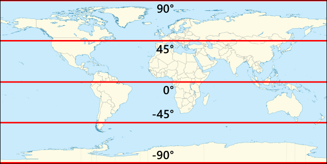

<!--
CO_OP_TRANSLATOR_METADATA:
{
  "original_hash": "52ed2bd997d08040f79a1a6ef2bac958",
  "translation_date": "2025-08-26T07:30:48+00:00",
  "source_file": "3-transport/lessons/1-location-tracking/README.md",
  "language_code": "pl"
}
-->
# Śledzenie lokalizacji

> Szkic autorstwa [Nitya Narasimhan](https://github.com/nitya). Kliknij obrazek, aby zobaczyć większą wersję.

## Quiz przed wykładem

[Quiz przed wykładem](https://black-meadow-040d15503.1.azurestaticapps.net/quiz/21)

## Wprowadzenie

Główny proces dostarczania żywności od rolnika do konsumenta obejmuje załadunek skrzynek z produktami na ciężarówki, statki, samoloty lub inne pojazdy transportowe, a następnie dostarczenie żywności w określone miejsce – bezpośrednio do klienta lub do centralnego magazynu w celu dalszego przetwarzania. Cały proces od farmy do konsumenta jest częścią procesu nazywanego *łańcuchem dostaw*. Poniższy film z W. P. Carey School of Business na Uniwersytecie Stanowym Arizony omawia ideę łańcucha dostaw i sposób jego zarządzania w bardziej szczegółowy sposób.

> 🎥 Kliknij obrazek powyżej, aby obejrzeć film

Dodanie urządzeń IoT może znacząco poprawić Twój łańcuch dostaw, umożliwiając zarządzanie lokalizacją przedmiotów, lepsze planowanie transportu i obsługi towarów oraz szybsze reagowanie na problemy.

Podczas zarządzania flotą pojazdów, takich jak ciężarówki, pomocne jest wiedzieć, gdzie każdy pojazd znajduje się w danym momencie. Pojazdy mogą być wyposażone w czujniki GPS, które przesyłają ich lokalizację do systemów IoT, umożliwiając właścicielom określenie ich położenia, prześledzenie trasy, którą przebyły, oraz przewidzenie czasu dotarcia do celu. Większość pojazdów działa poza zasięgiem WiFi, więc do przesyłania takich danych używają sieci komórkowych. Czasami czujnik GPS jest wbudowany w bardziej złożone urządzenia IoT, takie jak elektroniczne dzienniki pokładowe. Te urządzenia śledzą, jak długo ciężarówka jest w trasie, aby upewnić się, że kierowcy przestrzegają lokalnych przepisów dotyczących godzin pracy.

W tej lekcji dowiesz się, jak śledzić lokalizację pojazdu za pomocą czujnika GPS.

W tej lekcji omówimy:

* [Pojazdy połączone](../../../../../3-transport/lessons/1-location-tracking)
* [Współrzędne geograficzne](../../../../../3-transport/lessons/1-location-tracking)
* [Globalne systemy pozycjonowania (GPS)](../../../../../3-transport/lessons/1-location-tracking)
* [Odczyt danych z czujnika GPS](../../../../../3-transport/lessons/1-location-tracking)
* [Dane GPS w formacie NMEA](../../../../../3-transport/lessons/1-location-tracking)
* [Dekodowanie danych z czujnika GPS](../../../../../3-transport/lessons/1-location-tracking)

## Pojazdy połączone

IoT zmienia sposób transportu towarów, tworząc floty *połączonych pojazdów*. Te pojazdy są połączone z centralnymi systemami IT, przesyłając informacje o swojej lokalizacji i innych danych z czujników. Posiadanie floty połączonych pojazdów niesie ze sobą wiele korzyści:

* Śledzenie lokalizacji – możesz określić, gdzie pojazd znajduje się w dowolnym momencie, co pozwala na:

  * Otrzymywanie powiadomień, gdy pojazd zbliża się do celu, aby przygotować załogę do rozładunku
  * Lokalizowanie skradzionych pojazdów
  * Łączenie danych o lokalizacji i trasie z problemami drogowymi, aby umożliwić zmianę trasy pojazdu w trakcie podróży
  * Przestrzeganie przepisów podatkowych. Niektóre kraje pobierają opłaty za przejechane kilometry na drogach publicznych (np. [RUC w Nowej Zelandii](https://www.nzta.govt.nz/vehicles/licensing-rego/road-user-charges/)), więc wiedza, kiedy pojazd znajduje się na drogach publicznych, a kiedy na prywatnych, ułatwia obliczenie należnego podatku.
  * Wiedza, gdzie wysłać ekipy serwisowe w przypadku awarii

* Telemetria kierowcy – możliwość monitorowania, czy kierowcy przestrzegają ograniczeń prędkości, pokonują zakręty z odpowiednią prędkością, hamują wcześnie i efektywnie oraz jeżdżą bezpiecznie. Połączone pojazdy mogą również mieć kamery rejestrujące zdarzenia. Może to być powiązane z ubezpieczeniem, oferując niższe stawki dla dobrych kierowców.

* Zgodność z godzinami pracy kierowcy – zapewnienie, że kierowcy jeżdżą tylko przez dozwolone prawem godziny, na podstawie czasu włączania i wyłączania silnika.

Te korzyści można łączyć – na przykład, łączenie zgodności godzin pracy kierowcy ze śledzeniem lokalizacji, aby zmienić trasę kierowcy, jeśli nie może dotrzeć do celu w ramach dozwolonych godzin jazdy. Można je również łączyć z innymi danymi telemetrycznymi specyficznymi dla pojazdu, takimi jak dane o temperaturze z ciężarówek chłodniczych, aby zmienić trasę pojazdu, jeśli obecna trasa uniemożliwiłaby utrzymanie towarów w odpowiedniej temperaturze.

> 🎓 Logistyka to proces transportu towarów z jednego miejsca do drugiego, na przykład z farmy do supermarketu przez jeden lub więcej magazynów. Rolnik pakuje skrzynki z pomidorami, które są ładowane na ciężarówkę, dostarczane do centralnego magazynu, a następnie umieszczane na drugiej ciężarówce, która może zawierać mieszankę różnych rodzajów produktów, które są następnie dostarczane do supermarketu.

Głównym elementem śledzenia pojazdów jest GPS – czujniki, które mogą określić ich lokalizację w dowolnym miejscu na Ziemi. W tej lekcji dowiesz się, jak korzystać z czujnika GPS, zaczynając od nauki, jak definiować lokalizację na Ziemi.

## Współrzędne geograficzne

Współrzędne geograficzne są używane do definiowania punktów na powierzchni Ziemi, podobnie jak współrzędne mogą być używane do rysowania pikseli na ekranie komputera lub pozycjonowania ściegów w hafcie krzyżykowym. Dla pojedynczego punktu masz parę współrzędnych. Na przykład kampus Microsoftu w Redmond, Waszyngton, USA znajduje się na 47.6423109, -122.1390293.

### Szerokość i długość geograficzna

Ziemia jest kulą – trójwymiarowym okręgiem. Z tego powodu punkty są definiowane przez podzielenie jej na 360 stopni, tak jak w geometrii okręgów. Szerokość geograficzna mierzy liczbę stopni od północy do południa, a długość geograficzna mierzy liczbę stopni od wschodu do zachodu.

> 💁 Nikt tak naprawdę nie wie, dlaczego okręgi są podzielone na 360 stopni. [Strona o stopniach (kątach) na Wikipedii](https://wikipedia.org/wiki/Degree_(angle)) omawia niektóre możliwe powody.

Szerokość geograficzna jest mierzona za pomocą linii, które okrążają Ziemię i biegną równolegle do równika, dzieląc półkulę północną i południową na 90° każda. Równik znajduje się na 0°, biegun północny na 90°, znany również jako 90° na północ, a biegun południowy na -90°, czyli 90° na południe.

Długość geograficzna jest mierzona jako liczba stopni na wschód i zachód. Punkt początkowy 0° długości geograficznej nazywany jest *południkiem zerowym* i został zdefiniowany w 1884 roku jako linia biegnąca od bieguna północnego do bieguna południowego, przechodząca przez [Brytyjskie Obserwatorium Królewskie w Greenwich, Anglia](https://wikipedia.org/wiki/Royal_Observatory,_Greenwich).

> 🎓 Południk to wyimaginowana prosta linia biegnąca od bieguna północnego do bieguna południowego, tworząca półokrąg.

Aby zmierzyć długość geograficzną punktu, mierzy się liczbę stopni wokół równika od południka zerowego do południka przechodzącego przez ten punkt. Długość geograficzna wynosi od -180°, czyli 180° na zachód, przez 0° na południku zerowym, do 180°, czyli 180° na wschód. 180° i -180° odnoszą się do tego samego punktu, antypołudnika lub 180. południka. Jest to południk po przeciwnej stronie Ziemi od południka zerowego.

> 💁 Antypołudnik nie należy mylić z Międzynarodową Linią Zmiany Daty, która znajduje się w przybliżeniu w tym samym miejscu, ale nie jest prostą linią i zmienia się, aby dopasować się do granic geopolitycznych.

✅ Zrób małe badanie: Spróbuj znaleźć szerokość i długość geograficzną swojej obecnej lokalizacji.

### Stopnie, minuty i sekundy vs stopnie dziesiętne

Tradycyjnie pomiary stopni szerokości i długości geograficznej były wykonywane za pomocą systemu liczbowego sześćdziesiątkowego, czyli bazowego 60, systemu liczbowego używanego przez starożytnych Babilończyków, którzy jako pierwsi dokonywali pomiarów i zapisów czasu oraz odległości. Używasz systemu sześćdziesiątkowego prawdopodobnie codziennie, nawet nie zdając sobie z tego sprawy – dzieląc godziny na 60 minut i minuty na 60 sekund.

Długość i szerokość geograficzna są mierzone w stopniach, minutach i sekundach, przy czym jedna minuta to 1/60 stopnia, a jedna sekunda to 1/60 minuty.

Na przykład na równiku:

* 1° szerokości geograficznej to **111,3 kilometra**
* 1 minuta szerokości geograficznej to 111,3/60 = **1,855 kilometra**
* 1 sekunda szerokości geograficznej to 1,855/60 = **0,031 kilometra**

Symbol dla minuty to pojedynczy apostrof, dla sekundy podwójny apostrof. Na przykład 2 stopnie, 17 minut i 43 sekundy byłoby zapisane jako 2°17'43". Części sekund są podawane jako liczby dziesiętne, na przykład pół sekundy to 0°0'0.5".

Komputery nie pracują w bazie 60, więc te współrzędne są podawane jako stopnie dziesiętne podczas korzystania z danych GPS w większości systemów komputerowych. Na przykład 2°17'43" to 2.295277. Symbol stopnia jest zazwyczaj pomijany.

Współrzędne punktu są zawsze podawane jako `szerokość geograficzna, długość geograficzna`, więc wcześniejszy przykład kampusu Microsoftu na 47.6423109,-122.117198 ma:

* Szerokość geograficzną 47.6423109 (47.6423109 stopni na północ od równika)
* Długość geograficzną -122.1390293 (122.1390293 stopni na zachód od południka zerowego).

## Globalne systemy pozycjonowania (GPS)

Systemy GPS wykorzystują wiele satelitów orbitujących Ziemię do określenia Twojej lokalizacji. Prawdopodobnie korzystałeś z systemów GPS, nawet nie zdając sobie z tego sprawy – aby znaleźć swoją lokalizację w aplikacji mapowej na telefonie, takiej jak Apple Maps lub Google Maps, aby zobaczyć, gdzie znajduje się Twój przejazd w aplikacji do zamawiania transportu, takiej jak Uber lub Lyft, lub podczas korzystania z nawigacji satelitarnej (sat-nav) w samochodzie.

> 🎓 Satelity w „nawigacji satelitarnej” to satelity GPS!

Systemy GPS działają, mając wiele satelitów, które wysyłają sygnał z aktualną pozycją każdego satelity oraz dokładnym znacznikiem czasu. Te sygnały są przesyłane za pomocą fal radiowych i wykrywane przez antenę w czujniku GPS. Czujnik GPS wykrywa te sygnały i, korzystając z aktualnego czasu, mierzy, ile czasu zajęło sygnałowi dotarcie od satelity do czujnika. Ponieważ prędkość fal radiowych jest stała, czujnik GPS może użyć przesłanego znacznika czasu, aby obliczyć, jak daleko czujnik znajduje się od satelity. Łącząc dane z co najmniej 3 satelitów z przesłanymi pozycjami, czujnik GPS jest w stanie określić swoją lokalizację na Ziemi.

> 💁 Czujniki GPS potrzebują anten do wykrywania fal radiowych. Anteny wbudowane w ciężarówki i samochody z wbudowanym GPS są umieszczone tak, aby uzyskać dobry sygnał, zazwyczaj na przedniej szybie lub dachu. Jeśli korzystasz z oddzielnego systemu GPS, takiego jak smartfon lub urządzenie IoT, musisz upewnić się, że antena wbudowana w system GPS lub telefon ma wyraźny widok na niebo, na przykład jest zamontowana na przedniej szybie.

Satelity GPS krążą wokół Ziemi, a nie są w stałym punkcie nad czujnikiem, więc dane lokalizacyjne obejmują wysokość nad poziomem morza, a także szerokość i długość geograficzną.

GPS miał kiedyś ograniczenia dotyczące dokładności narzucone przez wojsko USA, ograniczając dokładność do około 5 metrów. To ograniczenie zostało zniesione w 2000 roku, umożliwiając dokładność do 30 centymetrów. Uzyskanie tej dokładności nie zawsze jest możliwe ze względu na zakłócenia sygnałów.

✅ Jeśli masz smartfon, uruchom aplikację mapową i sprawdź, jak dokładna jest Twoja lokalizacja. Może to zająć chwilę, zanim Twój telefon wykryje wiele satelitów, aby uzyskać bardziej dokładną lokalizację.
💁 Satelity zawierają zegary atomowe, które są niezwykle precyzyjne, ale każdego dnia odchylają się o 38 mikrosekund (0,0000038 sekundy) w porównaniu do zegarów atomowych na Ziemi. Dzieje się tak z powodu spowolnienia czasu przy zwiększającej się prędkości, zgodnie z teoriami szczególnej i ogólnej względności Einsteina – satelity poruszają się szybciej niż obrót Ziemi. To odchylenie zostało wykorzystane do potwierdzenia przewidywań teorii szczególnej i ogólnej względności i musi być uwzględnione w projektowaniu systemów GPS. Dosłownie czas płynie wolniej na satelicie GPS.
Systemy GPS zostały opracowane i wdrożone przez wiele krajów i unii politycznych, w tym USA, Rosję, Japonię, Indie, UE i Chiny. Nowoczesne czujniki GPS mogą łączyć się z większością tych systemów, aby uzyskać szybsze i bardziej precyzyjne dane lokalizacyjne.

> 🎓 Grupy satelitów w każdej implementacji nazywane są konstelacjami.

## Odczyt danych z czujnika GPS

Większość czujników GPS przesyła dane GPS za pomocą UART.

> ⚠️ UART został omówiony w [projekcie 2, lekcji 2](../../../2-farm/lessons/2-detect-soil-moisture/README.md#universal-asynchronous-receiver-transmitter-uart). W razie potrzeby wróć do tej lekcji.

Możesz użyć czujnika GPS w swoim urządzeniu IoT, aby odczytać dane GPS.

### Zadanie - podłącz czujnik GPS i odczytaj dane GPS

Przejdź przez odpowiedni przewodnik, aby odczytać dane GPS za pomocą swojego urządzenia IoT:

* [Arduino - Wio Terminal](wio-terminal-gps-sensor.md)
* [Komputer jednopłytkowy - Raspberry Pi](pi-gps-sensor.md)
* [Komputer jednopłytkowy - Wirtualne urządzenie](virtual-device-gps-sensor.md)

## Dane GPS w formacie NMEA

Podczas uruchamiania kodu mogłeś zauważyć coś, co na pierwszy rzut oka wygląda jak niezrozumiały tekst w wynikach. W rzeczywistości są to standardowe dane GPS, które mają swoje znaczenie.

Czujniki GPS przesyłają dane za pomocą wiadomości NMEA, zgodnie ze standardem NMEA 0183. NMEA to akronim od [National Marine Electronics Association](https://www.nmea.org), amerykańskiej organizacji handlowej, która ustala standardy komunikacji między elektroniką morską.

> 💁 Ten standard jest własnościowy i kosztuje co najmniej 2000 USD, ale wystarczająco dużo informacji na jego temat znajduje się w domenie publicznej, aby większość standardu została zrekonstruowana i mogła być używana w kodzie open source oraz innych projektach niekomercyjnych.

Wiadomości te są tekstowe. Każda wiadomość składa się z *zdania*, które zaczyna się od znaku `$`, po którym następują 2 znaki wskazujące źródło wiadomości (np. GP dla amerykańskiego systemu GPS, GN dla GLONASS, rosyjskiego systemu GPS) oraz 3 znaki wskazujące typ wiadomości. Reszta wiadomości to pola oddzielone przecinkami, zakończone znakiem nowej linii.

Niektóre typy wiadomości, które można odebrać, to:

| Typ | Opis |
| ---- | ----------- |
| GGA | Dane lokalizacji GPS, w tym szerokość, długość i wysokość czujnika GPS, wraz z liczbą satelitów w zasięgu, które umożliwiają obliczenie tej lokalizacji. |
| ZDA | Aktualna data i czas, w tym lokalna strefa czasowa |
| GSV | Szczegóły dotyczące satelitów w zasięgu - zdefiniowane jako satelity, z których czujnik GPS może odbierać sygnały |

> 💁 Dane GPS zawierają znaczniki czasu, więc Twoje urządzenie IoT może uzyskać czas z czujnika GPS, zamiast polegać na serwerze NTP lub wewnętrznym zegarze czasu rzeczywistego.

Wiadomość GGA zawiera aktualną lokalizację w formacie `(dd)dmm.mmmm`, wraz z pojedynczym znakiem wskazującym kierunek. `d` w formacie oznacza stopnie, `m` oznacza minuty, a sekundy są wyrażone jako dziesiętne części minut. Na przykład 2°17'43" to 217.716666667 - 2 stopnie, 17.716666667 minut.

Znak kierunku może być `N` lub `S` dla szerokości geograficznej, aby wskazać północ lub południe, oraz `E` lub `W` dla długości geograficznej, aby wskazać wschód lub zachód. Na przykład szerokość geograficzna 2°17'43" miałaby znak kierunku `N`, -2°17'43" miałaby znak kierunku `S`.

Na przykład - zdanie NMEA `$GNGGA,020604.001,4738.538654,N,12208.341758,W,1,3,,164.7,M,-17.1,M,,*67`

* Część szerokości geograficznej to `4738.538654,N`, co przekłada się na 47.6423109 w stopniach dziesiętnych. `4738.538654` to 47.6423109, a kierunek to `N` (północ), więc jest to dodatnia szerokość geograficzna.

* Część długości geograficznej to `12208.341758,W`, co przekłada się na -122.1390293 w stopniach dziesiętnych. `12208.341758` to 122.1390293°, a kierunek to `W` (zachód), więc jest to ujemna długość geograficzna.

## Dekodowanie danych z czujnika GPS

Zamiast używać surowych danych NMEA, lepiej jest je dekodować do bardziej użytecznego formatu. Istnieje wiele bibliotek open source, które mogą pomóc w wyodrębnieniu przydatnych danych z surowych wiadomości NMEA.

### Zadanie - dekodowanie danych z czujnika GPS

Przejdź przez odpowiedni przewodnik, aby dekodować dane GPS za pomocą swojego urządzenia IoT:

* [Arduino - Wio Terminal](wio-terminal-gps-decode.md)
* [Komputer jednopłytkowy - Raspberry Pi/Wirtualne urządzenie IoT](single-board-computer-gps-decode.md)

---

## 🚀 Wyzwanie

Napisz własny dekoder NMEA! Zamiast polegać na bibliotekach zewnętrznych do dekodowania zdań NMEA, czy potrafisz napisać własny dekoder, który wyodrębni szerokość i długość geograficzną ze zdań NMEA?

## Quiz po wykładzie

[Quiz po wykładzie](https://black-meadow-040d15503.1.azurestaticapps.net/quiz/22)

## Przegląd i samodzielna nauka

* Przeczytaj więcej o współrzędnych geograficznych na [stronie o systemie współrzędnych geograficznych na Wikipedii](https://wikipedia.org/wiki/Geographic_coordinate_system).
* Dowiedz się więcej o południkach zerowych na innych ciałach niebieskich niż Ziemia na [stronie o południku zerowym na Wikipedii](https://wikipedia.org/wiki/Prime_meridian#Prime_meridian_on_other_planetary_bodies).
* Zbadaj różne systemy GPS opracowane przez różne rządy i unie polityczne, takie jak UE, Japonia, Rosja, Indie i USA.

## Zadanie

[Zbadaj inne dane GPS](assignment.md)

**Zastrzeżenie**:  
Ten dokument został przetłumaczony za pomocą usługi tłumaczeniowej AI [Co-op Translator](https://github.com/Azure/co-op-translator). Chociaż dokładamy wszelkich starań, aby zapewnić dokładność, prosimy pamiętać, że automatyczne tłumaczenia mogą zawierać błędy lub nieścisłości. Oryginalny dokument w jego rodzimym języku powinien być uznawany za wiarygodne źródło. W przypadku informacji krytycznych zaleca się skorzystanie z profesjonalnego tłumaczenia wykonanego przez człowieka. Nie ponosimy odpowiedzialności za jakiekolwiek nieporozumienia lub błędne interpretacje wynikające z korzystania z tego tłumaczenia.