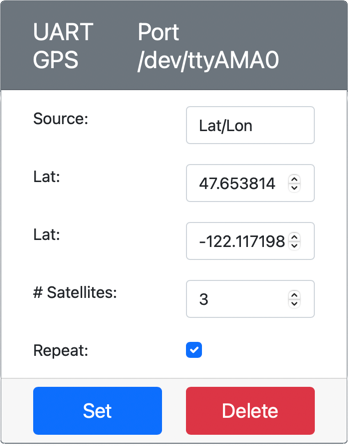

<!--
CO_OP_TRANSLATOR_METADATA:
{
  "original_hash": "64f18a8f8aaa1fef5e7320e0992d8b3a",
  "translation_date": "2025-08-26T07:30:23+00:00",
  "source_file": "3-transport/lessons/1-location-tracking/virtual-device-gps-sensor.md",
  "language_code": "pl"
}
-->
# Odczyt danych GPS - Wirtualny sprzęt IoT

W tej części lekcji dodasz czujnik GPS do swojego wirtualnego urządzenia IoT i odczytasz z niego wartości.

## Wirtualny sprzęt

Wirtualne urządzenie IoT będzie korzystać z symulowanego czujnika GPS, który jest dostępny przez UART za pośrednictwem portu szeregowego.

Fizyczny czujnik GPS posiada antenę, która odbiera fale radiowe z satelitów GPS i przekształca sygnały GPS w dane GPS. Wirtualna wersja symuluje to, pozwalając na ustawienie szerokości i długości geograficznej, wysyłanie surowych zdań NMEA lub przesyłanie pliku GPX z wieloma lokalizacjami, które mogą być zwracane sekwencyjnie.

> 🎓 Zdania NMEA zostaną omówione później w tej lekcji

### Dodanie czujnika do CounterFit

Aby użyć wirtualnego czujnika GPS, musisz dodać go do aplikacji CounterFit.

#### Zadanie - dodanie czujnika do CounterFit

Dodaj czujnik GPS do aplikacji CounterFit.

1. Utwórz nową aplikację w Pythonie na swoim komputerze w folderze `gps-sensor` z jednym plikiem o nazwie `app.py` oraz wirtualnym środowiskiem Pythona, a następnie dodaj pakiety pip dla CounterFit.

    > ⚠️ Możesz odwołać się do [instrukcji tworzenia i konfigurowania projektu CounterFit w Pythonie w lekcji 1, jeśli to konieczne](../../../1-getting-started/lessons/1-introduction-to-iot/virtual-device.md).

1. Zainstaluj dodatkowy pakiet Pip, aby dodać CounterFit shim, który umożliwia komunikację z czujnikami UART przez połączenie szeregowe. Upewnij się, że instalujesz to z terminala z aktywowanym wirtualnym środowiskiem.

    ```sh
    pip install counterfit-shims-serial
    ```

1. Upewnij się, że aplikacja CounterFit działa.

1. Utwórz czujnik GPS:

    1. W polu *Create sensor* w panelu *Sensors* rozwiń listę *Sensor type* i wybierz *UART GPS*.

    1. Pozostaw *Port* ustawiony na */dev/ttyAMA0*.

    1. Wybierz przycisk **Add**, aby utworzyć czujnik GPS na porcie `/dev/ttyAMA0`.

    

    Czujnik GPS zostanie utworzony i pojawi się na liście czujników.

    

## Programowanie czujnika GPS

Wirtualne urządzenie IoT może teraz zostać zaprogramowane do korzystania z wirtualnego czujnika GPS.

### Zadanie - programowanie czujnika GPS

Zaprogramuj aplikację czujnika GPS.

1. Upewnij się, że aplikacja `gps-sensor` jest otwarta w VS Code.

1. Otwórz plik `app.py`.

1. Dodaj poniższy kod na początku pliku `app.py`, aby połączyć aplikację z CounterFit:

    ```python
    from counterfit_connection import CounterFitConnection
    CounterFitConnection.init('127.0.0.1', 5000)
    ```

1. Dodaj poniższy kod poniżej, aby zaimportować potrzebne biblioteki, w tym bibliotekę dla portu szeregowego CounterFit:

    ```python
    import time
    import counterfit_shims_serial
    
    serial = counterfit_shims_serial.Serial('/dev/ttyAMA0')
    ```

    Ten kod importuje moduł `serial` z pakietu Pip `counterfit_shims_serial`. Następnie łączy się z portem szeregowym `/dev/ttyAMA0` - jest to adres portu szeregowego, którego używa wirtualny czujnik GPS dla swojego portu UART.

1. Dodaj poniższy kod poniżej, aby odczytać dane z portu szeregowego i wyświetlić wartości w konsoli:

    ```python
    def print_gps_data(line):
        print(line.rstrip())
    
    while True:
        line = serial.readline().decode('utf-8')
    
        while len(line) > 0:
            print_gps_data(line)
            line = serial.readline().decode('utf-8')
    
        time.sleep(1)
    ```

    Zdefiniowana jest funkcja `print_gps_data`, która wypisuje linię przekazaną do niej w konsoli.

    Następnie kod działa w nieskończonej pętli, odczytując tyle linii tekstu, ile może z portu szeregowego w każdej iteracji. Wywołuje funkcję `print_gps_data` dla każdej linii.

    Po odczytaniu wszystkich danych pętla usypia na 1 sekundę, a następnie próbuje ponownie.

1. Uruchom ten kod, upewniając się, że używasz innego terminala niż ten, w którym działa aplikacja CounterFit, aby aplikacja CounterFit pozostała uruchomiona.

1. W aplikacji CounterFit zmień wartość czujnika GPS. Możesz to zrobić na jeden z następujących sposobów:

    * Ustaw **Source** na `Lat/Lon` i wprowadź konkretną szerokość, długość geograficzną oraz liczbę satelitów używanych do uzyskania sygnału GPS. Ta wartość zostanie wysłana tylko raz, więc zaznacz pole **Repeat**, aby dane były powtarzane co sekundę.

      

    * Ustaw **Source** na `NMEA` i dodaj kilka zdań NMEA do pola tekstowego. Wszystkie te wartości zostaną wysłane, z opóźnieniem 1 sekundy przed każdym nowym zdaniem GGA (ustalenie pozycji).

      

      Możesz użyć narzędzia takiego jak [nmeagen.org](https://www.nmeagen.org), aby wygenerować te zdania, rysując na mapie. Te wartości zostaną wysłane tylko raz, więc zaznacz pole **Repeat**, aby dane były powtarzane co sekundę po ich wysłaniu.

    * Ustaw **Source** na plik GPX i prześlij plik GPX z lokalizacjami trasy. Możesz pobrać pliki GPX z wielu popularnych stron z mapami i trasami, takich jak [AllTrails](https://www.alltrails.com/). Te pliki zawierają wiele lokalizacji GPS jako trasę, a czujnik GPS będzie zwracał każdą nową lokalizację w odstępach 1 sekundy.

      

      Te wartości zostaną wysłane tylko raz, więc zaznacz pole **Repeat**, aby dane były powtarzane co sekundę po ich wysłaniu.

    Po skonfigurowaniu ustawień GPS wybierz przycisk **Set**, aby zatwierdzić te wartości dla czujnika.

1. Zobaczysz surowe dane wyjściowe z czujnika GPS, coś w rodzaju:

    ```output
    $GNGGA,020604.001,4738.538654,N,12208.341758,W,1,3,,164.7,M,-17.1,M,,*67
    $GNGGA,020604.001,4738.538654,N,12208.341758,W,1,3,,164.7,M,-17.1,M,,*67
    ```

> 💁 Ten kod znajdziesz w folderze [code-gps/virtual-device](../../../../../3-transport/lessons/1-location-tracking/code-gps/virtual-device).

😀 Twój program czujnika GPS działa poprawnie!

**Zastrzeżenie**:  
Ten dokument został przetłumaczony za pomocą usługi tłumaczenia AI [Co-op Translator](https://github.com/Azure/co-op-translator). Chociaż dokładamy wszelkich starań, aby zapewnić precyzję, prosimy pamiętać, że automatyczne tłumaczenia mogą zawierać błędy lub nieścisłości. Oryginalny dokument w jego rodzimym języku powinien być uznawany za autorytatywne źródło. W przypadku informacji o kluczowym znaczeniu zaleca się skorzystanie z profesjonalnego tłumaczenia przez człowieka. Nie ponosimy odpowiedzialności za jakiekolwiek nieporozumienia lub błędne interpretacje wynikające z użycia tego tłumaczenia.