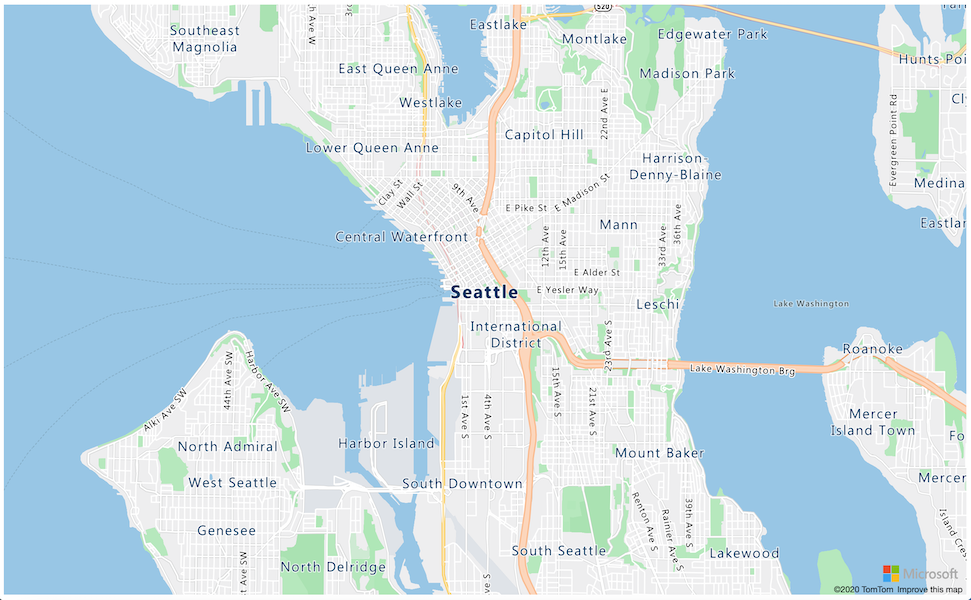

<!--
CO_OP_TRANSLATOR_METADATA:
{
  "original_hash": "9095c61445c2bca7245ef9b59a186a11",
  "translation_date": "2025-08-26T07:33:38+00:00",
  "source_file": "3-transport/lessons/3-visualize-location-data/README.md",
  "language_code": "pl"
}
-->
# Wizualizacja danych lokalizacyjnych


> Szkic autorstwa [Nitya Narasimhan](https://github.com/nitya). Kliknij obrazek, aby zobaczyć większą wersję.

Ten film przedstawia przegląd Azure Maps z IoT, usługi, która będzie omawiana w tej lekcji.

[](https://www.youtube.com/watch?v=P5i2GFTtb2s)

> 🎥 Kliknij obrazek powyżej, aby obejrzeć film

## Quiz przed lekcją

[Quiz przed lekcją](https://black-meadow-040d15503.1.azurestaticapps.net/quiz/25)

## Wprowadzenie

W poprzedniej lekcji nauczyłeś się, jak przesyłać dane GPS z czujników do chmury i zapisywać je w kontenerze magazynowym za pomocą kodu bezserwerowego. Teraz dowiesz się, jak wizualizować te punkty na mapie Azure. Nauczysz się tworzyć mapę na stronie internetowej, poznasz format danych GeoJSON i dowiesz się, jak używać go do nanoszenia wszystkich zarejestrowanych punktów GPS na mapie.

W tej lekcji omówimy:

* [Czym jest wizualizacja danych](../../../../../3-transport/lessons/3-visualize-location-data)
* [Usługi mapowe](../../../../../3-transport/lessons/3-visualize-location-data)
* [Tworzenie zasobu Azure Maps](../../../../../3-transport/lessons/3-visualize-location-data)
* [Wyświetlanie mapy na stronie internetowej](../../../../../3-transport/lessons/3-visualize-location-data)
* [Format GeoJSON](../../../../../3-transport/lessons/3-visualize-location-data)
* [Nanoszenie danych GPS na mapę za pomocą GeoJSON](../../../../../3-transport/lessons/3-visualize-location-data)

> 💁 W tej lekcji będziesz pracować z niewielką ilością HTML i JavaScript. Jeśli chcesz dowiedzieć się więcej o tworzeniu stron internetowych za pomocą HTML i JavaScript, sprawdź [Web development for beginners](https://github.com/microsoft/Web-Dev-For-Beginners).

## Czym jest wizualizacja danych

Wizualizacja danych, jak sama nazwa wskazuje, polega na przedstawianiu danych w sposób, który ułatwia ich zrozumienie przez ludzi. Zwykle kojarzy się z wykresami i diagramami, ale obejmuje każdą formę graficznego przedstawienia danych, która pomaga ludziom nie tylko lepiej je zrozumieć, ale także podejmować decyzje.

Weźmy prosty przykład - w projekcie farmy rejestrowałeś poziomy wilgotności gleby. Tabela danych wilgotności gleby rejestrowanych co godzinę 1 czerwca 2021 roku mogłaby wyglądać następująco:

| Data             | Odczyt |
| ---------------- | ------: |
| 01/06/2021 00:00 |     257 |
| 01/06/2021 01:00 |     268 |
| 01/06/2021 02:00 |     295 |
| 01/06/2021 03:00 |     305 |
| 01/06/2021 04:00 |     325 |
| 01/06/2021 05:00 |     359 |
| 01/06/2021 06:00 |     398 |
| 01/06/2021 07:00 |     410 |
| 01/06/2021 08:00 |     429 |
| 01/06/2021 09:00 |     451 |
| 01/06/2021 10:00 |     460 |
| 01/06/2021 11:00 |     452 |
| 01/06/2021 12:00 |     420 |
| 01/06/2021 13:00 |     408 |
| 01/06/2021 14:00 |     431 |
| 01/06/2021 15:00 |     462 |
| 01/06/2021 16:00 |     432 |
| 01/06/2021 17:00 |     402 |
| 01/06/2021 18:00 |     387 |
| 01/06/2021 19:00 |     360 |
| 01/06/2021 20:00 |     358 |
| 01/06/2021 21:00 |     354 |
| 01/06/2021 22:00 |     356 |
| 01/06/2021 23:00 |     362 |

Dla człowieka zrozumienie tych danych może być trudne. To ściana liczb bez większego znaczenia. Pierwszym krokiem do wizualizacji tych danych może być ich przedstawienie na wykresie liniowym:


Można to dodatkowo ulepszyć, dodając linię wskazującą moment włączenia automatycznego systemu nawadniania przy odczycie wilgotności gleby wynoszącym 450:


Ten wykres szybko pokazuje nie tylko poziomy wilgotności gleby, ale także punkty, w których system nawadniania został włączony.

Wykresy nie są jedynym narzędziem do wizualizacji danych. Urządzenia IoT monitorujące pogodę mogą mieć aplikacje internetowe lub mobilne, które wizualizują warunki pogodowe za pomocą symboli, takich jak chmura dla dni pochmurnych, chmura deszczowa dla dni deszczowych i tak dalej. Istnieje ogromna liczba sposobów wizualizacji danych, od poważnych po zabawne.

✅ Pomyśl o sposobach, w jakie widziałeś dane wizualizowane. Które metody były najbardziej przejrzyste i pozwalały najszybciej podejmować decyzje?

Najlepsze wizualizacje pozwalają ludziom podejmować decyzje szybko. Na przykład, posiadanie ściany wskaźników pokazujących różne odczyty z maszyn przemysłowych jest trudne do przetworzenia, ale migające czerwone światło, gdy coś idzie nie tak, pozwala człowiekowi podjąć decyzję. Czasami najlepszą wizualizacją jest migające światło!

Pracując z danymi GPS, najczytelniejszą wizualizacją może być naniesienie danych na mapę. Mapa pokazująca na przykład ciężarówki dostawcze może pomóc pracownikom zakładu przetwórczego zobaczyć, kiedy ciężarówki dotrą. Jeśli mapa pokazuje nie tylko lokalizacje ciężarówek, ale także ich zawartość, pracownicy zakładu mogą odpowiednio zaplanować działania - widząc blisko ciężarówkę chłodniczą, wiedzą, że należy przygotować miejsce w lodówce.

## Usługi mapowe

Praca z mapami to interesujące zadanie, a dostępnych jest wiele opcji, takich jak Bing Maps, Leaflet, Open Street Maps czy Google Maps. W tej lekcji dowiesz się o [Azure Maps](https://azure.microsoft.com/services/azure-maps/?WT.mc_id=academic-17441-jabenn) i o tym, jak mogą one wyświetlać dane GPS.


Azure Maps to "zbiór usług geolokalizacyjnych i SDK, które wykorzystują aktualne dane mapowe, aby dostarczyć kontekst geograficzny dla aplikacji internetowych i mobilnych." Programiści otrzymują narzędzia do tworzenia pięknych, interaktywnych map, które mogą oferować takie funkcje jak rekomendowane trasy, informacje o zdarzeniach drogowych, nawigacja wewnętrzna, możliwości wyszukiwania, dane o wysokości terenu, usługi pogodowe i wiele więcej.

✅ Eksperymentuj z [przykładami kodu mapowego](https://docs.microsoft.com/samples/browse?WT.mc_id=academic-17441-jabenn&products=azure-maps)

Mapy można wyświetlać jako pustą przestrzeń, kafelki, obrazy satelitarne, obrazy satelitarne z naniesionymi drogami, różne typy map w odcieniach szarości, mapy z cieniowaniem reliefowym pokazującym wysokość terenu, mapy nocne oraz mapy o wysokim kontraście. Możesz uzyskać aktualizacje w czasie rzeczywistym na swoich mapach, integrując je z [Azure Event Grid](https://azure.microsoft.com/services/event-grid/?WT.mc_id=academic-17441-jabenn). Możesz kontrolować zachowanie i wygląd swoich map, włączając różne kontrolki, które pozwalają mapie reagować na zdarzenia, takie jak szczypanie, przeciąganie i klikanie. Aby kontrolować wygląd mapy, możesz dodawać warstwy, które obejmują bąbelki, linie, wielokąty, mapy cieplne i inne. Styl mapy, który zaimplementujesz, zależy od wybranego SDK.

Do interfejsu Azure Maps można uzyskać dostęp, korzystając z [REST API](https://docs.microsoft.com/javascript/api/azure-maps-rest/?WT.mc_id=academic-17441-jabenn&view=azure-maps-typescript-latest), [Web SDK](https://docs.microsoft.com/azure/azure-maps/how-to-use-map-control?WT.mc_id=academic-17441-jabenn) lub, jeśli tworzysz aplikację mobilną, [Android SDK](https://docs.microsoft.com/azure/azure-maps/how-to-use-android-map-control-library?WT.mc_id=academic-17441-jabenn&pivots=programming-language-java-android).

W tej lekcji użyjesz Web SDK, aby narysować mapę i wyświetlić ścieżkę lokalizacji GPS swojego czujnika.

## Tworzenie zasobu Azure Maps

Pierwszym krokiem jest utworzenie konta Azure Maps.

### Zadanie - utworzenie zasobu Azure Maps

1. Uruchom następujące polecenie w Terminalu lub Command Prompt, aby utworzyć zasób Azure Maps w grupie zasobów `gps-sensor`:

    ```sh
    az maps account create --name gps-sensor \
                           --resource-group gps-sensor \
                           --accept-tos \
                           --sku S1
    ```

    To polecenie utworzy zasób Azure Maps o nazwie `gps-sensor`. Używany jest poziom `S1`, który jest płatnym poziomem obejmującym szeroki zakres funkcji, ale z hojną ilością darmowych wywołań.

    > 💁 Aby zobaczyć koszty korzystania z Azure Maps, sprawdź [stronę cenową Azure Maps](https://azure.microsoft.com/pricing/details/azure-maps/?WT.mc_id=academic-17441-jabenn).

1. Będziesz potrzebować klucza API dla zasobu map. Użyj następującego polecenia, aby uzyskać ten klucz:

    ```sh
    az maps account keys list --name gps-sensor \
                              --resource-group gps-sensor \
                              --output table
    ```

    Skopiuj wartość `PrimaryKey`.

## Wyświetlanie mapy na stronie internetowej

Teraz możesz przejść do kolejnego kroku, czyli wyświetlenia mapy na stronie internetowej. Użyjemy tylko jednego pliku `html` dla małej aplikacji internetowej; pamiętaj, że w środowisku produkcyjnym lub zespołowym Twoja aplikacja internetowa prawdopodobnie będzie miała więcej elementów.

### Zadanie - wyświetlenie mapy na stronie internetowej

1. Utwórz plik o nazwie `index.html` w folderze na swoim komputerze lokalnym. Dodaj znacznik HTML, aby umieścić mapę:

    ```html
    <html>
    <head>
        <style>
            #myMap {
                width:100%;
                height:100%;
            }
        </style>
    </head>
    
    <body onload="init()">
        <div id="myMap"></div>
    </body>
    </html>
    ```

    Mapa zostanie załadowana w `div` o nazwie `myMap`. Kilka stylów pozwala jej rozciągnąć się na szerokość i wysokość strony.

    > 🎓 `div` to sekcja strony internetowej, którą można nazwać i stylizować.

1. Pod otwierającym tagiem `<head>` dodaj zewnętrzny arkusz stylów do kontrolowania wyglądu mapy oraz zewnętrzny skrypt z Web SDK do zarządzania jej zachowaniem:

    ```html
    <link rel="stylesheet" href="https://atlas.microsoft.com/sdk/javascript/mapcontrol/2/atlas.min.css" type="text/css" />
    <script src="https://atlas.microsoft.com/sdk/javascript/mapcontrol/2/atlas.min.js"></script>
    ```

    Ten arkusz stylów zawiera ustawienia dotyczące wyglądu mapy, a plik skryptu zawiera kod do jej załadowania. Dodanie tego kodu jest podobne do dołączania plików nagłówkowych w C++ lub importowania modułów w Pythonie.

1. Pod tym skryptem dodaj blok skryptu do uruchomienia mapy.

    ```javascript
    <script type='text/javascript'>
        function init() {
            var map = new atlas.Map('myMap', {
                center: [-122.26473, 47.73444],
                zoom: 12,
                authOptions: {
                    authType: "subscriptionKey",
                    subscriptionKey: "<subscription_key>",

                }
            });
        }
    </script>
    ```

    Zamień `<subscription_key>` na klucz API dla swojego konta Azure Maps.

    Jeśli otworzysz swój plik `index.html` w przeglądarce internetowej, powinieneś zobaczyć załadowaną mapę, skoncentrowaną na obszarze Seattle.

    

    ✅ Eksperymentuj z parametrami zoom i center, aby zmienić wyświetlanie mapy. Możesz dodać różne współrzędne odpowiadające szerokości i długości geograficznej swoich danych, aby zmienić środek mapy.

> 💁 Lepszym sposobem pracy z aplikacjami internetowymi lokalnie jest zainstalowanie [http-server](https://www.npmjs.com/package/http-server). Będziesz potrzebować [node.js](https://nodejs.org/) i [npm](https://www.npmjs.com/) zainstalowanych przed użyciem tego narzędzia. Po zainstalowaniu tych narzędzi możesz przejść do lokalizacji swojego pliku `index.html` i wpisać `http-server`. Aplikacja internetowa otworzy się na lokalnym serwerze [http://127.0.0.1:8080/](http://127.0.0.1:8080/).

## Format GeoJSON

Teraz, gdy masz swoją aplikację internetową z wyświetlaną mapą, musisz wyodrębnić dane GPS z konta magazynowego i wyświetlić je w warstwie znaczników na mapie. Zanim to zrobimy, przyjrzyjmy się formatowi [GeoJSON](https://wikipedia.org/wiki/GeoJSON), który jest wymagany przez Azure Maps.

[GeoJSON](https://geojson.org/) to otwarty standard JSON ze specjalnym formatowaniem zaprojektowanym do obsługi danych geograficznych. Możesz dowiedzieć się więcej o nim, testując przykładowe dane za pomocą [geojson.io](https://geojson.io), które jest również przydatnym narzędziem do debugowania plików GeoJSON.

Przykładowe dane GeoJSON wyglądają tak:

```json
{
  "type": "FeatureCollection",
  "features": [
    {
      "type": "Feature",
      "geometry": {
        "type": "Point",
        "coordinates": [
          -2.10237979888916,
          57.164918677004714
        ]
      }
    }
  ]
}
```

Szczególnie interesujący jest sposób, w jaki dane są zagnieżdżone jako `Feature` w `FeatureCollection`. W tym obiekcie znajduje się `geometry` z `coordinates` wskazującymi szerokość i długość geograficzną.

✅ Tworząc swój GeoJSON, zwróć uwagę na kolejność `latitude` i `longitude` w obiekcie, inaczej punkty nie pojawią się tam, gdzie powinny! GeoJSON oczekuje danych w kolejności `lon,lat` dla punktów, a nie `lat,lon`.

`Geometry` może mieć różne typy, takie jak pojedynczy punkt lub wielokąt. W tym przykładzie jest to punkt z dwoma określonymi współrzędnymi: długością i szerokością geograficzną.
✅ Azure Maps obsługuje standardowy GeoJSON oraz [rozszerzone funkcje](https://docs.microsoft.com/azure/azure-maps/extend-geojson?WT.mc_id=academic-17441-jabenn), w tym możliwość rysowania okręgów i innych geometrii.

## Wyświetlanie danych GPS na mapie za pomocą GeoJSON

Teraz jesteś gotowy, aby wykorzystać dane z magazynu, który stworzyłeś w poprzedniej lekcji. Przypominając, dane są przechowywane w postaci plików w magazynie blobów, więc musisz pobrać te pliki i przeanalizować je, aby Azure Maps mógł z nich korzystać.

### Zadanie - skonfiguruj magazyn do dostępu z poziomu strony internetowej

Jeśli wykonasz zapytanie do swojego magazynu, aby pobrać dane, możesz być zaskoczony, widząc błędy w konsoli przeglądarki. Dzieje się tak, ponieważ musisz ustawić uprawnienia dla [CORS](https://developer.mozilla.org/docs/Web/HTTP/CORS) w tym magazynie, aby umożliwić zewnętrznym aplikacjom internetowym odczyt danych.

> 🎓 CORS oznacza "Cross-Origin Resource Sharing" i zazwyczaj musi być jawnie ustawiony w Azure ze względów bezpieczeństwa. Zapobiega to dostępowi do Twoich danych przez nieoczekiwane witryny.

1. Uruchom następujące polecenie, aby włączyć CORS:

    ```sh
    az storage cors add --methods GET \
                        --origins "*" \
                        --services b \
                        --account-name <storage_name> \
                        --account-key <key1>
    ```

    Zamień `<storage_name>` na nazwę swojego konta magazynu. Zamień `<key1>` na klucz konta dla swojego magazynu.

    To polecenie pozwala dowolnej witrynie (symbol wieloznaczny `*` oznacza dowolną) na wykonanie żądania *GET*, czyli pobranie danych z Twojego konta magazynu. `--services b` oznacza, że ustawienie to dotyczy tylko blobów.

### Zadanie - załaduj dane GPS z magazynu

1. Zamień całą zawartość funkcji `init` na następujący kod:

    ```javascript
    fetch("https://<storage_name>.blob.core.windows.net/gps-data/?restype=container&comp=list")
        .then(response => response.text())
        .then(str => new window.DOMParser().parseFromString(str, "text/xml"))
        .then(xml => {
            let blobList = Array.from(xml.querySelectorAll("Url"));
                blobList.forEach(async blobUrl => {
                    loadJSON(blobUrl.innerHTML)                
        });
    })
    .then( response => {
        map = new atlas.Map('myMap', {
            center: [-122.26473, 47.73444],
            zoom: 14,
            authOptions: {
                authType: "subscriptionKey",
                subscriptionKey: "<subscription_key>",
    
            }
        });
        map.events.add('ready', function () {
            var source = new atlas.source.DataSource();
            map.sources.add(source);
            map.layers.add(new atlas.layer.BubbleLayer(source));
            source.add(features);
        })
    })
    ```

    Zamień `<storage_name>` na nazwę swojego konta magazynu. Zamień `<subscription_key>` na klucz API dla swojego konta Azure Maps.

    W tym kodzie dzieje się kilka rzeczy. Po pierwsze, kod pobiera dane GPS z Twojego kontenera blobów, używając punktu końcowego URL zbudowanego na podstawie nazwy Twojego konta magazynu. Ten URL pobiera dane z `gps-data`, wskazując, że typ zasobu to kontener (`restype=container`), i zwraca informacje o wszystkich blobach. Lista ta nie zwraca samych blobów, ale zwraca URL dla każdego bloba, który można wykorzystać do załadowania danych bloba.

    > 💁 Możesz wkleić ten URL w przeglądarce, aby zobaczyć szczegóły wszystkich blobów w swoim kontenerze. Każdy element będzie miał właściwość `Url`, którą również możesz załadować w przeglądarce, aby zobaczyć zawartość bloba.

    Kod następnie ładuje każdy blob, wywołując funkcję `loadJSON`, którą utworzysz w kolejnym kroku. Następnie tworzy kontrolkę mapy i dodaje kod do zdarzenia `ready`. To zdarzenie jest wywoływane, gdy mapa zostanie wyświetlona na stronie internetowej.

    Zdarzenie `ready` tworzy źródło danych Azure Maps - kontener zawierający dane GeoJSON, które zostaną później wypełnione. To źródło danych jest następnie używane do stworzenia warstwy bąbelkowej - czyli zestawu okręgów na mapie, umieszczonych w punktach GeoJSON.

1. Dodaj funkcję `loadJSON` do swojego bloku skryptu, poniżej funkcji `init`:

    ```javascript
    var map, features;

    function loadJSON(file) {
        var xhr = new XMLHttpRequest();
        features = [];
        xhr.onreadystatechange = function () {
            if (xhr.readyState === XMLHttpRequest.DONE) {
                if (xhr.status === 200) {
                    gps = JSON.parse(xhr.responseText)
                    features.push(
                        new atlas.data.Feature(new atlas.data.Point([parseFloat(gps.gps.lon), parseFloat(gps.gps.lat)]))
                    )
                }
            }
        };
        xhr.open("GET", file, true);
        xhr.send();
    }    
    ```

    Ta funkcja jest wywoływana przez procedurę pobierania, aby przeanalizować dane JSON i przekonwertować je na współrzędne długości i szerokości geograficznej w formacie GeoJSON. 
    Po przeanalizowaniu dane są ustawiane jako część `Feature` GeoJSON. Mapa zostanie zainicjalizowana, a małe okręgi pojawią się wzdłuż ścieżki, którą wyznaczają Twoje dane:

1. Załaduj stronę HTML w przeglądarce. Załaduje ona mapę, a następnie wszystkie dane GPS z magazynu i wyświetli je na mapie.

    

> 💁 Ten kod znajdziesz w folderze [code](../../../../../3-transport/lessons/3-visualize-location-data/code).

---

## 🚀 Wyzwanie

Fajnie jest móc wyświetlać statyczne dane na mapie jako znaczniki. Czy potrafisz ulepszyć tę aplikację internetową, aby dodać animację i pokazać ścieżkę znaczników w czasie, używając plików JSON z oznaczeniem czasowym? Oto [kilka przykładów](https://azuremapscodesamples.azurewebsites.net/) użycia animacji na mapach.

## Quiz po wykładzie

[Quiz po wykładzie](https://black-meadow-040d15503.1.azurestaticapps.net/quiz/26)

## Przegląd i samodzielna nauka

Azure Maps jest szczególnie przydatne w pracy z urządzeniami IoT.

* Zbadaj niektóre zastosowania w [dokumentacji Azure Maps na Microsoft Docs](https://docs.microsoft.com/azure/azure-maps/tutorial-iot-hub-maps?WT.mc_id=academic-17441-jabenn).
* Pogłęb swoją wiedzę na temat tworzenia map i punktów nawigacyjnych dzięki [samouczkowi na temat tworzenia pierwszej aplikacji do wyznaczania tras z Azure Maps na Microsoft Learn](https://docs.microsoft.com/learn/modules/create-your-first-app-with-azure-maps/?WT.mc_id=academic-17441-jabenn).

## Zadanie

[Wdróż swoją aplikację](assignment.md)

**Zastrzeżenie**:  
Ten dokument został przetłumaczony za pomocą usługi tłumaczeniowej AI [Co-op Translator](https://github.com/Azure/co-op-translator). Chociaż dokładamy wszelkich starań, aby tłumaczenie było precyzyjne, prosimy pamiętać, że automatyczne tłumaczenia mogą zawierać błędy lub nieścisłości. Oryginalny dokument w jego rodzimym języku powinien być uznawany za autorytatywne źródło. W przypadku informacji o kluczowym znaczeniu zaleca się skorzystanie z profesjonalnego tłumaczenia przez człowieka. Nie ponosimy odpowiedzialności za jakiekolwiek nieporozumienia lub błędne interpretacje wynikające z użycia tego tłumaczenia.