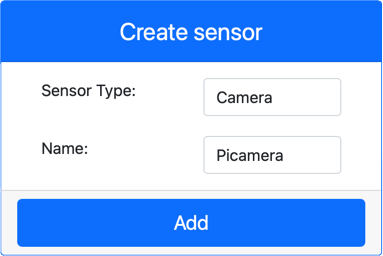

<!--
CO_OP_TRANSLATOR_METADATA:
{
  "original_hash": "3ba7150ffc4a6999f6c3cfb4906ec7df",
  "translation_date": "2025-08-26T06:34:27+00:00",
  "source_file": "4-manufacturing/lessons/2-check-fruit-from-device/virtual-device-camera.md",
  "language_code": "pl"
}
-->
# Przechwytywanie obrazu - Wirtualny sprzęt IoT

W tej części lekcji dodasz czujnik kamery do swojego wirtualnego urządzenia IoT i odczytasz z niego obrazy.

## Sprzęt

Wirtualne urządzenie IoT będzie korzystać z symulowanej kamery, która przesyła obrazy z plików lub z Twojej kamery internetowej.

### Dodanie kamery do CounterFit

Aby używać wirtualnej kamery, musisz dodać ją do aplikacji CounterFit.

#### Zadanie - dodanie kamery do CounterFit

Dodaj kamerę do aplikacji CounterFit.

1. Utwórz nową aplikację w Pythonie na swoim komputerze w folderze o nazwie `fruit-quality-detector` z jednym plikiem o nazwie `app.py` oraz wirtualnym środowiskiem Pythona, a następnie dodaj pakiety pip dla CounterFit.

    > ⚠️ Możesz odwołać się do [instrukcji tworzenia i konfiguracji projektu CounterFit w Pythonie w lekcji 1, jeśli to konieczne](../../../1-getting-started/lessons/1-introduction-to-iot/virtual-device.md).

1. Zainstaluj dodatkowy pakiet Pip, który umożliwia zainstalowanie shima CounterFit, symulującego niektóre funkcje pakietu [Picamera Pip package](https://pypi.org/project/picamera/). Upewnij się, że instalujesz go z terminala z aktywowanym wirtualnym środowiskiem.

    ```sh
    pip install counterfit-shims-picamera
    ```

1. Upewnij się, że aplikacja webowa CounterFit jest uruchomiona.

1. Utwórz kamerę:

    1. W polu *Create sensor* w panelu *Sensors* rozwiń listę *Sensor type* i wybierz *Camera*.

    1. Ustaw *Name* na `Picamera`.

    1. Wybierz przycisk **Add**, aby utworzyć kamerę.

    

    Kamera zostanie utworzona i pojawi się na liście czujników.

    

## Programowanie kamery

Wirtualne urządzenie IoT może teraz zostać zaprogramowane do korzystania z wirtualnej kamery.

### Zadanie - programowanie kamery

Zaprogramuj urządzenie.

1. Upewnij się, że aplikacja `fruit-quality-detector` jest otwarta w VS Code.

1. Otwórz plik `app.py`.

1. Dodaj poniższy kod na początku pliku `app.py`, aby połączyć aplikację z CounterFit:

    ```python
    from counterfit_connection import CounterFitConnection
    CounterFitConnection.init('127.0.0.1', 5000)
    ```

1. Dodaj poniższy kod do pliku `app.py`:

    ```python
    import io
    from counterfit_shims_picamera import PiCamera
    ```

    Ten kod importuje potrzebne biblioteki, w tym klasę `PiCamera` z biblioteki counterfit_shims_picamera.

1. Dodaj poniższy kod poniżej, aby zainicjalizować kamerę:

    ```python
    camera = PiCamera()
    camera.resolution = (640, 480)
    camera.rotation = 0
    ```

    Ten kod tworzy obiekt PiCamera i ustawia rozdzielczość na 640x480. Chociaż obsługiwane są wyższe rozdzielczości, klasyfikator obrazów działa na znacznie mniejszych obrazach (227x227), więc nie ma potrzeby przechwytywania i przesyłania większych obrazów.

    Linia `camera.rotation = 0` ustawia obrót obrazu w stopniach. Jeśli musisz obrócić obraz z kamery internetowej lub pliku, ustaw tę wartość odpowiednio. Na przykład, jeśli chcesz zmienić obraz banana z kamery internetowej w trybie poziomym na tryb pionowy, ustaw `camera.rotation = 90`.

1. Dodaj poniższy kod poniżej, aby przechwycić obraz jako dane binarne:

    ```python
    image = io.BytesIO()
    camera.capture(image, 'jpeg')
    image.seek(0)
    ```

    Ten kod tworzy obiekt `BytesIO` do przechowywania danych binarnych. Obraz jest odczytywany z kamery jako plik JPEG i przechowywany w tym obiekcie. Obiekt ten ma wskaźnik pozycji, który wskazuje, gdzie znajdują się dane, aby można było zapisać więcej danych na końcu, jeśli to konieczne, więc linia `image.seek(0)` przesuwa ten wskaźnik z powrotem na początek, aby później można było odczytać wszystkie dane.

1. Poniżej dodaj następujący kod, aby zapisać obraz do pliku:

    ```python
    with open('image.jpg', 'wb') as image_file:
        image_file.write(image.read())
    ```

    Ten kod otwiera plik o nazwie `image.jpg` do zapisu, następnie odczytuje wszystkie dane z obiektu `BytesIO` i zapisuje je do pliku.

    > 💁 Możesz przechwycić obraz bezpośrednio do pliku zamiast do obiektu `BytesIO`, przekazując nazwę pliku do wywołania `camera.capture`. Powodem użycia obiektu `BytesIO` jest to, że później w tej lekcji możesz przesłać obraz do swojego klasyfikatora obrazów.

1. Skonfiguruj obraz, który kamera w CounterFit będzie przechwytywać. Możesz ustawić *Source* na *File*, a następnie przesłać plik obrazu, lub ustawić *Source* na *WebCam*, aby obrazy były przechwytywane z Twojej kamery internetowej. Upewnij się, że wybierasz przycisk **Set** po wybraniu obrazu lub kamery internetowej.

    

1. Obraz zostanie przechwycony i zapisany jako `image.jpg` w bieżącym folderze. Zobaczysz ten plik w eksploratorze VS Code. Wybierz plik, aby wyświetlić obraz. Jeśli wymaga obrotu, zaktualizuj linię `camera.rotation = 0` zgodnie z potrzebami i zrób kolejne zdjęcie.

> 💁 Ten kod znajdziesz w folderze [code-camera/virtual-iot-device](../../../../../4-manufacturing/lessons/2-check-fruit-from-device/code-camera/virtual-iot-device).

 😀 Twój program obsługujący kamerę zakończył się sukcesem!

**Zastrzeżenie**:  
Ten dokument został przetłumaczony za pomocą usługi tłumaczenia AI [Co-op Translator](https://github.com/Azure/co-op-translator). Chociaż dokładamy wszelkich starań, aby tłumaczenie było precyzyjne, prosimy pamiętać, że automatyczne tłumaczenia mogą zawierać błędy lub nieścisłości. Oryginalny dokument w jego rodzimym języku powinien być uznawany za wiarygodne źródło. W przypadku informacji o kluczowym znaczeniu zaleca się skorzystanie z profesjonalnego tłumaczenia przez człowieka. Nie ponosimy odpowiedzialności za jakiekolwiek nieporozumienia lub błędne interpretacje wynikające z użycia tego tłumaczenia.