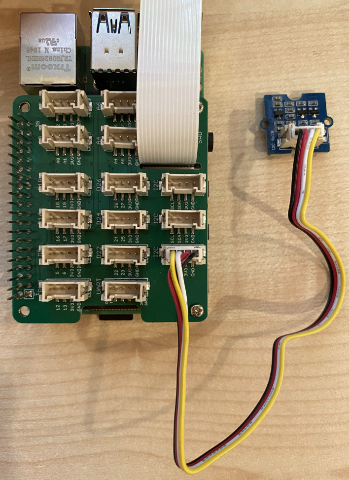

<!--
CO_OP_TRANSLATOR_METADATA:
{
  "original_hash": "6145a1d791731c8a9d0afd0a1bae5108",
  "translation_date": "2025-08-26T06:39:33+00:00",
  "source_file": "4-manufacturing/lessons/4-trigger-fruit-detector/pi-proximity.md",
  "language_code": "pl"
}
-->
# Wykrywanie bliskości - Raspberry Pi

W tej części lekcji dodasz czujnik bliskości do swojego Raspberry Pi i odczytasz z niego odległość.

## Sprzęt

Raspberry Pi potrzebuje czujnika bliskości.

Czujnik, którego użyjesz, to [Grove Time of Flight distance sensor](https://www.seeedstudio.com/Grove-Time-of-Flight-Distance-Sensor-VL53L0X.html). Ten czujnik wykorzystuje moduł laserowy do pomiaru odległości. Zakres czujnika wynosi od 10mm do 2000mm (1cm - 2m) i raportuje wartości w tym zakresie dość dokładnie, przy czym odległości powyżej 1000mm są raportowane jako 8109mm.

Laserowy dalmierz znajduje się na tylnej stronie czujnika, po przeciwnej stronie do gniazda Grove.

To jest czujnik I²C.

### Podłącz czujnik Time of Flight

Czujnik Grove Time of Flight można podłączyć do Raspberry Pi.

#### Zadanie - podłącz czujnik Time of Flight

Podłącz czujnik Time of Flight.


1. Włóż jeden koniec kabla Grove do gniazda na czujniku Time of Flight. Kabel wejdzie tylko w jednym kierunku.

1. Przy wyłączonym Raspberry Pi podłącz drugi koniec kabla Grove do jednego z gniazd I²C oznaczonych **I²C** na Grove Base Hat zamontowanym na Pi. Te gniazda znajdują się w dolnym rzędzie, po przeciwnej stronie do pinów GPIO i obok gniazda kabla kamery.



## Programowanie czujnika Time of Flight

Raspberry Pi można teraz zaprogramować do korzystania z podłączonego czujnika Time of Flight.

### Zadanie - zaprogramuj czujnik Time of Flight

Zaprogramuj urządzenie.

1. Włącz Raspberry Pi i poczekaj na jego uruchomienie.

1. Otwórz kod `fruit-quality-detector` w VS Code, bezpośrednio na Pi lub połącz się za pomocą rozszerzenia Remote SSH.

1. Zainstaluj pakiet rpi-vl53l0x za pomocą Pip. Jest to pakiet Python, który współpracuje z czujnikiem odległości VL53L0X. Zainstaluj go za pomocą poniższego polecenia pip:

    ```sh
    pip install rpi-vl53l0x
    ```

1. Utwórz nowy plik w tym projekcie o nazwie `distance-sensor.py`.

    > 💁 Łatwym sposobem na symulację wielu urządzeń IoT jest użycie osobnych plików Python dla każdego z nich, a następnie uruchomienie ich jednocześnie.

1. Dodaj poniższy kod do tego pliku:

    ```python
    import time
    
    from grove.i2c import Bus
    from rpi_vl53l0x.vl53l0x import VL53L0X
    ```

    Ten kod importuje bibliotekę Grove I²C bus oraz bibliotekę czujnika dla podstawowego sprzętu wbudowanego w czujnik Grove Time of Flight.

1. Poniżej tego kodu dodaj kod do uzyskania dostępu do czujnika:

    ```python
    distance_sensor = VL53L0X(bus = Bus().bus)
    distance_sensor.begin()    
    ```

    Ten kod deklaruje czujnik odległości korzystający z magistrali Grove I²C, a następnie uruchamia czujnik.

1. Na koniec dodaj nieskończoną pętlę do odczytu odległości:

    ```python
    while True:
        distance_sensor.wait_ready()
        print(f'Distance = {distance_sensor.get_distance()} mm')
        time.sleep(1)
    ```

    Ten kod czeka na wartość gotową do odczytu z czujnika, a następnie drukuje ją w konsoli.

1. Uruchom ten kod.

    > 💁 Pamiętaj, że ten plik nazywa się `distance-sensor.py`! Upewnij się, że uruchamiasz go za pomocą Python, a nie `app.py`.

1. Zobaczysz pomiary odległości pojawiające się w konsoli. Umieść obiekty w pobliżu czujnika, a zobaczysz pomiar odległości:

    ```output
    pi@raspberrypi:~/fruit-quality-detector $ python3 distance_sensor.py 
    Distance = 29 mm
    Distance = 28 mm
    Distance = 30 mm
    Distance = 151 mm
    ```

    Dalmierz znajduje się na tylnej stronie czujnika, więc upewnij się, że używasz właściwej strony podczas pomiaru odległości.

    

> 💁 Ten kod znajdziesz w folderze [code-proximity/pi](../../../../../4-manufacturing/lessons/4-trigger-fruit-detector/code-proximity/pi).

😀 Twój program czujnika bliskości działa poprawnie!

**Zastrzeżenie**:  
Ten dokument został przetłumaczony za pomocą usługi tłumaczenia AI [Co-op Translator](https://github.com/Azure/co-op-translator). Chociaż dokładamy wszelkich starań, aby tłumaczenie było precyzyjne, prosimy pamiętać, że automatyczne tłumaczenia mogą zawierać błędy lub nieścisłości. Oryginalny dokument w jego rodzimym języku powinien być uznawany za wiarygodne źródło. W przypadku informacji o kluczowym znaczeniu zaleca się skorzystanie z profesjonalnego tłumaczenia przez człowieka. Nie ponosimy odpowiedzialności za jakiekolwiek nieporozumienia lub błędne interpretacje wynikające z użycia tego tłumaczenia.