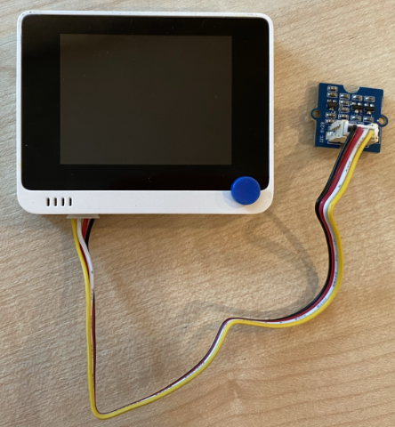

<!--
CO_OP_TRANSLATOR_METADATA:
{
  "original_hash": "288aebb0c59f7be1d2719b8f9660a313",
  "translation_date": "2025-08-26T06:39:50+00:00",
  "source_file": "4-manufacturing/lessons/4-trigger-fruit-detector/wio-terminal-proximity.md",
  "language_code": "pl"
}
-->
# Wykrywanie bliskości - Wio Terminal

W tej części lekcji dodasz czujnik bliskości do swojego Wio Terminal i odczytasz z niego odległość.

## Sprzęt

Wio Terminal potrzebuje czujnika bliskości.

Czujnik, którego użyjesz, to [Grove Time of Flight distance sensor](https://www.seeedstudio.com/Grove-Time-of-Flight-Distance-Sensor-VL53L0X.html). Ten czujnik wykorzystuje moduł laserowy do pomiaru odległości. Zakres pomiaru wynosi od 10 mm do 2000 mm (1 cm - 2 m) i w tym zakresie czujnik raportuje wartości z dużą dokładnością. Dla odległości powyżej 1000 mm czujnik zwraca wartość 8109 mm.

Dalekomierz laserowy znajduje się na tylnej stronie czujnika, po przeciwnej stronie niż gniazdo Grove.

Jest to czujnik I²C.

### Podłączanie czujnika Time of Flight

Czujnik Grove Time of Flight można podłączyć do Wio Terminal.

#### Zadanie - podłącz czujnik Time of Flight

Podłącz czujnik Time of Flight.


1. Włóż jeden koniec kabla Grove do gniazda w czujniku Time of Flight. Kabel pasuje tylko w jedną stronę.

1. Gdy Wio Terminal jest odłączony od komputera lub innego źródła zasilania, podłącz drugi koniec kabla Grove do lewego gniazda Grove w Wio Terminal, patrząc na ekran. Jest to gniazdo najbliżej przycisku zasilania. Jest to gniazdo cyfrowe i I²C.



1. Teraz możesz podłączyć Wio Terminal do komputera.

## Programowanie czujnika Time of Flight

Wio Terminal można teraz zaprogramować do korzystania z podłączonego czujnika Time of Flight.

### Zadanie - zaprogramuj czujnik Time of Flight

1. Utwórz nowy projekt Wio Terminal w PlatformIO. Nazwij ten projekt `distance-sensor`. Dodaj kod w funkcji `setup`, aby skonfigurować port szeregowy.

1. Dodaj zależność biblioteki dla czujnika odległości Seeed Grove Time of Flight do pliku `platformio.ini` projektu:

    ```ini
    lib_deps =
        seeed-studio/Grove Ranging sensor - VL53L0X @ ^1.1.1
    ```

1. W pliku `main.cpp` dodaj poniższy kod pod istniejącymi dyrektywami `include`, aby zadeklarować instancję klasy `Seeed_vl53l0x` do interakcji z czujnikiem Time of Flight:

    ```cpp
    #include "Seeed_vl53l0x.h"
    
    Seeed_vl53l0x VL53L0X;
    ```

1. Dodaj poniższy kod na końcu funkcji `setup`, aby zainicjalizować czujnik:

    ```cpp
    VL53L0X.VL53L0X_common_init();
    VL53L0X.VL53L0X_high_accuracy_ranging_init();
    ```

1. W funkcji `loop` odczytaj wartość z czujnika:

    ```cpp
    VL53L0X_RangingMeasurementData_t RangingMeasurementData;
    memset(&RangingMeasurementData, 0, sizeof(VL53L0X_RangingMeasurementData_t));

    VL53L0X.PerformSingleRangingMeasurement(&RangingMeasurementData);
    ```

    Ten kod inicjalizuje strukturę danych do odczytu danych, a następnie przekazuje ją do metody `PerformSingleRangingMeasurement`, gdzie zostanie wypełniona pomiarem odległości.

1. Pod tym kodem wypisz wynik pomiaru odległości, a następnie wprowadź opóźnienie 1 sekundy:

    ```cpp
    Serial.print("Distance = ");
    Serial.print(RangingMeasurementData.RangeMilliMeter);
    Serial.println(" mm");

    delay(1000);
    ```

1. Zbuduj, wgraj i uruchom ten kod. Będziesz mógł zobaczyć pomiary odległości w monitorze szeregowym. Umieść obiekty w pobliżu czujnika, a zobaczysz wynik pomiaru odległości:

    ```output
    Distance = 29 mm
    Distance = 28 mm
    Distance = 30 mm
    Distance = 151 mm
    ```

    Dalekomierz znajduje się na tylnej stronie czujnika, więc upewnij się, że używasz właściwej strony podczas pomiaru odległości.

    

> 💁 Kod ten znajdziesz w folderze [code-proximity/wio-terminal](../../../../../4-manufacturing/lessons/4-trigger-fruit-detector/code-proximity/wio-terminal).

😀 Twój program z czujnikiem bliskości zakończył się sukcesem!

**Zastrzeżenie**:  
Ten dokument został przetłumaczony za pomocą usługi tłumaczenia AI [Co-op Translator](https://github.com/Azure/co-op-translator). Chociaż dokładamy wszelkich starań, aby zapewnić poprawność tłumaczenia, prosimy pamiętać, że automatyczne tłumaczenia mogą zawierać błędy lub nieścisłości. Oryginalny dokument w jego rodzimym języku powinien być uznawany za wiarygodne źródło. W przypadku informacji o kluczowym znaczeniu zaleca się skorzystanie z profesjonalnego tłumaczenia przez człowieka. Nie ponosimy odpowiedzialności za jakiekolwiek nieporozumienia lub błędne interpretacje wynikające z użycia tego tłumaczenia.