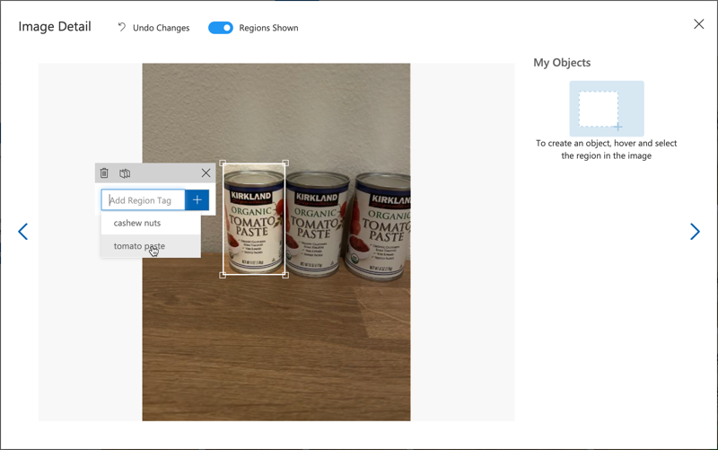

<!--
CO_OP_TRANSLATOR_METADATA:
{
  "original_hash": "8df310a42f902139a01417dacb1ffbef",
  "translation_date": "2025-08-26T06:28:42+00:00",
  "source_file": "5-retail/lessons/1-train-stock-detector/README.md",
  "language_code": "pl"
}
-->
# Trenuj detektor zapasów

> Szkic autorstwa [Nitya Narasimhan](https://github.com/nitya). Kliknij obrazek, aby zobaczyć większą wersję.

Ten film przedstawia przegląd wykrywania obiektów za pomocą usługi Azure Custom Vision, która będzie omawiana w tej lekcji.

> 🎥 Kliknij obrazek powyżej, aby obejrzeć film

## Quiz przed lekcją

[Quiz przed lekcją](https://black-meadow-040d15503.1.azurestaticapps.net/quiz/37)

## Wprowadzenie

W poprzednim projekcie użyłeś AI do trenowania klasyfikatora obrazów - modelu, który potrafi określić, czy obraz zawiera coś, na przykład dojrzałe owoce lub niedojrzałe owoce. Innym typem modelu AI, który można wykorzystać do pracy z obrazami, jest wykrywanie obiektów. Te modele nie klasyfikują obrazu za pomocą tagów, lecz są trenowane do rozpoznawania obiektów i potrafią je znaleźć na obrazach, nie tylko wykrywając ich obecność, ale także lokalizując je na obrazie. Dzięki temu można liczyć obiekty na obrazach.

W tej lekcji dowiesz się o wykrywaniu obiektów, w tym o tym, jak można je wykorzystać w handlu detalicznym. Nauczysz się również, jak trenować detektor obiektów w chmurze.

W tej lekcji omówimy:

* [Wykrywanie obiektów](../../../../../5-retail/lessons/1-train-stock-detector)
* [Wykorzystanie wykrywania obiektów w handlu detalicznym](../../../../../5-retail/lessons/1-train-stock-detector)
* [Trenowanie detektora obiektów](../../../../../5-retail/lessons/1-train-stock-detector)
* [Testowanie detektora obiektów](../../../../../5-retail/lessons/1-train-stock-detector)
* [Ponowne trenowanie detektora obiektów](../../../../../5-retail/lessons/1-train-stock-detector)

## Wykrywanie obiektów

Wykrywanie obiektów polega na wykrywaniu obiektów na obrazach za pomocą AI. W przeciwieństwie do klasyfikatora obrazów, który trenowałeś w poprzednim projekcie, wykrywanie obiektów nie polega na przewidywaniu najlepszego tagu dla całego obrazu, lecz na znajdowaniu jednego lub więcej obiektów na obrazie.

### Wykrywanie obiektów vs klasyfikacja obrazów

Klasyfikacja obrazów polega na klasyfikowaniu całego obrazu - jakie są prawdopodobieństwa, że cały obraz pasuje do każdego tagu. Otrzymujesz prawdopodobieństwa dla każdego tagu użytego do trenowania modelu.

Na powyższym przykładzie dwa obrazy są klasyfikowane za pomocą modelu trenowanego do klasyfikowania opakowań orzechów nerkowca lub puszek koncentratu pomidorowego. Pierwszy obraz przedstawia opakowanie orzechów nerkowca i ma dwa wyniki z klasyfikatora obrazów:

| Tag            | Prawdopodobieństwo |
| -------------- | ------------------: |
| `orzechy nerkowca`  | 98.4%       |
| `koncentrat pomidorowy` | 1.6%        |

Drugi obraz przedstawia puszkę koncentratu pomidorowego, a wyniki są następujące:

| Tag            | Prawdopodobieństwo |
| -------------- | ------------------: |
| `orzechy nerkowca`  | 0.7%        |
| `koncentrat pomidorowy` | 99.3%       |

Możesz użyć tych wartości z procentowym progiem, aby przewidzieć, co znajduje się na obrazie. Ale co, jeśli obraz zawierał wiele puszek koncentratu pomidorowego lub zarówno orzechy nerkowca, jak i koncentrat pomidorowy? Wyniki prawdopodobnie nie dadzą Ci tego, czego oczekujesz. Właśnie tutaj przydaje się wykrywanie obiektów.

Wykrywanie obiektów polega na trenowaniu modelu do rozpoznawania obiektów. Zamiast podawać mu obrazy zawierające obiekt i informować, że każdy obraz jest jednym tagiem lub innym, zaznaczasz sekcję obrazu, która zawiera konkretny obiekt, i tagujesz ją. Możesz oznaczyć pojedynczy obiekt na obrazie lub wiele. W ten sposób model uczy się, jak wygląda sam obiekt, a nie tylko jak wyglądają obrazy zawierające obiekt.

Kiedy używasz go do przewidywania obrazów, zamiast otrzymywać listę tagów i procentów, otrzymujesz listę wykrytych obiektów, z ich ramkami ograniczającymi i prawdopodobieństwem, że obiekt pasuje do przypisanego tagu.

> 🎓 *Ramki ograniczające* to ramki wokół obiektu.

Powyższy obraz zawiera zarówno opakowanie orzechów nerkowca, jak i trzy puszki koncentratu pomidorowego. Detektor obiektów wykrył orzechy nerkowca, zwracając ramkę ograniczającą, która zawiera orzechy nerkowca, z procentowym prawdopodobieństwem, że ramka ograniczająca zawiera obiekt, w tym przypadku 97.6%. Detektor obiektów wykrył również trzy puszki koncentratu pomidorowego i dostarcza trzy oddzielne ramki ograniczające, po jednej dla każdej wykrytej puszki, a każda z nich ma procentowe prawdopodobieństwo, że ramka ograniczająca zawiera puszkę koncentratu pomidorowego.

✅ Pomyśl o różnych scenariuszach, w których możesz chcieć użyć modeli AI opartych na obrazach. Które z nich wymagałyby klasyfikacji, a które wykrywania obiektów?

### Jak działa wykrywanie obiektów

Wykrywanie obiektów wykorzystuje złożone modele ML. Te modele działają, dzieląc obraz na wiele komórek, a następnie sprawdzają, czy środek ramki ograniczającej jest środkiem obrazu, który pasuje do jednego z obrazów użytych do trenowania modelu. Możesz to sobie wyobrazić jako coś w rodzaju uruchamiania klasyfikatora obrazów na różnych częściach obrazu w celu znalezienia dopasowań.

> 💁 To drastyczne uproszczenie. Istnieje wiele technik wykrywania obiektów, o których możesz przeczytać na [stronie o wykrywaniu obiektów na Wikipedii](https://wikipedia.org/wiki/Object_detection).

Istnieje wiele różnych modeli, które mogą wykrywać obiekty. Jednym z szczególnie znanych modeli jest [YOLO (You only look once)](https://pjreddie.com/darknet/yolo/), który jest niezwykle szybki i potrafi wykrywać 20 różnych klas obiektów, takich jak ludzie, psy, butelki i samochody.

✅ Przeczytaj o modelu YOLO na [pjreddie.com/darknet/yolo/](https://pjreddie.com/darknet/yolo/)

Modele wykrywania obiektów mogą być ponownie trenowane za pomocą transfer learningu, aby wykrywać niestandardowe obiekty.

## Wykorzystanie wykrywania obiektów w handlu detalicznym

Wykrywanie obiektów ma wiele zastosowań w handlu detalicznym. Niektóre z nich to:

* **Sprawdzanie i liczenie zapasów** - rozpoznawanie, kiedy zapasy na półkach są niskie. Jeśli zapasy są zbyt niskie, można wysyłać powiadomienia do pracowników lub robotów, aby uzupełnić półki.
* **Wykrywanie masek** - w sklepach z polityką noszenia masek podczas wydarzeń zdrowotnych, wykrywanie obiektów może rozpoznawać osoby z maskami i bez nich.
* **Automatyczne rozliczanie** - wykrywanie przedmiotów zdejmowanych z półek w zautomatyzowanych sklepach i odpowiednie rozliczanie klientów.
* **Wykrywanie zagrożeń** - rozpoznawanie uszkodzonych przedmiotów na podłodze lub rozlanych płynów, informowanie ekip sprzątających.

✅ Zrób trochę badań: Jakie są inne zastosowania wykrywania obiektów w handlu detalicznym?

## Trenowanie detektora obiektów

Możesz trenować detektor obiektów za pomocą Custom Vision, w podobny sposób jak trenowałeś klasyfikator obrazów.

### Zadanie - utwórz detektor obiektów

1. Utwórz grupę zasobów dla tego projektu o nazwie `stock-detector`.

1. Utwórz darmowy zasób treningowy Custom Vision oraz darmowy zasób predykcyjny Custom Vision w grupie zasobów `stock-detector`. Nazwij je `stock-detector-training` i `stock-detector-prediction`.

    > 💁 Możesz mieć tylko jeden darmowy zasób treningowy i predykcyjny, więc upewnij się, że usunąłeś projekt z wcześniejszych lekcji.

    > ⚠️ Możesz odwołać się do [instrukcji tworzenia zasobów treningowych i predykcyjnych z projektu 4, lekcji 1, jeśli potrzebujesz](../../../4-manufacturing/lessons/1-train-fruit-detector/README.md#task---create-a-cognitive-services-resource).

1. Uruchom portal Custom Vision na [CustomVision.ai](https://customvision.ai) i zaloguj się za pomocą konta Microsoft, którego używasz dla swojego konta Azure.

1. Postępuj zgodnie z sekcją [Tworzenie nowego projektu w szybkim starcie budowy detektora obiektów w dokumentacji Microsoft](https://docs.microsoft.com/azure/cognitive-services/custom-vision-service/get-started-build-detector?WT.mc_id=academic-17441-jabenn#create-a-new-project), aby utworzyć nowy projekt Custom Vision. Interfejs użytkownika może się zmieniać, a te dokumenty są zawsze najbardziej aktualnym odniesieniem.

    Nazwij swój projekt `stock-detector`.

    Podczas tworzenia projektu upewnij się, że używasz zasobu `stock-detector-training`, który utworzyłeś wcześniej. Użyj typu projektu *Object Detection* oraz domeny *Products on Shelves*.

    

    ✅ Domeny produktów na półkach są specjalnie przeznaczone do wykrywania zapasów na półkach sklepowych. Przeczytaj więcej o różnych domenach w [dokumentacji wyboru domen na Microsoft Docs](https://docs.microsoft.com/azure/cognitive-services/custom-vision-service/select-domain?WT.mc_id=academic-17441-jabenn#object-detection)

✅ Poświęć trochę czasu na eksplorację interfejsu użytkownika Custom Vision dla swojego detektora obiektów.

### Zadanie - trenuj swój detektor obiektów

Aby trenować swój model, będziesz potrzebować zestawu obrazów zawierających obiekty, które chcesz wykrywać.

1. Zbierz obrazy zawierające obiekt do wykrycia. Będziesz potrzebować co najmniej 15 obrazów zawierających każdy obiekt do wykrycia z różnych kątów i w różnych warunkach oświetleniowych, ale im więcej, tym lepiej. Ten detektor obiektów używa domeny *Products on shelves*, więc spróbuj ustawić obiekty tak, jakby były na półce sklepowej. Będziesz także potrzebować kilku obrazów do przetestowania modelu. Jeśli wykrywasz więcej niż jeden obiekt, będziesz chciał mieć obrazy testowe zawierające wszystkie obiekty.

    > 💁 Obrazy z wieloma różnymi obiektami liczą się do minimalnej liczby 15 obrazów dla wszystkich obiektów na obrazie.

    Twoje obrazy powinny być w formacie png lub jpeg, mniejsze niż 6MB. Jeśli tworzysz je na przykład za pomocą iPhone'a, mogą być to obrazy w wysokiej rozdzielczości HEIC, więc będą musiały zostać przekonwertowane i być może zmniejszone. Im więcej obrazów, tym lepiej, i powinieneś mieć podobną liczbę dojrzałych i niedojrzałych.

    Model jest zaprojektowany dla produktów na półkach, więc spróbuj zrobić zdjęcia obiektów na półkach.

    Możesz znaleźć przykładowe obrazy, które możesz użyć, w folderze [images](../../../../../5-retail/lessons/1-train-stock-detector/images) dla orzechów nerkowca i koncentratu pomidorowego, które możesz wykorzystać.

1. Postępuj zgodnie z sekcją [Przesyłanie i tagowanie obrazów w szybkim starcie budowy detektora obiektów w dokumentacji Microsoft](https://docs.microsoft.com/azure/cognitive-services/custom-vision-service/get-started-build-detector?WT.mc_id=academic-17441-jabenn#upload-and-tag-images), aby przesłać swoje obrazy treningowe. Utwórz odpowiednie tagi w zależności od typów obiektów, które chcesz wykrywać.

    

    Podczas rysowania ramek ograniczających dla obiektów, trzymaj je ciasno wokół obiektu. Może to zająć trochę czasu, aby obrysować wszystkie obrazy, ale narzędzie wykryje, co uważa za ramki ograniczające, co przyspieszy proces.

    

    > 💁 Jeśli masz więcej niż 15 obrazów dla każdego obiektu, możesz trenować po 15, a następnie użyć funkcji **Suggested tags**. Użyje ona trenowanego modelu do wykrywania obiektów na nieoznaczonym obrazie. Możesz wtedy potwierdzić wykryte obiekty lub odrzucić i ponownie narysować ramki ograniczające. To może zaoszczędzić *dużo* czasu.

1. Postępuj zgodnie z sekcją [Trenowanie detektora w szybkim starcie budowy detektora obiektów w dokumentacji Microsoft](https://docs.microsoft.com/azure/cognitive-services/custom-vision-service/get-started-build-detector?WT.mc_id=academic-17441-jabenn#train-the-detector), aby trenować detektor obiektów na swoich oznaczonych obrazach.

    Zostaniesz poproszony o wybór typu treningu. Wybierz **Quick Training**.

Detektor obiektów rozpocznie trening. Zajmie to kilka minut, zanim trening się zakończy.

## Testowanie detektora obiektów

Po przeszkoleniu detektora obiektów możesz go przetestować, podając mu nowe obrazy do wykrywania obiektów.

### Zadanie - testuj swój detektor obiektów

1. Użyj przycisku **Quick Test**, aby przesłać obrazy testowe i zweryfikować, czy obiekty zostały wykryte. Użyj obrazów testowych, które stworzyłeś wcześniej, a nie żadnych obrazów użytych do treningu.

    

1. Wypróbuj wszystkie obrazy testowe, do których masz dostęp, i obserwuj prawdopodobieństwa.

## Ponowne trenowanie detektora obiektów

Kiedy testujesz swój detektor obiektów, może nie dawać wyników, których oczekujesz, podobnie jak klasyfikatory obrazów w poprzednim projekcie. Możesz poprawić swój detektor obiektów, ponownie trenując go za pomocą obrazów, które źle rozpoznaje.

Za każdym razem, gdy wykonujesz przewidywanie za pomocą opcji szybkiego testu, obraz i wyniki są przechowywane. Możesz użyć tych obrazów do ponownego trenowania modelu.

1. Użyj zakładki **Predictions**, aby znaleźć obrazy, które użyłeś do testowania.

1. Potwierdź wszelkie dokładne wykrycia, usuń niepoprawne i dodaj brakujące obiekty.

1. Ponownie trenuj i przetestuj model.

---

## 🚀 Wyzwanie

Co by się stało, gdybyś użył detektora obiektów z podobnie wyglądającymi przedmiotami, takimi jak puszki koncentratu pomidorowego i pomidorów krojonych tej samej marki?

Jeśli masz jakieś podobnie wyglądające przedmioty, przetestuj je, dodając ich obrazy do swojego detektora obiektów.

## Quiz po lekcji
[Quiz po wykładzie](https://black-meadow-040d15503.1.azurestaticapps.net/quiz/38)

## Przegląd i samodzielna nauka

* Podczas trenowania detektora obiektów zauważyłeś wartości takie jak *Precyzja*, *Czułość* i *mAP*, które oceniają stworzony model. Przeczytaj więcej o tych wartościach, korzystając z [sekcji Ocena detektora w szybkim przewodniku Tworzenie detektora obiektów w dokumentacji Microsoft](https://docs.microsoft.com/azure/cognitive-services/custom-vision-service/get-started-build-detector?WT.mc_id=academic-17441-jabenn#evaluate-the-detector)
* Dowiedz się więcej o detekcji obiektów na [stronie Detekcja obiektów na Wikipedii](https://wikipedia.org/wiki/Object_detection)

## Zadanie

[Porównaj domeny](assignment.md)

**Zastrzeżenie**:  
Ten dokument został przetłumaczony za pomocą usługi tłumaczeniowej AI [Co-op Translator](https://github.com/Azure/co-op-translator). Chociaż dokładamy wszelkich starań, aby zapewnić poprawność tłumaczenia, prosimy pamiętać, że automatyczne tłumaczenia mogą zawierać błędy lub nieścisłości. Oryginalny dokument w jego rodzimym języku powinien być uznawany za autorytatywne źródło. W przypadku informacji o kluczowym znaczeniu zaleca się skorzystanie z profesjonalnego tłumaczenia przez człowieka. Nie ponosimy odpowiedzialności za jakiekolwiek nieporozumienia lub błędne interpretacje wynikające z użycia tego tłumaczenia.