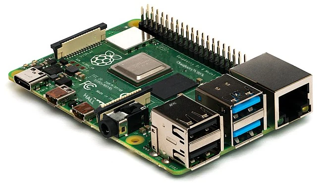
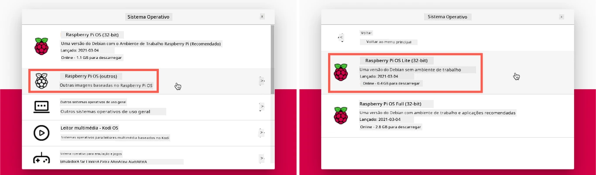
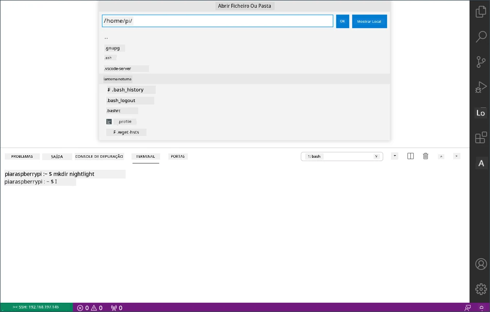

<!--
CO_OP_TRANSLATOR_METADATA:
{
  "original_hash": "8ff0d0a1d29832bb896b9c103b69a452",
  "translation_date": "2025-08-25T22:15:12+00:00",
  "source_file": "1-getting-started/lessons/1-introduction-to-iot/pi.md",
  "language_code": "pt"
}
-->
# Raspberry Pi

O [Raspberry Pi](https://raspberrypi.org) é um computador de placa única. Pode adicionar sensores e atuadores utilizando uma ampla gama de dispositivos e ecossistemas. Para estas lições, será utilizado um ecossistema de hardware chamado [Grove](https://www.seeedstudio.com/category/Grove-c-1003.html). Vai programar o seu Pi e aceder aos sensores Grove utilizando Python.



## Configuração

Se estiver a usar um Raspberry Pi como o seu hardware IoT, tem duas opções: pode trabalhar diretamente no Pi ao longo destas lições ou pode conectar-se remotamente a um Pi 'headless' e programar a partir do seu computador.

Antes de começar, também precisa de ligar o Grove Base Hat ao seu Pi.

### Tarefa - configuração

Instale o Grove Base Hat no seu Pi e configure-o.

1. Conecte o Grove Base Hat ao seu Pi. O conector do hat encaixa sobre todos os pinos GPIO do Pi, deslizando até ao fundo para se fixar firmemente na base. Ele cobre o Pi.

    

1. Decida como pretende programar o seu Pi e siga para a secção correspondente abaixo:

    * [Trabalhar diretamente no seu Pi](../../../../../1-getting-started/lessons/1-introduction-to-iot)
    * [Acesso remoto para programar o Pi](../../../../../1-getting-started/lessons/1-introduction-to-iot)

### Trabalhar diretamente no seu Pi

Se quiser trabalhar diretamente no seu Pi, pode usar a versão desktop do Raspberry Pi OS e instalar todas as ferramentas necessárias.

#### Tarefa - trabalhar diretamente no seu Pi

Prepare o seu Pi para desenvolvimento.

1. Siga as instruções no [guia de configuração do Raspberry Pi](https://projects.raspberrypi.org/en/projects/raspberry-pi-setting-up) para configurar o seu Pi, conectá-lo a um teclado/ratinho/monitor, ligá-lo à sua rede Wi-Fi ou Ethernet e atualizar o software.

Para programar o Pi utilizando os sensores e atuadores Grove, precisará de instalar um editor para escrever o código do dispositivo, bem como várias bibliotecas e ferramentas que interagem com o hardware Grove.

1. Assim que o seu Pi reiniciar, abra o Terminal clicando no ícone **Terminal** na barra de menu superior ou escolha *Menu -> Acessórios -> Terminal*.

1. Execute o seguinte comando para garantir que o sistema operativo e o software instalado estão atualizados:

    ```sh
    sudo apt update && sudo apt full-upgrade --yes
    ```

1. Execute os seguintes comandos para instalar todas as bibliotecas necessárias para o hardware Grove:

    ```sh
    sudo apt install git python3-dev python3-pip --yes

    git clone https://github.com/Seeed-Studio/grove.py
    cd grove.py
    sudo pip3 install .

    sudo raspi-config nonint do_i2c 0
    ```

    Isto começa por instalar o Git, juntamente com o Pip para instalar pacotes Python.

    Uma das funcionalidades mais poderosas do Python é a capacidade de instalar [pacotes Pip](https://pypi.org) - estes são pacotes de código escritos por outras pessoas e publicados na Internet. Pode instalar um pacote Pip no seu computador com um único comando e utilizá-lo no seu código.

    Os pacotes Python do Seeed Grove precisam de ser instalados a partir do código-fonte. Estes comandos irão clonar o repositório contendo o código-fonte deste pacote e instalá-lo localmente.

    > 💁 Por padrão, quando instala um pacote, ele fica disponível em todo o computador, o que pode causar problemas com versões de pacotes - como uma aplicação depender de uma versão que deixa de funcionar quando instala uma nova versão para outra aplicação. Para contornar este problema, pode usar um [ambiente virtual Python](https://docs.python.org/3/library/venv.html), essencialmente uma cópia do Python numa pasta dedicada, onde os pacotes Pip são instalados apenas nessa pasta. No entanto, não usará ambientes virtuais no seu Pi. O script de instalação do Grove instala os pacotes Python do Grove globalmente, então, para usar um ambiente virtual, teria de configurá-lo e reinstalar manualmente os pacotes Grove nesse ambiente. É mais fácil usar pacotes globais, especialmente porque muitos programadores de Pi preferem regravar um cartão SD limpo para cada projeto.

    Por fim, isto ativa a interface I<sup>2</sup>C.

1. Reinicie o Pi utilizando o menu ou executando o seguinte comando no Terminal:

    ```sh
    sudo reboot
    ```

1. Assim que o Pi reiniciar, reabra o Terminal e execute o seguinte comando para instalar o [Visual Studio Code (VS Code)](https://code.visualstudio.com?WT.mc_id=academic-17441-jabenn) - este será o editor utilizado para escrever o código do dispositivo em Python.

    ```sh
    sudo apt install code
    ```

    Após a instalação, o VS Code estará disponível na barra de menu superior.

    > 💁 Está livre para usar qualquer IDE ou editor Python de sua preferência para estas lições, mas as instruções serão baseadas no uso do VS Code.

1. Instale o Pylance. Esta é uma extensão para o VS Code que fornece suporte à linguagem Python. Consulte a [documentação da extensão Pylance](https://marketplace.visualstudio.com/items?WT.mc_id=academic-17441-jabenn&itemName=ms-python.vscode-pylance) para obter instruções sobre como instalar esta extensão no VS Code.

### Acesso remoto para programar o Pi

Em vez de programar diretamente no Pi, pode configurá-lo para funcionar como 'headless', ou seja, sem estar conectado a um teclado/ratinho/monitor, e programá-lo a partir do seu computador utilizando o Visual Studio Code.

#### Configurar o sistema operativo do Pi

Para programar remotamente, o sistema operativo do Pi precisa de ser instalado num cartão SD.

##### Tarefa - configurar o sistema operativo do Pi

Configure o sistema operativo do Pi para funcionar como 'headless'.

1. Faça o download do **Raspberry Pi Imager** na [página de software do Raspberry Pi OS](https://www.raspberrypi.org/software/) e instale-o.

1. Insira um cartão SD no seu computador, utilizando um adaptador, se necessário.

1. Abra o Raspberry Pi Imager.

1. No Raspberry Pi Imager, selecione o botão **CHOOSE OS**, depois escolha *Raspberry Pi OS (Other)* e, em seguida, *Raspberry Pi OS Lite (32-bit)*.

    

    > 💁 O Raspberry Pi OS Lite é uma versão do Raspberry Pi OS sem a interface gráfica ou ferramentas baseadas em UI. Estas não são necessárias para um Pi 'headless', tornando a instalação mais leve e o tempo de arranque mais rápido.

1. Selecione o botão **CHOOSE STORAGE** e escolha o seu cartão SD.

1. Abra as **Opções Avançadas** pressionando `Ctrl+Shift+X`. Estas opções permitem pré-configurar o Raspberry Pi OS antes de gravá-lo no cartão SD.

    1. Marque a caixa **Enable SSH** e defina uma palavra-passe para o utilizador `pi`. Esta será a palavra-passe utilizada para iniciar sessão no Pi mais tarde.

    1. Se planeia conectar-se ao Pi via Wi-Fi, marque a caixa **Configure WiFi** e insira o SSID e a palavra-passe da sua rede Wi-Fi, além de selecionar o seu país Wi-Fi. Não precisa de fazer isto se for usar um cabo Ethernet. Certifique-se de que a rede à qual se conecta é a mesma do seu computador.

    1. Marque a caixa **Set locale settings** e defina o seu país e fuso horário.

    1. Clique no botão **SAVE**.

1. Clique no botão **WRITE** para gravar o sistema operativo no cartão SD. Se estiver a usar macOS, será solicitado que insira a sua palavra-passe, pois a ferramenta subjacente que grava imagens de disco requer acesso privilegiado.

O sistema operativo será gravado no cartão SD e, ao concluir, o cartão será ejetado pelo sistema operativo, e será notificado. Remova o cartão SD do seu computador, insira-o no Pi, ligue o Pi e aguarde cerca de 2 minutos para que ele inicie corretamente.

#### Conectar-se ao Pi

O próximo passo é aceder remotamente ao Pi. Pode fazer isso utilizando `ssh`, disponível no macOS, Linux e versões recentes do Windows.

##### Tarefa - conectar-se ao Pi

Aceda remotamente ao Pi.

1. Abra um Terminal ou Prompt de Comando e insira o seguinte comando para se conectar ao Pi:

    ```sh
    ssh pi@raspberrypi.local
    ```

    Se estiver a usar uma versão mais antiga do Windows que não tenha `ssh` instalado, pode usar o OpenSSH. Pode encontrar as instruções de instalação na [documentação de instalação do OpenSSH](https://docs.microsoft.com//windows-server/administration/openssh/openssh_install_firstuse?WT.mc_id=academic-17441-jabenn).

1. Isto deve conectar-se ao seu Pi e pedir a palavra-passe.

    A capacidade de encontrar computadores na sua rede utilizando `<hostname>.local` é uma adição relativamente recente ao Linux e Windows. Se estiver a usar Linux ou Windows e receber erros sobre o nome do host não ser encontrado, precisará de instalar software adicional para ativar a rede ZeroConf (também referida pela Apple como Bonjour):

    1. Se estiver a usar Linux, instale o Avahi utilizando o seguinte comando:

        ```sh
        sudo apt-get install avahi-daemon
        ```

    1. Se estiver a usar Windows, a forma mais fácil de ativar o ZeroConf é instalar o [Bonjour Print Services para Windows](http://support.apple.com/kb/DL999). Também pode instalar o [iTunes para Windows](https://www.apple.com/itunes/download/) para obter uma versão mais recente da utilidade (que não está disponível de forma independente).

    > 💁 Se não conseguir conectar-se utilizando `raspberrypi.local`, pode usar o endereço IP do seu Pi. Consulte a [documentação sobre endereços IP do Raspberry Pi](https://www.raspberrypi.org/documentation/remote-access/ip-address.md) para instruções sobre várias formas de obter o endereço IP.

1. Insira a palavra-passe que definiu nas Opções Avançadas do Raspberry Pi Imager.

#### Configurar o software no Pi

Depois de se conectar ao Pi, precisa de garantir que o sistema operativo está atualizado e instalar várias bibliotecas e ferramentas que interagem com o hardware Grove.

##### Tarefa - configurar o software no Pi

Configure o software instalado no Pi e instale as bibliotecas Grove.

1. A partir da sua sessão `ssh`, execute o seguinte comando para atualizar e reiniciar o Pi:

    ```sh
    sudo apt update && sudo apt full-upgrade --yes && sudo reboot
    ```

    O Pi será atualizado e reiniciado. A sessão `ssh` será encerrada quando o Pi for reiniciado, então aguarde cerca de 30 segundos e reconecte-se.

1. A partir da sessão `ssh` reconectada, execute os seguintes comandos para instalar todas as bibliotecas necessárias para o hardware Grove:

    ```sh
    sudo apt install git python3-dev python3-pip --yes

    git clone https://github.com/Seeed-Studio/grove.py
    cd grove.py
    sudo pip3 install .

    sudo raspi-config nonint do_i2c 0
    ```

    Isto começa por instalar o Git, juntamente com o Pip para instalar pacotes Python.

    Uma das funcionalidades mais poderosas do Python é a capacidade de instalar [pacotes Pip](https://pypi.org) - estes são pacotes de código escritos por outras pessoas e publicados na Internet. Pode instalar um pacote Pip no seu computador com um único comando e utilizá-lo no seu código.

    Os pacotes Python do Seeed Grove precisam de ser instalados a partir do código-fonte. Estes comandos irão clonar o repositório contendo o código-fonte deste pacote e instalá-lo localmente.

    > 💁 Por padrão, quando instala um pacote, ele fica disponível em todo o computador, o que pode causar problemas com versões de pacotes - como uma aplicação depender de uma versão que deixa de funcionar quando instala uma nova versão para outra aplicação. Para contornar este problema, pode usar um [ambiente virtual Python](https://docs.python.org/3/library/venv.html), essencialmente uma cópia do Python numa pasta dedicada, onde os pacotes Pip são instalados apenas nessa pasta. No entanto, não usará ambientes virtuais no seu Pi. O script de instalação do Grove instala os pacotes Python do Grove globalmente, então, para usar um ambiente virtual, teria de configurá-lo e reinstalar manualmente os pacotes Grove nesse ambiente. É mais fácil usar pacotes globais, especialmente porque muitos programadores de Pi preferem regravar um cartão SD limpo para cada projeto.

    Por fim, isto ativa a interface I<sup>2</sup>C.

1. Reinicie o Pi executando o seguinte comando:

    ```sh
    sudo reboot
    ```

    A sessão `ssh` será encerrada quando o Pi for reiniciado. Não é necessário reconectar-se.

#### Configurar o VS Code para acesso remoto

Depois de o Pi estar configurado, pode conectar-se a ele utilizando o Visual Studio Code (VS Code) a partir do seu computador - este é um editor de texto gratuito para programadores que será utilizado para escrever o código do dispositivo em Python.

##### Tarefa - configurar o VS Code para acesso remoto

Instale o software necessário e conecte-se remotamente ao seu Pi.

1. Instale o VS Code no seu computador seguindo a [documentação do VS Code](https://code.visualstudio.com?WT.mc_id=academic-17441-jabenn).

1. Siga as instruções na [documentação de Desenvolvimento Remoto do VS Code usando SSH](https://code.visualstudio.com/docs/remote/ssh?WT.mc_id=academic-17441-jabenn) para instalar os componentes necessários.

1. Seguindo as mesmas instruções, conecte o VS Code ao Pi.

1. Uma vez conectado, siga as instruções de [gestão de extensões](https://code.visualstudio.com/docs/remote/ssh#_managing-extensions?WT.mc_id=academic-17441-jabenn) para instalar remotamente a extensão [Pylance](https://marketplace.visualstudio.com/items?WT.mc_id=academic-17441-jabenn&itemName=ms-python.vscode-pylance) no Pi.

## Olá, mundo
É tradicional, ao começar a aprender uma nova linguagem de programação ou tecnologia, criar uma aplicação 'Hello World' - uma pequena aplicação que exibe algo como o texto `"Hello World"` para confirmar que todas as ferramentas estão configuradas corretamente.

A aplicação Hello World para o Pi garantirá que tens o Python e o Visual Studio Code instalados corretamente.

Esta aplicação estará numa pasta chamada `nightlight`, e será reutilizada com código diferente em partes posteriores deste exercício para construir a aplicação nightlight.

### Tarefa - hello world

Cria a aplicação Hello World.

1. Abre o VS Code, diretamente no Pi ou no teu computador, conectado ao Pi usando a extensão Remote SSH.

1. Abre o Terminal do VS Code selecionando *Terminal -> New Terminal*, ou pressionando `` CTRL+` ``. O terminal abrirá no diretório home do utilizador `pi`.

1. Executa os seguintes comandos para criar um diretório para o teu código e criar um ficheiro Python chamado `app.py` dentro desse diretório:

    ```sh
    mkdir nightlight
    cd nightlight
    touch app.py
    ```

1. Abre esta pasta no VS Code selecionando *File -> Open...* e escolhendo a pasta *nightlight*, depois seleciona **OK**.

    

1. Abre o ficheiro `app.py` no explorador do VS Code e adiciona o seguinte código:

    ```python
    print('Hello World!')
    ```

    A função `print` imprime na consola o que for passado como argumento.

1. No Terminal do VS Code, executa o seguinte comando para correr a tua aplicação Python:

    ```sh
    python app.py
    ```

    > 💁 Poderás precisar de chamar explicitamente `python3` para executar este código se tiveres o Python 2 instalado além do Python 3 (a versão mais recente). Se tiveres o Python 2 instalado, ao chamar `python`, será usada a versão 2 em vez da 3. Por padrão, as versões mais recentes do Raspberry Pi OS têm apenas o Python 3 instalado.

    A seguinte saída aparecerá no terminal:

    ```output
    pi@raspberrypi:~/nightlight $ python3 app.py
    Hello World!
    ```

> 💁 Podes encontrar este código na pasta [code/pi](../../../../../1-getting-started/lessons/1-introduction-to-iot/code/pi).

😀 O teu programa 'Hello World' foi um sucesso!

**Aviso Legal**:  
Este documento foi traduzido utilizando o serviço de tradução por IA [Co-op Translator](https://github.com/Azure/co-op-translator). Embora nos esforcemos pela precisão, esteja ciente de que traduções automáticas podem conter erros ou imprecisões. O documento original na sua língua nativa deve ser considerado a fonte autoritária. Para informações críticas, recomenda-se a tradução profissional realizada por humanos. Não nos responsabilizamos por quaisquer mal-entendidos ou interpretações incorretas decorrentes do uso desta tradução.