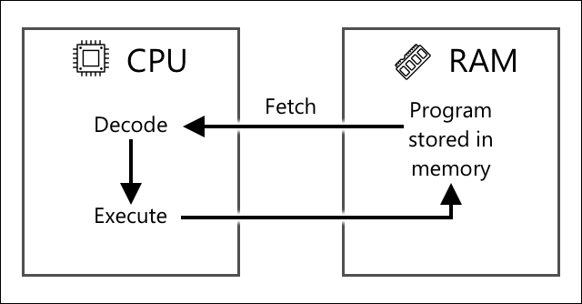

<!--
CO_OP_TRANSLATOR_METADATA:
{
  "original_hash": "9dd7f645ad1c6f20b72fee512987f772",
  "translation_date": "2025-08-25T22:19:27+00:00",
  "source_file": "1-getting-started/lessons/2-deeper-dive/README.md",
  "language_code": "pt"
}
-->
# Uma exploração mais profunda no IoT

> Ilustração por [Nitya Narasimhan](https://github.com/nitya). Clique na imagem para uma versão maior.

Esta lição foi ensinada como parte da série [Hello IoT](https://youtube.com/playlist?list=PLmsFUfdnGr3xRts0TIwyaHyQuHaNQcb6-) do [Microsoft Reactor](https://developer.microsoft.com/reactor/?WT.mc_id=academic-17441-jabenn). A lição foi apresentada em 2 vídeos - uma aula de 1 hora e uma sessão de perguntas e respostas de 1 hora, explorando mais a fundo partes da lição e respondendo a dúvidas.

> 🎥 Clique nas imagens acima para assistir aos vídeos

## Questionário pré-aula

[Questionário pré-aula](https://black-meadow-040d15503.1.azurestaticapps.net/quiz/3)

## Introdução

Esta lição explora mais profundamente alguns dos conceitos abordados na última lição.

Nesta lição, vamos abordar:

* [Componentes de uma aplicação IoT](../../../../../1-getting-started/lessons/2-deeper-dive)
* [Exploração mais profunda de microcontroladores](../../../../../1-getting-started/lessons/2-deeper-dive)
* [Exploração mais profunda de computadores de placa única](../../../../../1-getting-started/lessons/2-deeper-dive)

## Componentes de uma aplicação IoT

Os dois componentes de uma aplicação IoT são a *Internet* e o *dispositivo*. Vamos analisar esses dois componentes com mais detalhes.

### O Dispositivo

A parte **Dispositivo** do IoT refere-se a um equipamento que pode interagir com o mundo físico. Esses dispositivos geralmente são pequenos, de baixo custo, operando em velocidades reduzidas e consumindo pouca energia - por exemplo, microcontroladores simples com apenas alguns kilobytes de RAM (em comparação com gigabytes em um PC), operando a algumas centenas de megahertz (em comparação com gigahertz em um PC), mas consumindo tão pouca energia que podem funcionar por semanas, meses ou até anos com baterias.

Esses dispositivos interagem com o mundo físico, seja usando sensores para coletar dados do ambiente ou controlando saídas ou atuadores para realizar mudanças físicas. Um exemplo típico é um termostato inteligente - um dispositivo que possui um sensor de temperatura, um meio de definir a temperatura desejada, como um botão ou tela sensível ao toque, e uma conexão com um sistema de aquecimento ou refrigeração que pode ser ativado quando a temperatura detectada estiver fora do intervalo desejado. O sensor de temperatura detecta que o ambiente está muito frio e um atuador liga o aquecimento.

Há uma enorme variedade de dispositivos que podem atuar como dispositivos IoT, desde hardware dedicado que detecta uma única coisa até dispositivos de uso geral, incluindo o seu smartphone! Um smartphone pode usar sensores para detectar o ambiente ao seu redor e atuadores para interagir com o mundo - por exemplo, usando um sensor GPS para detectar sua localização e um alto-falante para fornecer instruções de navegação até um destino.

✅ Pense em outros sistemas ao seu redor que leem dados de um sensor e os utilizam para tomar decisões. Um exemplo seria o termostato de um forno. Consegue encontrar mais exemplos?

### A Internet

A parte **Internet** de uma aplicação IoT consiste em aplicações às quais o dispositivo IoT pode se conectar para enviar e receber dados, bem como outras aplicações que podem processar os dados do dispositivo IoT e ajudar a tomar decisões sobre quais solicitações enviar aos atuadores do dispositivo IoT.

Uma configuração típica seria ter algum tipo de serviço em nuvem ao qual o dispositivo IoT se conecta. Esse serviço em nuvem lida com aspectos como segurança, além de receber mensagens do dispositivo IoT e enviar mensagens de volta ao dispositivo. Esse serviço em nuvem, por sua vez, conecta-se a outras aplicações que podem processar ou armazenar dados de sensores, ou usar esses dados em conjunto com informações de outros sistemas para tomar decisões.

Os dispositivos nem sempre se conectam diretamente à Internet via WiFi ou conexões com fio. Alguns dispositivos usam redes mesh para se comunicarem entre si por meio de tecnologias como Bluetooth, conectando-se a um dispositivo hub que possui uma conexão com a Internet.

No exemplo de um termostato inteligente, o termostato se conectaria usando o WiFi doméstico a um serviço em nuvem. Ele enviaria os dados de temperatura para esse serviço em nuvem, que, por sua vez, os gravaria em um banco de dados, permitindo que o proprietário verificasse as temperaturas atuais e passadas por meio de um aplicativo no telefone. Outro serviço na nuvem saberia qual temperatura o proprietário deseja e enviaria mensagens de volta ao dispositivo IoT por meio do serviço em nuvem para informar ao sistema de aquecimento se deve ligar ou desligar.

Uma versão ainda mais inteligente poderia usar IA na nuvem com dados de outros sensores conectados a outros dispositivos IoT, como sensores de ocupação que detectam quais cômodos estão em uso, além de dados como condições climáticas e até mesmo o seu calendário, para tomar decisões sobre como ajustar a temperatura de forma inteligente. Por exemplo, poderia desligar o aquecimento se o calendário indicar que você está de férias ou ajustar o aquecimento de forma personalizada para cada cômodo, dependendo de quais você utiliza, aprendendo com os dados para se tornar cada vez mais preciso ao longo do tempo.

✅ Que outros dados poderiam ajudar a tornar um termostato conectado à Internet mais inteligente?

### IoT na Borda

Embora o "I" em IoT signifique Internet, esses dispositivos não precisam necessariamente se conectar à Internet. Em alguns casos, os dispositivos podem se conectar a dispositivos de borda - dispositivos gateway que operam na sua rede local, permitindo que você processe dados sem fazer chamadas pela Internet. Isso pode ser mais rápido quando há muitos dados ou uma conexão lenta com a Internet, permite operar offline onde a conectividade com a Internet não é possível, como em um navio ou em uma área de desastre durante uma crise humanitária, e permite manter os dados privados. Alguns dispositivos contêm código de processamento criado com ferramentas em nuvem e executam esse código localmente para coletar e responder a dados sem usar uma conexão com a Internet para tomar decisões.

Um exemplo disso é um dispositivo doméstico inteligente, como um Apple HomePod, Amazon Alexa ou Google Home, que escuta sua voz usando modelos de IA treinados na nuvem, mas que operam localmente no dispositivo. Esses dispositivos "acordam" quando uma determinada palavra ou frase é dita e, somente então, enviam sua fala pela Internet para processamento. O dispositivo para de enviar a fala em um momento apropriado, como quando detecta uma pausa na sua fala. Tudo o que você diz antes de ativar o dispositivo com a palavra de ativação e tudo o que você diz após o dispositivo parar de ouvir não será enviado pela Internet ao provedor do dispositivo, garantindo assim a privacidade.

✅ Pense em outros cenários onde a privacidade é importante, de modo que o processamento de dados seria melhor realizado na borda em vez de na nuvem. Como dica - pense em dispositivos IoT com câmeras ou outros dispositivos de imagem.

### Segurança no IoT

Com qualquer conexão à Internet, a segurança é uma consideração importante. Há uma piada antiga que diz que "o S no IoT significa Segurança" - mas não há "S" em IoT, implicando que não é seguro.

Dispositivos IoT conectam-se a um serviço em nuvem e, portanto, são tão seguros quanto esse serviço em nuvem - se o serviço permitir que qualquer dispositivo se conecte, dados maliciosos podem ser enviados ou ataques de vírus podem ocorrer. Isso pode ter consequências muito reais, já que dispositivos IoT interagem e controlam outros dispositivos. Por exemplo, o [worm Stuxnet](https://wikipedia.org/wiki/Stuxnet) manipulou válvulas em centrífugas para danificá-las. Hackers também aproveitaram [falhas de segurança para acessar monitores de bebês](https://www.npr.org/sections/thetwo-way/2018/06/05/617196788/s-c-mom-says-baby-monitor-was-hacked-experts-say-many-devices-are-vulnerable) e outros dispositivos de vigilância doméstica.

> 💁 Às vezes, dispositivos IoT e dispositivos de borda operam em uma rede completamente isolada da Internet para manter os dados privados e seguros. Isso é conhecido como [air-gapping](https://wikipedia.org/wiki/Air_gap_(networking)).

## Exploração mais profunda de microcontroladores

Na última lição, introduzimos os microcontroladores. Agora, vamos analisá-los mais detalhadamente.

### CPU

A CPU é o "cérebro" do microcontrolador. É o processador que executa o seu código e pode enviar e receber dados de dispositivos conectados. CPUs podem conter um ou mais núcleos - essencialmente, um ou mais processadores que podem trabalhar juntos para executar o seu código.

CPUs dependem de um relógio que "tique" milhões ou bilhões de vezes por segundo. Cada tique, ou ciclo, sincroniza as ações que a CPU pode realizar. A cada tique, a CPU pode executar uma instrução de um programa, como recuperar dados de um dispositivo externo ou realizar um cálculo matemático. Esse ciclo regular permite que todas as ações sejam concluídas antes que a próxima instrução seja processada.

Quanto mais rápido o ciclo do relógio, mais instruções podem ser processadas por segundo e, portanto, mais rápida é a CPU. As velocidades das CPUs são medidas em [Hertz (Hz)](https://wikipedia.org/wiki/Hertz), uma unidade padrão onde 1 Hz significa um ciclo ou tique do relógio por segundo.

> 🎓 As velocidades das CPUs geralmente são dadas em MHz ou GHz. 1MHz é 1 milhão de Hz, 1GHz é 1 bilhão de Hz.

> 💁 As CPUs executam programas usando o [ciclo buscar-decodificar-executar](https://wikipedia.org/wiki/Instruction_cycle). A cada tique do relógio, a CPU buscará a próxima instrução na memória, decodificará e, em seguida, executará, como usar uma unidade lógica aritmética (ALU) para somar dois números. Algumas execuções levarão múltiplos tiques para serem concluídas, então o próximo ciclo será executado no próximo tique após a conclusão da instrução.

Microcontroladores têm velocidades de relógio muito mais baixas do que computadores de mesa ou portáteis, ou mesmo a maioria dos smartphones. O Wio Terminal, por exemplo, tem uma CPU que opera a 120MHz ou 120.000.000 ciclos por segundo.

✅ Um PC ou Mac médio tem uma CPU com múltiplos núcleos operando a múltiplos GigaHertz, o que significa que o relógio tica bilhões de vezes por segundo. Pesquise a velocidade do relógio do seu computador e compare quantas vezes ele é mais rápido do que o Wio Terminal.

Cada ciclo do relógio consome energia e gera calor. Quanto mais rápidos os tiques, mais energia é consumida e mais calor é gerado. PCs possuem dissipadores de calor e ventoinhas para remover o calor, sem os quais eles superaqueceriam e desligariam em segundos. Microcontroladores geralmente não possuem esses componentes, pois operam muito mais frios e, portanto, muito mais lentos. PCs funcionam com energia elétrica ou grandes baterias por algumas horas, enquanto microcontroladores podem operar por dias, meses ou até anos com pequenas baterias. Microcontroladores também podem ter núcleos que operam em velocidades diferentes, alternando para núcleos mais lentos e de baixo consumo quando a demanda na CPU é baixa, para reduzir o consumo de energia.

> 💁 Alguns PCs e Macs estão adotando a mesma combinação de núcleos rápidos de alto desempenho e núcleos mais lentos de alta eficiência, alternando para economizar bateria. Por exemplo, o chip M1 nos últimos laptops da Apple pode alternar entre 4 núcleos de desempenho e 4 núcleos de eficiência para otimizar a vida útil da bateria ou a velocidade, dependendo da tarefa em execução.

✅ Faça uma pequena pesquisa: Leia sobre CPUs no [artigo da Wikipedia sobre CPUs](https://wikipedia.org/wiki/Central_processing_unit).

#### Tarefa

Investigue o Wio Terminal.

Se você estiver usando um Wio Terminal para estas lições, tente localizar a CPU. Encontre a seção *Hardware Overview* na [página do produto Wio Terminal](https://www.seeedstudio.com/Wio-Terminal-p-4509.html) para uma imagem do interior e tente localizar a CPU através da janela de plástico transparente na parte de trás.

### Memória

Microcontroladores geralmente possuem dois tipos de memória - memória de programa e memória de acesso aleatório (RAM).

A memória de programa é não volátil, o que significa que o que for escrito nela permanece mesmo quando não há energia no dispositivo. Esta é a memória que armazena o código do seu programa.

A RAM é a memória usada pelo programa para ser executado, contendo variáveis alocadas pelo seu programa e dados coletados de periféricos. A RAM é volátil, ou seja, quando a energia é desligada, o conteúdo é perdido, efetivamente reiniciando o programa.
🎓 A memória de programa armazena o seu código e permanece mesmo quando não há energia.
> 🎓 A RAM é usada para executar o seu programa e é reiniciada quando não há energia

Tal como acontece com a CPU, a memória de um microcontrolador é várias ordens de magnitude menor do que a de um PC ou Mac. Um PC típico pode ter 8 Gigabytes (GB) de RAM, ou 8.000.000.000 bytes, sendo que cada byte tem espaço suficiente para armazenar uma única letra ou um número de 0 a 255. Um microcontrolador, por outro lado, teria apenas Kilobytes (KB) de RAM, sendo que um kilobyte equivale a 1.000 bytes. O terminal Wio mencionado acima tem 192KB de RAM, ou 192.000 bytes - mais de 40.000 vezes menos do que um PC médio!

O diagrama abaixo mostra a diferença relativa de tamanho entre 192KB e 8GB - o pequeno ponto no centro representa 192KB.

O armazenamento de programas também é menor do que num PC. Um PC típico pode ter um disco rígido de 500GB para armazenamento de programas, enquanto um microcontrolador pode ter apenas kilobytes ou, talvez, alguns megabytes (MB) de armazenamento (1MB é 1.000KB, ou 1.000.000 bytes). O terminal Wio tem 4MB de armazenamento para programas.

✅ Faça uma pequena pesquisa: Quanta RAM e armazenamento tem o computador que está a usar para ler isto? Como isso se compara a um microcontrolador?

### Entrada/Saída

Os microcontroladores precisam de conexões de entrada e saída (I/O) para ler dados de sensores e enviar sinais de controlo para atuadores. Normalmente, eles possuem vários pinos de entrada/saída de uso geral (GPIO). Estes pinos podem ser configurados por software como entrada (ou seja, recebem um sinal) ou saída (enviam um sinal).

🧠⬅️ Os pinos de entrada são usados para ler valores de sensores.

🧠➡️ Os pinos de saída enviam instruções para atuadores.

✅ Vai aprender mais sobre isto numa lição posterior.

#### Tarefa

Investigue o terminal Wio.

Se estiver a usar um terminal Wio para estas lições, encontre os pinos GPIO. Consulte a secção *Pinout diagram* na [página do produto Wio Terminal](https://www.seeedstudio.com/Wio-Terminal-p-4509.html) para saber quais pinos correspondem a quê. O terminal Wio vem com um autocolante que pode colar na parte de trás com os números dos pinos, por isso adicione-o agora, se ainda não o fez.

### Tamanho físico

Os microcontroladores são geralmente pequenos, sendo que o menor, um [Freescale Kinetis KL03 MCU, é pequeno o suficiente para caber na cavidade de uma bola de golfe](https://www.edn.com/tiny-arm-cortex-m0-based-mcu-shrinks-package/). Apenas a CPU de um PC pode medir 40mm x 40mm, sem incluir os dissipadores de calor e ventoinhas necessários para garantir que a CPU funcione por mais de alguns segundos sem sobreaquecer, sendo substancialmente maior do que um microcontrolador completo. O kit de desenvolvimento do terminal Wio, com um microcontrolador, caixa, ecrã e uma gama de conexões e componentes, não é muito maior do que uma CPU Intel i9 nua e é substancialmente menor do que a CPU com um dissipador de calor e ventoinha!

| Dispositivo                     | Tamanho               |
| ------------------------------- | --------------------- |
| Freescale Kinetis KL03          | 1,6mm x 2mm x 1mm     |
| Terminal Wio                    | 72mm x 57mm x 12mm    |
| Intel i9 CPU, dissipador e ventoinha | 136mm x 145mm x 103mm |

### Frameworks e sistemas operativos

Devido à sua baixa velocidade e tamanho de memória, os microcontroladores não executam um sistema operativo (SO) no sentido tradicional de um desktop. O sistema operativo que faz o seu computador funcionar (Windows, Linux ou macOS) precisa de muita memória e poder de processamento para executar tarefas que são completamente desnecessárias para um microcontrolador. Lembre-se de que os microcontroladores são geralmente programados para realizar uma ou mais tarefas muito específicas, ao contrário de um computador de uso geral como um PC ou Mac, que precisa de suportar uma interface de utilizador, reproduzir música ou filmes, fornecer ferramentas para escrever documentos ou código, jogar ou navegar na Internet.

Para programar um microcontrolador sem um SO, é necessário algum tipo de ferramenta que permita construir o seu código de forma que o microcontrolador o consiga executar, utilizando APIs que possam comunicar com quaisquer periféricos. Cada microcontrolador é diferente, por isso os fabricantes normalmente suportam frameworks padrão que permitem seguir uma 'receita' padrão para construir o seu código e executá-lo em qualquer microcontrolador que suporte esse framework.

Pode programar microcontroladores usando um SO - frequentemente referido como um sistema operativo em tempo real (RTOS), pois estes são projetados para lidar com o envio de dados para e a partir de periféricos em tempo real. Estes sistemas operativos são muito leves e oferecem funcionalidades como:

* Multithreading, permitindo que o seu código execute mais de um bloco de código ao mesmo tempo, seja em múltiplos núcleos ou alternando num único núcleo.
* Networking para permitir comunicação segura pela Internet.
* Componentes de interface gráfica (GUI) para construir interfaces de utilizador (UI) em dispositivos com ecrãs.

✅ Leia sobre alguns RTOS diferentes: [Azure RTOS](https://azure.microsoft.com/services/rtos/?WT.mc_id=academic-17441-jabenn), [FreeRTOS](https://www.freertos.org), [Zephyr](https://www.zephyrproject.org)

#### Arduino

[Arduino](https://www.arduino.cc) é provavelmente o framework de microcontroladores mais popular, especialmente entre estudantes, entusiastas e makers. Arduino é uma plataforma de eletrónica open source que combina software e hardware. Pode comprar placas compatíveis com Arduino da própria Arduino ou de outros fabricantes e, em seguida, programá-las usando o framework Arduino.

As placas Arduino são programadas em C ou C++. Usar C/C++ permite que o seu código seja compilado de forma muito compacta e execute rapidamente, algo necessário num dispositivo com recursos limitados, como um microcontrolador. O núcleo de uma aplicação Arduino é chamado de sketch e é um código em C/C++ com 2 funções - `setup` e `loop`. Quando a placa é ligada, o código do framework Arduino executa a função `setup` uma vez e, em seguida, executa a função `loop` repetidamente, continuamente, até que a energia seja desligada.

Escreveria o seu código de configuração na função `setup`, como conectar-se ao WiFi e serviços na cloud ou inicializar pinos para entrada e saída. O seu código de processamento ficaria na função `loop`, como ler de um sensor e enviar o valor para a cloud. Normalmente, incluiria um atraso em cada loop; por exemplo, se quiser que os dados do sensor sejam enviados apenas a cada 10 segundos, adicionaria um atraso de 10 segundos no final do loop para que o microcontrolador possa entrar em modo de suspensão, economizando energia, e depois executar o loop novamente quando necessário, 10 segundos depois.

✅ Esta arquitetura de programa é conhecida como *event loop* ou *message loop*. Muitas aplicações utilizam este modelo nos bastidores e é o padrão para a maioria das aplicações desktop que executam em SOs como Windows, macOS ou Linux. O `loop` escuta mensagens de componentes da interface de utilizador, como botões, ou dispositivos como o teclado, e responde a elas. Pode ler mais neste [artigo sobre o event loop](https://wikipedia.org/wiki/Event_loop).

O Arduino fornece bibliotecas padrão para interagir com microcontroladores e os pinos de I/O, com diferentes implementações nos bastidores para funcionar em diferentes microcontroladores. Por exemplo, a função [`delay`](https://www.arduino.cc/reference/en/language/functions/time/delay/) pausa o programa por um período de tempo especificado, e a função [`digitalRead`](https://www.arduino.cc/reference/en/language/functions/digital-io/digitalread/) lê um valor `HIGH` ou `LOW` do pino especificado, independentemente da placa em que o código está a ser executado. Estas bibliotecas padrão significam que o código Arduino escrito para uma placa pode ser recompilado para qualquer outra placa Arduino e funcionará, assumindo que os pinos são os mesmos e as placas suportam os mesmos recursos.

Existe um grande ecossistema de bibliotecas Arduino de terceiros que permitem adicionar funcionalidades extras aos seus projetos Arduino, como usar sensores e atuadores ou conectar-se a serviços IoT na cloud.

##### Tarefa

Investigue o terminal Wio.

Se estiver a usar um terminal Wio para estas lições, releia o código que escreveu na última lição. Encontre as funções `setup` e `loop`. Monitorize a saída serial para verificar que a função `loop` está a ser chamada repetidamente. Experimente adicionar código à função `setup` para escrever na porta serial e observe que este código é chamado apenas uma vez cada vez que reinicia o dispositivo. Experimente reiniciar o dispositivo com o interruptor de energia na lateral para verificar que este código é chamado sempre que o dispositivo é reiniciado.

## Exploração mais profunda de computadores de placa única

Na última lição, introduzimos os computadores de placa única. Vamos agora explorá-los mais a fundo.

### Raspberry Pi

A [Raspberry Pi Foundation](https://www.raspberrypi.org) é uma instituição de caridade do Reino Unido fundada em 2009 para promover o estudo da ciência da computação, especialmente ao nível escolar. Como parte desta missão, desenvolveram um computador de placa única, chamado Raspberry Pi. Atualmente, os Raspberry Pis estão disponíveis em 3 variantes - uma versão de tamanho completo, o menor Pi Zero, e um módulo de computação que pode ser integrado no seu dispositivo IoT final.

A iteração mais recente do Raspberry Pi de tamanho completo é o Raspberry Pi 4B. Este possui uma CPU quad-core (4 núcleos) a 1,5GHz, 2, 4 ou 8GB de RAM, ethernet gigabit, WiFi, 2 portas HDMI que suportam ecrãs 4k, uma porta de saída de áudio e vídeo composto, portas USB (2 USB 2.0, 2 USB 3.0), 40 pinos GPIO, um conector de câmara para um módulo de câmara Raspberry Pi e um slot para cartão SD. Tudo isto numa placa de 88mm x 58mm x 19,5mm, alimentada por uma fonte de alimentação USB-C de 3A. Estes começam a partir de US$35, muito mais baratos do que um PC ou Mac.

> 💁 Existe também um Pi400, um computador tudo-em-um com um Pi4 integrado num teclado.

O Pi Zero é muito menor e consome menos energia. Ele possui uma CPU de núcleo único a 1GHz, 512MB de RAM, WiFi (no modelo Zero W), uma única porta HDMI, uma porta micro-USB, 40 pinos GPIO, um conector de câmara para um módulo de câmara Raspberry Pi e um slot para cartão SD. Mede 65mm x 30mm x 5mm e consome muito pouca energia. O Zero custa US$5, enquanto a versão W com WiFi custa US$10.

> 🎓 As CPUs de ambos são processadores ARM, ao contrário dos processadores Intel/AMD x86 ou x64 encontrados na maioria dos PCs e Macs. Estes são semelhantes às CPUs encontradas em alguns microcontroladores, bem como na maioria dos telemóveis, no Microsoft Surface X e nos novos Macs com Apple Silicon.

Todas as variantes do Raspberry Pi executam uma versão do Debian Linux chamada Raspberry Pi OS. Esta está disponível numa versão lite, sem ambiente de trabalho, perfeita para projetos 'headless' onde não precisa de um ecrã, ou numa versão completa com um ambiente de trabalho completo, incluindo navegador web, aplicações de escritório, ferramentas de programação e jogos. Como o SO é uma versão do Debian Linux, pode instalar qualquer aplicação ou ferramenta que funcione no Debian e seja construída para o processador ARM dentro do Pi.

#### Tarefa

Investigue o Raspberry Pi.

Se estiver a usar um Raspberry Pi para estas lições, leia sobre os diferentes componentes de hardware na placa.

* Pode encontrar detalhes sobre os processadores usados na [página de documentação de hardware do Raspberry Pi](https://www.raspberrypi.org/documentation/hardware/raspberrypi/). Leia sobre o processador usado no Pi que está a usar.
* Localize os pinos GPIO. Leia mais sobre eles na [documentação GPIO do Raspberry Pi](https://www.raspberrypi.org/documentation/hardware/raspberrypi/gpio/README.md). Use o [guia de utilização dos pinos GPIO](https://www.raspberrypi.org/documentation/usage/gpio/README.md) para identificar os diferentes pinos no seu Pi.

### Programar computadores de placa única

Os computadores de placa única são computadores completos, que executam um SO completo. Isto significa que existe uma ampla gama de linguagens de programação, frameworks e ferramentas que pode usar para programá-los, ao contrário dos microcontroladores, que dependem do suporte da placa em frameworks como o Arduino. A maioria das linguagens de programação possui bibliotecas que podem aceder aos pinos GPIO para enviar e receber dados de sensores e atuadores.

✅ Que linguagens de programação conhece? São suportadas no Linux?

A linguagem de programação mais comum para construir aplicações IoT num Raspberry Pi é o Python. Existe um enorme ecossistema de hardware projetado para o Pi, e quase todos incluem o código necessário para utilizá-los como bibliotecas Python. Alguns destes ecossistemas são baseados em 'hats' - assim chamados porque se encaixam no topo do Pi como um chapéu e conectam-se através de um grande conector aos 40 pinos GPIO. Estes hats fornecem capacidades adicionais, como ecrãs, sensores, carros telecomandados ou adaptadores para ligar sensores com cabos padronizados.
### Utilização de computadores de placa única em implementações profissionais de IoT

Os computadores de placa única são utilizados em implementações profissionais de IoT, não apenas como kits de desenvolvimento. Eles podem ser uma forma poderosa de controlar hardware e executar tarefas complexas, como a execução de modelos de machine learning. Por exemplo, existe o [módulo de computação Raspberry Pi 4](https://www.raspberrypi.org/blog/raspberry-pi-compute-module-4/) que oferece toda a potência de um Raspberry Pi 4, mas num formato compacto e mais económico, sem a maioria das portas, projetado para ser integrado em hardware personalizado.

---

## 🚀 Desafio

O desafio da última lição foi listar o maior número possível de dispositivos IoT que existem na sua casa, escola ou local de trabalho. Para cada dispositivo dessa lista, acha que são baseados em microcontroladores, computadores de placa única ou até numa combinação de ambos?

## Questionário pós-aula

[Questionário pós-aula](https://black-meadow-040d15503.1.azurestaticapps.net/quiz/4)

## Revisão e Estudo Individual

* Leia o [guia de introdução ao Arduino](https://www.arduino.cc/en/Guide/Introduction) para compreender melhor a plataforma Arduino.  
* Leia a [introdução ao Raspberry Pi 4](https://www.raspberrypi.org/products/raspberry-pi-4-model-b/) para aprender mais sobre os Raspberry Pis.  
* Saiba mais sobre alguns dos conceitos e siglas no artigo [O que são CPUs, MPUs, MCUs e GPUs no Electrical Engineering Journal](https://www.eejournal.com/article/what-the-faq-are-cpus-mpus-mcus-and-gpus/).  

✅ Utilize estes guias, juntamente com os custos apresentados nos links do [guia de hardware](../../../hardware.md), para decidir qual plataforma de hardware deseja utilizar ou se prefere usar um dispositivo virtual.

## Tarefa

[Compare e contraste microcontroladores e computadores de placa única](assignment.md)

**Aviso Legal**:  
Este documento foi traduzido utilizando o serviço de tradução por IA [Co-op Translator](https://github.com/Azure/co-op-translator). Embora nos esforcemos para garantir a precisão, é importante notar que traduções automáticas podem conter erros ou imprecisões. O documento original na sua língua nativa deve ser considerado a fonte autoritária. Para informações críticas, recomenda-se a tradução profissional realizada por humanos. Não nos responsabilizamos por quaisquer mal-entendidos ou interpretações incorretas decorrentes da utilização desta tradução.