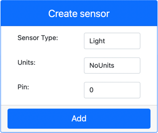

<!--
CO_OP_TRANSLATOR_METADATA:
{
  "original_hash": "11f10c6760fb8202cf368422702fdf70",
  "translation_date": "2025-08-25T22:08:28+00:00",
  "source_file": "1-getting-started/lessons/3-sensors-and-actuators/virtual-device-sensor.md",
  "language_code": "pt"
}
-->
# Construir uma luz de presença - Hardware IoT Virtual

Nesta parte da lição, irá adicionar um sensor de luz ao seu dispositivo IoT virtual.

## Hardware Virtual

A luz de presença necessita de um sensor, criado na aplicação CounterFit.

O sensor é um **sensor de luz**. Num dispositivo IoT físico, seria um [fotodíodo](https://wikipedia.org/wiki/Photodiode) que converte luz em um sinal elétrico. Sensores de luz são sensores analógicos que enviam um valor inteiro indicando uma quantidade relativa de luz, que não corresponde a nenhuma unidade de medida padrão, como [lux](https://wikipedia.org/wiki/Lux).

### Adicionar os sensores ao CounterFit

Para usar um sensor de luz virtual, é necessário adicioná-lo à aplicação CounterFit.

#### Tarefa - adicionar os sensores ao CounterFit

Adicione o sensor de luz à aplicação CounterFit.

1. Certifique-se de que a aplicação web CounterFit está em execução a partir da parte anterior deste exercício. Caso contrário, inicie-a.

1. Crie um sensor de luz:

    1. Na caixa *Create sensor* no painel *Sensors*, abra o menu suspenso *Sensor type* e selecione *Light*.

    1. Deixe a opção *Units* definida como *NoUnits*.

    1. Certifique-se de que o *Pin* está definido como *0*.

    1. Selecione o botão **Add** para criar o sensor de luz no Pin 0.

    

    O sensor de luz será criado e aparecerá na lista de sensores.

    

## Programar o sensor de luz

O dispositivo pode agora ser programado para usar o sensor de luz integrado.

### Tarefa - programar o sensor de luz

Programe o dispositivo.

1. Abra o projeto da luz de presença no VS Code que criou na parte anterior deste exercício. Termine e recrie o terminal para garantir que está a ser executado no ambiente virtual, se necessário.

1. Abra o ficheiro `app.py`.

1. Adicione o seguinte código ao topo do ficheiro `app.py`, junto com as restantes declarações `import`, para importar algumas bibliotecas necessárias:

    ```python
    import time
    from counterfit_shims_grove.grove_light_sensor_v1_2 import GroveLightSensor
    ```

    A declaração `import time` importa o módulo `time` do Python, que será usado mais tarde neste exercício.

    A declaração `from counterfit_shims_grove.grove_light_sensor_v1_2 import GroveLightSensor` importa o `GroveLightSensor` das bibliotecas Python CounterFit Grove shim. Esta biblioteca contém código para interagir com um sensor de luz criado na aplicação CounterFit.

1. Adicione o seguinte código ao final do ficheiro para criar instâncias de classes que gerem o sensor de luz:

    ```python
    light_sensor = GroveLightSensor(0)
    ```

    A linha `light_sensor = GroveLightSensor(0)` cria uma instância da classe `GroveLightSensor` conectada ao pin **0** - o pin Grove do CounterFit ao qual o sensor de luz está ligado.

1. Adicione um loop infinito após o código acima para consultar o valor do sensor de luz e imprimi-lo no terminal:

    ```python
    while True:
        light = light_sensor.light
        print('Light level:', light)
    ```

    Isto irá ler o nível de luz atual usando a propriedade `light` da classe `GroveLightSensor`. Esta propriedade lê o valor analógico do pin. Este valor é então impresso no terminal.

1. Adicione uma pequena pausa de um segundo no final do loop `while`, pois os níveis de luz não precisam de ser verificados continuamente. Uma pausa reduz o consumo de energia do dispositivo.

    ```python
    time.sleep(1)
    ```

1. No Terminal do VS Code, execute o seguinte comando para executar a sua aplicação Python:

    ```sh
    python3 app.py
    ```

    Os valores de luz serão exibidos no terminal. Inicialmente, este valor será 0.

1. Na aplicação CounterFit, altere o valor do sensor de luz que será lido pela aplicação. Pode fazer isso de duas formas:

    * Insira um número na caixa *Value* do sensor de luz e, em seguida, selecione o botão **Set**. O número que inserir será o valor retornado pelo sensor.

    * Marque a caixa *Random* e insira um valor *Min* e *Max*, depois selecione o botão **Set**. Sempre que o sensor ler um valor, será gerado um número aleatório entre *Min* e *Max*.

    Os valores que definir serão exibidos no terminal. Altere o *Value* ou as definições de *Random* para fazer o valor mudar.

    ```output
    (.venv) ➜  GroveTest python3 app.py 
    Light level: 143
    Light level: 244
    Light level: 246
    Light level: 253
    ```

> 💁 Pode encontrar este código na pasta [code-sensor/virtual-device](../../../../../1-getting-started/lessons/3-sensors-and-actuators/code-sensor/virtual-device).

😀 O seu programa de luz de presença foi um sucesso!

**Aviso Legal**:  
Este documento foi traduzido utilizando o serviço de tradução por IA [Co-op Translator](https://github.com/Azure/co-op-translator). Embora nos esforcemos para garantir a precisão, é importante notar que traduções automáticas podem conter erros ou imprecisões. O documento original na sua língua nativa deve ser considerado a fonte autoritária. Para informações críticas, recomenda-se a tradução profissional realizada por humanos. Não nos responsabilizamos por quaisquer mal-entendidos ou interpretações incorretas decorrentes do uso desta tradução.