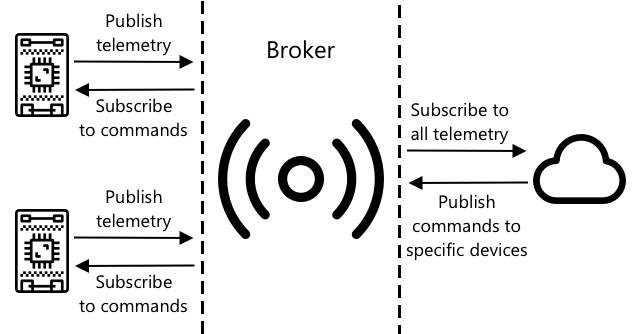

<!--
CO_OP_TRANSLATOR_METADATA:
{
  "original_hash": "71b5040e0b3472f1c0949c9b55f224c0",
  "translation_date": "2025-08-25T21:55:03+00:00",
  "source_file": "1-getting-started/lessons/4-connect-internet/README.md",
  "language_code": "pt"
}
-->
# Conecte o seu dispositivo à Internet


> Ilustração por [Nitya Narasimhan](https://github.com/nitya). Clique na imagem para uma versão maior.

Esta lição foi ensinada como parte da série [Hello IoT](https://youtube.com/playlist?list=PLmsFUfdnGr3xRts0TIwyaHyQuHaNQcb6-) do [Microsoft Reactor](https://developer.microsoft.com/reactor/?WT.mc_id=academic-17441-jabenn). A lição foi apresentada em 2 vídeos - uma aula de 1 hora e uma sessão de perguntas e respostas de 1 hora, explorando mais a fundo partes da lição e respondendo a dúvidas.

[](https://youtu.be/O4dd172mZhs)

[](https://youtu.be/j-cVCzRDE2Q)

> 🎥 Clique nas imagens acima para assistir aos vídeos

## Questionário pré-aula

[Questionário pré-aula](https://black-meadow-040d15503.1.azurestaticapps.net/quiz/7)

## Introdução

O **I** em IoT significa **Internet** - a conectividade com a nuvem e os serviços que possibilitam muitas das funcionalidades dos dispositivos IoT, desde a coleta de medições dos sensores conectados ao dispositivo até o envio de mensagens para controlar os atuadores. Dispositivos IoT geralmente se conectam a um único serviço de IoT na nuvem usando um protocolo de comunicação padrão, e esse serviço está conectado ao restante da sua aplicação IoT, desde serviços de IA para tomar decisões inteligentes com base nos dados até aplicativos web para controle ou relatórios.

> 🎓 Dados coletados de sensores e enviados para a nuvem são chamados de telemetria.

Dispositivos IoT podem receber mensagens da nuvem. Muitas vezes, essas mensagens contêm comandos - ou seja, instruções para realizar uma ação, seja internamente (como reiniciar ou atualizar o firmware) ou usando um atuador (como acender uma luz).

Esta lição apresenta alguns dos protocolos de comunicação que dispositivos IoT podem usar para se conectar à nuvem e os tipos de dados que podem enviar ou receber. Você também terá uma experiência prática com ambos, adicionando controle pela Internet à sua luz noturna, movendo a lógica de controle do LED para um código 'servidor' executado localmente.

Nesta lição, abordaremos:

* [Protocolos de comunicação](../../../../../1-getting-started/lessons/4-connect-internet)
* [Message Queueing Telemetry Transport (MQTT)](../../../../../1-getting-started/lessons/4-connect-internet)
* [Telemetria](../../../../../1-getting-started/lessons/4-connect-internet)
* [Comandos](../../../../../1-getting-started/lessons/4-connect-internet)

## Protocolos de comunicação

Existem vários protocolos de comunicação populares usados por dispositivos IoT para se comunicar com a Internet. Os mais comuns são baseados em mensagens de publicação/assinatura via algum tipo de broker. Os dispositivos IoT se conectam ao broker, publicam telemetria e assinam comandos. Os serviços na nuvem também se conectam ao broker, assinam todas as mensagens de telemetria e publicam comandos, seja para dispositivos específicos ou para grupos de dispositivos.



O MQTT é o protocolo de comunicação mais popular para dispositivos IoT e será abordado nesta lição. Outros protocolos incluem AMQP e HTTP/HTTPS.

## Message Queueing Telemetry Transport (MQTT)

[MQTT](http://mqtt.org) é um protocolo de mensagens leve e de padrão aberto que pode enviar mensagens entre dispositivos. Ele foi projetado em 1999 para monitorar oleodutos, antes de ser lançado como um padrão aberto 15 anos depois pela IBM.

O MQTT possui um único broker e vários clientes. Todos os clientes se conectam ao broker, e o broker encaminha mensagens para os clientes relevantes. As mensagens são roteadas usando tópicos nomeados, em vez de serem enviadas diretamente para um cliente individual. Um cliente pode publicar em um tópico, e qualquer cliente que assinar esse tópico receberá a mensagem.


✅ Faça uma pesquisa. Se você tiver muitos dispositivos IoT, como pode garantir que o seu broker MQTT consiga lidar com todas as mensagens?

### Conecte o seu dispositivo IoT ao MQTT

A primeira parte de adicionar controle pela Internet à sua luz noturna é conectá-la a um broker MQTT.

#### Tarefa

Conecte o seu dispositivo a um broker MQTT.

Nesta parte da lição, você conectará sua luz noturna IoT à Internet para permitir que ela seja controlada remotamente. Mais tarde nesta lição, o seu dispositivo IoT enviará uma mensagem de telemetria via MQTT para um broker MQTT público com o nível de luz, onde será captada por um código de servidor que você escreverá. Esse código verificará o nível de luz e enviará uma mensagem de comando de volta ao dispositivo, instruindo-o a ligar ou desligar o LED.

O caso de uso real para tal configuração poderia ser coletar dados de vários sensores de luz antes de decidir acender as luzes em um local com muitas luzes, como um estádio. Isso poderia evitar que as luzes fossem acesas se apenas um sensor estivesse coberto por nuvens ou por um pássaro, mas os outros sensores detectassem luz suficiente.

✅ Que outras situações exigiriam a avaliação de dados de vários sensores antes de enviar comandos?

Em vez de lidar com as complexidades de configurar um broker MQTT como parte desta tarefa, você pode usar um servidor de teste público que executa o [Eclipse Mosquitto](https://www.mosquitto.org), um broker MQTT de código aberto. Este broker de teste está disponível publicamente em [test.mosquitto.org](https://test.mosquitto.org) e não exige a criação de uma conta, tornando-o uma ótima ferramenta para testar clientes e servidores MQTT.

> 💁 Este broker de teste é público e não é seguro. Qualquer pessoa pode estar ouvindo o que você publica, então ele não deve ser usado com dados que precisam ser mantidos privados.


Siga o passo relevante abaixo para conectar o seu dispositivo ao broker MQTT:

* [Arduino - Wio Terminal](wio-terminal-mqtt.md)
* [Computador de placa única - Raspberry Pi/Dispositivo IoT virtual](single-board-computer-mqtt.md)

### Um mergulho mais profundo no MQTT

Os tópicos podem ter uma hierarquia, e os clientes podem assinar diferentes níveis da hierarquia usando curingas. Por exemplo, você pode enviar mensagens de telemetria de temperatura para o tópico `/telemetry/temperature` e mensagens de umidade para o tópico `/telemetry/humidity`, e então, no seu aplicativo na nuvem, assinar o tópico `/telemetry/*` para receber ambas as mensagens de telemetria de temperatura e umidade.

As mensagens podem ser enviadas com uma qualidade de serviço (QoS), que determina a garantia de que a mensagem será recebida.

* No máximo uma vez - a mensagem é enviada apenas uma vez e o cliente e o broker não tomam medidas adicionais para confirmar a entrega (enviar e esquecer).
* Pelo menos uma vez - a mensagem é reenviada pelo remetente várias vezes até que o recebimento seja confirmado (entrega reconhecida).
* Exatamente uma vez - o remetente e o receptor realizam um processo de handshake em dois níveis para garantir que apenas uma cópia da mensagem seja recebida (entrega garantida).

✅ Que situações podem exigir uma mensagem de entrega garantida em vez de uma mensagem de enviar e esquecer?

Embora o nome seja Message Queueing (iniciais em MQTT), ele na verdade não suporta filas de mensagens. Isso significa que, se um cliente se desconectar e depois se reconectar, ele não receberá mensagens enviadas durante a desconexão, exceto aquelas que ele já havia começado a processar usando o processo de QoS. As mensagens podem ter um sinalizador de retenção ativado. Se este sinalizador estiver ativado, o broker MQTT armazenará a última mensagem enviada em um tópico com este sinalizador e enviará esta mensagem para qualquer cliente que posteriormente assinar o tópico. Desta forma, os clientes sempre receberão a mensagem mais recente.

O MQTT também suporta uma função de keep alive que verifica se a conexão ainda está ativa durante longos intervalos entre mensagens.

> 🦟 [Mosquitto da Eclipse Foundation](https://mosquitto.org) oferece um broker MQTT gratuito que você pode executar para experimentar o MQTT, além de um broker MQTT público que você pode usar para testar seu código, hospedado em [test.mosquitto.org](https://test.mosquitto.org).

As conexões MQTT podem ser públicas e abertas, ou criptografadas e protegidas usando nomes de usuário e senhas, ou certificados.

> 💁 O MQTT se comunica via TCP/IP, o mesmo protocolo de rede subjacente ao HTTP, mas em uma porta diferente. Você também pode usar MQTT sobre websockets para se comunicar com aplicativos web executados em um navegador ou em situações onde firewalls ou outras regras de rede bloqueiam conexões MQTT padrão.

## Telemetria

A palavra telemetria é derivada de raízes gregas que significam medir remotamente. Telemetria é o ato de coletar dados de sensores e enviá-los para a nuvem.

> 💁 Um dos primeiros dispositivos de telemetria foi inventado na França em 1874 e enviava em tempo real dados meteorológicos e de profundidade de neve do Mont Blanc para Paris. Ele usava fios físicos, pois tecnologias sem fio não estavam disponíveis na época.

Vamos relembrar o exemplo do termostato inteligente da Lição 1.


O termostato possui sensores de temperatura para coletar telemetria. Provavelmente teria um sensor de temperatura embutido e poderia se conectar a vários sensores de temperatura externos via um protocolo sem fio, como [Bluetooth Low Energy](https://wikipedia.org/wiki/Bluetooth_Low_Energy) (BLE).

Um exemplo dos dados de telemetria que ele enviaria poderia ser:

| Nome | Valor | Descrição |
| ---- | ----- | ----------- |
| `thermostat_temperature` | 18°C | A temperatura medida pelo sensor de temperatura embutido no termostato |
| `livingroom_temperature` | 19°C | A temperatura medida por um sensor de temperatura remoto que foi nomeado como `livingroom` para identificar a sala onde está localizado |
| `bedroom_temperature` | 21°C | A temperatura medida por um sensor de temperatura remoto que foi nomeado como `bedroom` para identificar o quarto onde está localizado |

O serviço na nuvem pode então usar esses dados de telemetria para tomar decisões sobre quais comandos enviar para controlar o aquecimento.

### Enviar telemetria do seu dispositivo IoT

A próxima parte de adicionar controle pela Internet à sua luz noturna é enviar a telemetria do nível de luz para o broker MQTT em um tópico de telemetria.

#### Tarefa - enviar telemetria do seu dispositivo IoT

Envie telemetria do nível de luz para o broker MQTT.

Os dados são enviados codificados como JSON - abreviação de JavaScript Object Notation, um padrão para codificar dados em texto usando pares chave/valor.

✅ Se você nunca ouviu falar de JSON antes, pode aprender mais sobre ele na [documentação do JSON.org](https://www.json.org/).

Siga o passo relevante abaixo para enviar telemetria do seu dispositivo para o broker MQTT:

* [Arduino - Wio Terminal](wio-terminal-telemetry.md)
* [Computador de placa única - Raspberry Pi/Dispositivo IoT virtual](single-board-computer-telemetry.md)

### Receber telemetria do broker MQTT

Não faz sentido enviar telemetria se não houver nada na outra ponta para ouvi-la. A telemetria do nível de luz precisa de algo que a processe. Este código 'servidor' é o tipo de código que você implantará em um serviço na nuvem como parte de uma aplicação IoT maior, mas aqui você executará este código localmente no seu computador (ou no seu Pi, se estiver programando diretamente nele). O código do servidor consiste em um aplicativo Python que escuta mensagens de telemetria via MQTT com níveis de luz. Mais tarde nesta lição, você fará com que ele responda com uma mensagem de comando com instruções para ligar ou desligar o LED.

✅ Faça uma pesquisa: O que acontece com as mensagens MQTT se não houver um ouvinte?

#### Instalar Python e VS Code

Se você não tiver Python e VS Code instalados localmente, precisará instalá-los para programar o servidor. Se estiver usando um dispositivo IoT virtual ou trabalhando no seu Raspberry Pi, pode pular esta etapa, pois já deve ter isso instalado e configurado.

##### Tarefa - instalar Python e VS Code

Instale Python e VS Code.

1. Instale o Python. Consulte a [página de downloads do Python](https://www.python.org/downloads/) para instruções sobre como instalar a versão mais recente do Python.

1. Instale o Visual Studio Code (VS Code). Este será o editor que você usará para escrever o código do dispositivo virtual em Python. Consulte a [documentação do VS Code](https://code.visualstudio.com?WT.mc_id=academic-17441-jabenn) para instruções sobre como instalar o VS Code.
💁 Está à vontade para usar qualquer IDE ou editor de Python para estas lições, caso tenha uma ferramenta preferida, mas as lições fornecerão instruções baseadas no uso do VS Code.
1. Instale a extensão Pylance para VS Code. Esta é uma extensão para o VS Code que oferece suporte à linguagem Python. Consulte a [documentação da extensão Pylance](https://marketplace.visualstudio.com/items?WT.mc_id=academic-17441-jabenn&itemName=ms-python.vscode-pylance) para instruções sobre como instalar esta extensão no VS Code.

#### Configurar um ambiente virtual Python

Uma das funcionalidades mais poderosas do Python é a capacidade de instalar [pacotes pip](https://pypi.org) - pacotes de código escritos por outras pessoas e publicados na Internet. Pode instalar um pacote pip no seu computador com um único comando e, em seguida, usar esse pacote no seu código. Vai usar o pip para instalar um pacote que permite comunicação via MQTT.

Por padrão, quando instala um pacote, ele fica disponível em todo o computador, o que pode levar a problemas com versões de pacotes - como uma aplicação depender de uma versão específica de um pacote que deixa de funcionar quando instala uma nova versão para outra aplicação. Para contornar este problema, pode usar um [ambiente virtual Python](https://docs.python.org/3/library/venv.html), que é essencialmente uma cópia do Python numa pasta dedicada. Quando instala pacotes pip, eles são instalados apenas nessa pasta.

##### Tarefa - configurar um ambiente virtual Python

Configure um ambiente virtual Python e instale os pacotes pip para MQTT.

1. No terminal ou linha de comandos, execute o seguinte numa localização à sua escolha para criar e navegar para um novo diretório:

    ```sh
    mkdir nightlight-server
    cd nightlight-server
    ```

1. Agora execute o seguinte para criar um ambiente virtual na pasta `.venv`:

    ```sh
    python3 -m venv .venv
    ```

    > 💁 Deve chamar explicitamente `python3` para criar o ambiente virtual, caso tenha o Python 2 instalado além do Python 3 (a versão mais recente). Se tiver o Python 2 instalado, ao chamar `python`, será usado o Python 2 em vez do Python 3.

1. Ative o ambiente virtual:

    * No Windows:
        * Se estiver a usar o Command Prompt ou o Command Prompt através do Windows Terminal, execute:

            ```cmd
            .venv\Scripts\activate.bat
            ```

        * Se estiver a usar o PowerShell, execute:

            ```powershell
            .\.venv\Scripts\Activate.ps1
            ```

    * No macOS ou Linux, execute:

        ```cmd
        source ./.venv/bin/activate
        ```

    > 💁 Estes comandos devem ser executados na mesma localização onde executou o comando para criar o ambiente virtual. Nunca precisará de navegar para dentro da pasta `.venv`; deve sempre executar o comando de ativação e quaisquer comandos para instalar pacotes ou executar código a partir da pasta onde criou o ambiente virtual.

1. Uma vez ativado o ambiente virtual, o comando padrão `python` executará a versão do Python usada para criar o ambiente virtual. Execute o seguinte para verificar a versão:

    ```sh
    python --version
    ```

    A saída será semelhante ao seguinte:

    ```output
    (.venv) ➜  nightlight-server python --version
    Python 3.9.1
    ```

    > 💁 A sua versão do Python pode ser diferente - desde que seja a versão 3.6 ou superior, está tudo bem. Caso contrário, elimine esta pasta, instale uma versão mais recente do Python e tente novamente.

1. Execute os seguintes comandos para instalar o pacote pip [Paho-MQTT](https://pypi.org/project/paho-mqtt/), uma biblioteca popular de MQTT.

    ```sh
    pip install paho-mqtt
    ```

    Este pacote pip será instalado apenas no ambiente virtual e não estará disponível fora dele.

#### Escrever o código do servidor

Agora pode escrever o código do servidor em Python.

##### Tarefa - escrever o código do servidor

Escreva o código do servidor.

1. No terminal ou linha de comandos, execute o seguinte dentro do ambiente virtual para criar um ficheiro Python chamado `app.py`:

    * No Windows, execute:

        ```cmd
        type nul > app.py
        ```

    * No macOS ou Linux, execute:

        ```cmd
        touch app.py
        ```

1. Abra a pasta atual no VS Code:

    ```sh
    code .
    ```

1. Quando o VS Code for iniciado, ele ativará o ambiente virtual Python. Isto será indicado na barra de estado inferior:

    

1. Se o terminal do VS Code já estiver em execução quando o VS Code for iniciado, o ambiente virtual não será ativado nele. A forma mais fácil de resolver isto é encerrar o terminal usando o botão **Kill the active terminal instance**:

    

1. Inicie um novo terminal no VS Code selecionando *Terminal -> New Terminal*, ou pressionando `` CTRL+` ``. O novo terminal carregará o ambiente virtual, com a chamada para ativá-lo aparecendo no terminal. O nome do ambiente virtual (`.venv`) também estará no prompt:

    ```output
    ➜  nightlight-server source .venv/bin/activate
    (.venv) ➜  nightlight 
    ```

1. Abra o ficheiro `app.py` no explorador do VS Code e adicione o seguinte código:

    ```python
    import json
    import time
    
    import paho.mqtt.client as mqtt
    
    id = '<ID>'
    
    client_telemetry_topic = id + '/telemetry'
    client_name = id + 'nightlight_server'
    
    mqtt_client = mqtt.Client(client_name)
    mqtt_client.connect('test.mosquitto.org')
    
    mqtt_client.loop_start()
    
    def handle_telemetry(client, userdata, message):
        payload = json.loads(message.payload.decode())
        print("Message received:", payload)
    
    mqtt_client.subscribe(client_telemetry_topic)
    mqtt_client.on_message = handle_telemetry
    
    while True:
        time.sleep(2)
    ```

    Substitua `<ID>` na linha 6 pelo ID único que usou ao criar o código do seu dispositivo.

    ⚠️ Este **deve** ser o mesmo ID que usou no seu dispositivo, caso contrário o código do servidor não irá subscrever ou publicar no tópico correto.

    Este código cria um cliente MQTT com um nome único e conecta-se ao broker *test.mosquitto.org*. Em seguida, inicia um loop de processamento que é executado numa thread em segundo plano, ouvindo mensagens em quaisquer tópicos subscritos.

    O cliente subscreve mensagens no tópico de telemetria e define uma função que é chamada quando uma mensagem é recebida. Quando uma mensagem de telemetria é recebida, a função `handle_telemetry` é chamada, imprimindo a mensagem recebida no terminal.

    Por fim, um loop infinito mantém a aplicação em execução. O cliente MQTT está a ouvir mensagens numa thread em segundo plano e funciona enquanto a aplicação principal estiver em execução.

1. No terminal do VS Code, execute o seguinte para executar a sua aplicação Python:

    ```sh
    python app.py
    ```

    A aplicação começará a ouvir mensagens do dispositivo IoT.

1. Certifique-se de que o seu dispositivo está em execução e a enviar mensagens de telemetria. Ajuste os níveis de luz detetados pelo seu dispositivo físico ou virtual. As mensagens recebidas serão impressas no terminal.

    ```output
    (.venv) ➜  nightlight-server python app.py
    Message received: {'light': 0}
    Message received: {'light': 400}
    ```

    O ficheiro app.py no ambiente virtual nightlight deve estar em execução para que o ficheiro app.py no ambiente virtual nightlight-server receba as mensagens enviadas.

> 💁 Pode encontrar este código na pasta [code-server/server](../../../../../1-getting-started/lessons/4-connect-internet/code-server/server).

### Com que frequência deve ser enviada telemetria?

Uma consideração importante sobre telemetria é com que frequência medir e enviar os dados. A resposta é - depende. Se medir frequentemente, pode responder mais rapidamente a mudanças nas medições, mas usa mais energia, mais largura de banda, gera mais dados e precisa de mais recursos na cloud para processar. Deve medir com frequência suficiente, mas não em excesso.

Para um termóstato, medir a cada poucos minutos provavelmente é mais do que suficiente, já que as temperaturas não mudam com tanta frequência. Se medir apenas uma vez por dia, pode acabar por aquecer a casa para temperaturas noturnas no meio de um dia ensolarado, enquanto que, se medir a cada segundo, terá milhares de medições de temperatura desnecessariamente duplicadas, o que consumirá a velocidade e largura de banda da Internet dos utilizadores (um problema para pessoas com planos de largura de banda limitada), usará mais energia, o que pode ser um problema para dispositivos alimentados por bateria, como sensores remotos, e aumentará o custo dos recursos de computação na cloud para processar e armazenar os dados.

Se estiver a monitorizar dados de uma máquina numa fábrica que, caso falhe, pode causar danos catastróficos e milhões de euros em perdas de receita, então medir várias vezes por segundo pode ser necessário. É melhor desperdiçar largura de banda do que perder telemetria que indica que uma máquina precisa de ser parada e reparada antes de quebrar.

> 💁 Nesta situação, pode considerar ter um dispositivo de edge para processar a telemetria primeiro, reduzindo a dependência da Internet.

### Perda de conectividade

Conexões à Internet podem ser instáveis, com interrupções frequentes. O que deve um dispositivo IoT fazer nestas circunstâncias - deve perder os dados ou armazená-los até que a conectividade seja restaurada? Mais uma vez, a resposta é depende.

Para um termóstato, os dados podem provavelmente ser descartados assim que uma nova medição de temperatura for feita. O sistema de aquecimento não se importa que há 20 minutos a temperatura era de 20,5°C se agora é de 19°C; é a temperatura atual que determina se o aquecimento deve estar ligado ou desligado.

Para máquinas, pode querer manter os dados, especialmente se forem usados para procurar tendências. Existem modelos de machine learning que podem detetar anomalias em fluxos de dados analisando dados de um período definido (como a última hora) e identificando dados anómalos. Isto é frequentemente usado para manutenção preditiva, procurando indicações de que algo pode falhar em breve para que possa ser reparado ou substituído antes que isso aconteça. Pode querer que toda a telemetria de uma máquina seja enviada para que possa ser processada para deteção de anomalias, então, assim que o dispositivo IoT puder reconectar-se, enviará toda a telemetria gerada durante a interrupção da Internet.

Os designers de dispositivos IoT também devem considerar se o dispositivo IoT pode ser usado durante uma interrupção da Internet ou perda de sinal causada pela localização. Um termóstato inteligente deve ser capaz de tomar algumas decisões limitadas para controlar o aquecimento se não puder enviar telemetria para a cloud devido a uma interrupção.

[](https://twitter.com/internetofshit/status/1315736960082808832)

Para o MQTT lidar com uma perda de conectividade, o código do dispositivo e do servidor será responsável por garantir a entrega das mensagens, se necessário, por exemplo, exigindo que todas as mensagens enviadas sejam respondidas por mensagens adicionais num tópico de resposta e, caso contrário, sejam enfileiradas manualmente para serem reproduzidas mais tarde.

## Comandos

Comandos são mensagens enviadas pela cloud para um dispositivo, instruindo-o a fazer algo. Na maioria das vezes, isso envolve fornecer algum tipo de saída através de um atuador, mas pode ser uma instrução para o próprio dispositivo, como reiniciar ou recolher telemetria extra e devolvê-la como resposta ao comando.


Um termóstato pode receber um comando da cloud para ligar o aquecimento. Com base nos dados de telemetria de todos os sensores, se o serviço na cloud decidir que o aquecimento deve estar ligado, envia o comando relevante.

### Enviar comandos para o broker MQTT

O próximo passo para o nosso candeeiro noturno controlado pela Internet é o código do servidor enviar um comando de volta para o dispositivo IoT para controlar a luz com base nos níveis de luz que deteta.

1. Abra o código do servidor no VS Code.

1. Adicione a seguinte linha após a declaração do `client_telemetry_topic` para definir qual tópico enviar comandos:

    ```python
    server_command_topic = id + '/commands'
    ```

1. Adicione o seguinte código ao final da função `handle_telemetry`:

    ```python
    command = { 'led_on' : payload['light'] < 300 }
    print("Sending message:", command)
    
    client.publish(server_command_topic, json.dumps(command))
    ```

    Isto envia uma mensagem JSON para o tópico de comandos com o valor de `led_on` definido como verdadeiro ou falso, dependendo se a luz é inferior a 300 ou não. Se a luz for inferior a 300, é enviado verdadeiro para instruir o dispositivo a ligar o LED.

1. Execute o código como antes.

1. Ajuste os níveis de luz detetados pelo seu dispositivo físico ou virtual. As mensagens recebidas e os comandos enviados serão escritos no terminal:

    ```output
    (.venv) ➜  nightlight-server python app.py
    Message received: {'light': 0}
    Sending message: {'led_on': True}
    Message received: {'light': 400}
    Sending message: {'led_on': False}
    ```

> 💁 A telemetria e os comandos estão a ser enviados num único tópico cada. Isto significa que a telemetria de vários dispositivos aparecerá no mesmo tópico de telemetria e os comandos para vários dispositivos aparecerão no mesmo tópico de comandos. Se quiser enviar um comando para um dispositivo específico, pode usar vários tópicos, nomeados com um ID único do dispositivo, como `/commands/device1`, `/commands/device2`. Dessa forma, um dispositivo pode ouvir mensagens destinadas apenas a ele.

> 💁 Pode encontrar este código na pasta [code-commands/server](../../../../../1-getting-started/lessons/4-connect-internet/code-commands/server).

### Lidar com comandos no dispositivo IoT

Agora que os comandos estão a ser enviados pelo servidor, pode adicionar código ao dispositivo IoT para lidar com eles e controlar o LED.

Siga o passo relevante abaixo para ouvir comandos do broker MQTT:

* [Arduino - Wio Terminal](wio-terminal-commands.md)
* [Computador de placa única - Raspberry Pi/Dispositivo IoT virtual](single-board-computer-commands.md)

Depois de escrever e executar este código, experimente alterar os níveis de luz. Veja a saída do servidor e do dispositivo e observe o LED enquanto altera os níveis de luz.

### Perda de conectividade

O que deve um serviço na cloud fazer se precisar de enviar um comando para um dispositivo IoT que está offline? Mais uma vez, a resposta é depende.

Se o último comando substituir um anterior, então os anteriores podem provavelmente ser ignorados. Se um serviço na cloud enviar um comando para ligar o aquecimento e depois enviar um comando para desligá-lo, então o comando de ligar pode ser ignorado e não reenviado.

Se os comandos precisarem de ser processados em sequência, como mover um braço robótico para cima e depois fechar uma garra, então precisam de ser enviados na ordem correta assim que a conectividade for restaurada.

✅ Como o código do dispositivo ou do servidor poderia garantir que os comandos sejam sempre enviados e processados na ordem correta via MQTT, se necessário?

---

## 🚀 Desafio

O desafio nas últimas três lições foi listar o maior número possível de dispositivos IoT que estão na sua casa, escola ou local de trabalho e decidir se são construídos em torno de microcontroladores ou computadores de placa única, ou até mesmo uma mistura de ambos, e pensar sobre quais sensores e atuadores estão a usar.
Para estes dispositivos, pense nas mensagens que podem estar a enviar ou receber. Que telemetria enviam? Que mensagens ou comandos podem receber? Acha que são seguros?

## Questionário pós-aula

[Questionário pós-aula](https://black-meadow-040d15503.1.azurestaticapps.net/quiz/8)

## Revisão e Estudo Individual

Leia mais sobre MQTT na [página da Wikipedia sobre MQTT](https://wikipedia.org/wiki/MQTT).

Experimente executar um broker MQTT por conta própria utilizando [Mosquitto](https://www.mosquitto.org) e conecte-se a partir do seu dispositivo IoT e código de servidor.

> 💁 Dica - por padrão, o Mosquitto não permite conexões anónimas (ou seja, conectar sem um nome de utilizador e palavra-passe), e não permite conexões de fora do computador onde está a ser executado.  
> Pode resolver isto com um [ficheiro de configuração `mosquitto.conf`](https://www.mosquitto.org/man/mosquitto-conf-5.html) com o seguinte:  
>
> ```sh
> listener 1883 0.0.0.0
> allow_anonymous true
> ```

## Tarefa

[Compare e contraste o MQTT com outros protocolos de comunicação](assignment.md)

**Aviso Legal**:  
Este documento foi traduzido utilizando o serviço de tradução por IA [Co-op Translator](https://github.com/Azure/co-op-translator). Embora nos esforcemos pela precisão, esteja ciente de que traduções automáticas podem conter erros ou imprecisões. O documento original na sua língua nativa deve ser considerado a fonte autoritária. Para informações críticas, recomenda-se a tradução profissional realizada por humanos. Não nos responsabilizamos por quaisquer mal-entendidos ou interpretações incorretas decorrentes da utilização desta tradução.