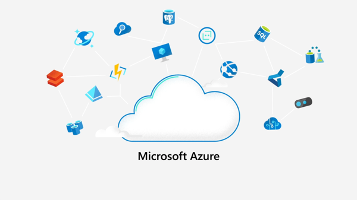

<!--
CO_OP_TRANSLATOR_METADATA:
{
  "original_hash": "4d8e7a066d75b625e7a979c14157041d",
  "translation_date": "2025-08-25T21:42:05+00:00",
  "source_file": "2-farm/lessons/4-migrate-your-plant-to-the-cloud/README.md",
  "language_code": "pt"
}
-->
# Migre a sua planta para a nuvem


> Ilustração por [Nitya Narasimhan](https://github.com/nitya). Clique na imagem para uma versão maior.

Esta lição foi ensinada como parte da série [IoT para Iniciantes - Agricultura Digital, Projeto 2](https://youtube.com/playlist?list=PLmsFUfdnGr3yCutmcVg6eAUEfsGiFXgcx) do [Microsoft Reactor](https://developer.microsoft.com/reactor/?WT.mc_id=academic-17441-jabenn).

[](https://youtu.be/bNxjopXkhvk)

## Questionário pré-aula

[Questionário pré-aula](https://black-meadow-040d15503.1.azurestaticapps.net/quiz/15)

## Introdução

Na última lição, aprendeu a conectar a sua planta a um broker MQTT e a controlar um relé a partir de código de servidor executado localmente. Isso forma o núcleo de um sistema automatizado de irrigação conectado à internet, usado desde plantas individuais em casa até grandes explorações agrícolas comerciais.

O dispositivo IoT comunicou-se com um broker MQTT público para demonstrar os princípios, mas esta não é a forma mais confiável ou segura. Nesta lição, aprenderá sobre a nuvem e as capacidades de IoT fornecidas por serviços de nuvem pública. Também aprenderá como migrar a sua planta para um desses serviços de nuvem a partir do broker MQTT público.

Nesta lição, abordaremos:

* [O que é a nuvem?](../../../../../2-farm/lessons/4-migrate-your-plant-to-the-cloud)
* [Criar uma subscrição na nuvem](../../../../../2-farm/lessons/4-migrate-your-plant-to-the-cloud)
* [Serviços de IoT na nuvem](../../../../../2-farm/lessons/4-migrate-your-plant-to-the-cloud)
* [Criar um serviço de IoT na nuvem](../../../../../2-farm/lessons/4-migrate-your-plant-to-the-cloud)
* [Comunicar com o IoT Hub](../../../../../2-farm/lessons/4-migrate-your-plant-to-the-cloud)
* [Conectar o seu dispositivo ao serviço de IoT](../../../../../2-farm/lessons/4-migrate-your-plant-to-the-cloud)

## O que é a nuvem?

Antes da nuvem, quando uma empresa queria fornecer serviços aos seus funcionários (como bases de dados ou armazenamento de ficheiros) ou ao público (como websites), construía e geria um centro de dados. Isso podia variar desde uma sala com poucos computadores até um edifício com muitos computadores. A empresa geria tudo, incluindo:

* Compra de computadores
* Manutenção de hardware
* Energia e refrigeração
* Rede
* Segurança, incluindo a segurança do edifício e do software nos computadores
* Instalação e atualização de software

Isso podia ser muito caro, exigir uma ampla gama de funcionários especializados e ser muito lento para mudar quando necessário. Por exemplo, se uma loja online precisasse de se preparar para uma época de férias movimentada, teria de planear meses antes para comprar mais hardware, configurá-lo, instalá-lo e instalar o software para gerir o processo de vendas. Após a época de férias terminar e as vendas diminuírem, ficariam com computadores pagos mas inativos até à próxima época movimentada.

✅ Acha que isso permitiria às empresas moverem-se rapidamente? Se uma loja de roupas online se tornasse popular de repente porque uma celebridade foi vista com as suas roupas, conseguiria aumentar rapidamente a capacidade computacional para suportar o aumento repentino de pedidos?

### O computador de outra pessoa

A nuvem é frequentemente referida de forma humorística como "o computador de outra pessoa". A ideia inicial era simples - em vez de comprar computadores, aluga-se o computador de outra pessoa. Outra pessoa, um fornecedor de computação em nuvem, geriria enormes centros de dados. Eles seriam responsáveis por comprar e instalar o hardware, gerir energia e refrigeração, rede, segurança do edifício, atualizações de hardware e software, tudo. Como cliente, aluga-se os computadores necessários, alugando mais conforme a procura aumenta e reduzindo o número alugado se a procura diminuir. Esses centros de dados na nuvem estão espalhados pelo mundo.


Esses centros de dados podem ter vários quilómetros quadrados de tamanho. As imagens acima foram tiradas há alguns anos num centro de dados na nuvem da Microsoft e mostram o tamanho inicial, juntamente com uma expansão planeada. A área limpa para a expansão tem mais de 5 quilómetros quadrados.

> 💁 Esses centros de dados requerem quantidades tão grandes de energia que alguns têm as suas próprias centrais elétricas. Devido ao seu tamanho e ao nível de investimento dos fornecedores de nuvem, geralmente são muito ecológicos. São mais eficientes do que grandes números de pequenos centros de dados, funcionam principalmente com energia renovável e os fornecedores de nuvem trabalham arduamente para reduzir desperdícios, cortar o uso de água e replantar florestas para compensar as que foram derrubadas para fornecer espaço para construir centros de dados. Pode ler mais sobre como um fornecedor de nuvem está a trabalhar na sustentabilidade no [site de sustentabilidade do Azure](https://azure.microsoft.com/global-infrastructure/sustainability/?WT.mc_id=academic-17441-jabenn).

✅ Faça uma pesquisa: Leia sobre as principais nuvens, como [Azure da Microsoft](https://azure.microsoft.com/?WT.mc_id=academic-17441-jabenn) ou [GCP da Google](https://cloud.google.com). Quantos centros de dados têm e onde estão localizados no mundo?

Usar a nuvem reduz os custos para as empresas e permite que se concentrem no que fazem melhor, deixando a especialização em computação na nuvem nas mãos do fornecedor. As empresas já não precisam de alugar ou comprar espaço em centros de dados, pagar a diferentes fornecedores por conectividade e energia ou contratar especialistas. Em vez disso, podem pagar uma única fatura mensal ao fornecedor de nuvem para que tudo seja tratado.

O fornecedor de nuvem pode então usar economias de escala para reduzir os custos, comprando computadores em grandes quantidades a preços mais baixos, investindo em ferramentas para reduzir o trabalho de manutenção e até projetando e construindo o seu próprio hardware para melhorar a oferta de nuvem.

### Microsoft Azure

Azure é a nuvem para desenvolvedores da Microsoft, e será a nuvem que usará nestas lições. O vídeo abaixo oferece uma breve visão geral do Azure:

[](https://www.microsoft.com/videoplayer/embed/RE4Ibng?WT.mc_id=academic-17441-jabenn)

## Criar uma subscrição na nuvem

Para usar serviços na nuvem, precisará de se inscrever numa subscrição com um fornecedor de nuvem. Para esta lição, inscrever-se-á numa subscrição do Microsoft Azure. Se já tiver uma subscrição do Azure, pode ignorar esta tarefa. Os detalhes da subscrição descritos aqui estão corretos no momento da escrita, mas podem mudar.

> 💁 Se estiver a aceder a estas lições através da sua escola, pode já ter uma subscrição do Azure disponível. Verifique com o seu professor.

Existem dois tipos diferentes de subscrição gratuita do Azure que pode inscrever-se:

* **Azure para Estudantes** - Esta é uma subscrição projetada para estudantes com 18 anos ou mais. Não precisa de um cartão de crédito para se inscrever e usa o endereço de email da sua escola para validar que é estudante. Ao inscrever-se, recebe US$100 para gastar em recursos na nuvem, juntamente com serviços gratuitos, incluindo uma versão gratuita de um serviço de IoT. Isso dura 12 meses e pode renovar todos os anos enquanto continuar a ser estudante.

* **Subscrição gratuita do Azure** - Esta é uma subscrição para qualquer pessoa que não seja estudante. Precisará de um cartão de crédito para se inscrever, mas o seu cartão não será cobrado, sendo usado apenas para verificar que é uma pessoa real, não um bot. Recebe $200 de crédito para usar nos primeiros 30 dias em qualquer serviço, juntamente com níveis gratuitos de serviços do Azure. Depois de usar o crédito, o seu cartão não será cobrado, a menos que converta para uma subscrição paga conforme o uso.

> 💁 A Microsoft oferece uma subscrição Azure para Estudantes Starter para estudantes com menos de 18 anos, mas no momento da escrita isso não suporta serviços de IoT.

### Tarefa - inscrever-se numa subscrição gratuita na nuvem

Se for estudante com 18 anos ou mais, pode inscrever-se numa subscrição Azure para Estudantes. Precisará de validar com um endereço de email da escola. Pode fazer isso de duas formas:

* Inscreva-se num pacote de desenvolvedor estudante do GitHub em [education.github.com/pack](https://education.github.com/pack). Isso dá-lhe acesso a uma variedade de ferramentas e ofertas, incluindo GitHub e Microsoft Azure. Depois de se inscrever no pacote de desenvolvedor, pode ativar a oferta Azure para Estudantes.

* Inscreva-se diretamente numa conta Azure para Estudantes em [azure.microsoft.com/free/students](https://azure.microsoft.com/free/students/?WT.mc_id=academic-17441-jabenn).

> ⚠️ Se o endereço de email da sua escola não for reconhecido, abra um [issue neste repositório](https://github.com/Microsoft/IoT-For-Beginners/issues) e veremos se pode ser adicionado à lista de permissões do Azure para Estudantes.

Se não for estudante ou não tiver um endereço de email válido da escola, pode inscrever-se numa subscrição gratuita do Azure.

* Inscreva-se numa subscrição gratuita do Azure em [azure.microsoft.com/free](https://azure.microsoft.com/free/?WT.mc_id=academic-17441-jabenn)

## Serviços de IoT na nuvem

O broker MQTT público de teste que tem usado é uma ótima ferramenta para aprender, mas tem várias desvantagens como ferramenta para uso comercial:

* Confiabilidade - é um serviço gratuito sem garantias e pode ser desligado a qualquer momento
* Segurança - é público, então qualquer pessoa pode ouvir a sua telemetria ou enviar comandos para controlar o seu hardware
* Desempenho - foi projetado para apenas algumas mensagens de teste, então não suportaria um grande volume de mensagens enviadas
* Descoberta - não há como saber quais dispositivos estão conectados

Os serviços de IoT na nuvem resolvem esses problemas. São mantidos por grandes fornecedores de nuvem que investem fortemente em confiabilidade e estão disponíveis para resolver quaisquer problemas que possam surgir. Têm segurança integrada para impedir que hackers leiam os seus dados ou enviem comandos maliciosos. Também têm alto desempenho, sendo capazes de lidar com muitos milhões de mensagens todos os dias, aproveitando a nuvem para escalar conforme necessário.

> 💁 Embora pague por essas vantagens com uma taxa mensal, a maioria dos fornecedores de nuvem oferece uma versão gratuita do seu serviço de IoT com um número limitado de mensagens por dia ou dispositivos que podem conectar-se. Essa versão gratuita geralmente é mais do que suficiente para um desenvolvedor aprender sobre o serviço. Nesta lição, usará uma versão gratuita.

Os dispositivos IoT conectam-se a um serviço na nuvem usando um SDK de dispositivo (uma biblioteca que fornece código para trabalhar com os recursos do serviço) ou diretamente através de um protocolo de comunicação como MQTT ou HTTP. O SDK de dispositivo geralmente é a rota mais fácil, pois lida com tudo para si, como saber quais tópicos publicar ou subscrever e como lidar com a segurança.


O seu dispositivo então comunica com outras partes da sua aplicação através deste serviço - semelhante à forma como enviou telemetria e recebeu comandos via MQTT. Isso geralmente é feito usando um SDK de serviço ou uma biblioteca semelhante. As mensagens vêm do seu dispositivo para o serviço, onde outros componentes da sua aplicação podem lê-las, e as mensagens podem ser enviadas de volta para o seu dispositivo.


Esses serviços implementam segurança ao conhecer todos os dispositivos que podem conectar-se e enviar dados, seja pré-registrando os dispositivos no serviço ou fornecendo aos dispositivos chaves secretas ou certificados que podem usar para se registrar no serviço na primeira vez que se conectarem. Dispositivos desconhecidos não conseguem conectar-se; se tentarem, o serviço rejeita a conexão e ignora as mensagens enviadas por eles.

✅ Faça uma pesquisa: Qual é a desvantagem de ter um serviço de IoT aberto onde qualquer dispositivo ou código pode conectar-se? Consegue encontrar exemplos específicos de hackers que tiraram proveito disso?

Outros componentes da sua aplicação podem conectar-se ao serviço de IoT e aprender sobre todos os dispositivos que estão conectados ou registrados, e comunicar com eles diretamente, seja em massa ou individualmente.
💁 Os serviços de IoT também implementam capacidades adicionais, e os fornecedores de cloud têm serviços e aplicações adicionais que podem ser ligados ao serviço. Por exemplo, se quiser armazenar todas as mensagens de telemetria enviadas por todos os dispositivos numa base de dados, geralmente basta alguns cliques na ferramenta de configuração do fornecedor de cloud para ligar o serviço a uma base de dados e transmitir os dados.
## Criar um serviço IoT na nuvem

Agora que tem uma subscrição do Azure, pode inscrever-se num serviço IoT. O serviço IoT da Microsoft chama-se Azure IoT Hub.


O vídeo abaixo oferece uma breve visão geral do Azure IoT Hub:

[](https://www.youtube.com/watch?v=smuZaZZXKsU)

> 🎥 Clique na imagem acima para assistir ao vídeo

✅ Dedique um momento para pesquisar e ler a visão geral do IoT Hub na [documentação do Microsoft IoT Hub](https://docs.microsoft.com/azure/iot-hub/about-iot-hub?WT.mc_id=academic-17441-jabenn).

Os serviços na nuvem disponíveis no Azure podem ser configurados através de um portal baseado na web ou de uma interface de linha de comando (CLI). Para esta tarefa, irá utilizar o CLI.

### Tarefa - instalar o Azure CLI

Para usar o Azure CLI, primeiro precisa de instalá-lo no seu PC ou Mac.

1. Siga as instruções na [documentação do Azure CLI](https://docs.microsoft.com/cli/azure/install-azure-cli?WT.mc_id=academic-17441-jabenn) para instalar o CLI.

1. O Azure CLI suporta várias extensões que adicionam capacidades para gerir uma ampla gama de serviços do Azure. Instale a extensão IoT executando o seguinte comando na sua linha de comando ou terminal:

    ```sh
    az extension add --name azure-iot
    ```

1. Na sua linha de comando ou terminal, execute o seguinte comando para iniciar sessão na sua subscrição do Azure a partir do Azure CLI.

    ```sh
    az login
    ```

    Uma página web será aberta no seu navegador padrão. Inicie sessão usando a conta que utilizou para se inscrever na sua subscrição do Azure. Depois de iniciar sessão, pode fechar o separador do navegador.

1. Se tiver várias subscrições do Azure, como uma fornecida pela escola e a sua própria subscrição do Azure para Estudantes, precisará de selecionar a que deseja usar. Execute o seguinte comando para listar todas as subscrições às quais tem acesso:

    ```sh
    az account list --output table
    ```

    Na saída, verá o nome de cada subscrição juntamente com o seu `SubscriptionId`.

    ```output
    ➜  ~ az account list --output table
    Name                    CloudName    SubscriptionId                        State    IsDefault
    ----------------------  -----------  ------------------------------------  -------  -----------
    School-subscription     AzureCloud   cb30cde9-814a-42f0-a111-754cb788e4e1  Enabled  True
    Azure for Students      AzureCloud   fa51c31b-162c-4599-add6-781def2e1fbf  Enabled  False
    ```

    Para selecionar a subscrição que deseja usar, utilize o seguinte comando:

    ```sh
    az account set --subscription <SubscriptionId>
    ```

    Substitua `<SubscriptionId>` pelo Id da subscrição que deseja usar. Depois de executar este comando, volte a executar o comando para listar as suas contas. Verá que a coluna `IsDefault` estará marcada como `True` para a subscrição que acabou de definir.

### Tarefa - criar um grupo de recursos

Os serviços do Azure, como instâncias do IoT Hub, máquinas virtuais, bases de dados ou serviços de IA, são referidos como **recursos**. Cada recurso precisa de estar dentro de um **Grupo de Recursos**, uma agrupação lógica de um ou mais recursos.

> 💁 Usar grupos de recursos significa que pode gerir vários serviços de uma só vez. Por exemplo, depois de concluir todas as lições deste projeto, pode eliminar o grupo de recursos, e todos os recursos nele serão eliminados automaticamente.

1. Existem vários centros de dados do Azure em todo o mundo, divididos em regiões. Quando cria um recurso ou grupo de recursos no Azure, precisa de especificar onde deseja que seja criado. Execute o seguinte comando para obter a lista de localizações:

    ```sh
    az account list-locations --output table
    ```

    Verá uma lista de localizações. Esta lista será longa.

    > 💁 No momento da escrita, existem 65 localizações onde pode fazer a implementação.

    ```output
        ➜  ~ az account list-locations --output table
    DisplayName               Name                 RegionalDisplayName
    ------------------------  -------------------  -------------------------------------
    East US                   eastus               (US) East US
    East US 2                 eastus2              (US) East US 2
    South Central US          southcentralus       (US) South Central US
    ...
    ```

    Anote o valor da coluna `Name` da região mais próxima de si. Pode encontrar as regiões num mapa na [página de geografias do Azure](https://azure.microsoft.com/global-infrastructure/geographies/?WT.mc_id=academic-17441-jabenn).

1. Execute o seguinte comando para criar um grupo de recursos chamado `soil-moisture-sensor`. Os nomes dos grupos de recursos precisam de ser únicos na sua subscrição.

    ```sh
    az group create --name soil-moisture-sensor \
                    --location <location>
    ```

    Substitua `<location>` pela localização que selecionou no passo anterior.

### Tarefa - criar um IoT Hub

Agora pode criar um recurso IoT Hub no seu grupo de recursos.

1. Utilize o seguinte comando para criar o recurso IoT Hub:

    ```sh
    az iot hub create --resource-group soil-moisture-sensor \
                      --sku F1 \
                      --partition-count 2 \
                      --name <hub_name>
    ```

    Substitua `<hub_name>` por um nome para o seu hub. Este nome precisa de ser globalmente único - ou seja, nenhum outro IoT Hub criado por qualquer pessoa pode ter o mesmo nome. Este nome é usado num URL que aponta para o hub, por isso precisa de ser único. Use algo como `soil-moisture-sensor-` e adicione um identificador único no final, como algumas palavras aleatórias ou o seu nome.

    A opção `--sku F1` indica que será utilizado o nível gratuito. O nível gratuito suporta 8.000 mensagens por dia, juntamente com a maioria das funcionalidades dos níveis pagos.

    > 🎓 Diferentes níveis de preços dos serviços do Azure são referidos como tiers. Cada tier tem um custo diferente e oferece diferentes funcionalidades ou volumes de dados.

    > 💁 Se quiser saber mais sobre preços, pode consultar o [guia de preços do Azure IoT Hub](https://azure.microsoft.com/pricing/details/iot-hub/?WT.mc_id=academic-17441-jabenn).

    A opção `--partition-count 2` define quantos fluxos de dados o IoT Hub suporta; mais partições reduzem bloqueios de dados quando várias entidades lêem e escrevem no IoT Hub. Partições estão fora do âmbito destas lições, mas este valor precisa de ser definido para criar um IoT Hub no nível gratuito.

    > 💁 Só pode ter um IoT Hub no nível gratuito por subscrição.

O IoT Hub será criado. Pode levar um minuto ou mais para ser concluído.

## Comunicar com o IoT Hub

Na lição anterior, utilizou MQTT e enviou mensagens de ida e volta em diferentes tópicos, com os diferentes tópicos tendo diferentes propósitos. Em vez de enviar mensagens por diferentes tópicos, o IoT Hub tem várias formas definidas para o dispositivo comunicar com o Hub, ou para o Hub comunicar com o dispositivo.

> 💁 Por baixo, esta comunicação entre o IoT Hub e o seu dispositivo pode usar MQTT, HTTPS ou AMQP.

* Mensagens de dispositivo para nuvem (D2C) - estas são mensagens enviadas de um dispositivo para o IoT Hub, como telemetria. Elas podem ser lidas do IoT Hub pelo código da sua aplicação.

    > 🎓 Por baixo, o IoT Hub utiliza um serviço do Azure chamado [Event Hubs](https://docs.microsoft.com/azure/event-hubs/?WT.mc_id=academic-17441-jabenn). Quando escreve código para ler mensagens enviadas para o hub, estas são frequentemente chamadas de eventos.

* Mensagens de nuvem para dispositivo (C2D) - estas são mensagens enviadas pelo código da aplicação, através de um IoT Hub para um dispositivo IoT.

* Pedidos de métodos diretos - estas são mensagens enviadas pelo código da aplicação através de um IoT Hub para um dispositivo IoT para solicitar que o dispositivo faça algo, como controlar um atuador. Estas mensagens requerem uma resposta para que o código da aplicação possa saber se foram processadas com sucesso.

* Twins de dispositivos - estes são documentos JSON mantidos sincronizados entre o dispositivo e o IoT Hub, e são usados para armazenar configurações ou outras propriedades relatadas pelo dispositivo ou que devem ser definidas no dispositivo (conhecidas como desejadas) pelo IoT Hub.

O IoT Hub pode armazenar mensagens e pedidos de métodos diretos por um período de tempo configurável (por padrão, um dia), então, se um dispositivo ou código da aplicação perder a conexão, ainda pode recuperar mensagens enviadas enquanto estava offline após reconectar-se. Os twins de dispositivos são mantidos permanentemente no IoT Hub, então, a qualquer momento, um dispositivo pode reconectar-se e obter o twin de dispositivo mais recente.

✅ Faça uma pesquisa: Leia mais sobre estes tipos de mensagens na [orientação de comunicações de dispositivo para nuvem](https://docs.microsoft.com/azure/iot-hub/iot-hub-devguide-d2c-guidance?WT.mc_id=academic-17441-jabenn) e na [orientação de comunicações de nuvem para dispositivo](https://docs.microsoft.com/azure/iot-hub/iot-hub-devguide-c2d-guidance?WT.mc_id=academic-17441-jabenn) na documentação do IoT Hub.

## Conectar o seu dispositivo ao serviço IoT

Depois de criar o hub, o seu dispositivo IoT pode conectar-se a ele. Apenas dispositivos registados podem conectar-se a um serviço, então precisará de registar o seu dispositivo primeiro. Quando o regista, pode obter uma string de conexão que o dispositivo pode usar para se conectar. Esta string de conexão é específica do dispositivo e contém informações sobre o IoT Hub, o dispositivo e uma chave secreta que permitirá que este dispositivo se conecte.

> 🎓 Uma string de conexão é um termo genérico para um pedaço de texto que contém detalhes de conexão. Estas são usadas ao conectar-se a IoT Hubs, bases de dados e muitos outros serviços. Geralmente consistem num identificador para o serviço, como um URL, e informações de segurança, como uma chave secreta. Estas são passadas para SDKs para se conectar ao serviço.

> ⚠️ As strings de conexão devem ser mantidas seguras! A segurança será abordada em mais detalhe numa lição futura.

### Tarefa - registar o seu dispositivo IoT

O dispositivo IoT pode ser registado no seu IoT Hub usando o Azure CLI.

1. Execute o seguinte comando para registar um dispositivo:

    ```sh
    az iot hub device-identity create --device-id soil-moisture-sensor \
                                      --hub-name <hub_name>
    ```

    Substitua `<hub_name>` pelo nome que utilizou para o seu IoT Hub.

    Isto criará um dispositivo com um ID de `soil-moisture-sensor`.

1. Quando o seu dispositivo IoT se conecta ao seu IoT Hub usando o SDK, precisa de usar uma string de conexão que fornece o URL do hub, juntamente com uma chave secreta. Execute o seguinte comando para obter a string de conexão:

    ```sh
    az iot hub device-identity connection-string show --device-id soil-moisture-sensor \
                                                      --output table \
                                                      --hub-name <hub_name>
    ```

    Substitua `<hub_name>` pelo nome que utilizou para o seu IoT Hub.

1. Guarde a string de conexão que aparece na saída, pois precisará dela mais tarde.

### Tarefa - conectar o seu dispositivo IoT à nuvem

Siga o guia relevante para conectar o seu dispositivo IoT à nuvem:

* [Arduino - Wio Terminal](wio-terminal-connect-hub.md)
* [Computador de placa única - Raspberry Pi/Dispositivo IoT Virtual](single-board-computer-connect-hub.md)

### Tarefa - monitorizar eventos

Por enquanto, não irá atualizar o código do servidor. Em vez disso, pode usar o Azure CLI para monitorizar eventos do seu dispositivo IoT.

1. Certifique-se de que o seu dispositivo IoT está a funcionar e a enviar valores de telemetria de humidade do solo.

1. Execute o seguinte comando no seu prompt de comando ou terminal para monitorizar mensagens enviadas ao seu IoT Hub:

    ```sh
    az iot hub monitor-events --hub-name <hub_name>
    ```

    Substitua `<hub_name>` pelo nome que utilizou para o seu IoT Hub.

    Verá mensagens aparecerem na saída do console à medida que são enviadas pelo seu dispositivo IoT.

    ```output
    Starting event monitor, use ctrl-c to stop...
    {
        "event": {
            "origin": "soil-moisture-sensor",
            "module": "",
            "interface": "",
            "component": "",
            "payload": "{\"soil_moisture\": 376}"
        }
    },
    {
        "event": {
            "origin": "soil-moisture-sensor",
            "module": "",
            "interface": "",
            "component": "",
            "payload": "{\"soil_moisture\": 381}"
        }
    }
    ```

    O conteúdo do `payload` corresponderá à mensagem enviada pelo seu dispositivo IoT.

    > No momento da escrita, a extensão `az iot` não está totalmente funcional em dispositivos Apple Silicon. Se estiver a usar um dispositivo Apple Silicon, precisará de monitorizar as mensagens de outra forma, como usando as [Ferramentas Azure IoT para Visual Studio Code](https://docs.microsoft.com/en-us/azure/iot-hub/iot-hub-vscode-iot-toolkit-cloud-device-messaging).

1. Estas mensagens têm várias propriedades anexadas automaticamente, como o carimbo de data/hora em que foram enviadas. Estas são conhecidas como *anotações*. Para visualizar todas as anotações das mensagens, use o seguinte comando:

    ```sh
    az iot hub monitor-events --properties anno --hub-name <hub_name>
    ```

    Substitua `<hub_name>` pelo nome que utilizou para o seu IoT Hub.

    Verá mensagens aparecerem na saída do console à medida que são enviadas pelo seu dispositivo IoT.

    ```output
    Starting event monitor, use ctrl-c to stop...
    {
        "event": {
            "origin": "soil-moisture-sensor",
            "module": "",
            "interface": "",
            "component": "",
            "properties": {},
            "annotations": {
                "iothub-connection-device-id": "soil-moisture-sensor",
                "iothub-connection-auth-method": "{\"scope\":\"device\",\"type\":\"sas\",\"issuer\":\"iothub\",\"acceptingIpFilterRule\":null}",
                "iothub-connection-auth-generation-id": "637553997165220462",
                "iothub-enqueuedtime": 1619976150288,
                "iothub-message-source": "Telemetry",
                "x-opt-sequence-number": 1379,
                "x-opt-offset": "550576",
                "x-opt-enqueued-time": 1619976150277
            },
            "payload": "{\"soil_moisture\": 381}"
        }
    }
    ```

    Os valores de tempo nas anotações estão em [tempo UNIX](https://wikipedia.org/wiki/Unix_time), representando o número de segundos desde a meia-noite de 1 de janeiro de 1970.

    Saia do monitor de eventos quando terminar.

### Tarefa - controlar o seu dispositivo IoT

Também pode usar o Azure CLI para chamar métodos diretos no seu dispositivo IoT.

1. Execute o seguinte comando no seu prompt de comando ou terminal para invocar o método `relay_on` no dispositivo IoT:

    ```sh
    az iot hub invoke-device-method --device-id soil-moisture-sensor \
                                    --method-name relay_on \
                                    --method-payload '{}' \
                                    --hub-name <hub_name>
    ```

    Substitua `
<hub_name>
` com o nome que utilizou para o seu IoT Hub.

    Isto envia um pedido de método direto para o método especificado por `method-name`. Os métodos diretos podem receber um payload contendo dados para o método, e este pode ser especificado no parâmetro `method-payload` como JSON.

    Verá o relé ligar-se e a saída correspondente do seu dispositivo IoT:

    ```output
    Direct method received -  relay_on
    ```

1. Repita o passo acima, mas defina o `--method-name` como `relay_off`. Verá o relé desligar-se e a saída correspondente do dispositivo IoT.

---

## 🚀 Desafio

O nível gratuito do IoT Hub permite 8.000 mensagens por dia. O código que escreveu envia mensagens de telemetria a cada 10 segundos. Quantas mensagens por dia são enviadas com uma mensagem a cada 10 segundos?

Pense na frequência com que as medições de humidade do solo devem ser enviadas. Como pode alterar o seu código para permanecer dentro do limite do nível gratuito e verificar com a frequência necessária, mas sem exagerar? E se quisesse adicionar um segundo dispositivo?

## Questionário pós-aula

[Questionário pós-aula](https://black-meadow-040d15503.1.azurestaticapps.net/quiz/16)

## Revisão e Estudo Individual

O SDK do IoT Hub é open source tanto para Arduino como para Python. Nos repositórios de código no GitHub, existem vários exemplos que mostram como trabalhar com diferentes funcionalidades do IoT Hub.

* Se estiver a usar um Wio Terminal, consulte os [exemplos de Arduino no GitHub](https://github.com/Azure/azure-iot-pal-arduino/tree/master/pal/samples)
* Se estiver a usar um Raspberry Pi ou um dispositivo virtual, consulte os [exemplos de Python no GitHub](https://github.com/Azure/azure-iot-sdk-python/tree/master/azure-iot-hub/samples)

## Tarefa

[Saiba mais sobre serviços na cloud](assignment.md)

**Aviso Legal**:  
Este documento foi traduzido utilizando o serviço de tradução por IA [Co-op Translator](https://github.com/Azure/co-op-translator). Embora nos esforcemos para garantir a precisão, é importante notar que traduções automáticas podem conter erros ou imprecisões. O documento original na sua língua nativa deve ser considerado a fonte autoritária. Para informações críticas, recomenda-se a tradução profissional realizada por humanos. Não nos responsabilizamos por quaisquer mal-entendidos ou interpretações incorretas decorrentes do uso desta tradução.