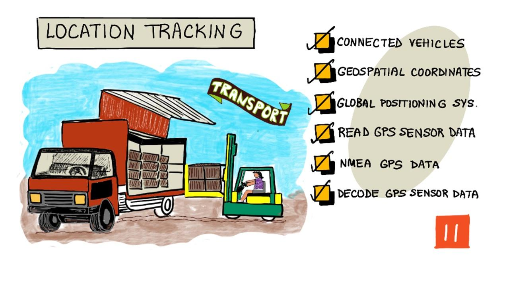

<!--
CO_OP_TRANSLATOR_METADATA:
{
  "original_hash": "52ed2bd997d08040f79a1a6ef2bac958",
  "translation_date": "2025-08-25T22:58:24+00:00",
  "source_file": "3-transport/lessons/1-location-tracking/README.md",
  "language_code": "pt"
}
-->
# Localização de veículos

> Ilustração por [Nitya Narasimhan](https://github.com/nitya). Clique na imagem para uma versão maior.

## Questionário pré-aula

[Questionário pré-aula](https://black-meadow-040d15503.1.azurestaticapps.net/quiz/21)

## Introdução

O processo principal para levar alimentos de um agricultor até um consumidor envolve carregar caixas de produtos em camiões, navios, aviões ou outros veículos de transporte comercial, e entregar os alimentos em algum lugar - seja diretamente a um cliente, ou a um centro de distribuição ou armazém para processamento. Todo o processo de ponta a ponta, desde a fazenda até o consumidor, faz parte de um processo chamado *cadeia de abastecimento*. O vídeo abaixo, da W. P. Carey School of Business da Universidade Estadual do Arizona, explica o conceito de cadeia de abastecimento e como ela é gerida em mais detalhe.

> 🎥 Clique na imagem acima para assistir ao vídeo

A adição de dispositivos IoT pode melhorar drasticamente a sua cadeia de abastecimento, permitindo gerir onde os itens estão, planear melhor o transporte e o manuseamento de mercadorias, e responder mais rapidamente a problemas.

Ao gerir uma frota de veículos, como camiões, é útil saber onde cada veículo está em determinado momento. Os veículos podem ser equipados com sensores GPS que enviam a sua localização para sistemas IoT, permitindo aos proprietários localizar os veículos, ver o percurso realizado e saber quando chegarão ao destino. A maioria dos veículos opera fora da cobertura Wi-Fi, por isso utilizam redes móveis para enviar este tipo de dados. Por vezes, o sensor GPS está integrado em dispositivos IoT mais complexos, como livros de registo eletrónicos. Estes dispositivos monitorizam quanto tempo um camião esteve em trânsito para garantir que os condutores cumprem as leis locais sobre horas de trabalho.

Nesta lição, aprenderá como rastrear a localização de um veículo utilizando um sensor de Sistema de Posicionamento Global (GPS).

Nesta lição, abordaremos:

* [Veículos conectados](../../../../../3-transport/lessons/1-location-tracking)
* [Coordenadas geoespaciais](../../../../../3-transport/lessons/1-location-tracking)
* [Sistemas de Posicionamento Global (GPS)](../../../../../3-transport/lessons/1-location-tracking)
* [Ler dados de sensores GPS](../../../../../3-transport/lessons/1-location-tracking)
* [Dados GPS NMEA](../../../../../3-transport/lessons/1-location-tracking)
* [Decodificar dados de sensores GPS](../../../../../3-transport/lessons/1-location-tracking)

## Veículos conectados

A IoT está a transformar a forma como as mercadorias são transportadas, criando frotas de *veículos conectados*. Estes veículos estão ligados a sistemas de TI centrais, reportando informações sobre a sua localização e outros dados de sensores. Ter uma frota de veículos conectados oferece uma ampla gama de benefícios:

* Rastreio de localização - pode localizar um veículo a qualquer momento, permitindo:

  * Receber alertas quando um veículo está prestes a chegar ao destino, para preparar a equipa para o descarregamento
  * Localizar veículos roubados
  * Combinar dados de localização e rota com problemas de trânsito para redirecionar veículos durante a viagem
  * Cumprir obrigações fiscais. Alguns países cobram taxas aos veículos com base na quilometragem percorrida em estradas públicas (como o [RUC da Nova Zelândia](https://www.nzta.govt.nz/vehicles/licensing-rego/road-user-charges/)), por isso, saber quando um veículo está em estradas públicas versus privadas facilita o cálculo dos impostos devidos.
  * Saber onde enviar equipas de manutenção em caso de avaria

* Telemetria do condutor - garantir que os condutores respeitam os limites de velocidade, fazem curvas a velocidades adequadas, travam de forma eficiente e conduzem com segurança. Veículos conectados também podem ter câmaras para gravar incidentes. Isto pode ser associado a seguros, oferecendo tarifas reduzidas para bons condutores.

* Conformidade com horas de condução - garantir que os condutores conduzem apenas durante as horas legalmente permitidas, com base nos horários em que ligam e desligam o motor.

Estes benefícios podem ser combinados - por exemplo, combinar a conformidade com horas de condução com o rastreio de localização para redirecionar condutores caso não consigam chegar ao destino dentro das horas permitidas. Também podem ser combinados com outras telemetrias específicas do veículo, como dados de temperatura de camiões com controlo de temperatura, permitindo redirecionar veículos se a rota atual comprometer a manutenção da temperatura das mercadorias.

> 🎓 Logística é o processo de transporte de mercadorias de um local para outro, como de uma fazenda para um supermercado, passando por um ou mais armazéns. Um agricultor embala caixas de tomates que são carregadas num camião, entregues a um armazém central e colocadas num segundo camião que pode conter uma mistura de diferentes tipos de produtos, que são então entregues a um supermercado.

O componente principal do rastreio de veículos é o GPS - sensores que podem localizar a sua posição em qualquer lugar da Terra. Nesta lição, aprenderá a usar um sensor GPS, começando por aprender como definir uma localização na Terra.

## Coordenadas geoespaciais

As coordenadas geoespaciais são usadas para definir pontos na superfície da Terra, de forma semelhante a como as coordenadas podem ser usadas para desenhar um pixel num ecrã de computador ou posicionar pontos num bordado. Para um único ponto, tem-se um par de coordenadas. Por exemplo, o Campus da Microsoft em Redmond, Washington, EUA, está localizado em 47.6423109, -122.1390293.

### Latitude e longitude

A Terra é uma esfera - um círculo tridimensional. Por isso, os pontos são definidos dividindo-a em 360 graus, o mesmo que a geometria dos círculos. A latitude mede o número de graus de norte a sul, e a longitude mede o número de graus de leste a oeste.

> 💁 Ninguém sabe ao certo a razão original para os círculos serem divididos em 360 graus. A [página sobre graus (ângulo) na Wikipédia](https://wikipedia.org/wiki/Degree_(angle)) aborda algumas das possíveis razões.

A latitude é medida usando linhas que circundam a Terra e correm paralelas ao equador, dividindo os hemisférios Norte e Sul em 90° cada. O equador está a 0°, o Polo Norte está a 90°, também conhecido como 90° Norte, e o Polo Sul está a -90°, ou 90° Sul.

A longitude é medida como o número de graus a leste e oeste. A origem de 0° da longitude é chamada de *Meridiano Principal* e foi definida em 1884 como uma linha do Polo Norte ao Polo Sul que passa pelo [Observatório Real Britânico em Greenwich, Inglaterra](https://wikipedia.org/wiki/Royal_Observatory,_Greenwich).

> 🎓 Um meridiano é uma linha imaginária reta que vai do Polo Norte ao Polo Sul, formando um semicírculo.

Para medir a longitude de um ponto, mede-se o número de graus ao longo do equador, desde o Meridiano Principal até um meridiano que passa por esse ponto. A longitude varia de -180°, ou 180° Oeste, passando por 0° no Meridiano Principal, até 180°, ou 180° Este. 180° e -180° referem-se ao mesmo ponto, o antimeridiano ou 180º meridiano. Este é um meridiano no lado oposto da Terra em relação ao Meridiano Principal.

> 💁 O antimeridiano não deve ser confundido com a Linha Internacional de Data, que está aproximadamente na mesma posição, mas não é uma linha reta e varia para se ajustar às fronteiras geopolíticas.

✅ Faça uma pesquisa: Tente encontrar a latitude e longitude da sua localização atual.

### Graus, minutos e segundos vs graus decimais

Tradicionalmente, as medições de graus de latitude e longitude eram feitas usando numeração sexagesimal, ou base-60, um sistema de numeração usado pelos antigos babilónios, que fizeram as primeiras medições e registos de tempo e distância. Provavelmente usa o sistema sexagesimal todos os dias sem perceber - dividindo horas em 60 minutos e minutos em 60 segundos.

A longitude e a latitude são medidas em graus, minutos e segundos, com um minuto sendo 1/60 de um grau, e 1 segundo sendo 1/60 de um minuto.

Por exemplo, no equador:

* 1° de latitude é **111,3 quilómetros**
* 1 minuto de latitude é 111,3/60 = **1,855 quilómetros**
* 1 segundo de latitude é 1,855/60 = **0,031 quilómetros**

O símbolo para um minuto é uma aspa simples, para um segundo é uma aspa dupla. Por exemplo, 2 graus, 17 minutos e 43 segundos seriam escritos como 2°17'43". Partes de segundos são dadas como decimais, por exemplo, meio segundo é 0°0'0,5".

Os computadores não trabalham em base-60, por isso estas coordenadas são dadas como graus decimais ao usar dados GPS na maioria dos sistemas informáticos. Por exemplo, 2°17'43" é 2,295277. O símbolo de grau geralmente é omitido.

As coordenadas de um ponto são sempre dadas como `latitude, longitude`, então o exemplo anterior do Campus da Microsoft em 47.6423109,-122.117198 tem:

* Uma latitude de 47.6423109 (47.6423109 graus ao norte do equador)
* Uma longitude de -122.1390293 (122.1390293 graus a oeste do Meridiano Principal).

## Sistemas de Posicionamento Global (GPS)

Os sistemas GPS utilizam múltiplos satélites em órbita da Terra para localizar a sua posição. Provavelmente já utilizou sistemas GPS sem sequer perceber - para encontrar a sua localização numa aplicação de mapas no telemóvel, como Apple Maps ou Google Maps, para ver onde está o seu transporte numa aplicação como Uber ou Bolt, ou ao usar navegação por satélite (sat-nav) no carro.

> 🎓 Os satélites na 'navegação por satélite' são satélites GPS!

Os sistemas GPS funcionam com vários satélites que enviam um sinal com a posição atual de cada satélite e um carimbo de tempo preciso. Estes sinais são enviados por ondas de rádio e detetados por uma antena no sensor GPS. Um sensor GPS deteta estes sinais e, utilizando o tempo atual, mede quanto tempo o sinal demorou a chegar ao sensor a partir do satélite. Como a velocidade das ondas de rádio é constante, o sensor GPS pode usar o carimbo de tempo enviado para calcular a distância entre o sensor e o satélite. Combinando os dados de pelo menos 3 satélites com as posições enviadas, o sensor GPS consegue determinar a sua localização na Terra.

> 💁 Os sensores GPS precisam de antenas para detetar ondas de rádio. As antenas integradas em camiões e carros com GPS incorporado são posicionadas para obter um bom sinal, geralmente no para-brisas ou no teto. Se estiver a usar um sistema GPS separado, como um smartphone ou um dispositivo IoT, deve garantir que a antena integrada no sistema GPS ou telemóvel tem uma visão desobstruída do céu, como estar montada no para-brisas.

Os satélites GPS estão a orbitar a Terra, não num ponto fixo acima do sensor, por isso os dados de localização incluem altitude acima do nível do mar, bem como latitude e longitude.

O GPS costumava ter limitações de precisão impostas pelos militares dos EUA, limitando a precisão a cerca de 5 metros. Esta limitação foi removida em 2000, permitindo uma precisão de 30 centímetros. No entanto, alcançar esta precisão nem sempre é possível devido a interferências nos sinais.

✅ Se tiver um smartphone, abra a aplicação de mapas e veja quão precisa é a sua localização. Pode demorar um pouco para o telemóvel detetar vários satélites e obter uma localização mais precisa.
💁 Os satélites possuem relógios atómicos extremamente precisos, mas sofrem um desvio de 38 microssegundos (0,0000038 segundos) por dia em comparação com os relógios atómicos na Terra, devido à desaceleração do tempo à medida que a velocidade aumenta, conforme previsto pelas teorias da relatividade especial e geral de Einstein - os satélites deslocam-se mais rapidamente do que a rotação da Terra. Este desvio foi utilizado para comprovar as previsões da relatividade especial e geral e precisa de ser ajustado no design dos sistemas GPS. Literalmente, o tempo passa mais devagar num satélite GPS.
Os sistemas GPS foram desenvolvidos e implementados por vários países e uniões políticas, incluindo os EUA, Rússia, Japão, Índia, UE e China. Os sensores GPS modernos podem conectar-se à maioria destes sistemas para obter localizações mais rápidas e precisas.

> 🎓 Os grupos de satélites em cada implementação são chamados de constelações.

## Ler dados do sensor GPS

A maioria dos sensores GPS envia dados GPS através de UART.

> ⚠️ UART foi abordado no [projeto 2, lição 2](../../../2-farm/lessons/2-detect-soil-moisture/README.md#universal-asynchronous-receiver-transmitter-uart). Consulte essa lição novamente, se necessário.

Pode utilizar um sensor GPS no seu dispositivo IoT para obter dados GPS.

### Tarefa - conectar um sensor GPS e ler dados GPS

Siga o guia relevante para ler dados GPS usando o seu dispositivo IoT:

* [Arduino - Wio Terminal](wio-terminal-gps-sensor.md)
* [Computador de placa única - Raspberry Pi](pi-gps-sensor.md)
* [Computador de placa única - Dispositivo virtual](virtual-device-gps-sensor.md)

## Dados GPS NMEA

Quando executou o seu código, pode ter visto algo que parece ser um conjunto de caracteres sem sentido na saída. Na verdade, trata-se de dados GPS padrão, e tudo tem um significado.

Os sensores GPS produzem dados usando mensagens NMEA, de acordo com o padrão NMEA 0183. NMEA é um acrónimo para a [National Marine Electronics Association](https://www.nmea.org), uma organização comercial sediada nos EUA que define padrões para comunicação entre dispositivos eletrónicos marítimos.

> 💁 Este padrão é proprietário e custa pelo menos 2.000 USD, mas há informações suficientes no domínio público para que a maior parte do padrão tenha sido revertida e possa ser usada em código open source e outros projetos não comerciais.

Estas mensagens são baseadas em texto. Cada mensagem consiste numa *frase* que começa com o caractere `$`, seguido por 2 caracteres que indicam a origem da mensagem (por exemplo, GP para o sistema GPS dos EUA, GN para o GLONASS, o sistema GPS russo) e 3 caracteres que indicam o tipo de mensagem. O restante da mensagem é composto por campos separados por vírgulas, terminando com um caractere de nova linha.

Alguns dos tipos de mensagens que podem ser recebidas são:

| Tipo | Descrição |
| ---- | --------- |
| GGA | Dados de Fixação GPS, incluindo a latitude, longitude e altitude do sensor GPS, juntamente com o número de satélites visíveis para calcular esta fixação. |
| ZDA | A data e hora atuais, incluindo o fuso horário local. |
| GSV | Detalhes dos satélites visíveis - definidos como os satélites dos quais o sensor GPS consegue detetar sinais. |

> 💁 Os dados GPS incluem carimbos de data e hora, permitindo que o seu dispositivo IoT obtenha a hora, se necessário, a partir de um sensor GPS, em vez de depender de um servidor NTP ou de um relógio interno em tempo real.

A mensagem GGA inclui a localização atual no formato `(dd)dmm.mmmm`, juntamente com um único caractere para indicar a direção. O `d` no formato representa graus, o `m` representa minutos, com os segundos como decimais dos minutos. Por exemplo, 2°17'43" seria 217.716666667 - 2 graus, 17.716666667 minutos.

O caractere de direção pode ser `N` ou `S` para latitude, indicando norte ou sul, e `E` ou `W` para longitude, indicando este ou oeste. Por exemplo, uma latitude de 2°17'43" teria um caractere de direção `N`, enquanto -2°17'43" teria um caractere de direção `S`.

Por exemplo - a frase NMEA `$GNGGA,020604.001,4738.538654,N,12208.341758,W,1,3,,164.7,M,-17.1,M,,*67`

* A parte da latitude é `4738.538654,N`, que se converte para 47.6423109 em graus decimais. `4738.538654` é 47.6423109, e a direção é `N` (norte), portanto, é uma latitude positiva.

* A parte da longitude é `12208.341758,W`, que se converte para -122.1390293 em graus decimais. `12208.341758` é 122.1390293°, e a direção é `W` (oeste), portanto, é uma longitude negativa.

## Decodificar dados do sensor GPS

Em vez de usar os dados NMEA brutos, é melhor decodificá-los para um formato mais útil. Existem várias bibliotecas open source que pode usar para ajudar a extrair dados úteis das mensagens NMEA brutas.

### Tarefa - decodificar dados do sensor GPS

Siga o guia relevante para decodificar dados do sensor GPS usando o seu dispositivo IoT:

* [Arduino - Wio Terminal](wio-terminal-gps-decode.md)
* [Computador de placa única - Raspberry Pi/Dispositivo IoT virtual](single-board-computer-gps-decode.md)

---

## 🚀 Desafio

Escreva o seu próprio decodificador NMEA! Em vez de depender de bibliotecas de terceiros para decodificar frases NMEA, consegue escrever o seu próprio decodificador para extrair latitude e longitude das frases NMEA?

## Questionário pós-aula

[Questionário pós-aula](https://black-meadow-040d15503.1.azurestaticapps.net/quiz/22)

## Revisão e Autoestudo

* Leia mais sobre Coordenadas Geoespaciais na [página do sistema de coordenadas geográficas na Wikipedia](https://wikipedia.org/wiki/Geographic_coordinate_system).
* Leia sobre os Meridianos de Referência em outros corpos celestes além da Terra na [página do Meridiano de Referência na Wikipedia](https://wikipedia.org/wiki/Prime_meridian#Prime_meridian_on_other_planetary_bodies).
* Pesquise os vários sistemas GPS diferentes de vários governos e uniões políticas mundiais, como a UE, Japão, Rússia, Índia e EUA.

## Tarefa

[Investigar outros dados GPS](assignment.md)

**Aviso Legal**:  
Este documento foi traduzido utilizando o serviço de tradução por IA [Co-op Translator](https://github.com/Azure/co-op-translator). Embora nos esforcemos para garantir a precisão, esteja ciente de que traduções automáticas podem conter erros ou imprecisões. O documento original na sua língua nativa deve ser considerado a fonte autoritária. Para informações críticas, recomenda-se uma tradução profissional realizada por humanos. Não nos responsabilizamos por quaisquer mal-entendidos ou interpretações incorretas decorrentes do uso desta tradução.