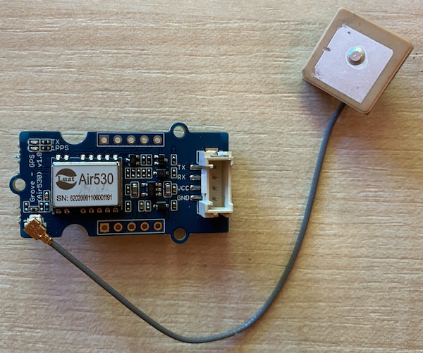

<!--
CO_OP_TRANSLATOR_METADATA:
{
  "original_hash": "3b2448c7ab4e9673e77e35a50c5e350d",
  "translation_date": "2025-08-25T23:01:58+00:00",
  "source_file": "3-transport/lessons/1-location-tracking/pi-gps-sensor.md",
  "language_code": "pt"
}
-->
# Ler dados de GPS - Raspberry Pi

Nesta parte da lição, vais adicionar um sensor GPS ao teu Raspberry Pi e ler os valores obtidos.

## Hardware

O Raspberry Pi necessita de um sensor GPS.

O sensor que vais utilizar é o [sensor Grove GPS Air530](https://www.seeedstudio.com/Grove-GPS-Air530-p-4584.html). Este sensor pode conectar-se a múltiplos sistemas GPS para obter uma localização rápida e precisa. O sensor é composto por 2 partes - a eletrónica principal do sensor e uma antena externa conectada por um fio fino para captar as ondas de rádio dos satélites.

Este é um sensor UART, o que significa que envia dados GPS através de UART.

## Conectar o sensor GPS

O sensor Grove GPS pode ser conectado ao Raspberry Pi.

### Tarefa - conectar o sensor GPS

Conecta o sensor GPS.



1. Insere uma extremidade de um cabo Grove na entrada do sensor GPS. O cabo só encaixa de uma forma.

1. Com o Raspberry Pi desligado, conecta a outra extremidade do cabo Grove à entrada UART marcada como **UART** no Grove Base Hat ligado ao Pi. Esta entrada está na fila do meio, no lado mais próximo da ranhura do cartão SD, oposto às portas USB e à entrada Ethernet.

    

1. Posiciona o sensor GPS de forma que a antena conectada tenha visibilidade para o céu - idealmente junto a uma janela aberta ou no exterior. É mais fácil obter um sinal claro sem obstruções à antena.

## Programar o sensor GPS

Agora podes programar o Raspberry Pi para utilizar o sensor GPS conectado.

### Tarefa - programar o sensor GPS

Programa o dispositivo.

1. Liga o Pi e espera que ele inicie.

1. O sensor GPS tem 2 LEDs - um LED azul que pisca quando os dados são transmitidos e um LED verde que pisca a cada segundo ao receber dados dos satélites. Certifica-te de que o LED azul está a piscar quando ligas o Pi. Após alguns minutos, o LED verde começará a piscar - se não, pode ser necessário reposicionar a antena.

1. Abre o VS Code, diretamente no Pi ou conectando-te através da extensão Remote SSH.

    > ⚠️ Podes consultar [as instruções para configurar e abrir o VS Code na lição 1, se necessário](../../../1-getting-started/lessons/1-introduction-to-iot/pi.md).

1. Com versões mais recentes do Raspberry Pi que suportam Bluetooth, existe um conflito entre a porta serial usada para Bluetooth e a usada pela porta UART do Grove. Para resolver isto, faz o seguinte:

    1. No terminal do VS Code, edita o ficheiro `/boot/config.txt` usando o `nano`, um editor de texto integrado no terminal, com o seguinte comando:

        ```sh
        sudo nano /boot/config.txt
        ```

        > Este ficheiro não pode ser editado diretamente no VS Code, pois precisas de permissões elevadas (`sudo`). O VS Code não executa estas permissões.

    1. Usa as teclas de seta para navegar até ao final do ficheiro. Copia o código abaixo e cola-o no final do ficheiro:

        ```ini
        dtoverlay=pi3-miniuart-bt
        dtoverlay=pi3-disable-bt
        enable_uart=1
        ```

        Podes colar utilizando os atalhos normais do teu dispositivo (`Ctrl+v` no Windows, Linux ou Raspberry Pi OS, `Cmd+v` no macOS).

    1. Guarda o ficheiro e sai do `nano` pressionando `Ctrl+x`. Pressiona `y` quando te for perguntado se queres guardar as alterações e, em seguida, `enter` para confirmar que queres sobrescrever o ficheiro `/boot/config.txt`.

        > Se cometeres um erro, podes sair sem guardar e repetir os passos.

    1. Edita o ficheiro `/boot/cmdline.txt` no `nano` com o seguinte comando:

        ```sh
        sudo nano /boot/cmdline.txt
        ```

    1. Este ficheiro contém vários pares de chave/valor separados por espaços. Remove quaisquer pares de chave/valor com a chave `console`. Provavelmente terão este aspeto:

        ```output
        console=serial0,115200 console=tty1 
        ```

        Podes navegar até estas entradas usando as teclas de seta e apagá-las com as teclas `del` ou `backspace`.

        Por exemplo, se o teu ficheiro original for assim:

        ```output
        console=serial0,115200 console=tty1 root=PARTUUID=058e2867-02 rootfstype=ext4 elevator=deadline fsck.repair=yes rootwait
        ```

        A nova versão será:

        ```output
        root=PARTUUID=058e2867-02 rootfstype=ext4 elevator=deadline fsck.repair=yes rootwait
        ```

    1. Segue os passos acima para guardar este ficheiro e sair do `nano`.

    1. Reinicia o teu Pi e volta a conectar-te no VS Code após o reinício.

1. No terminal, cria uma nova pasta no diretório home do utilizador `pi` chamada `gps-sensor`. Cria um ficheiro nesta pasta chamado `app.py`.

1. Abre esta pasta no VS Code.

1. O módulo GPS envia dados UART através de uma porta serial. Instala o pacote `pyserial` do Pip para comunicar com a porta serial no teu código Python:

    ```sh
    pip3 install pyserial
    ```

1. Adiciona o seguinte código ao teu ficheiro `app.py`:

    ```python
    import time
    import serial
    
    serial = serial.Serial('/dev/ttyAMA0', 9600, timeout=1)
    serial.reset_input_buffer()
    serial.flush()
    
    def print_gps_data(line):
        print(line.rstrip())
    
    while True:
        line = serial.readline().decode('utf-8')
    
        while len(line) > 0:
            print_gps_data(line)
            line = serial.readline().decode('utf-8')
    
        time.sleep(1)
    ```

    Este código importa o módulo `serial` do pacote `pyserial`. Em seguida, conecta-se à porta serial `/dev/ttyAMA0` - este é o endereço da porta serial que o Grove Pi Base Hat utiliza para a sua porta UART. Depois, limpa quaisquer dados existentes desta conexão serial.

    A seguir, é definida uma função chamada `print_gps_data` que imprime no terminal a linha passada para ela.

    O código entra então num loop infinito, lendo o máximo de linhas de texto possível da porta serial em cada iteração. Chama a função `print_gps_data` para cada linha.

    Após ler todos os dados, o loop faz uma pausa de 1 segundo e tenta novamente.

1. Executa este código. Verás a saída bruta do sensor GPS, algo como o seguinte:

    ```output
    $GNGGA,020604.001,4738.538654,N,12208.341758,W,1,3,,164.7,M,-17.1,M,,*67
    $GPGSA,A,1,,,,,,,,,,,,,,,*1E
    $BDGSA,A,1,,,,,,,,,,,,,,,*0F
    $GPGSV,1,1,00*79
    $BDGSV,1,1,00*68
    ```

    > Se obtiveres um dos seguintes erros ao parar e reiniciar o código, adiciona um bloco `try - except` ao teu loop `while`.

      ```output
      UnicodeDecodeError: 'utf-8' codec can't decode byte 0x93 in position 0: invalid start byte
      UnicodeDecodeError: 'utf-8' codec can't decode byte 0xf1 in position 0: invalid continuation byte
      ```

    ```python
    while True:
        try:
            line = serial.readline().decode('utf-8')
              
            while len(line) > 0:
                print_gps_data()
                line = serial.readline().decode('utf-8')
      
        # There's a random chance the first byte being read is part way through a character.
        # Read another full line and continue.

        except UnicodeDecodeError:
            line = serial.readline().decode('utf-8')

    time.sleep(1)
    ```

> 💁 Podes encontrar este código na pasta [code-gps/pi](../../../../../3-transport/lessons/1-location-tracking/code-gps/pi).

😀 O teu programa para o sensor GPS foi um sucesso!

**Aviso Legal**:  
Este documento foi traduzido utilizando o serviço de tradução por IA [Co-op Translator](https://github.com/Azure/co-op-translator). Embora nos esforcemos pela precisão, esteja ciente de que traduções automáticas podem conter erros ou imprecisões. O documento original na sua língua nativa deve ser considerado a fonte autoritária. Para informações críticas, recomenda-se a tradução profissional realizada por humanos. Não nos responsabilizamos por quaisquer mal-entendidos ou interpretações incorretas decorrentes do uso desta tradução.